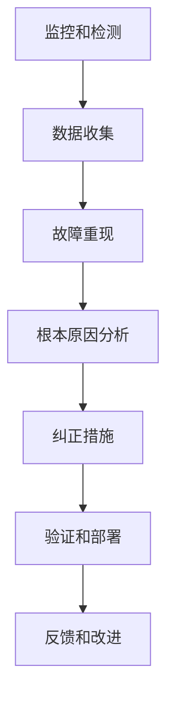

# AI系统故障诊断原理与代码实战案例讲解

## 1.背景介绍

### 1.1 AI系统的重要性

在当今时代,人工智能(AI)系统无处不在,从语音助手到自动驾驶汽车,从推荐系统到医疗诊断,AI已经深深融入我们的日常生活和各行各业。随着AI系统的广泛应用,确保其可靠性和稳定性变得至关重要。然而,就像任何其他复杂系统一样,AI系统也可能出现故障和异常行为,这可能导致严重的后果。因此,及时发现和诊断AI系统故障,采取适当的纠正措施,对于维护系统的正常运行和用户体验至关重要。

### 1.2 AI系统故障的挑战

诊断AI系统故障面临着许多独特的挑战:

1. **黑盒性质**: 许多AI系统,尤其是基于深度学习的系统,是高度复杂和难以解释的"黑盒"。它们的内部工作原理对人类来说是不透明的,这使得故障诊断变得更加困难。

2. **数据质量**: AI系统的性能很大程度上依赖于训练数据的质量。低质量或有偏差的数据可能导致AI系统产生意外的行为或错误的输出。

3. **环境变化**: AI系统通常被部署在动态环境中,环境的变化(如传感器故障、数据漂移等)可能导致系统性能下降或异常行为。

4. **复杂性**: 现代AI系统通常由多个组件(如数据预处理、特征提取、模型训练和推理等)组成,这增加了故障诊断的复杂性。

5. **可解释性**: 缺乏AI系统决策过程的可解释性,使得理解系统行为及其潜在故障的根源变得更加困难。

### 1.3 故障诊断的重要性

及时有效的AI系统故障诊断对于确保系统的可靠性、安全性和用户信任至关重要。准确诊断故障的根源有助于采取适当的纠正措施,防止进一步的故障扩散,并提高系统的整体性能和稳定性。此外,通过故障诊断积累的经验和知识,可以帮助改进AI系统的设计、开发和部署过程,从而提高未来系统的鲁棒性。

## 2.核心概念与联系

### 2.1 AI系统故障类型

AI系统故障可以分为多种类型,每种类型都需要采取不同的诊断和纠正措施。一些常见的故障类型包括:

1. **数据相关故障**: 这种故障源于训练数据的质量问题,如数据噪声、偏差、缺失值等。

2. **模型相关故障**: 这种故障与模型本身的设计、训练或优化过程有关,如欠拟合、过拟合、梯度消失/爆炸等。

3. **系统集成故障**: 这种故障发生在将AI模型集成到更大的系统中时,可能涉及硬件、软件或环境因素。

4. **安全和隐私故障**: 这些故障可能导致AI系统产生不安全、不公平或侵犯隐私的行为。

5. **可解释性故障**: 这种故障与AI系统决策过程的不透明性有关,使得理解系统行为及其潜在故障的根源变得困难。

了解不同类型的故障及其潜在原因,是进行有效故障诊断的关键第一步。

### 2.2 故障诊断流程

AI系统故障诊断通常遵循一个系统的流程,包括以下几个关键步骤:

1. **监控和检测**: 持续监控AI系统的性能和行为,及时检测异常情况。

2. **数据收集**: 收集与故障相关的各种数据,如日志、指标、输入/输出数据等。

3. **故障重现**: 尝试在受控环境中重现故障,以便进行深入分析。

4. **根本原因分析**: 利用各种技术和工具(如可解释性方法、统计分析等)分析故障的根本原因。

5. **纠正措施**: 根据分析结果,制定并实施适当的纠正措施,如数据清理、模型重训练、系统重新配置等。

6. **验证和部署**: 在测试环境中验证纠正措施的有效性,然后将修复后的系统部署到生产环境中。

7. **反馈和改进**: 从故障诊断过程中吸取经验教训,并将其反馈到AI系统的设计、开发和部署流程中,以提高未来系统的鲁棒性。

这个流程强调了故障诊断的迭代性质,并将其视为一个持续的学习和改进过程。

## 3.核心算法原理具体操作步骤

### 3.1 监控和异常检测

监控和异常检测是故障诊断流程的第一步,旨在及时发现AI系统的异常行为。常见的监控和异常检测技术包括:

1. **基于规则的异常检测**: 定义一组规则或阈值,当系统指标或行为超出这些规则或阈值时,就会触发异常警报。例如,可以设置模型准确率的最小阈值,如果实际准确率低于该阈值,则认为系统异常。

2. **基于统计的异常检测**: 利用统计技术(如高斯混合模型、隔离森林等)来建立系统正常行为的概率分布模型。当新的观测值偏离这个模型时,就会被标记为异常。

3. **基于深度学习的异常检测**: 使用自编码器、生成对抗网络(GAN)等深度学习模型来学习正常数据的分布,并将偏离这个分布的数据点标记为异常。

4. **在线监控**: 持续收集和分析系统指标、日志和其他运行时数据,以实时检测异常情况。这通常需要构建可扩展的数据管道和监控基础设施。

5. **人工监控**: 人工审查系统输出或行为,以发现潜在的异常情况。这种方法通常用于高风险应用场景,作为自动化监控的补充。

无论采用何种技术,关键是要根据具体的AI系统和应用场景,定制合适的监控和异常检测策略。及早发现异常情况是进行有效故障诊断的前提。

### 3.2 数据收集和故障重现

一旦检测到异常情况,下一步就是收集与故障相关的各种数据,以便进行深入分析和故障重现。常见的数据收集方法包括:

1. **日志收集**: 从AI系统的各个组件(如数据预处理、模型训练、模型推理等)收集详细的日志数据,包括错误消息、警告、系统事件等。

2. **指标收集**: 收集系统的各种运行时指标,如CPU/内存利用率、网络延迟、模型准确率等。

3. **输入/输出数据收集**: 收集导致异常的输入数据样本,以及相应的系统输出。

4. **系统快照**: 在异常发生时,捕获系统的完整状态快照,包括内存转储、配置文件等。

5. **环境数据收集**: 收集与系统运行环境相关的数据,如传感器读数、网络条件等。

收集到足够的相关数据后,下一步是尝试在受控环境中重现故障。这对于稳定地复制和研究故障行为至关重要。常见的故障重现技术包括:

1. **回放测试**: 使用收集的输入数据样本和系统快照,在测试环境中重放导致异常的执行路径。

2. **模糊测试**: 通过向系统输入随机或特殊构造的数据,尝试触发潜在的故障情况。

3. **压力测试**: 在极端条件下(如高负载、资源限制等)运行系统,以暴露可能的故障。

4. **环境模拟**: 构建模拟环境,重现导致故障的特定环境条件。

成功重现故障是进行有效根本原因分析的前提。在某些情况下,可能需要进行大量的尝试和调试,才能成功重现复杂的故障情况。

### 3.3 根本原因分析

收集到足够的数据并成功重现故障后,下一步就是进行根本原因分析,以确定故障的具体原因。常见的根本原因分析技术包括:

1. **日志分析**: 分析系统日志,查找与故障相关的错误消息、警告和事件,以获得故障的线索。

2. **数据分析**: 分析与故障相关的输入/输出数据,检查是否存在异常模式或偏差。

3. **统计分析**: 使用统计技术(如假设检验、相关性分析等)来分析系统指标和行为数据,识别与故障相关的统计异常。

4. **可解释性分析**: 应用各种可解释性技术(如SHAP、LIME等)来解释AI模型的决策过程,从而揭示潜在的故障原因。

5. **代码审查**: 审查AI系统的源代码,查找潜在的bug、设计缺陷或不当实现。

6. **环境分析**: 分析系统运行环境的数据,检查是否存在可能导致故障的异常情况(如传感器故障、网络中断等)。

7. **专家评审**: 邀请领域专家评审故障情况,利用他们的专业知识和经验来提供见解和建议。

根本原因分析通常需要综合运用多种技术,并且可能需要反复迭代,才能最终确定故障的真正根源。这个过程需要耐心、细致和创造性的思维。

### 3.4 纠正措施和验证

一旦确定了故障的根本原因,下一步就是制定和实施适当的纠正措施。常见的纠正措施包括:

1. **数据清理和增强**: 如果故障源于训练数据的质量问题,可以通过清理噪声数据、补充缺失数据、处理偏差等方式来改善数据质量。

2. **模型重训练**: 如果故障与模型本身有关,可以尝试调整模型架构、超参数或优化策略,并重新训练模型。

3. **系统重新配置**: 如果故障与系统集成或环境因素有关,可以重新配置系统组件、硬件资源或环境设置。

4. **安全和隐私增强**: 如果发现了安全或隐私相关的故障,可以采取加强安全措施、隐私保护机制等纠正措施。

5. **可解释性改进**: 如果故障与可解释性有关,可以引入新的可解释性技术或改进现有技术,以提高系统决策过程的透明度。

实施纠正措施后,需要在测试环境中进行彻底的验证,确保故障已经得到有效解决,并且没有引入新的问题。一旦通过验证,就可以将修复后的系统部署到生产环境中。

### 3.5 反馈和持续改进

故障诊断过程不应该是一次性的事件,而应该被视为一个持续的学习和改进过程。从每一次故障诊断中吸取的经验教训,都应该被反馈到AI系统的整个生命周期中,以提高未来系统的鲁棒性和可靠性。

具体的反馈和改进措施可以包括:

1. **更新开发和测试流程**: 根据故障诊断的经验,改进AI系统的开发和测试流程,加强质量控制和风险管理。

2. **优化监控和异常检测**: 根据新发现的故障模式,优化监控和异常检测策略,以提高未来故障的及时发现能力。

3. **改进数据管理**: 根据发现的数据质量问题,优化数据收集、清理和管理流程,确保高质量的训练数据。

4. **加强可解释性**: 投资于可解释性技术的研发和应用,提高AI系统决策过程的透明度和可解释性。

5. **培训和知识共享**: 将故障诊断过程中积累的知识和经验,形成培训材料和最佳实践指南,供团队内部和外部共享。

通过持续的反馈和改进,AI系统的故障诊断能力将不断提高,从而提高整个AI生态系统的可靠性和用户信任度。

## 4.数学模型和公式详细讲解举例说