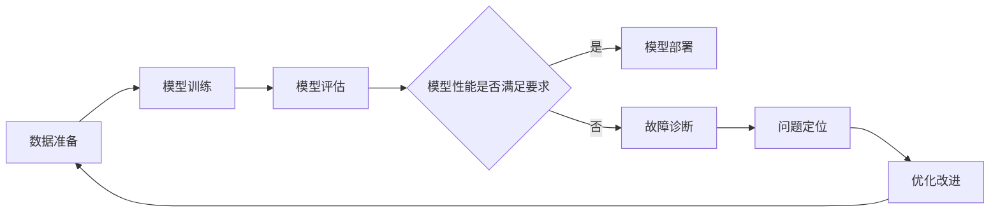

# AI系统故障诊断原理与代码实战案例讲解

## 1. 背景介绍
### 1.1 AI系统故障诊断的重要性
### 1.2 AI系统故障诊断的挑战
### 1.3 本文的主要内容和贡献

## 2. 核心概念与联系
### 2.1 AI系统的组成和架构
### 2.2 常见的AI系统故障类型
#### 2.2.1 数据质量问题
#### 2.2.2 模型训练问题
#### 2.2.3 推理和预测问题
#### 2.2.4 系统集成问题
### 2.3 故障诊断的基本原理和流程



## 3. 核心算法原理具体操作步骤
### 3.1 数据质量诊断算法
#### 3.1.1 数据完整性检查
#### 3.1.2 数据一致性检查
#### 3.1.3 数据分布检测
### 3.2 模型训练诊断算法
#### 3.2.1 梯度检查
#### 3.2.2 学习率调整策略
#### 3.2.3 过拟合和欠拟合诊断
### 3.3 推理和预测诊断算法
#### 3.3.1 异常值检测
#### 3.3.2 置信度评估
#### 3.3.3 对抗样本检测
### 3.4 系统集成诊断算法
#### 3.4.1 接口一致性检查
#### 3.4.2 数据流追踪
#### 3.4.3 性能瓶颈分析

## 4. 数学模型和公式详细讲解举例说明
### 4.1 数据质量评估模型
#### 4.1.1 缺失值比例计算
$$ MissingRate = \frac{N_{missing}}{N} $$
其中，$N_{missing}$为缺失值的数量，$N$为总样本数。
#### 4.1.2 异常值检测模型
使用箱线图(Box Plot)或者Z-score等方法检测异常值。
### 4.2 模型评估指标
#### 4.2.1 分类模型评估指标
- 准确率(Accuracy)
$$ Accuracy = \frac{TP+TN}{TP+TN+FP+FN} $$
- 精确率(Precision) 
$$ Precision = \frac{TP}{TP+FP} $$
- 召回率(Recall)
$$ Recall = \frac{TP}{TP+FN} $$
- F1分数(F1-score)
$$ F1 = 2 \cdot \frac{Precision \cdot Recall}{Precision + Recall} $$

其中，TP为真正例，TN为真负例，FP为假正例，FN为假负例。

#### 4.2.2 回归模型评估指标
- 平均绝对误差(MAE) 
$$ MAE = \frac{1}{n}\sum_{i=1}^n \lvert y_i - \hat{y}_i \rvert $$
- 均方误差(MSE)
$$ MSE = \frac{1}{n}\sum_{i=1}^n (y_i - \hat{y}_i)^2 $$
- 决定系数(R-squared)
$$ R^2 = 1 - \frac{\sum_{i=1}^n (y_i - \hat{y}_i)^2}{\sum_{i=1}^n (y_i - \bar{y})^2} $$

其中，$y_i$为真实值，$\hat{y}_i$为预测值，$\bar{y}$为真实值的平均值。

## 5. 项目实践：代码实例和详细解释说明
### 5.1 数据质量诊断代码实例
```python
import pandas as pd

def check_missing_values(df):
    """检查数据集中的缺失值"""
    missing_values = df.isnull().sum()
    missing_ratio = missing_values / len(df)
    return missing_values, missing_ratio

# 读取数据集
data = pd.read_csv('data.csv')

# 检查缺失值
missing_values, missing_ratio = check_missing_values(data)
print("缺失值数量：\n", missing_values)
print("缺失值比例：\n", missing_ratio)
```

上述代码实现了对数据集中缺失值的检查，输出每个特征的缺失值数量和比例，方便进行数据质量诊断。

### 5.2 模型训练诊断代码实例
```python
import numpy as np

def gradient_check(model, X, y, epsilon=1e-7):
    """梯度检查"""
    theta_original = model.theta
    num_parameters = len(theta_original)
    J_plus = np.zeros(num_parameters)
    J_minus = np.zeros(num_parameters)
    gradapprox = np.zeros(num_parameters)

    for i in range(num_parameters):
        theta_plus = theta_original.copy()
        theta_plus[i] += epsilon
        model.theta = theta_plus
        J_plus[i] = model.cost_function(X, y)

        theta_minus = theta_original.copy()
        theta_minus[i] -= epsilon
        model.theta = theta_minus
        J_minus[i] = model.cost_function(X, y)

        gradapprox[i] = (J_plus[i] - J_minus[i]) / (2 * epsilon)

    model.theta = theta_original

    grad = model.gradient(X, y)

    diff = np.linalg.norm(gradapprox - grad) / (np.linalg.norm(gradapprox) + np.linalg.norm(grad))

    if diff < 1e-7:
        print("梯度检查通过!")
    else:
        print("梯度检查失败，请检查模型实现!")

# 初始化模型
model = MyModel()

# 准备数据
X_train, y_train = load_data()

# 进行梯度检查
gradient_check(model, X_train, y_train)
```

上述代码实现了对模型梯度计算的检查，通过数值方法估计梯度，并与模型计算的梯度进行比较，以确保模型梯度计算的正确性。

### 5.3 推理和预测诊断代码实例
```python
from sklearn.covariance import EllipticEnvelope

def detect_outliers(X, contamination=0.05):
    """异常值检测"""
    detector = EllipticEnvelope(contamination=contamination)
    detector.fit(X)
    y_pred = detector.predict(X)
    outlier_indices = np.where(y_pred == -1)[0]
    return outlier_indices

# 准备数据
X_test = load_test_data()

# 检测异常值
outlier_indices = detect_outliers(X_test)
print("异常值索引：", outlier_indices)
```

上述代码使用椭圆包络(Elliptic Envelope)算法对测试数据进行异常值检测，输出异常值的索引，方便进行推理和预测诊断。

## 6. 实际应用场景
### 6.1 工业设备故障诊断
- 应用背景
- 诊断流程
- 实际效果
### 6.2 金融风险预警
- 应用背景
- 诊断流程  
- 实际效果
### 6.3 医疗辅助诊断
- 应用背景
- 诊断流程
- 实际效果

## 7. 工具和资源推荐
### 7.1 数据质量诊断工具
- pandas-profiling
- Deequ
- Great Expectations
### 7.2 模型训练诊断工具
- TensorBoard
- Weights and Biases
- Comet
### 7.3 推理和预测诊断工具
- Alibi Detect
- Seldon Core
- Prometheus
### 7.4 系统集成诊断工具
- Jaeger
- Zipkin
- SkyWalking

## 8. 总结：未来发展趋势与挑战
### 8.1 AI系统故障诊断的发展趋势
- 自动化和智能化诊断
- 端到端的诊断方案
- 实时监控和预警
### 8.2 AI系统故障诊断面临的挑战
- 复杂系统的可解释性
- 诊断方法的通用性
- 诊断结果的可操作性
### 8.3 未来的研究方向和机遇

## 9. 附录：常见问题与解答
### 9.1 如何选择合适的评估指标？
### 9.2 异常值处理有哪些常用方法？
### 9.3 如何进行模型调参？
### 9.4 部署时需要注意哪些问题？

作者：禅与计算机程序设计艺术 / Zen and the Art of Computer Programming