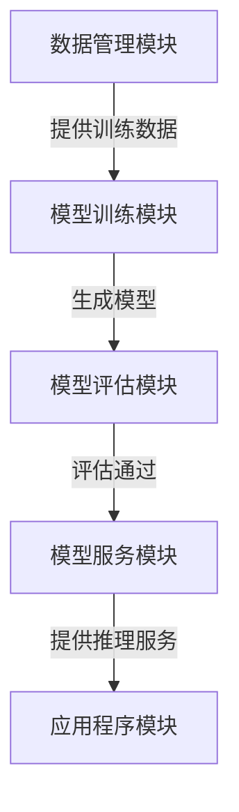
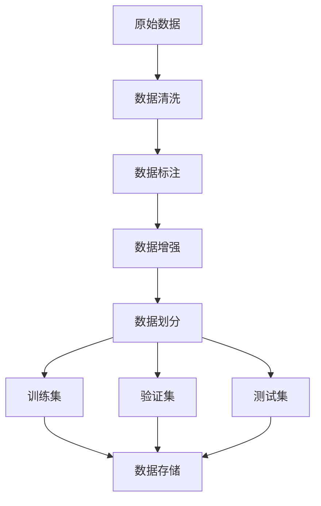
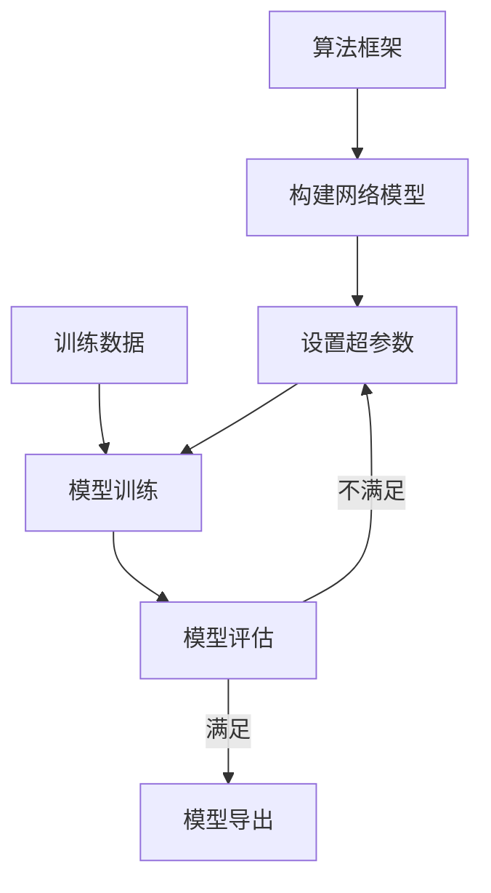

# AI系统架构原理与代码实战案例讲解

## 1.背景介绍

### 1.1 人工智能的兴起

人工智能(Artificial Intelligence,AI)作为一门新兴的交叉学科,已经逐渐融入到我们生活的方方面面。从语音助手到自动驾驶汽车,从医疗诊断到金融风险评估,AI无处不在。随着大数据、云计算和算力的不断提升,AI系统的性能也在不断提高,应用领域也在持续扩大。

### 1.2 AI系统架构的重要性

AI系统往往涉及大规模的数据处理、复杂的模型训练和高性能的模型推理等环节,对系统的架构设计提出了很高的要求。合理的AI系统架构不仅能够保证系统的高效运行,还能够支持系统的可扩展性、可维护性和安全性。因此,掌握AI系统架构的设计原理和最佳实践就显得尤为重要。

## 2.核心概念与联系

### 2.1 AI系统的核心组件

一个典型的AI系统通常包括以下几个核心组件:

1. **数据管理模块**: 负责数据采集、清洗、标注、存储和版本管理等工作。
2. **模型训练模块**: 使用训练数据,基于特定的算法和框架训练模型。
3. **模型评估模块**: 对训练好的模型进行评估,检验其性能和质量。
4. **模型服务模块**: 将训练好的模型部署为在线服务,提供模型推理能力。
5. **应用程序模块**: 将模型服务集成到具体的应用程序中,为最终用户提供AI功能。



### 2.2 AI系统架构的设计目标

设计AI系统架构时,需要权衡多个目标:

1. **高性能**: 确保系统能够高效处理大规模数据和计算密集型任务。
2. **可扩展性**: 能够灵活地扩展计算资源和存储资源,满足不断增长的需求。
3. **可靠性**: 提供高可用性和容错能力,避免单点故障导致系统中断。
4. **安全性**: 保护数据隐私和模型知识产权,防止恶意攻击和数据泄露。
5. **可维护性**: 采用模块化设计,方便系统的升级、扩展和故障排查。

## 3.核心算法原理具体操作步骤

### 3.1 数据处理流程

数据是训练AI模型的基础,因此数据处理流程至关重要。典型的数据处理流程包括:

1. **数据采集**: 从各种数据源(如传感器、日志、网页等)采集原始数据。
2. **数据清洗**: 对原始数据进行去重、填充缺失值、格式转换等预处理操作。
3. **数据标注**: 为训练数据添加标签(Label),这是监督学习所需要的。
4. **数据增强**: 通过各种方法(如旋转、缩放、噪声添加等)生成更多的训练数据。
5. **数据划分**: 将处理好的数据划分为训练集、验证集和测试集。
6. **数据存储**: 将处理好的数据存储到分布式存储系统中,方便后续使用。



### 3.2 模型训练流程

训练AI模型是一个迭代式的过程,需要不断调整超参数和优化算法,以获得最佳性能。典型的模型训练流程包括:

1. **选择算法框架**: 根据任务类型(如计算机视觉、自然语言处理等)选择合适的算法框架(如TensorFlow、PyTorch等)。
2. **构建网络模型**: 设计神经网络的结构和层次,定义模型的输入和输出。
3. **设置超参数**: 设置模型训练的超参数,如学习率、批量大小、正则化系数等。
4. **准备训练数据**: 从数据存储系统中加载训练数据和验证数据。
5. **模型训练**: 使用训练数据训练模型,并在验证数据上评估模型性能。
6. **模型优化**: 根据评估结果,调整超参数和网络结构,重复训练直到达到预期性能。
7. **模型导出**: 将训练好的模型导出为可部署的格式(如TensorFlow SavedModel或ONNX模型)。



## 4.数学模型和公式详细讲解举例说明

### 4.1 线性回归

线性回归是一种常见的监督学习算法,用于预测连续型目标变量。给定一组特征向量 $\mathbf{x} = (x_1, x_2, \ldots, x_n)$ 和对应的目标值 $y$,线性回归试图找到一个最佳拟合的线性模型:

$$y = \theta_0 + \theta_1 x_1 + \theta_2 x_2 + \ldots + \theta_n x_n$$

其中 $\theta_0, \theta_1, \ldots, \theta_n$ 是需要学习的模型参数。通过最小化均方误差损失函数:

$$J(\theta) = \frac{1}{2m} \sum_{i=1}^m (h_\theta(x^{(i)}) - y^{(i)})^2$$

可以找到最优参数值,其中 $m$ 是训练样本数, $h_\theta(x)$ 是线性回归模型的预测值。

常见的优化算法有梯度下降法、最小二乘法等。梯度下降法的更新规则为:

$$\theta_j := \theta_j - \alpha \frac{1}{m} \sum_{i=1}^m (h_\theta(x^{(i)}) - y^{(i)}) x_j^{(i)}$$

其中 $\alpha$ 是学习率,控制每次更新的步长。

### 4.2 逻辑回归

逻辑回归是一种用于分类任务的算法,适用于二分类问题。给定特征向量 $\mathbf{x}$,逻辑回归模型计算 $y=1$ 的概率:

$$h_\theta(x) = P(y=1 | x; \theta) = \frac{1}{1 + e^{-\theta^T x}}$$

其中 $\theta$ 是需要学习的模型参数向量。通过最大似然估计,可以找到最优参数值:

$$\max_\theta \prod_{i=1}^m [h_\theta(x^{(i)})]^{y^{(i)}} [1 - h_\theta(x^{(i)})]^{1 - y^{(i)}}$$

对数似然函数为:

$$l(\theta) = \sum_{i=1}^m y^{(i)} \log h_\theta(x^{(i)}) + (1 - y^{(i)}) \log (1 - h_\theta(x^{(i)}))$$

同样可以使用梯度下降法等优化算法来求解最优参数值。

## 5.项目实践:代码实例和详细解释说明

为了更好地理解AI系统架构和算法原理,我们将通过一个图像分类项目的实践案例进行讲解。该项目的目标是构建一个能够识别手写数字的AI系统。

### 5.1 数据处理

我们将使用经典的MNIST手写数字数据集,该数据集包含60,000个训练样本和10,000个测试样本。每个样本是一个28x28的灰度图像,对应一个0到9的数字标签。

```python
import tensorflow as tf

# 加载MNIST数据集
mnist = tf.keras.datasets.mnist
(x_train, y_train), (x_test, y_test) = mnist.load_data()

# 数据预处理
x_train, x_test = x_train / 255.0, x_test / 255.0

# 将样本reshape为合适的输入形状
x_train = x_train.reshape((-1, 28, 28, 1))
x_test = x_test.reshape((-1, 28, 28, 1))
```

### 5.2 构建网络模型

我们将使用一个简单的卷积神经网络(CNN)作为模型架构。该模型包括两个卷积层、两个池化层和一个全连接层。

```python
from tensorflow.keras.models import Sequential
from tensorflow.keras.layers import Conv2D, MaxPooling2D, Flatten, Dense

# 构建CNN模型
model = Sequential([
    Conv2D(32, (3, 3), activation='relu', input_shape=(28, 28, 1)),
    MaxPooling2D((2, 2)),
    Conv2D(64, (3, 3), activation='relu'),
    MaxPooling2D((2, 2)),
    Flatten(),
    Dense(10, activation='softmax')
])
```

### 5.3 模型训练

我们将使用Adam优化器和稀疏分类交叉熵损失函数来训练模型。

```python
# 编译模型
model.compile(optimizer='adam',
              loss='sparse_categorical_crossentropy',
              metrics=['accuracy'])

# 训练模型
model.fit(x_train, y_train, epochs=5, batch_size=64, validation_data=(x_test, y_test))
```

### 5.4 模型评估

在训练结束后,我们可以在测试集上评估模型的性能。

```python
# 评估模型
test_loss, test_acc = model.evaluate(x_test, y_test)
print(f'Test accuracy: {test_acc * 100:.2f}%')
```

### 5.5 模型部署

最后,我们可以将训练好的模型导出为可部署的格式,以便在生产环境中使用。

```python
# 导出模型
model.save('mnist_model.h5')
```

通过这个实践案例,我们不仅掌握了构建AI系统的基本流程,还学习了如何使用TensorFlow框架进行模型训练和部署。

## 6.实际应用场景

AI系统架构的设计原则和最佳实践在各种应用场景中都有广泛的应用,例如:

1. **计算机视觉**: 图像分类、目标检测、语义分割等任务,需要高性能的GPU加速和分布式训练。
2. **自然语言处理**: 机器翻译、文本生成、情感分析等任务,需要处理大规模语料数据。
3. **推荐系统**: 个性化推荐、广告投放等任务,需要实时处理海量用户数据。
4. **金融风险管理**: 欺诈检测、信用评分等任务,需要确保数据安全和模型可解释性。
5. **医疗健康**: 疾病诊断、药物发现等任务,需要满足严格的隐私和合规要求。

无论是在哪个领域,合理的AI系统架构设计都是保证系统高效、可靠、安全运行的关键。

## 7.工具和资源推荐

在AI系统架构的设计和实现过程中,我们可以利用一些优秀的工具和资源:

1. **AI框架**: TensorFlow、PyTorch、MXNet等深度学习框架,提供了丰富的模型构建和训练功能。
2. **分布式训练工具**: Horovod、TF-Estimator、PyTorch Lightning等,支持在多GPU和多机器上进行分布式并行训练。
3. **模型服务工具**: TensorFlow Serving、TorchServe、KFServing等,用于高效部署和在线服务模型。
4. **数据管理工具**: Apache Kafka、Apache NiFi等,用于实时数据采集和处理。
5. **云平台**: AWS、GCP、Azure等云平台,提供了丰富的AI服务和计算资源。
6. **开源社区**: GitHub、Stack Overflow等社区,可以获取大量的代码示例和技术支持。
7. **在线课程**: Coursera、edX等平台上的AI相关课程,有助于系统地学习AI理论和实践。
8. **技术博客**: 谷歌、亚马逊等公司的技术博客,分享了大量AI系统架构的实践经验。

利用这些工具和资源,我们可以更高效地设计和实现AI系统架构。

## 8.总结:未来发展趋势与挑战

AI系统架构是一个不断发展的领