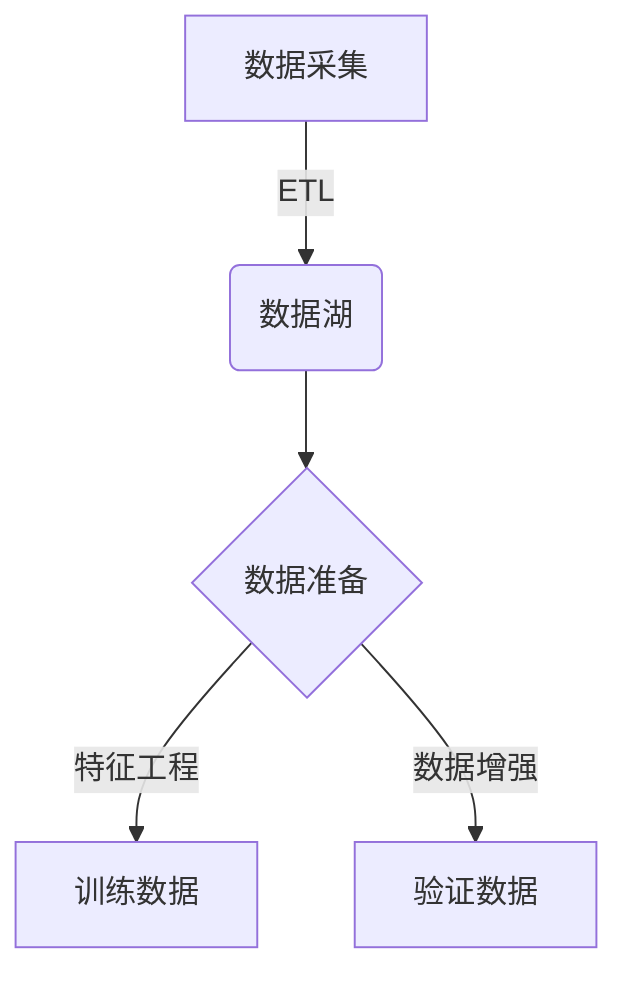
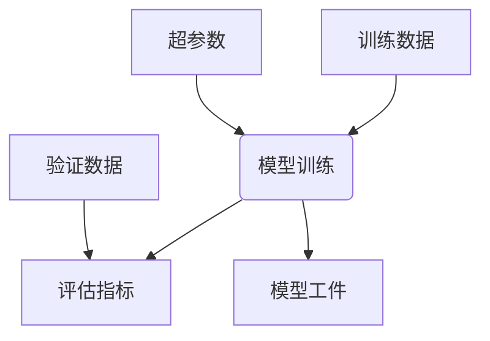
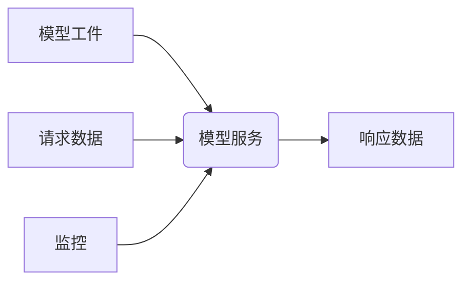
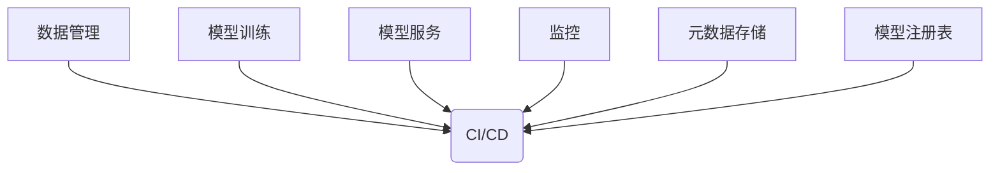

# AI系统架构原理与代码实战案例讲解

## 1.背景介绍

在当今时代,人工智能(AI)已经渗透到我们生活的方方面面,从语音助手到自动驾驶汽车,从推荐系统到医疗诊断,AI无处不在。随着数据量的激增和算力的飞速发展,AI系统变得越来越复杂。因此,设计一个高效、可扩展、安全和可靠的AI系统架构至关重要。

本文将探讨构建AI系统的核心原理和最佳实践,并通过实际案例展示如何将这些原理付诸实践。我们将深入探讨数据管理、模型训练、模型服务、监控和部署等关键组件,以及它们如何协同工作以构建一个端到端的AI系统。

### 1.1 AI系统架构的重要性

AI系统架构的设计对于系统的性能、可扩展性、安全性和可维护性至关重要。一个糟糕的架构设计可能会导致以下问题:

- 性能bottleneck
- 数据孤岛和不一致
- 模型版本混乱
- 缺乏监控和可观测性
- 安全漏洞和隐私泄露

相反,一个精心设计的架构可以帮助我们:

- 高效利用计算资源
- 确保数据质量和一致性 
- 实现模型版本控制和回滚
- 提供全面的监控和报警
- 保护系统安全和隐私

### 1.2 AI系统架构的挑战

构建AI系统面临着许多独特的挑战,例如:

- 大规模数据处理
- 分布式训练和推理
- 模型版本管理
- 模型部署和服务
- 监控和调试复杂模型
- 确保AI系统的公平性、透明度和可解释性

## 2.核心概念与联系

在深入探讨AI系统架构之前,让我们先了解一些核心概念及它们之间的关系。

### 2.1 数据管理

数据是训练AI模型的燃料。高质量的数据对于构建准确、公平和可解释的AI模型至关重要。数据管理包括以下几个关键步骤:

1. **数据采集**: 从各种来源收集原始数据,如日志、传感器、API等。
2. **数据湖**: 将原始数据存储在集中的数据湖中,以便进一步处理。
3. **数据准备**: 对原始数据进行清洗、标注、转换和增强,以准备用于模型训练和评估。
4. **特征工程**: 从原始数据中提取有意义的特征,以供模型训练使用。
5. **数据增强**: 通过各种技术(如旋转、翻转、噪声注入等)生成额外的训练数据,以提高模型的泛化能力。

高质量的数据管理对于构建准确和可靠的AI模型至关重要。

### 2.2 模型训练

模型训练是将标记数据输入到算法中,并优化模型参数以最小化损失函数的过程。训练过程包括以下关键步骤:

1. **训练数据**: 包含输入特征和相应标签的数据集。
2. **算法选择**: 选择合适的机器学习算法,如深度神经网络、决策树或支持向量机等。
3. **损失函数**: 定义模型预测与真实标签之间的差异度量。
4. **优化器**: 使用优化算法(如梯度下降)最小化损失函数。
5. **超参数调优**: 调整算法的超参数(如学习率、正则化强度等)以获得最佳性能。
6. **模型评估**: 使用保留的验证数据评估模型性能,计算指标如准确率、精确率、召回率等。
7. **模型工件**: 训练后的模型参数和元数据,可用于部署和服务。

训练过程通常是计算密集型的,需要使用GPU或TPU等加速硬件来提高效率。

### 2.3 模型服务

模型服务是将训练好的模型部署到生产环境中,并对外提供推理服务的过程。它包括以下关键步骤:

1. **模型工件**: 从模型训练过程中获取模型工件。
2. **模型部署**: 将模型工件部署到服务器或云环境中。
3. **请求处理**: 接收客户端的输入数据,进行预处理和特征提取。
4. **推理服务**: 使用部署的模型对输入数据进行推理,生成预测结果。
5. **响应处理**: 对预测结果进行后处理,并将其返回给客户端。
6. **监控**: 持续监控模型性能、资源利用率和错误日志等指标。

模型服务需要考虑可扩展性、高可用性、安全性和低延迟等因素。常见的部署方式包括容器化、无服务器函数和模型服务平台等。

### 2.4 MLOps

MLOps(Machine Learning Operations)是一种将机器学习系统的整个生命周期(从数据采集到模型部署)自动化和标准化的方法。它借鉴了DevOps的理念和实践,旨在提高ML系统的可靠性、可重复性和生产效率。MLOps包括以下关键组件:

1. **持续集成/持续交付(CI/CD)**: 自动化构建、测试和部署过程,确保高质量和高效率。
2. **元数据存储**: 存储有关数据、代码、模型和实验的元数据,以支持可追溯性和再现性。
3. **模型注册表**: 存储和管理训练好的模型工件及其元数据。
4. **监控**: 持续监控数据、模型和系统指标,以检测异常并触发警报。
5. **自动化**: 自动化重复性任务,如数据准备、模型训练、模型评估和部署等。

MLOps的目标是建立一个端到端的自动化管道,使ML系统能够高效、可靠和可重复地运行。

## 3.核心算法原理具体操作步骤

在构建AI系统时,我们需要选择合适的算法来解决特定的问题。本节将介绍一些常见的AI算法,并探讨它们的原理和具体操作步骤。

### 3.1 监督学习算法

监督学习算法是最常见的机器学习算法类型之一。它们从标记的训练数据中学习,并尝试建立输入特征和目标变量之间的映射关系。

#### 3.1.1 线性回归

线性回归是一种简单但有效的算法,用于解决回归问题。它试图找到一条最佳拟合直线,使预测值与实际值之间的误差平方和最小化。

算法步骤:

1. 初始化模型参数(权重和偏置)。
2. 计算预测值与实际值之间的误差。
3. 使用梯度下降法更新模型参数,以最小化误差。
4. 重复步骤2和3,直到收敛或达到最大迭代次数。

线性回归的优点是简单易懂,计算效率高。但它也有一些限制,如对非线性关系的拟合能力较差。

#### 3.1.2 逻辑回归

逻辑回归是一种用于解决二分类问题的算法。它通过对输入特征进行加权求和,然后使用逻辑sigmoid函数将结果映射到0到1之间,从而预测样本属于正类的概率。

算法步骤:

1. 初始化模型参数(权重和偏置)。
2. 计算样本属于正类的预测概率。
3. 使用交叉熵损失函数计算预测概率与真实标签之间的误差。
4. 使用梯度下降法更新模型参数,以最小化损失函数。
5. 重复步骤2到4,直到收敛或达到最大迭代次数。

逻辑回归的优点是简单且易于理解,同时也可以处理非线性问题。但它也有一些限制,如对异常值敏感,并且假设特征之间是线性可分的。

#### 3.1.3 决策树

决策树是一种基于树形结构的监督学习算法,可用于解决回归和分类问题。它通过对特征进行递归分裂,将数据划分为越来越小的子集,直到每个子集中的样本都属于同一类别或满足某个停止条件。

算法步骤:

1. 从根节点开始,选择一个最优特征进行分裂。
2. 对每个分支,重复步骤1,直到满足停止条件。
3. 为每个叶节点分配一个类别(分类问题)或一个连续值(回归问题)。

决策树的优点是易于解释和可视化,并且可以处理数值和分类特征。但它也容易过拟合,并且对数据的微小变化敏感。

### 3.2 无监督学习算法

无监督学习算法从未标记的数据中寻找隐藏的模式或结构。它们常用于聚类、降维和异常检测等任务。

#### 3.2.1 K-Means聚类

K-Means是一种常用的聚类算法,它将数据划分为K个簇,使得每个样本属于离其最近的簇中心的簇。

算法步骤:

1. 随机初始化K个簇中心。
2. 将每个样本分配到最近的簇中心所对应的簇。
3. 重新计算每个簇的中心,使其成为该簇中所有样本的均值。
4. 重复步骤2和3,直到簇分配不再发生变化或达到最大迭代次数。

K-Means的优点是简单且计算效率高。但它也有一些限制,如对初始簇中心的选择敏感,并且难以处理非凸形状的簇。

#### 3.2.2 主成分分析(PCA)

PCA是一种常用的无监督降维技术,它通过找到数据的主要方向(主成分)来降低特征空间的维数,同时尽可能保留原始数据的方差。

算法步骤:

1. 对数据进行归一化处理。
2. 计算数据的协方差矩阵。
3. 计算协方差矩阵的特征值和特征向量。
4. 选择与最大特征值对应的前k个特征向量作为主成分。
5. 将原始数据投影到主成分空间中,得到降维后的数据。

PCA的优点是简单且计算效率高,同时可以有效地减少数据维数。但它也有一些限制,如对非线性关系的捕获能力较差,并且对异常值敏感。

### 3.3 深度学习算法

深度学习算法是一种基于人工神经网络的算法,它可以自动从原始数据中学习多层次的特征表示,并在各种任务上取得了卓越的性能。

#### 3.3.1 前馈神经网络

前馈神经网络是最基本的深度学习模型,它由多个全连接层组成,每一层的输出都作为下一层的输入。

算法步骤:

1. 初始化网络权重和偏置。
2. 前向传播:将输入数据传递through网络,计算每一层的输出。
3. 计算输出层与真实标签之间的损失。
4. 反向传播:计算每一层的梯度,并使用优化算法(如梯度下降)更新网络参数。
5. 重复步骤2到4,直到收敛或达到最大迭代次数。

前馈神经网络的优点是可以近似任何连续函数,并且具有很强的表达能力。但它也容易过拟合,并且对输入数据的缩放和平移敏感。

#### 3.3.2 卷积神经网络(CNN)

CNN是一种专门用于处理网格数据(如图像和序列)的深度神经网络。它通过交替使用卷积层和池化层来提取局部