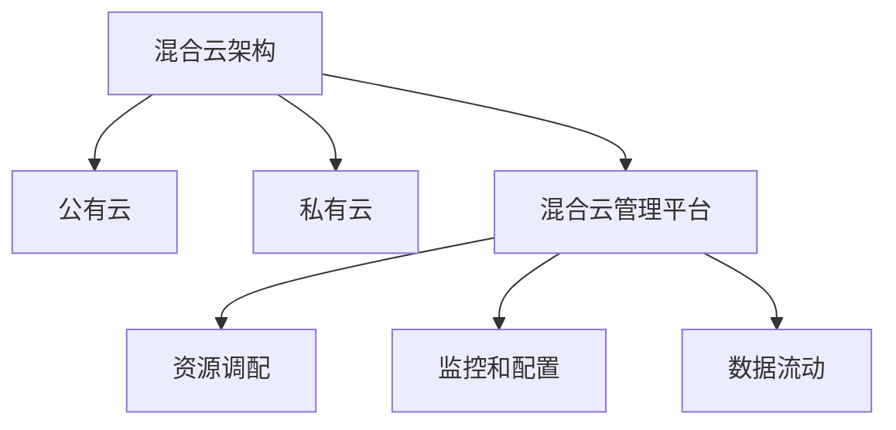

# AI系统混合云管理原理与代码实战案例讲解

## 1. 背景介绍

随着人工智能(AI)系统的快速发展和广泛应用,管理和部署这些系统的复杂性也与日俱增。传统的单一云环境已经无法满足AI系统的需求,因为它们需要大量的计算资源、数据存储和网络带宽。因此,混合云架构应运而生,它将公有云和私有云的优势结合起来,为AI系统提供了更加灵活、可扩展和经济高效的解决方案。

混合云管理是指在公有云和私有云之间协调和管理资源的过程。它允许组织根据特定需求在不同云环境之间动态分配工作负载,并确保数据和应用程序的安全性、合规性和性能。有效的混合云管理对于AI系统的顺利运行至关重要,因为它可以优化资源利用率、降低成本并提高整体效率。

## 2. 核心概念与联系

### 2.1 混合云架构

混合云架构是将公有云和私有云资源相结合的基础设施模型。它允许组织根据特定需求灵活地利用不同云环境的优势。以下是混合云架构的主要组成部分:

1. **公有云**: 由云服务提供商(如AWS、Azure、GCP)所拥有和管理的云资源。公有云提供了高度可扩展的计算能力、存储和网络资源,并采用按需付费模式。

2. **私有云**: 由组织自己拥有和管理的云资源,通常部署在内部数据中心或专用服务器上。私有云提供了更高的安全性、控制力和隐私性,但可扩展性和资源利用率可能受到限制。

3. **混合云管理平台**: 用于管理和协调公有云和私有云资源的软件层。它提供了一个统一的控制平面,允许管理员监控、配置和调配资源,并确保不同云环境之间的互操作性和数据流动。

### 2.2 AI系统的需求

AI系统对计算资源、存储和网络的需求通常是巨大的,这使得混合云架构成为一个理想的选择。以下是AI系统的一些典型需求:

1. **大规模计算能力**: 训练深度学习模型需要大量的计算资源,如GPU和TPU。公有云可以提供按需扩展的计算能力,而私有云则可以用于部署和推理。

2. **大量数据存储**: AI系统需要存储和处理海量的训练数据和模型。混合云架构可以利用公有云的可扩展存储,同时保留私有云中的敏感数据。

3. **高带宽网络**: 在训练和推理过程中,AI系统需要高速网络来传输大量数据。混合云架构可以利用公有云的高带宽网络,同时确保私有云的网络安全性。

4. **灵活的资源管理**: AI工作负载通常是动态变化的,需要根据需求动态调配资源。混合云管理平台可以实现跨云环境的资源调度和优化。

5. **安全性和合规性**: 一些AI应用程序涉及敏感数据或受监管,需要满足严格的安全性和合规性要求。私有云可以提供更高的控制力和隐私性保护。

通过有效的混合云管理,组织可以充分利用公有云和私有云的优势,为AI系统提供所需的计算资源、存储、网络和安全性,从而实现更高的效率和性能。

## 3. 核心算法原理具体操作步骤

混合云管理涉及多个核心算法和技术,以实现资源调度、负载均衡、自动扩缩容、监控和安全性等功能。以下是一些核心算法原理和具体操作步骤:

### 3.1 资源调度算法

资源调度算法负责在公有云和私有云之间分配和调度AI工作负载,以优化资源利用率和成本效益。常见的资源调度算法包括:

1. **基于优先级的调度**: 根据工作负载的优先级和资源需求,将其分配到合适的云环境。高优先级工作负载可能会被分配到私有云,以确保性能和安全性,而低优先级工作负载可能会被分配到公有云,以降低成本。

2. **基于成本的调度**: 根据不同云环境的成本和可用资源,选择最经济的资源组合来运行工作负载。这可以通过建立成本模型和优化算法来实现。

3. **基于负载的调度**: 根据当前的资源利用情况,将工作负载分配到负载较轻的云环境,以实现负载均衡和资源利用率最大化。

4. **基于约束的调度**: 根据工作负载的约束条件(如安全性、合规性、地理位置等),将其分配到满足这些约束的云环境。

资源调度算法的具体操作步骤通常包括:

1. 收集工作负载的元数据,如资源需求、优先级、约束条件等。
2. 收集公有云和私有云的资源利用情况、成本和其他相关指标。
3. 根据特定的调度算法,计算出最优的资源分配方案。
4. 将工作负载调度到选定的云环境,并监控其执行情况。
5. 根据动态变化的条件,重新调度工作负载以优化资源利用率和成本效益。

### 3.2 自动扩缩容算法

自动扩缩容算法用于根据实际工作负载动态调整云资源的数量,以满足性能需求并控制成本。常见的自动扩缩容算法包括:

1. **基于阈值的扩缩容**: 根据预定义的资源利用率阈值(如CPU利用率、内存利用率等),当超过上限时自动扩容,低于下限时自动缩容。

2. **基于队列的扩缩容**: 监控待处理工作负载的队列长度,当队列长度超过上限时扩容,低于下限时缩容。

3. **基于时间序列的扩缩容**: 利用时间序列分析和机器学习算法,预测未来的资源需求,并提前扩缩容以满足需求。

4. **基于成本优化的扩缩容**: 根据不同实例类型的成本和性能,选择最优的实例组合来满足工作负载需求,并动态调整以控制成本。

自动扩缩容算法的具体操作步骤通常包括:

1. 收集云资源的利用率、工作负载队列长度等指标。
2. 根据特定的扩缩容算法,计算出所需的资源数量。
3. 向云提供商请求扩容或缩容资源。
4. 监控扩缩容过程,并在必要时进行调整。
5. 持续优化扩缩容策略,以提高资源利用率和成本效益。

### 3.3 负载均衡算法

负载均衡算法用于在多个云资源实例之间分发AI工作负载,以实现高可用性、高性能和均衡的资源利用率。常见的负载均衡算法包括:

1. **轮询调度**: 按顺序将工作负载分发到不同的实例。
2. **加权轮询调度**: 根据实例的权重(如性能、负载等)分发工作负载。
3. **最小连接数调度**: 将工作负载分发到当前连接数最少的实例。
4. **最小响应时间调度**: 将工作负载分发到响应时间最短的实例。
5. **基于机器学习的调度**: 利用机器学习算法,根据历史数据和当前状态预测最佳的调度策略。

负载均衡算法的具体操作步骤通常包括:

1. 收集云资源实例的状态信息,如连接数、响应时间、负载等。
2. 根据特定的负载均衡算法,选择合适的实例来分发工作负载。
3. 监控实例的状态变化,并动态调整负载均衡策略。
4. 优化负载均衡算法,以提高系统的整体性能和资源利用率。

## 4. 数学模型和公式详细讲解举例说明

在混合云管理中,数学模型和公式常用于建模和优化资源调度、自动扩缩容和负载均衡等过程。以下是一些常见的数学模型和公式:

### 4.1 资源调度模型

资源调度模型旨在找到最优的资源分配方案,以最小化成本或最大化性能。常见的资源调度模型包括:

1. **整数规划模型**:

$$
\begin{aligned}
\min \quad & \sum_{i=1}^{n} \sum_{j=1}^{m} c_{ij} x_{ij} \\
\text{s.t.} \quad & \sum_{j=1}^{m} x_{ij} = 1, \quad \forall i \\
& \sum_{i=1}^{n} r_{ik} x_{ij} \leq R_{jk}, \quad \forall j, k \\
& x_{ij} \in \{0, 1\}, \quad \forall i, j
\end{aligned}
$$

其中:
- $n$ 是工作负载的数量
- $m$ 是云资源实例的数量
- $c_{ij}$ 是将工作负载 $i$ 分配到实例 $j$ 的成本
- $x_{ij}$ 是决策变量,表示是否将工作负载 $i$ 分配到实例 $j$
- $r_{ik}$ 是工作负载 $i$ 对资源 $k$ 的需求
- $R_{jk}$ 是实例 $j$ 的资源 $k$ 的容量

目标函数是最小化总成本,约束条件包括每个工作负载只能分配到一个实例,以及每个实例的资源利用率不能超过其容量。

2. **基于优先级的调度模型**:

$$
\begin{aligned}
\max \quad & \sum_{i=1}^{n} p_i y_i \\
\text{s.t.} \quad & \sum_{i=1}^{n} r_{ik} y_i \leq R_k, \quad \forall k \\
& y_i \in \{0, 1\}, \quad \forall i
\end{aligned}
$$

其中:
- $p_i$ 是工作负载 $i$ 的优先级
- $y_i$ 是决策变量,表示是否执行工作负载 $i$
- $R_k$ 是可用资源 $k$ 的总量

目标函数是最大化执行的工作负载的总优先级,约束条件是不超过可用资源的总量。

### 4.2 自动扩缩容模型

自动扩缩容模型用于确定在给定工作负载下所需的资源数量,以满足性能需求并控制成本。常见的自动扩缩容模型包括:

1. **基于队列长度的扩缩容模型**:

$$
N = \begin{cases}
N_{\text{current}} + \Delta N, & \text{if } Q > Q_{\text{max}} \\
N_{\text{current}} - \Delta N, & \text{if } Q < Q_{\text{min}} \\
N_{\text{current}}, & \text{otherwise}
\end{cases}
$$

其中:
- $N$ 是所需的资源实例数量
- $N_{\text{current}}$ 是当前的资源实例数量
- $\Delta N$ 是扩缩容的步长
- $Q$ 是当前的工作负载队列长度
- $Q_{\text{max}}$ 和 $Q_{\text{min}}$ 是队列长度的上限和下限阈值

当队列长度超过上限时,增加 $\Delta N$ 个实例;当队列长度低于下限时,减少 $\Delta N$ 个实例。

2. **基于成本优化的扩缩容模型**:

$$
\begin{aligned}
\min \quad & \sum_{j=1}^{m} c_j N_j \\
\text{s.t.} \quad & \sum_{j=1}^{m} R_{jk} N_j \geq D_k, \quad \forall k \\
& N_j \geq 0, \quad \forall j
\end{aligned}
$$

其中:
- $m$ 是资源实例类型的数量
- $c_j$ 是实例类型 $j$ 的成本
- $N_j$ 是实例类型 $j$ 的数量
- $R_{jk}$ 是实例类型 $j$ 对资源 $k$ 的提供量
- $D_k$ 是对资源 $k$ 的总需求

目标函数是最小化总成本,约束条件是满足所有资源的需求。

### 4.3 负