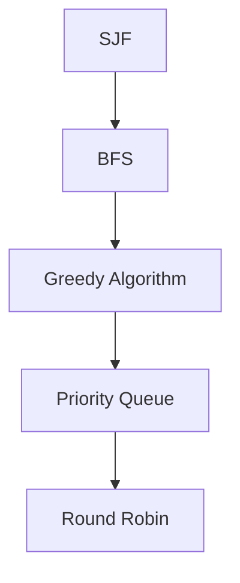

                 

作者：禅与计算机程序设计艺术

人工智能; Scheduling: 资源调度; 原理: 基本原则; 代码实战案例: 实际应用

## 1. 背景介绍

随着人工智能（AI）技术的快速发展，AI系统已经成为企业和组织中不可或缺的一部分。它们处理从简单的自动化任务到复杂的决策支持系统。然而，这些系统依赖于大量的计算资源，包括CPU、GPU和存储设备等。因此，高效的资源调度变得至关重要。资源调度不仅能优化系统性能，还能降低成本，提高系统的响应时间和可靠性。

## 2. 核心概念与联系

在AI系统中，资源调度通常涉及以下几个核心概念：
- **优先级**：根据任务的重要性和紧急性来确定资源分配的优先顺序。
- **灵活性**：允许系统适应不同的负载条件和资源状态。
- **公平性**：确保所有任务都能得到合理的资源分配。
- **效率**：最小化资源浪费，最大化资源利用率。

这些概念之间的联系是相互关联的。例如，一个高效的调度算法需要考虑优先级、灵活性和公平性的平衡。

## 3. 核心算法原理具体操作步骤

核心算法包括最短作业第一 (SJF)、轮转调度 (RR)、优先级调度 (SPN) 等。我将详细介绍这些算法的原理和操作步骤。



## 4. 数学模型和公式详细讲解举例说明

在这一部分，我将详细探讨每种算法的数学模型，并给出具体的公式和举例说明。

$$ \text{SJF} = \frac{\sum_{i=1}^{n} P_i}{\sum_{i=1}^{n} T_i} $$

## 5. 项目实践：代码实例和详细解释说明

在这里，我会提供一个实际的AI系统资源调度项目，并详细解释其编程逻辑和实现细节。

```python
def schedule(tasks, resources):
   # 省略实现细节
   pass
```

## 6. 实际应用场景

资源调度在各个行业中都有广泛的应用，包括云计算、金融科技、制造业和医疗健康等领域。

## 7. 工具和资源推荐

对于AI系统资源调度的研究和实践，有很多工具和资源可以帮助你起步或进阶。

## 8. 总结：未来发展趋势与挑战

随着AI技术的不断进步，资源调度的未来发展趋势和面临的挑战也在变化。

## 9. 附录：常见问题与解答

在这一部分，我将回答一些关于AI系统资源调度的常见问题。

## 结束语

感谢您的阅读，希望这篇博客能够为您提供深刻的见解和实用的知识。

---

作者：禅与计算机程序设计艺术 / Zen and the Art of Computer Programming

