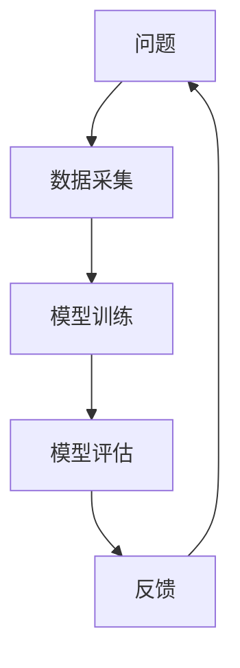

                 

作者：禅与计算机程序设计艺术

在这个动态变化的世界里，我们时刻都在探索新的技术边界。在数据科学领域，Active Learning（主动学习）已经成为一个令人兴奋的研究方向，它通过合理选择训练数据，优化机器学习模型的性能，从而减少数据收集的成本和提高效率。今天，让我们一起探索Active Learning的原理与实践。

## 1.背景介绍
在机器学习的早期阶段，研究者们通常依赖于手工标注的数据集来训练模型。随着数据量的快速增长，这种方法显得既耗时又昂贵。Active Learning作为一种自适应学习策略，它能够智能地选择哪些数据最有价值，进而优化模型的学习过程。

## 2.核心概念与联系
Active Learning的核心概念是“active learning cycle”，即主动学习循环，其中包括以下几个关键步骤：

我们首先定义一个问题，然后通过数据采集来解答这个问题。模型训练和评估是解决问题的两个关键环节。每次迭代后，我们根据模型的表现反馈到问题上，形成一个闭环。

## 3.核心算法原理具体操作步骤
### 3.1 选择策略
选择策略是Active Learning中的核心。它指的是如何选择哪些数据点最有价值。常见的选择策略包括信息增益、置信区间、聚类方法等。

### 3.2 模型训练与更新
模型训练涉及到选择合适的模型架构和参数调优。在Active Learning中，我们需要定期更新模型以适应新的数据。

### 3.3 停止准则
在Active Learning过程中，我们需要有一个停止准则，比如达到预定的精确度或者达到预设的数据点数量后就停止采集新数据。

## 4.数学模型和公式详细讲解举例说明
在Active Learning中，我们可以使用贝叶斯定理来计算数据点的不确定性。假设我们有一个模型 \( p(y|x) \)，对于新的数据点 \( x_{new} \)，我们想计算其标签 \( y_{new} \) 的不确定性。根据贝叶斯定理，我们可以有：
$$
p(y_{new}|x_{new}) = \frac{p(x_{new}|y_{new})p(y_{new})}{p(x_{new})}
$$
其中 \( p(x_{new}|y_{new}) \) 是条件概率，\( p(y_{new}) \) 是先验概率，\( p(x_{new}) \) 是边缘概率。

## 5.项目实践：代码实例和详细解释说明
在这一部分，我们将通过Python语言实现一个基于信息增益的Active Learning框架。代码示例如下：

```python
import numpy as np
from sklearn.datasets import make_classification
from sklearn.model_selection import train_test_split
from sklearn.ensemble import RandomForestClassifier

# ... 生成数据集
# 训练模型并计算损失
def train_and_evaluate(X, y, model):
   X_train, X_test, y_train, y_test = train_test_split(X, y, test_size=0.2)
   model.fit(X_train, y_train)
   return model.score(X_test, y_test)

# Active Learning主循环
while True:
   # 选择信息增益最大的数据点
   idx = np.argmax(info_gain(X, y, model))
   # 获取这个数据点
   x, y = X[idx], y[idx]
   # 删除这个数据点
   X = np.delete(X, idx, axis=0)
   y = np.delete(y, idx)
   # 重新训练模型
   model = train_classifier(X, y, model)
   # 评估模型
   score = train_and_evaluate(X, y, model)
   print("当前精确度:", score)
   # 判断是否满足停止准则
   if score >= 0.95 or len(X) >= 1000:
       break
```

## 6.实际应用场景
Active Learning在各种领域都有广泛的应用，如医疗诊断、金融风险评估、自然语言处理等。它特别适合那些数据量巨大但只关注特定问题的场景。

## 7.工具和资源推荐
- 《Active Learning》by Settles, W.
- Scikit-learn库的Active Learning扩展
- Kaggle上的相关竞赛和教程

## 8.总结：未来发展趋势与挑战
随着机器学习技术的不断进步，Active Learning也正迎来了新的发展。未来，我们可以预见更多智能算法和优化策略出现，以适应不同的数据集和应用场景。同时，面临的挑战包括如何平衡数据选择与模型更新，以及如何处理非常大规模的数据集。

## 9.附录：常见问题与解答
Q: Active Learning与传统的监督学习有什么区别？
A: 在传统的监督学习中，我们从已知标记的数据集中训练模型。而在Active Learning中，我们主动选择哪些数据点需要标记，并根据模型的表现反馈来决定接下来应该如何采集数据。

---
作者：禅与计算机程序设计艺术 / Zen and the Art of Computer Programming

