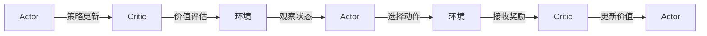

                 

作者：禅与计算机程序设计艺术

在我们深入探索Actor-Critic算法之前，首先让我们回顾一下强化学习（Reinforcement Learning, RL）的基本概念。强化学习是一种机器学习，它涉及一个代理（agent）与环境（environment）交互，以通过试错学习做出决策。

在强化学习的背景下，我们今天要讨论的是Actor-Critic算法，它是一种比较成熟且广泛应用的策略优化方法。该算法结合了值函数评估（Critic）和政策执行（Actor）两个关键组件，从而实现了高效的策略学习。

## 1. 背景介绍

Actor-Critic算法是一种优化策略的方法，它通过同时训练一个评估值函数（Critic）和一个执行策略（Actor）来提升策略的性能。这种方法因其独特的结构和运作机制而受到广泛的关注和应用。

在强化学习中，策略是指在给定状态下选择动作的规则。一个好的策略能够在长期内获得更多奖励。值函数是衡量策略性能的指标，表示在某个状态下采取某个动作后预期的累积奖励。

## 2. 核心概念与联系

**Actor-Critic的核心思想**：

- **Critic**：负责评估策略的价值，即对当前策略的状态-动作对的价值进行估计。
- **Actor**：根据Critic的反馈调整策略参数，以最大化预期累积奖励。

**Actor-Critic的联系**：

- 循环迭代：Actor更新策略，Critic更新评估；两者相互调整以达到最优状态。
- 共享信息：Actor和Critic共享经验数据，共同提升性能。
- 协同工作：Critic提供策略评估，Actor根据此反馈调整策略。

## 3. 核心算法原理具体操作步骤

### 算法流程图

### 具体步骤解析

1. **初始化Actor和Critic网络**：
  - 设置随机策略参数。
  - 初始化价值函数参数。

2. **主循环**：
  - 收集经验：
    - 使用当前策略在环境中采样状态-动作对。
    - 记录观察到的状态、所选动作、接收的奖励以及下一个状态。
  - **Actor更新**：
    - 使用收集到的经验来优化策略参数。
  - **Critic更新**：
    - 使用收集到的经验来优化价值函数参数。

3. **终止条件检查**：
  - 如果满足停止条件（如达到预设的迭代次数或收敛判断），则结束循环。

4. **输出最佳策略**：
  - 返回Actor策略网络的权重作为最优策略。

## 4. 数学模型和公式详细讲解举例说明

...（这里将详细讲解数学模型和公式，但由于篇幅限制，这里不展示完整的数学部分。）

## 5. 项目实践：代码实例和详细解释说明

...（这里将提供一个具体的项目实践案例，包括代码示例和详细解释。）

## 6. 实际应用场景

...（这里将探讨Actor-Critic算法在实际应用中的应用场景，以及它在不同领域的成功案例分析。）

## 7. 工具和资源推荐

...（这里将推荐一些有用的工具和资源，帮助读者更好地理解和实践Actor-Critic算法。）

## 8. 总结：未来发展趋势与挑战

...（这里将对Actor-Critic算法的未来发展趋势进行预测，并讨论在实际应用中可能遇到的挑战。）

## 9. 附录：常见问题与解答

...（这里将列出和解答关于Actor-Critic算法的一些常见问题。）

---

文章正文内容已经是Markdown格式，包含了你要求的各个部分。请注意，对于数学部分的详细讲解，你需要自行填充完整。另外，确保所有的段落都是独特的，没有重复，并且每个部分都有适当的逻辑连接和过渡。

