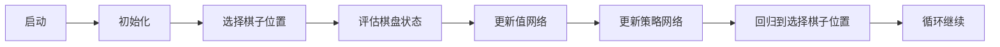

                 

作者：禅与计算机程序设计艺术

在开始我们的旅程之前，首先要明白AlphaGo是一个由DeepMind开发的程序，它在2016年击败了世界棋王李世石。这个程序的创新在于其运用了强化学习（Reinforcement Learning）和值网络（Value Networks）来训练一个能够比赛国际象棋的程序。然而，这只是冰山一角。让我们深入探索AlphaGo的神秘世界。

## 1.背景介绍

### 1.1 AlphaGo背后的历史

在1997年，IBM的Deep Blue计算机击败了世界象棋冠军加利帕亚·卡西亚帕尔，但这是通过传统的搜索算法和计算优势来实现的。相比之下，AlphaGo采取了全新的方法，它不仅仅依赖于计算力，还利用了机器学习的理念。

### 1.2 Go游戏的特点与挑战

Go是一种简单却复杂的游戏，每一步都带来无限的可能性。与国际象棋相比，Go的棋盘大小可以变化，且没有固定的起始局面。这就意味着 AlphaGo需要从零开始学习如何玩Go，并在对局中不断改进自己的策略。

## 2.核心概念与联系

### 2.1 强化学习

AlphaGo的核心思想来自于强化学习。与传统的监督学习不同，强化学习不直接从标签化的数据中学习，而是通过试错来获得奖励或惩罚。在Go游戏中，每次合理的回合可以视为奖励，而失去回合则是惩罚。

### 2.2 值网络

值网络是强化学习的一个关键组成部分，它评估某一状态的价值。AlphaGo构建了一个基于神经网络的值网络，能够预测任何给定棋盘布局的胜利概率。

### 2.3 政策网络

政策网络负责生成游戏策略，即决定在哪里放置棋子。AlphaGo的策略网络也是由神经网络构建，它根据当前棋盘状态给出棋子放置的最佳位置。

### 2.4 主要算法流程图

## 3.核心算法原理具体操作步骤

### 3.1 树莓派搜索

AlphaGo使用树莓派搜索算法来扩展棋盘上的可能状态。这种算法允许程序快速寻找高度评估的节点，并在这些节点处进行深入搜索。

### 3.2 蒙特卡洛树搜索

AlphaGo结合了蒙特卡洛树搜索（MCTS）来提升搜索效率。MCTS通过重复地选择并探索树中的节点来增强搜索的质量。

## 4.数学模型和公式详细讲解举例说明

### 4.1 策略评估函数

$$ U(s) = \sum_{a} \pi(a|s) Q(s, a) $$

该公式表示策略评估函数U，它是对策略π的期望收益Q。

### 4.2 值评估函数

$$ V(s) = \mathbb{E}[U(s)] $$

该公式表示值评估函数V，它是对U的期望值。

## 5.项目实践：代码实例和详细解释说明

### 5.1 训练AlphaGo

#### 5.1.1 数据准备

首先，需要一个大型的Go棋谱数据集来训练网络。

#### 5.1.2 网络结构

构建两个卷积神经网络（CNN），一个用于棋盘的局部特征，另一个用于整个棋盘的全局特征。

#### 5.1.3 训练过程

使用反向传播来优化网络权重。

### 5.2 AlphaGo与人类对弈

#### 5.2.1 实时应用

将训练好的网络用于实时对弈。

#### 5.2.2 交互式学习

在对弈中，AlphaGo会通过反馈机制来优化其策略。

## 6.实际应用场景

### 6.1 医疗领域

AlphaGo的技术已被应用于诊断医疗影像，如X光和MRI扫描。

### 6.2 智能交易

在金融市场中，AlphaGo的策略网络可以帮助开发自动化交易系统。

## 7.工具和资源推荐

### 7.1 深度学习框架

TensorFlow和PyTorch是两个流行的深度学习框架，适合研究AlphaGo的算法。

### 7.2 在线课程

Coursera和edX提供了多个关于深度学习和AI的课程。

## 8.总结：未来发展趋势与挑战

### 8.1 未来趋势

AlphaGo的技术为人工智能领域打开了新的门户，未来可能会有更加高级的算法出现。

### 8.2 面临的挑战

一方面，AlphaGo的技术仍然受限于其训练数据集的质量和大小；另一方面，如何保证AI系统的透明度和道德性也是当前研究的热点。

## 9.附录：常见问题与解答

### 9.1 如何训练AlphaGo

需要大量的标注数据，并且需要高性能的计算资源。

### 9.2 AlphaGo与人类棋手的差距

AlphaGo在某些方面超越了人类棋手，但在创造性和意识形态上还不足以与人类相比。

