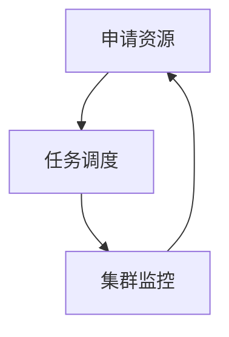

## 背景介绍

ApplicationMaster 是 Hadoop 集群中的一个重要组件，它负责协调和管理整个 Hadoop 集群的资源和任务。Hadoop 是一个开源的大数据处理框架，能够处理海量数据的存储和计算。ApplicationMaster 的主要职责是为用户的应用程序提供一个抽象的资源管理接口，使其能够更方便地管理和使用集群资源。那么，ApplicationMaster 是如何实现这一目标的呢？本篇文章将从原理和代码实例两个方面对 ApplicationMaster 进行深入分析。

## 核心概念与联系

首先，我们需要了解 ApplicationMaster 的核心概念。ApplicationMaster 可以理解为一个集群的资源管理者，它负责为用户的应用程序分配资源、调度任务以及监控集群状态等。它与其他组件之间通过 RPC（远程过程调用）进行通信。ApplicationMaster 的主要任务可以分为以下几个方面：

1. 资源申请：ApplicationMaster 负责向 ResourceManager（资源管理器）申请资源，包括内存、CPU 和磁盘等。
2. 任务调度：ApplicationMaster 负责调度用户提交的任务，并将任务分配给具体的数据节点。
3. 集群监控：ApplicationMaster 负责监控集群的状态，并在必要时重新启动失败的任务。

下面是一个简单的 Mermaid 流程图，展示了 ApplicationMaster 的主要工作流程：



## 核心算法原理具体操作步骤

ApplicationMaster 的核心算法原理主要包括资源申请、任务调度和集群监控三个方面。下面我们逐一进行分析。

1. 资源申请：ApplicationMaster 使用一种叫做 RMTemplate 的类来申请资源。RMTemplate 提供了一个抽象的接口，使用户能够更方便地申请资源。它主要包括以下几个步骤：

    a. 生成一个 ApplicationSubmissionContext 对象，该对象包含了应用程序的元数据，如应用程序名称、版本等。
    b. 使用 ApplicationSubmissionClient 提交 ApplicationSubmissionContext，得到一个 jobId。
    c. 使用 ResourceManagerClient 获取资源分配信息，包括内存、CPU 和磁盘等。
2. 任务调度：ApplicationMaster 使用一个叫做 TaskRunner 的类来调度任务。TaskRunner 提供了一个抽象的接口，使用户能够更方便地调度任务。它主要包括以下几个步骤：

    a. 生成一个 TaskContext 对象，该对象包含了任务的元数据，如任务名称、版本等。
    b. 使用 TaskRunnerClient 提交 TaskContext，得到一个 taskId。
    c. 使用 TaskRunnerClient 获取任务状态，并根据任务状态进行处理。
3. 集群监控：ApplicationMaster 使用一个叫做 ClusterMonitor 的类来监控集群状态。ClusterMonitor 提供了一个抽象的接口，使用户能够更方便地监控集群状态。它主要包括以下几个步骤：

    a. 定期从 ResourceManager 获取集群状态信息，如节点状态、任务状态等。
    b. 根据集群状态信息，进行相应的处理，如重新启动失败的任务等。

## 数学模型和公式详细讲解举例说明

在 ApplicationMaster 中，数学模型和公式主要应用于资源分配和任务调度等方面。以下是一个简单的例子：

假设我们有一个 Hadoop 集群，包含 10 个数据节点和 1 个 ResourceManager。现在，我们要为一个用户的应用程序分配资源。我们可以使用一个简单的资源分配公式来计算需要分配的资源：

资源需求 = 应用程序所需内存 * 数据节点数

通过这个公式，我们可以计算出需要分配的资源，并将其分配给用户的应用程序。同时，我们还需要考虑其他因素，如 CPU 利用率、磁盘利用率等，以便更合理地分配资源。

## 项目实践：代码实例和详细解释说明

在实际项目中，我们可以使用以下代码实例来实现 ApplicationMaster 的功能：

```java
// 申请资源
ApplicationSubmissionContext context = new ApplicationSubmissionContext(...);
ApplicationSubmissionClient client = new ApplicationSubmissionClient(...);
String jobId = client.submitApplication(context);

// 任务调度
TaskContext taskContext = new TaskContext(...);
TaskRunnerClient taskRunnerClient = new TaskRunnerClient(...);
String taskId = taskRunnerClient.submitTask(taskContext);

// 集群监控
ClusterMonitor clusterMonitor = new ClusterMonitor(...);
clusterMonitor.monitorCluster();
```

上述代码实例展示了如何使用 ApplicationMaster 申请资源、调度任务和监控集群等功能。通过这段代码，我们可以看出 ApplicationMaster 的实现相对简单，而且易于使用。

## 实际应用场景

ApplicationMaster 在实际项目中可以用于各种大数据处理场景，如数据清洗、数据分析、机器学习等。它可以帮助用户更方便地管理和使用集群资源，从而提高数据处理效率。

## 工具和资源推荐

为了更好地使用 ApplicationMaster，我们可以参考以下工具和资源：

1. Hadoop 官方文档：[https://hadoop.apache.org/docs/current/hadoop-project-dist/hadoop-yarn/webapp/yarn-yarn-applications.html](https://hadoop.apache.org/docs/current/hadoop-project-dist/hadoop-yarn/webapp/yarn-yarn-applications.html)
2. Hadoop 教程：[https://www.jianshu.com/p/3d90a3c7f8b4](https://www.jianshu.com/p/3d90a3c7f8b4)
3. Hadoop 源代码：[https://github.com/apache/hadoop](https://github.com/apache/hadoop)

## 总结：未来发展趋势与挑战

ApplicationMaster 是 Hadoop 集群中一个重要的组件，它在大数据处理领域具有广泛的应用前景。随着大数据技术的不断发展，ApplicationMaster 的功能和性能也将得到不断提升。未来，ApplicationMaster可能面临以下挑战：

1. 更高效的资源分配：随着数据量的不断增加，如何更高效地分配资源成为一个重要问题。未来，ApplicationMaster可能需要采用更加智能的资源分配算法，以满足用户的需求。
2. 更好的任务调度：任务调度是 ApplicationMaster 的一个核心功能。未来，ApplicationMaster可能需要采用更加高效的任务调度算法，以满足用户的需求。
3. 更好的集群监控：集群监控是 ApplicationMaster 的另一个重要功能。未来，ApplicationMaster可能需要采用更加智能的集群监控方法，以满足用户的需求。

## 附录：常见问题与解答

1. ApplicationMaster 和 ResourceManager 的区别？ApplicationMaster 是 Hadoop 集群中一个重要的组件，它负责协调和管理整个 Hadoop 集群的资源和任务。ResourceManager 是 Hadoop 集群中另一个重要的组件，它负责管理集群的资源，包括内存、CPU 和磁盘等。总之，ApplicationMaster 负责协调和管理任务，而 ResourceManager 负责管理资源。
2. ApplicationMaster 是如何与 ResourceManager 进行通信的？ApplicationMaster 与 ResourceManager 之间使用 RPC（远程过程调用）进行通信。RPC 是一种通信协议，它允许不同的程序在不同的机器上进行通信。
3. ApplicationMaster 的主要任务有哪些？ApplicationMaster 的主要任务可以分为以下几个方面：资源申请、任务调度和集群监控。

作者：禅与计算机程序设计艺术 / Zen and the Art of Computer Programming