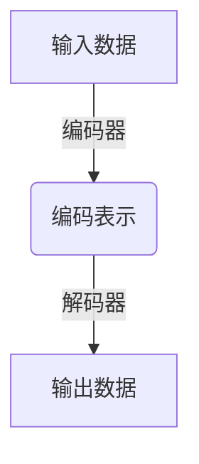

# Autoencoders原理与代码实例讲解

## 1.背景介绍

在深度学习和人工智能领域,自编码器(Autoencoders)是一种无监督学习技术,主要用于数据压缩、降维和特征学习。它们的工作原理是通过神经网络将高维输入数据编码为低维表示,然后再将这个低维表示解码还原为与原始输入数据相似的高维输出。自编码器的关键在于,通过对网络施加合适的约束,迫使其学习输入数据的有用特征和模式,从而实现有效的数据压缩和特征提取。

自编码器最早由Hinton等人在2006年提出,当时主要用于降维和预训练深度神经网络的初始权重。近年来,随着深度学习的快速发展,自编码器及其变体在多个领域得到了广泛应用,包括异常检测、生成式对抗网络(GANs)、降噪自动编码器(Denoising Autoencoders)等。其强大的特征学习能力使其成为无监督表示学习的重要工具。

### 1.1 为什么需要自编码器?

在机器学习任务中,我们经常会遇到以下情况:

- 原始数据维度很高,包含大量冗余信息,需要进行降维以提高计算效率。
- 原始数据存在噪声,需要对数据进行去噪处理。
- 需要从原始数据中学习出有用的特征表示,以便于后续的任务,如分类、聚类等。

自编码器恰好能够很好地解决上述问题。它们能够自动从数据中学习出有用的特征表示,并且可以对数据进行有损压缩,从而达到降维和去噪的目的。

### 1.2 自编码器的基本结构

一个基本的自编码器由两部分组成:编码器(encoder)和解码器(decoder)。编码器将高维输入数据编码为低维表示,而解码器则将这个低维表示解码还原为与原始输入相似的高维输出。

编码器和解码器通常都是由全连接或卷积神经网络构成。在训练过程中,自编码器会最小化输入数据和输出数据之间的重构误差,迫使其学习到能够有效压缩和重构数据的特征表示。

## 2.核心概念与联系

### 2.1 自编码器的基本形式

给定一个输入数据 $\mathbf{x} \in \mathbb{R}^{d}$,我们希望学习两个函数:

1. 编码器函数 $f: \mathbb{R}^{d} \rightarrow \mathbb{R}^{k}$,将输入数据 $\mathbf{x}$ 编码为低维表示 $\mathbf{z} = f(\mathbf{x})$,其中 $\mathbf{z} \in \mathbb{R}^{k}$,且 $k < d$。
2. 解码器函数 $g: \mathbb{R}^{k} \rightarrow \mathbb{R}^{d}$,将低维表示 $\mathbf{z}$ 解码还原为与原始输入 $\mathbf{x}$ 相似的高维输出 $\mathbf{x}' = g(\mathbf{z})$。

编码器和解码器通常都是由神经网络参数化,例如多层感知器(MLP)或卷积神经网络(CNN)。自编码器的训练目标是最小化输入 $\mathbf{x}$ 和输出 $\mathbf{x}'$ 之间的重构误差:

$$\mathcal{L}(\mathbf{x}, \mathbf{x}') = \| \mathbf{x} - g(f(\mathbf{x})) \|^2$$

通过最小化这个重构误差,自编码器被迫学习到能够有效压缩和重构数据的特征表示 $\mathbf{z}$。

### 2.2 自编码器的变体

基本的自编码器结构可以通过施加不同的约束和正则化来扩展,从而得到不同的变体,用于解决不同的任务。一些常见的自编码器变体包括:

- **稀疏自编码器(Sparse Autoencoders)**: 通过在隐含层施加稀疏性约束,迫使隐含层的神经元只对于某些特定的输入模式激活,从而学习出更加鲁棒和可解释的特征表示。
- **去噪自编码器(Denoising Autoencoders)**: 在输入数据中加入噪声,迫使自编码器学习到对噪声具有鲁棒性的特征表示,常用于降噪和数据净化任务。
- **变分自编码器(Variational Autoencoders, VAEs)**: 通过在编码器上施加变分约束,将编码器的输出视为隐含变量的概率分布,从而使自编码器能够生成新的数据样本。
- **卷积自编码器(Convolutional Autoencoders)**: 使用卷积神经网络构建编码器和解码器,常用于图像数据的压缩和特征提取。

通过对自编码器施加不同的约束和正则化,我们可以使其适应不同的任务需求,发挥更强大的功能。

## 3.核心算法原理具体操作步骤

自编码器的训练过程可以总结为以下几个步骤:

1. **初始化编码器和解码器网络**。通常使用随机初始化的权重参数。
2. **输入数据并通过编码器获得编码表示**。将输入数据 $\mathbf{x}$ 传入编码器网络 $f$,获得低维编码表示 $\mathbf{z} = f(\mathbf{x})$。
3. **通过解码器从编码表示重构输出**。将编码表示 $\mathbf{z}$ 传入解码器网络 $g$,获得重构输出 $\mathbf{x}' = g(\mathbf{z})$。
4. **计算重构误差**。计算输入 $\mathbf{x}$ 和重构输出 $\mathbf{x}'$ 之间的重构误差 $\mathcal{L}(\mathbf{x}, \mathbf{x}')$,常用的误差函数包括均方误差(MSE)、交叉熵(Cross Entropy)等。
5. **反向传播误差并更新网络参数**。利用反向传播算法,计算误差相对于编码器和解码器网络参数的梯度,并使用优化算法(如随机梯度下降)更新网络参数,以最小化重构误差。
6. **重复步骤2-5,直到收敛**。重复上述过程,直到重构误差收敛或达到预设的最大迭代次数。

通过上述过程,自编码器能够学习到输入数据的有用特征表示,并且可以将高维输入数据压缩为低维编码,再从该低维编码重构出与原始输入相似的高维输出。

需要注意的是,在实际应用中,我们通常会在自编码器的基础上施加额外的约束和正则化项,以满足不同任务的需求。例如,在变分自编码器中,我们会对编码器的输出施加变分约束,使其能够生成新的数据样本;在去噪自编码器中,我们会在输入数据中加入噪声,迫使自编码器学习到对噪声具有鲁棒性的特征表示。

## 4.数学模型和公式详细讲解举例说明

在上一节中,我们介绍了自编码器的基本原理和训练步骤。现在,让我们更深入地探讨自编码器的数学模型和公式。

### 4.1 自编码器的数学表示

给定一个输入数据 $\mathbf{x} \in \mathbb{R}^{d}$,我们希望学习两个函数:

1. 编码器函数 $f: \mathbb{R}^{d} \rightarrow \mathbb{R}^{k}$,将输入数据 $\mathbf{x}$ 编码为低维表示 $\mathbf{z} = f(\mathbf{x})$,其中 $\mathbf{z} \in \mathbb{R}^{k}$,且 $k < d$。
2. 解码器函数 $g: \mathbb{R}^{k} \rightarrow \mathbb{R}^{d}$,将低维表示 $\mathbf{z}$ 解码还原为与原始输入 $\mathbf{x}$ 相似的高维输出 $\mathbf{x}' = g(\mathbf{z})$。

在自编码器中,编码器和解码器通常都是由神经网络参数化。例如,我们可以使用多层感知器(MLP)来表示编码器和解码器:

$$f(\mathbf{x}) = \sigma(W_e^{(l)} \cdots \sigma(W_e^{(1)}\mathbf{x} + b_e^{(1)}) \cdots + b_e^{(l)})$$
$$g(\mathbf{z}) = \sigma(W_d^{(l)} \cdots \sigma(W_d^{(1)}\mathbf{z} + b_d^{(1)}) \cdots + b_d^{(l)})$$

其中 $W_e^{(i)}$ 和 $b_e^{(i)}$ 分别表示编码器第 $i$ 层的权重和偏置,而 $W_d^{(i)}$ 和 $b_d^{(i)}$ 分别表示解码器第 $i$ 层的权重和偏置。$\sigma$ 是激活函数,如 ReLU 或 Sigmoid。

在训练过程中,自编码器的目标是最小化输入 $\mathbf{x}$ 和重构输出 $\mathbf{x}'$ 之间的重构误差:

$$\mathcal{L}(\mathbf{x}, \mathbf{x}') = \| \mathbf{x} - g(f(\mathbf{x})) \|^2$$

这里我们使用了均方误差(Mean Squared Error, MSE)作为损失函数,但也可以使用其他损失函数,如交叉熵(Cross Entropy)等。

通过最小化这个重构误差,自编码器被迫学习到能够有效压缩和重构数据的特征表示 $\mathbf{z}$。

### 4.2 稀疏自编码器

在基本的自编码器结构中,我们可以通过施加额外的约束来获得不同的变体,用于解决不同的任务。一个常见的变体是稀疏自编码器(Sparse Autoencoders)。

稀疏自编码器的目标是在隐含层(编码表示 $\mathbf{z}$)施加稀疏性约束,迫使隐含层的神经元只对于某些特定的输入模式激活,从而学习出更加鲁棒和可解释的特征表示。

具体来说,我们可以在自编码器的损失函数中加入一个稀疏性正则项:

$$\mathcal{L}(\mathbf{x}, \mathbf{x}') = \| \mathbf{x} - g(f(\mathbf{x})) \|^2 + \lambda \cdot \Omega(\rho, \hat{\rho})$$

其中 $\Omega(\rho, \hat{\rho})$ 是一个稀疏性惩罚项,用于约束隐含层的平均活跃度 $\hat{\rho}$ 接近于预设的稀疏度目标 $\rho$。$\lambda$ 是一个超参数,用于控制稀疏性约束的强度。

常见的稀疏性惩罚项包括:

1. **KL 散度(KL Divergence)**:

$$\Omega(\rho, \hat{\rho}) = \rho \log \frac{\rho}{\hat{\rho}} + (1-\rho) \log \frac{1-\rho}{1-\hat{\rho}}$$

2. **平方误差(Squared Error)**:

$$\Omega(\rho, \hat{\rho}) = \frac{1}{2}(\rho - \hat{\rho})^2$$

其中 $\hat{\rho}$ 是隐含层神经元的平均活跃度,可以通过以下公式计算:

$$\hat{\rho} = \frac{1}{m} \sum_{i=1}^{m} \frac{1}{k} \sum_{j=1}^{k} [z_j^{(i)}]$$

这里 $m$ 是训练批次的大小,而 $k$ 是隐含层的维度。$z_j^{(i)}$ 表示第 $i$ 个训练样本的第 $j$ 个隐含层神经元的输出。

通过在自编码器中引入稀疏性约束,我们可以迫使隐含层学习到更加鲁棒和可解释的特征表示,从而提高自编码器的性能和泛化能力。

### 4.3 去噪自编码器

另一个常见的自编码器变体是去噪自编码器(Denoising Autoencoders)。去噪自编码器的目标是