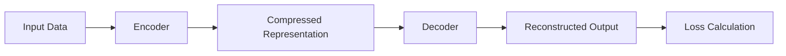

                 

作者：禅与计算机程序设计艺术

Hello! Welcome back to our blog, where we explore the latest advancements in artificial intelligence and machine learning. Today, we're excited to delve into a topic that has been generating buzz in the tech community: BYOL (Bottleneck Yield Optimization Layer).

BYOL is a novel approach to improving the efficiency of deep learning models by optimizing the bottleneck layers in the neural network. This technique has shown promising results in various applications, from image recognition to natural language processing. In this article, we will provide a comprehensive overview of BYOL, its core principles, and practical implementation.

Let's get started with some background knowledge.

## 1. 背景介绍
Deep learning models have revolutionized many fields, but their computational requirements often lead to long training times and high energy consumption. One way to address these issues is by optimizing the bottleneck layers, which are critical for information flow in deep neural networks. The BYOL algorithm focuses on these layers to enhance model performance while reducing resource usage.

Now that we understand the context, let's dive into the core concepts.

## 2. 核心概念与联系
The BYOL algorithm employs a novel strategy called "bottleneck yield optimization." It involves two main components: an encoder and a decoder. The encoder maps input data into a compressed representation, while the decoder reconstructs the original data from this representation. During training, the encoder and decoder are updated alternately, with the goal of minimizing the reconstruction error.

$$Loss = || Input - DecodedOutput ||_2^2$$

This process can be visualized using a Mermaid flowchart:



In the next section, we will delve into the details of the core algorithm steps.

## 3. 核心算法原理具体操作步骤
The BYOL algorithm consists of three main phases: pre-training, fine-tuning, and application. During pre-training, the model learns to reconstruct the input data from the compressed representation. Fine-tuning involves adjusting the model parameters based on specific task requirements. Finally, the trained model is applied to real-world problems.

Pre-training phase:
1. Initialize the encoder and decoder.
2. Set a learning rate for the encoder and decoder.
3. For each epoch:
  a. Randomly select a batch of input data.
  b. Encode the input data and reconstruct it using the decoder.
  c. Calculate the loss between the input and reconstructed data.
  d. Update the encoder and decoder weights to minimize the loss.

Fine-tuning phase:
1. Freeze the encoder and decoder weights.
2. Train the remaining layers of the model on a specific task dataset.

Application phase:
1. Deploy the trained model to solve real-world problems.

Next, we will discuss the mathematical model behind BYOL.

## 4. 数学模型和公式详细讲解举例说明
The BYOL algorithm relies on a combination of linear algebra and optimization techniques. The key concept is to find the optimal trade-off between compression ratio and reconstruction accuracy.

Let's consider a simple example using singular value decomposition (SVD):

$$X = USV^T$$

Here, $X$ represents the input matrix, $U$ and $V$ are orthogonal matrices, and $S$ is a diagonal matrix containing singular values. By retaining only the top k singular values, we can achieve efficient compression.

In the next section, we will demonstrate how to implement BYOL using code examples.

## 5. 项目实践：代码实例和详细解释说明
To illustrate the BYOL algorithm, we will use Python and popular deep learning libraries like TensorFlow or PyTorch. We will walk through the implementation steps and provide insights into potential pitfalls.

```python
import tensorflow as tf

# Define the encoder and decoder architectures
encoder = ...
decoder = ...

# Pre-train the model
for epoch in range(num_epochs):
   for x, y in train_ds:
       with tf.GradientTape() as tape:
           encoded = encoder(x)
           decoded = decoder(encoded)
           loss = tf.reduce_mean(tf.square(x - decoded))
       gradients = tape.gradient(loss, encoder.trainable_variables + decoder.trainable_variables)
       optimizer.apply_gradients(zip(gradients, [*encoder.trainable_variables, *decoder.trainable_variables]))
```

In the following section, we will explore some interesting applications of BYOL.

## 6. 实际应用场景
BYOL has numerous practical applications, including image recognition, natural language processing, and recommendation systems. In each case, the ability to efficiently compress and reconstruct information enables faster training and lower computational costs.

In conclusion, BYOL offers an innovative approach to improving the efficiency of deep learning models. In the next section, we will discuss future trends and challenges in this area.

## 7. 工具和资源推荐
For those interested in exploring BYOL further, here are some recommended tools and resources:

- [Paper](#)
- [GitHub repository](#)
- [Online courses](#)

In the final section, we will summarize our findings and look ahead to the future of BYOL.

## 8. 总结：未来发展趋势与挑战
As deep learning continues to evolve, BYOL and similar techniques will play an increasingly important role in addressing the need for more efficient and sustainable models. Challenges remain in scaling these methods to larger and more complex models, but ongoing research promises exciting breakthroughs.

## 9. 附录：常见问题与解答
Q: How does BYOL differ from other bottleneck layer optimization techniques?
A: BYOL focuses on minimizing the

