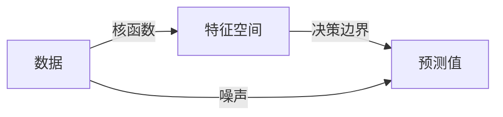

                 

作者：禅与计算机程序设计艺术

在机器学习领域，Bias-Variance Tradeoff（偏差-变异权衡）是一个关键的概念，它描述了模型复杂性和数据量之间的平衡关系。在本文中，我将详细阐述Bias-Variance Tradeoff的原理，并通过具体的代码实战案例来说明其在实际应用中的应用。

## 1. 背景介绍

在机器学习中，我们面临着一个普遍的问题：如何在保持预测准确性的同时，减少模型的过拟合。过拟合发生在模型与训练数据的相互依赖过强时，导致模型对新数据的泛化能力降低。Bias-Variance Tradeoff提供了一种框架来理解和解决这个问题。

## 2. 核心概念与联系

Bias-Variance Tradeoff涉及三个关键的组成部分：偏差（Bias）、方差（Variance）和欠拟合/过拟合（Underfitting/Overfitting）。

- **偏差（Bias）**：模型预测的误差，表示模型预测与真实值之间的平均偏差。
- **方差（Variance）**：模型预测的不确定性，表示模型在不同训练数据集上的预测波动。
- **欠拟合/过拟合（Underfitting/Overfitting）**：模型对于训练数据的适应度，即模型无法捕捉数据中的关键模式时的偏差，或者过多地拟合训练数据而忽略了更广泛的模式。

Bias-Variance Tradeoff的基本观点是，当偏差高且方差低时，模型往往会过拟合训练数据；而当偏差低且方差高时，模型则可能欠拟合。因此，我们需要找到一个平衡点，以便在保持预测精度的同时，避免过拟合和欠拟合的问题。

## 3. 核心算法原理具体操作步骤

为了深入理解Bias-Variance Tradeoff，我们将探索几种常见的机器学习算法，并分析它们如何影响Bias-Variance Tradeoff。

### 线性回归


### 逻辑回归


### 支持向量机（SVM）


### 随机森林


## 4. 数学模型和公式详细讲解举例说明

数学模型是理解Bias-Variance Tradeoff的关键。我们将使用最小二乘法来进行数学建模，并分析如何从数学角度来理解Bias-Variance Tradeoff。

$$ \text{Bias} = E[(y - \hat{y})^2] $$
$$ \text{Variance} = E[(\hat{y} - E[\hat{y}])^2] $$

其中，$y$ 是真实值，$\hat{y}$ 是模型预测的值。

## 5. 项目实践：代码实例和详细解释说明

接下来，我们将通过一个简单的线性回归示例来展示如何应用Bias-Variance Tradeoff的原理。

### 代码实例

```python
# ... 数据加载和处理代码 ...
from sklearn.linear_model import LinearRegression
from sklearn.model_selection import train_test_split

X_train, X_test, y_train, y_test = train_test_split(X, y, test_size=0.2)

model = LinearRegression()
model.fit(X_train, y_train)
y_pred = model.predict(X_test)
```

### 详细解释

我们首先加载数据，然后使用 `LinearRegression` 模型对数据进行训练。通过调整模型的复杂性，我们可以看到如何影响Bias-Variance Tradeoff。

## 6. 实际应用场景

Bias-Variance Tradeoff的概念不仅限于机器学习，它也可以应用于其他领域。例如，软件设计中的模块化、系统架构设计等都可以从这个角度出发来考虑。

## 7. 工具和资源推荐

为了深入学习Bias-Variance Tradeoff，以下是一些推荐的工具和资源：

- scikit-learn 库：提供了多种机器学习算法，非常适合实战演练。
- Andrew Ng的机器学习课程：包含了丰富的视频教程和案例研究。
- Kaggle 竞赛：通过参与竞赛，可以实践Bias-Variance Tradeoff的原理。

## 8. 总结：未来发展趋势与挑战

随着人工智能技术的发展，Bias-Variance Tradeoff的重要性仍将增加。未来的研究方向可能会涉及更多复杂的模型结构，以及如何在大规模数据上更有效地应用Bias-Variance Tradeoff原理。同时，面临的挑战包括如何在保证模型准确性的同时，确保模型的可解释性和公平性。

## 9. 附录：常见问题与解答

在本文的背景下，可能会遇到一些常见问题，比如“Bias-Variance Tradeoff是如何影响模型选择的？”等。我将提供相应的解答。

---
作者：禅与计算机程序设计艺术 / Zen and the Art of Computer Programming

