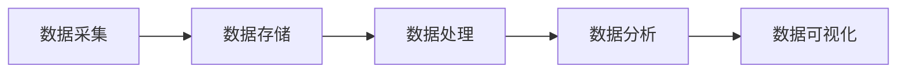

# Big Data 原理与代码实战案例讲解

## 1. 背景介绍
### 1.1 大数据时代的来临
#### 1.1.1 数据爆炸式增长
#### 1.1.2 传统技术面临挑战
#### 1.1.3 大数据技术应运而生

### 1.2 大数据的定义与特征
#### 1.2.1 大数据的4V特征
#### 1.2.2 大数据与传统数据的区别
#### 1.2.3 大数据处理的挑战

### 1.3 大数据技术生态系统
#### 1.3.1 Hadoop生态系统
#### 1.3.2 Spark生态系统  
#### 1.3.3 其他大数据技术

## 2. 核心概念与联系
### 2.1 分布式存储
#### 2.1.1 HDFS分布式文件系统
#### 2.1.2 HBase分布式列存储
#### 2.1.3 Cassandra分布式NoSQL数据库

### 2.2 分布式计算
#### 2.2.1 MapReduce分布式计算框架
#### 2.2.2 Spark分布式计算引擎
#### 2.2.3 Flink流计算框架

### 2.3 数据处理流程


## 3. 核心算法原理具体操作步骤
### 3.1 MapReduce编程模型
#### 3.1.1 Map阶段
#### 3.1.2 Shuffle阶段 
#### 3.1.3 Reduce阶段

### 3.2 Spark RDD编程模型
#### 3.2.1 RDD的创建
#### 3.2.2 RDD的转换操作
#### 3.2.3 RDD的行动操作

### 3.3 Flink DataStream编程模型  
#### 3.3.1 DataSource
#### 3.3.2 Transformation
#### 3.3.3 DataSink

## 4. 数学模型和公式详细讲解举例说明
### 4.1 协同过滤推荐算法
#### 4.1.1 用户-物品评分矩阵
$$
R=
\begin{bmatrix} 
r_{11} & r_{12} & \cdots & r_{1n}\\ 
r_{21} & r_{22} & \cdots & r_{2n}\\
\vdots & \vdots & \ddots & \vdots\\
r_{m1} & r_{m2} & \cdots & r_{mn}\\
\end{bmatrix}
$$
#### 4.1.2 余弦相似度
$sim(i,j) = \frac{\sum_{u\in U}R_{ui}R_{uj}}{\sqrt{\sum_{u\in U}R_{ui}^2}\sqrt{\sum_{u\in U}R_{uj}^2}}$

#### 4.1.3 预测用户评分
$P_{ui} = \overline{R_u} + \frac{\sum_{j\in S(i;u)}sim(i,j)(R_{uj}-\overline{R_j})}{\sum_{j\in S(i;u)}|sim(i,j)|}$

### 4.2 PageRank链接分析算法
#### 4.2.1 初始PageRank值
$PR(p_i)=\frac{1}{N}$

#### 4.2.2 PageRank计算公式
$PR(p_i)=\frac{1-d}{N}+d\sum_{p_j\in M(p_i)}\frac{PR(p_j)}{L(p_j)}$

#### 4.2.3 迭代计算收敛

## 5. 项目实践：代码实例和详细解释说明
### 5.1 Hadoop WordCount实例
#### 5.1.1 Map函数
```java
public static class TokenizerMapper extends Mapper<Object, Text, Text, IntWritable> {
    private final static IntWritable one = new IntWritable(1);
    private Text word = new Text();
      
    public void map(Object key, Text value, Context context) throws IOException, InterruptedException {
        StringTokenizer itr = new StringTokenizer(value.toString());
        while (itr.hasMoreTokens()) {
            word.set(itr.nextToken());
            context.write(word, one);
        }
    }
}
```

#### 5.1.2 Reduce函数
```java
public static class IntSumReducer extends Reducer<Text,IntWritable,Text,IntWritable> {
    private IntWritable result = new IntWritable();

    public void reduce(Text key, Iterable<IntWritable> values, Context context) throws IOException, InterruptedException {
        int sum = 0;
        for (IntWritable val : values) {
            sum += val.get();
        }
        result.set(sum);
        context.write(key, result);
    }
}
```

#### 5.1.3 运行WordCount作业
```java
Configuration conf = new Configuration();
Job job = Job.getInstance(conf, "word count");
job.setJarByClass(WordCount.class);
job.setMapperClass(TokenizerMapper.class);
job.setCombinerClass(IntSumReducer.class);
job.setReducerClass(IntSumReducer.class);
job.setOutputKeyClass(Text.class);
job.setOutputValueClass(IntWritable.class);
FileInputFormat.addInputPath(job, new Path(args[0]));
FileOutputFormat.setOutputPath(job, new Path(args[1]));
System.exit(job.waitForCompletion(true) ? 0 : 1);
```

### 5.2 Spark WordCount实例
#### 5.2.1 创建SparkContext
```scala
val conf = new SparkConf().setAppName("WordCount") 
val sc = new SparkContext(conf)
```

#### 5.2.2 加载数据创建RDD
```scala
val textFile = sc.textFile("hdfs://...")
```

#### 5.2.3 执行WordCount
```scala
val counts = textFile.flatMap(line => line.split(" "))
                 .map(word => (word, 1))
                 .reduceByKey(_ + _)
```

#### 5.2.4 保存结果
```scala
counts.saveAsTextFile("hdfs://...")
```

## 6. 实际应用场景
### 6.1 电商推荐系统
#### 6.1.1 用户行为数据采集
#### 6.1.2 离线批处理生成推荐
#### 6.1.3 实时流处理更新推荐

### 6.2 金融风控系统
#### 6.2.1 交易数据实时采集
#### 6.2.2 实时风险监控
#### 6.2.3 离线模型训练优化

### 6.3 智慧城市
#### 6.3.1 传感器数据采集
#### 6.3.2 实时数据处理分析
#### 6.3.3 数据挖掘与预测

## 7. 工具和资源推荐
### 7.1 大数据平台
- Hadoop
- Spark
- Flink
- Storm
- Hive
- HBase

### 7.2 开发工具
- IntelliJ IDEA
- Eclipse
- Zeppelin Notebook

### 7.3 学习资源
- 官方文档
- 慕课网大数据课程
- 图灵社区大数据书籍

## 8. 总结：未来发展趋势与挑战
### 8.1 大数据与人工智能融合
### 8.2 流批一体化处理
### 8.3 数据隐私与安全
### 8.4 大数据技术标准化

## 9. 附录：常见问题与解答
### 9.1 如何选择合适的大数据框架？
### 9.2 大数据项目需要哪些角色？
### 9.3 学习大数据需要哪些基础？
### 9.4 如何搭建大数据学习环境？

作者：禅与计算机程序设计艺术 / Zen and the Art of Computer Programming