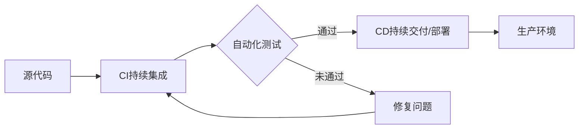

# CI/CD与自动化测试原理与代码实战案例讲解

## 1. 背景介绍
### 1.1 CI/CD的发展历史
### 1.2 自动化测试的重要性
### 1.3 CI/CD与自动化测试在软件开发中的作用

## 2. 核心概念与联系
### 2.1 CI的概念与原理
#### 2.1.1 持续集成(Continuous Integration)的定义
#### 2.1.2 CI的工作流程
#### 2.1.3 CI的优势
### 2.2 CD的概念与原理 
#### 2.2.1 持续交付(Continuous Delivery)的定义
#### 2.2.2 持续部署(Continuous Deployment)的定义
#### 2.2.3 CD的工作流程
#### 2.2.4 CD的优势
### 2.3 自动化测试的概念与分类
#### 2.3.1 自动化测试的定义
#### 2.3.2 自动化测试的分类
#### 2.3.3 自动化测试的优势
### 2.4 CI/CD与自动化测试的关系

## 3. 核心算法原理具体操作步骤
### 3.1 CI/CD流水线的构建
#### 3.1.1 代码管理
#### 3.1.2 构建触发
#### 3.1.3 环境准备 
#### 3.1.4 构建与测试
#### 3.1.5 部署
#### 3.1.6 通知与报告
### 3.2 Jenkins的安装与配置
#### 3.2.1 Jenkins的安装
#### 3.2.2 Jenkins的系统配置
#### 3.2.3 Jenkins插件管理
### 3.3 Jenkins Pipeline的使用
#### 3.3.1 Pipeline的概念
#### 3.3.2 Jenkinsfile的编写
#### 3.3.3 Pipeline的执行与调试

## 4. 数学模型和公式详细讲解举例说明
### 4.1 自动化测试覆盖率模型
$$ Coverage = \frac{已测试代码行数}{总代码行数} \times 100\% $$
### 4.2 缺陷检测效率模型
$$ DDE = \frac{检测到的缺陷数}{实际存在的缺陷数} \times 100\% $$
### 4.3 CI/CD时间成本模型
$$ TimeCost = \sum_{i=1}^{n} (Build_i + Test_i + Deploy_i) $$

## 5. 项目实践：代码实例和详细解释说明
### 5.1 构建一个Java项目的CI/CD流水线
#### 5.1.1 项目代码结构
#### 5.1.2 编写Jenkinsfile
#### 5.1.3 配置Jenkins任务
#### 5.1.4 执行与验证
### 5.2 自动化单元测试的实现
#### 5.2.1 使用JUnit编写单元测试
#### 5.2.2 Mockito的使用
#### 5.2.3 测试报告的生成
### 5.3 自动化API测试的实现
#### 5.3.1 使用Postman编写API测试
#### 5.3.2 Newman的使用
#### 5.3.3 测试报告的生成
### 5.4 自动化UI测试的实现
#### 5.4.1 使用Selenium编写UI测试
#### 5.4.2 测试报告的生成

## 6. 实际应用场景
### 6.1 互联网公司的CI/CD实践
### 6.2 金融行业的CI/CD实践
### 6.3 电商行业的CI/CD实践

## 7. 工具和资源推荐
### 7.1 CI/CD工具
#### 7.1.1 Jenkins
#### 7.1.2 GitLab CI
#### 7.1.3 Travis CI
#### 7.1.4 CircleCI
### 7.2 自动化测试工具
#### 7.2.1 Selenium
#### 7.2.2 Appium
#### 7.2.3 JMeter
#### 7.2.4 Postman
### 7.3 学习资源
#### 7.3.1 官方文档
#### 7.3.2 技术博客
#### 7.3.3 视频教程

## 8. 总结：未来发展趋势与挑战
### 8.1 CI/CD的发展趋势
#### 8.1.1 云原生CI/CD
#### 8.1.2 AI赋能CI/CD
#### 8.1.3 安全与合规
### 8.2 自动化测试的发展趋势
#### 8.2.1 智能测试
#### 8.2.2 测试左移
#### 8.2.3 全栈自动化测试
### 8.3 CI/CD与自动化测试面临的挑战
#### 8.3.1 复杂系统的测试
#### 8.3.2 测试数据的管理
#### 8.3.3 测试与开发的协作

## 9. 附录：常见问题与解答
### 9.1 如何选择适合的CI/CD工具？
### 9.2 如何提高自动化测试的稳定性？
### 9.3 如何进行CI/CD流水线的优化？
### 9.4 如何处理自动化测试中的失败用例？
### 9.5 如何保障CI/CD流水线的安全性？

作者：禅与计算机程序设计艺术 / Zen and the Art of Computer Programming