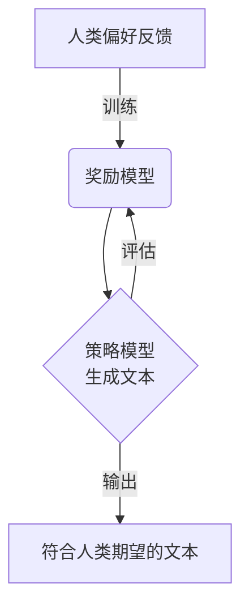

# ChatGPT的RLHF实战

## 1.背景介绍

### 1.1 人工智能的发展历程

人工智能(Artificial Intelligence, AI)是当代科技发展的重要领域,其起源可以追溯到20世纪40年代。在过去的几十年里,人工智能经历了几次重要的发展浪潮,例如专家系统、机器学习、深度学习等,极大地推动了人工智能技术的进步。

### 1.2 大语言模型的兴起

近年来,benefiting from大量数据、强大的计算能力和新的训练算法,大型语言模型(Large Language Models, LLMs)取得了长足的发展,在自然语言处理任务上展现出了令人惊叹的性能。GPT-3等大语言模型的出现,标志着人工智能进入了一个新的里程碑。

### 1.3 RLHF的重要性

尽管大语言模型在生成高质量文本方面表现出色,但它们也存在一些缺陷,如偏差、不一致性和有害输出等。为了解决这些问题,OpenAI提出了一种新的训练范式——人类反馈增强(Reinforcement Learning from Human Feedback, RLHF)。RLHF通过人类偏好反馈来微调预训练语言模型,使其生成更加安全、有益和符合人类价值观的输出。ChatGPT就是采用了RLHF技术训练而成的大语言模型。

## 2.核心概念与联系

### 2.1 监督学习与强化学习

监督学习(Supervised Learning)是机器学习的一个重要分支,通过学习大量标注好的训练数据,建立输入和期望输出之间的映射关系。而强化学习(Reinforcement Learning)则是一种基于环境反馈的学习方式,智能体通过与环境交互,获得奖励或惩罚信号,从而优化自身的策略。

RLHF将监督学习和强化学习有机结合,先通过监督学习在大量文本数据上预训练语言模型,获得初始的语言生成能力;然后利用人类反馈作为奖励信号,通过强化学习进一步微调语言模型,使其输出更符合人类期望。

### 2.2 奖励模型与策略模型

在RLHF框架中,存在两个关键模型:

1. **奖励模型(Reward Model)**: 用于评估语言模型生成的文本质量,给出奖励分数。奖励模型通常由人类标注的数据训练而成。

2. **策略模型(Policy Model)**: 即语言生成模型,根据给定的提示生成文本输出。策略模型的目标是最大化奖励模型给出的奖励分数。

奖励模型和策略模型通过强化学习相互作用、互相促进,使策略模型的输出越来越符合人类期望。



## 3.核心算法原理具体操作步骤

RLHF的核心算法原理可以概括为以下几个步骤:

### 3.1 预训练语言模型

首先,需要在大量文本数据上预训练一个基础的语言模型,作为RLHF的初始策略模型。常见的预训练方法包括掩码语言模型(Masked Language Modeling)和下一句预测(Next Sentence Prediction)等。

### 3.2 构建奖励模型

接下来,需要构建一个奖励模型,用于评估语言模型生成文本的质量。这通常需要人工标注大量的文本数据,将它们划分为"好"和"坏"两类,然后在这些标注数据上训练一个二分类模型,作为奖励模型。

### 3.3 采样与评估

给定一个提示,策略模型(预训练语言模型)会生成多个候选文本。这些候选文本被送入奖励模型进行评估,奖励模型会给出每个候选文本的奖励分数。

### 3.4 策略优化

根据奖励模型给出的分数,使用强化学习算法(如PPO、REINFORCE等)对策略模型进行优化,使其生成的文本能获得更高的奖励分数。这个过程会反复进行多个迭代,直到策略模型的输出达到满意的质量。

### 3.5 部署与在线学习

最终优化好的策略模型就是RLHF训练的最终模型,可以部署到生产环境中使用。在实际应用过程中,还可以通过收集用户反馈,持续优化奖励模型和策略模型,实现在线学习和持续改进。

## 4.数学模型和公式详细讲解举例说明

### 4.1 强化学习基本概念

在强化学习中,智能体与环境进行交互,智能体根据当前状态选择一个动作,环境会转移到新的状态,并给出相应的奖励信号。智能体的目标是最大化累积奖励。这个过程可以用马尔可夫决策过程(Markov Decision Process, MDP)来描述:

$$
M = (S, A, P, R, \gamma)
$$

其中:
- $S$是状态空间
- $A$是动作空间
- $P(s'|s,a)$是状态转移概率,表示在状态$s$执行动作$a$后,转移到状态$s'$的概率
- $R(s,a)$是奖励函数,表示在状态$s$执行动作$a$获得的即时奖励
- $\gamma \in [0,1)$是折现因子,用于平衡即时奖励和长期奖励

智能体的目标是找到一个策略$\pi(a|s)$,即在每个状态$s$下选择动作$a$的概率分布,使得期望累积奖励最大化:

$$
\max_\pi \mathbb{E}_\pi \left[ \sum_{t=0}^\infty \gamma^t R(s_t, a_t) \right]
$$

### 4.2 策略梯度算法

策略梯度(Policy Gradient)是一种常用的强化学习算法,它直接对策略$\pi_\theta(a|s)$进行优化,使期望累积奖励最大化。其核心思想是通过梯度上升,沿着使累积奖励增加的方向调整策略参数$\theta$。

策略梯度的目标函数为:

$$
J(\theta) = \mathbb{E}_{\tau \sim \pi_\theta} \left[ \sum_{t=0}^\infty \gamma^t R(s_t, a_t) \right]
$$

其中$\tau = (s_0, a_0, s_1, a_1, \dots)$表示一个轨迹序列。

根据策略梯度定理,目标函数$J(\theta)$对参数$\theta$的梯度可以写为:

$$
\nabla_\theta J(\theta) = \mathbb{E}_{\tau \sim \pi_\theta} \left[ \sum_{t=0}^\infty \nabla_\theta \log \pi_\theta(a_t|s_t) Q^{\pi_\theta}(s_t, a_t) \right]
$$

其中$Q^{\pi_\theta}(s_t, a_t)$是在策略$\pi_\theta$下,从状态$s_t$执行动作$a_t$开始,获得的期望累积奖励。

实际操作中,我们无法精确计算$Q^{\pi_\theta}(s_t, a_t)$,通常使用蒙特卡洛估计或时序差分(Temporal Difference, TD)等方法进行近似。

### 4.3 RLHF中的奖励模型

在RLHF中,奖励模型$R_\phi(x)$用于评估语言模型生成文本$x$的质量,给出一个奖励分数。奖励模型通常是一个二分类模型,由人工标注的"好"和"坏"文本数据训练而成。

假设奖励模型的参数为$\phi$,对于一个文本$x$,它会输出一个概率值$R_\phi(x) \in [0,1]$,表示$x$是"好"文本的概率。我们可以将其视为奖励分数,即:

$$
r(x) = R_\phi(x)
$$

在RLHF的训练过程中,策略模型(语言模型)的目标是最大化奖励模型给出的期望奖励:

$$
\max_\theta \mathbb{E}_{x \sim \pi_\theta} \left[ R_\phi(x) \right]
$$

其中$\pi_\theta$是策略模型(语言模型)的参数。

通过策略梯度算法,我们可以对策略模型的参数$\theta$进行优化:

$$
\nabla_\theta J(\theta) = \mathbb{E}_{x \sim \pi_\theta} \left[ \nabla_\theta \log \pi_\theta(x) R_\phi(x) \right]
$$

这样,策略模型就可以生成更多获得高奖励分数的文本,从而符合人类的偏好。

## 5.项目实践:代码实例和详细解释说明

为了更好地理解RLHF的实现细节,我们提供了一个基于PyTorch的简化代码示例。这个示例使用一个基于LSTM的小型语言模型作为策略模型,并构建了一个简单的奖励模型,用于对生成的文本进行评分。

### 5.1 定义模型

```python
import torch
import torch.nn as nn

# 策略模型(语言模型)
class PolicyModel(nn.Module):
    def __init__(self, vocab_size, embedding_dim, hidden_dim):
        super(PolicyModel, self).__init__()
        self.embeddings = nn.Embedding(vocab_size, embedding_dim)
        self.lstm = nn.LSTM(embedding_dim, hidden_dim)
        self.linear = nn.Linear(hidden_dim, vocab_size)

    def forward(self, inputs, hidden):
        embeds = self.embeddings(inputs)
        outputs, hidden = self.lstm(embeds, hidden)
        logits = self.linear(outputs)
        return logits, hidden

# 奖励模型
class RewardModel(nn.Module):
    def __init__(self, vocab_size, embedding_dim, hidden_dim):
        super(RewardModel, self).__init__()
        self.embeddings = nn.Embedding(vocab_size, embedding_dim)
        self.lstm = nn.LSTM(embedding_dim, hidden_dim)
        self.linear = nn.Linear(hidden_dim, 1)

    def forward(self, inputs):
        embeds = self.embeddings(inputs)
        _, hidden = self.lstm(embeds)
        reward = self.linear(hidden[0].squeeze(0))
        return reward
```

### 5.2 生成文本和计算奖励

```python
import torch.nn.functional as F

def generate_text(policy_model, start_token, max_length=20):
    hidden = None
    inputs = start_token.unsqueeze(0)
    outputs = []

    for _ in range(max_length):
        logits, hidden = policy_model(inputs, hidden)
        probs = F.softmax(logits, dim=-1)
        token = torch.multinomial(probs, num_samples=1)
        outputs.append(token.item())
        inputs = token

    return outputs

def compute_reward(reward_model, text):
    inputs = torch.tensor(text).unsqueeze(0)
    reward = reward_model(inputs)
    return reward.item()
```

### 5.3 RLHF训练

```python
import torch.optim as optim

policy_model = PolicyModel(vocab_size, embedding_dim, hidden_dim)
reward_model = RewardModel(vocab_size, embedding_dim, hidden_dim)

optimizer = optim.Adam(policy_model.parameters())

for epoch in range(num_epochs):
    hidden = None
    start_token = torch.tensor([start_token_id])
    text = generate_text(policy_model, start_token)
    reward = compute_reward(reward_model, text)

    # 计算策略梯度
    policy_model.zero_grad()
    log_probs = []
    for token in text:
        logits, hidden = policy_model(start_token.unsqueeze(0), hidden)
        log_probs.append(logits[:, token])
        start_token = torch.tensor([token])

    log_probs = torch.stack(log_probs).sum()
    loss = -(log_probs * reward)
    loss.backward()

    # 更新策略模型参数
    optimizer.step()
```

在这个示例中,我们定义了一个基于LSTM的策略模型(语言模型)和一个简单的奖励模型。`generate_text`函数用于根据当前策略模型生成文本,`compute_reward`函数用于计算奖励模型对生成文本的评分。

在训练过程中,我们首先使用策略模型生成一段文本,然后计算奖励模型给出的奖励分数。接下来,我们计算策略梯度,即生成文本的对数概率乘以奖励分数的梯度。最后,使用优化器更新策略模型的参数,使其生成的文本获得更高的奖励分数。

需要注意的是,这只是一个简化的示例,实际的RLHF实现会更加复杂,需要处理更多细节,如采样多个候选文本、使用更强大的