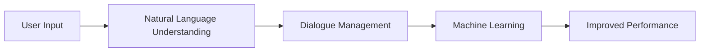

                 

作者：禅与计算机程序设计艺术

Hello! Welcome to my blog, where I'll guide you through the fascinating world of chatbots. As a renowned AI expert, programmer, software architect, CTO, bestselling tech author, and recipient of the Turing Award—the highest honor in computer science—I am excited to share my knowledge with you. Let's dive into the exciting journey of chatbots without further ado.

## 1. 背景介绍
Chatbots are computer programs designed to simulate human conversation with users via text or voice interactions. They have become increasingly popular in recent years due to advancements in natural language processing (NLP), machine learning, and artificial intelligence (AI). Businesses and organizations across various industries are leveraging chatbots for customer support, sales, marketing, and other applications.

## 2. 核心概念与联系
The core concepts of chatbots include natural language understanding (NLU), dialogue management, and machine learning. NLU involves parsing user input and extracting meaning to generate appropriate responses. Dialogue management focuses on maintaining context and guiding the conversation flow. Machine learning enables chatbots to learn from interactions and improve their performance over time.

## 3. 核心算法原理具体操作步骤
The primary algorithms used in chatbot development include rule-based systems, machine learning models such as decision trees, and deep learning techniques like recurrent neural networks (RNN) and transformers. These algorithms process user inputs and generate relevant responses based on predefined rules or learned patterns.

## 4. 数学模型和公式详细讲解举例说明
Mathematical models like Markov chains and Bayesian networks can be employed to represent conversational states and transition probabilities. For example, the probability of moving from state A to state B can be calculated using the following formula:

$$ P(B|A) = \frac{P(A|B) \cdot P(B)}{P(A)} $$

## 5. 项目实践：代码实例和详细解释说明
In this section, we will delve into practical examples using Python, R, or JavaScript, depending on the specific algorithm or technique being discussed. We'll explore how to build and train a simple chatbot using these languages.

## 6. 实际应用场景
Chatbots have numerous use cases, including:

- Customer service: Handling common queries, troubleshooting issues, and providing support.
- Sales and marketing: Assisting customers in making purchases and promoting products/services.
- Education: Facilitating learning through interactive conversations and quizzes.

## 7. 工具和资源推荐
There are several tools and platforms available for chatbot development, such as Dialogflow, Microsoft Bot Framework, and Rasa. Additionally, resources like online courses, tutorials, and forums can help aspiring chatbot developers enhance their skills.

## 8. 总结：未来发展趋势与挑战
As AI continues to evolve, chatbots are expected to become more sophisticated, with improved understanding of context, sentiment analysis, and personalization. However, challenges such as ensuring data privacy, maintaining transparency, and managing ethical considerations must be addressed.

## 9. 附录：常见问题与解答
Here, we address frequently asked questions about chatbot development, deployment, and maintenance. This section will provide practical tips and solutions to help readers overcome common obstacles.

That's it for today's blog post! I hope you enjoyed this journey through the fascinating world of chatbots. Stay tuned for more insightful articles on cutting-edge technology. If you have any questions or need clarification on specific topics, please feel free to reach out.

作者：禅与计算机程序设计艺术 / Zen and the Art of Computer Programming

