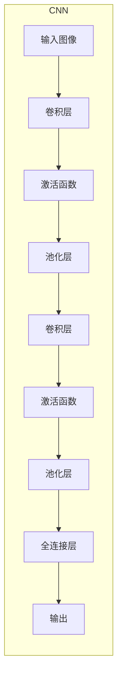
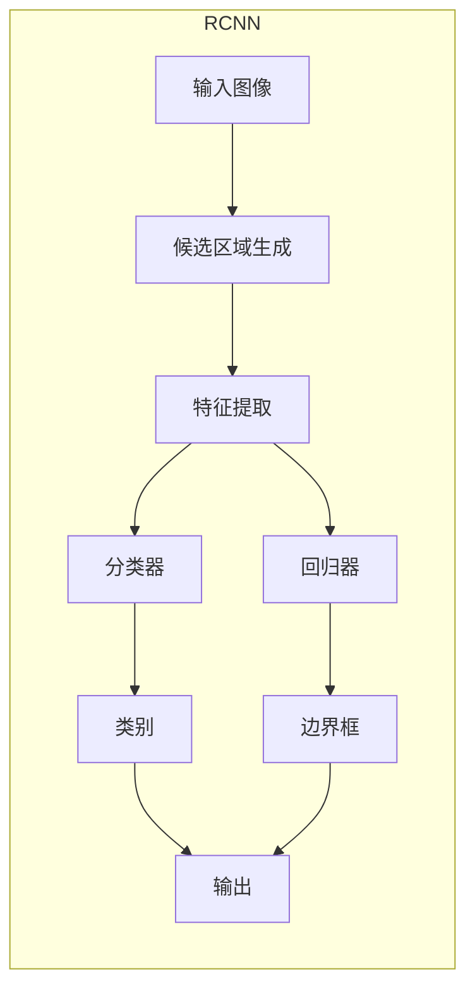
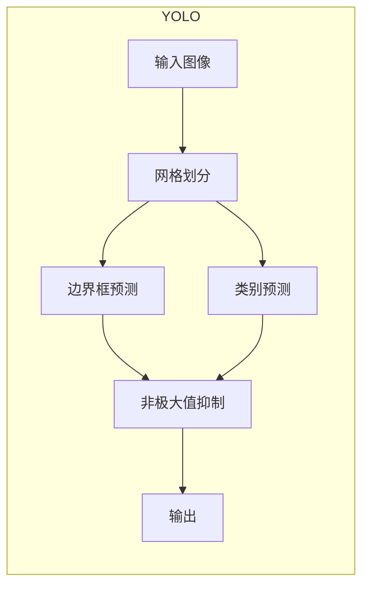

# Computer Vision 原理与代码实例讲解

## 1. 背景介绍

计算机视觉(Computer Vision, CV)是人工智能领域的一个重要分支,旨在使计算机能够从数字图像或视频中获取有意义的高层次理解和信息。它涉及多个领域,包括图像处理、模式识别、机器学习等。随着深度学习技术的快速发展,计算机视觉在各个领域得到了广泛应用,如自动驾驶、人脸识别、医疗影像分析等。

计算机视觉系统通常包括以下几个主要步骤:图像获取、预处理、特征提取、检测/分类、高层次处理和决策。这些步骤相互关联,共同构建了一个完整的计算机视觉解决方案。

## 2. 核心概念与联系

### 2.1 图像处理

图像处理是计算机视觉的基础,主要包括图像去噪、增强、分割、变换等操作。常用的图像处理算法有高斯滤波、中值滤波、直方图均衡化、边缘检测等。

### 2.2 特征提取

特征提取是将图像数据转换为适合后续任务的特征向量的过程。传统方法包括SIFT、HOG等手工设计的特征提取器。近年来,基于深度学习的特征提取方法(如卷积神经网络)展现出优异的性能。

### 2.3 目标检测

目标检测旨在从图像中定位感兴趣的目标,如人脸、车辆等。经典算法有Viola-Jones、HOG+SVM等。当前主流方法是基于深度学习的目标检测网络,如YOLO、Faster R-CNN等。

### 2.4 图像分类

图像分类是将图像归类到预定义的类别中。传统方法包括基于模板匹配、决策树等。深度学习方法如卷积神经网络在大规模图像分类任务上取得了突破性进展。

### 2.5 实例分割

实例分割是同时进行目标检测和像素级别分割的任务。常用的方法包括基于CNN的掩码预测、条件随机场等。实例分割在自动驾驶、医疗影像分析等领域有重要应用。

### 2.6 视频分析

视频分析是对视频序列进行理解和分析的过程,包括目标跟踪、行为识别、动作检测等。常用的方法有卡尔曼滤波、光流估计、时空神经网络等。

## 3. 核心算法原理具体操作步骤

### 3.1 卷积神经网络

卷积神经网络(Convolutional Neural Network, CNN)是计算机视觉中最为广泛使用的深度学习模型。它由卷积层、池化层和全连接层组成,能够自动从图像数据中学习出多层次的特征表示。

CNN 的具体操作步骤如下:

1. **卷积层(Convolution Layer)**: 通过滑动卷积核(小矩阵)在输入图像上进行卷积运算,提取局部特征。
2. **激活函数(Activation Function)**: 对卷积结果进行非线性变换,如ReLU函数,增加模型的表达能力。
3. **池化层(Pooling Layer)**: 对特征图进行下采样,减小特征图的尺寸,提高模型的鲁棒性。
4. **全连接层(Fully Connected Layer)**: 将所有特征拼接成一个向量,并通过全连接层进行分类或回归。

在训练过程中,CNN 通过反向传播算法和梯度下降优化权重参数,使得输出结果与标签值逐渐接近。



### 3.2 目标检测算法

目标检测是计算机视觉中一个核心任务,常用的算法包括基于区域的目标检测(R-CNN系列)和基于回归的目标检测(YOLO系列)。

**R-CNN 系列算法**的主要步骤:

1. **候选区域生成**: 使用选择性搜索等算法生成大量候选边界框。
2. **特征提取**: 对每个候选框提取特征,常用预训练的CNN模型。
3. **分类和回归**: 使用SVM或softmax分类器对候选框进行分类,同时对边界框进行回归调整。



**YOLO 系列算法**的主要步骤:

1. **网格划分**: 将输入图像划分为 S×S 个网格。
2. **边界框预测**: 每个网格预测 B 个边界框及其置信度。
3. **类别预测**: 每个边界框预测 C 个类别概率。
4. **非极大值抑制**: 去除重叠的冗余边界框。



## 4. 数学模型和公式详细讲解举例说明

### 4.1 卷积运算

卷积运算是CNN中最基本的操作,用于提取输入图像的局部特征。给定输入特征图 $X$ 和卷积核 $K$,卷积运算可以表示为:

$$
Y_{i,j} = \sum_{m}\sum_{n}X_{i+m,j+n}K_{m,n}
$$

其中 $Y_{i,j}$ 是输出特征图在位置 $(i,j)$ 处的值, $X_{i+m,j+n}$ 是输入特征图在位移 $(m,n)$ 处的值, $K_{m,n}$ 是卷积核的权重。

### 4.2 池化运算

池化运算用于下采样特征图,减小特征图的尺寸,提高模型的鲁棒性。常用的池化操作有最大池化和平均池化。

最大池化的公式为:

$$
Y_{i,j} = \max_{(m,n) \in R}X_{i+m,j+n}
$$

其中 $R$ 是池化窗口的大小, $Y_{i,j}$ 是输出特征图在位置 $(i,j)$ 处的值,等于输入特征图 $X$ 在相应池化窗口内的最大值。

### 4.3 非极大值抑制

非极大值抑制(Non-Maximum Suppression, NMS)是目标检测算法中常用的后处理步骤,用于去除重叠的冗余边界框。

给定一组边界框及其置信度分数,NMS 算法的步骤如下:

1. 按置信度分数从高到低排序所有边界框。
2. 选择置信度最高的边界框作为基准框。
3. 计算其他边界框与基准框的交并比(Intersection over Union, IoU)。
4. 移除与基准框的 IoU 大于阈值的边界框。
5. 重复步骤 2-4,直到所有边界框被处理。

IoU 的计算公式为:

$$
\text{IoU}(B_1, B_2) = \frac{\text{area}(B_1 \cap B_2)}{\text{area}(B_1 \cup B_2)}
$$

其中 $B_1$ 和 $B_2$ 是两个边界框, $\cap$ 表示交集, $\cup$ 表示并集。

## 5. 项目实践: 代码实例和详细解释说明

在本节中,我们将通过一个实际项目来演示如何使用 PyTorch 构建一个简单的卷积神经网络,用于手写数字识别任务。

### 5.1 导入必要的库

```python
import torch
import torchvision
import torchvision.transforms as transforms
import matplotlib.pyplot as plt
import numpy as np
```

### 5.2 加载和预处理数据

我们使用 PyTorch 内置的 MNIST 数据集,并对其进行标准化预处理。

```python
# 定义数据转换
transform = transforms.Compose([transforms.ToTensor(), transforms.Normalize((0.5,), (0.5,))])

# 加载训练和测试数据集
trainset = torchvision.datasets.MNIST(root='./data', train=True, download=True, transform=transform)
testset = torchvision.datasets.MNIST(root='./data', train=False, download=True, transform=transform)

# 创建数据加载器
trainloader = torch.utils.data.DataLoader(trainset, batch_size=64, shuffle=True)
testloader = torch.utils.data.DataLoader(testset, batch_size=64, shuffle=False)
```

### 5.3 定义卷积神经网络模型

我们定义一个简单的卷积神经网络,包含两个卷积层和两个全连接层。

```python
import torch.nn as nn
import torch.nn.functional as F

class Net(nn.Module):
    def __init__(self):
        super(Net, self).__init__()
        self.conv1 = nn.Conv2d(1, 10, kernel_size=5)
        self.conv2 = nn.Conv2d(10, 20, kernel_size=5)
        self.fc1 = nn.Linear(320, 50)
        self.fc2 = nn.Linear(50, 10)

    def forward(self, x):
        x = F.relu(self.conv1(x))
        x = F.max_pool2d(x, 2, 2)
        x = F.relu(self.conv2(x))
        x = F.max_pool2d(x, 2, 2)
        x = x.view(-1, 320)
        x = F.relu(self.fc1(x))
        x = self.fc2(x)
        return x

net = Net()
```

### 5.4 定义损失函数和优化器

我们使用交叉熵损失函数和随机梯度下降优化器。

```python
import torch.optim as optim

criterion = nn.CrossEntropyLoss()
optimizer = optim.SGD(net.parameters(), lr=0.001, momentum=0.9)
```

### 5.5 训练模型

我们在训练集上训练模型,并在测试集上评估模型的性能。

```python
# 训练模型
for epoch in range(10):
    running_loss = 0.0
    for i, data in enumerate(trainloader, 0):
        inputs, labels = data
        optimizer.zero_grad()

        outputs = net(inputs)
        loss = criterion(outputs, labels)
        loss.backward()
        optimizer.step()

        running_loss += loss.item()
        if i % 1000 == 999:
            print('[%d, %5d] loss: %.3f' % (epoch + 1, i + 1, running_loss / 1000))
            running_loss = 0.0

# 测试模型
correct = 0
total = 0
with torch.no_grad():
    for data in testloader:
        images, labels = data
        outputs = net(images)
        _, predicted = torch.max(outputs.data, 1)
        total += labels.size(0)
        correct += (predicted == labels).sum().item()

print('Accuracy on test set: %d %%' % (100 * correct / total))
```

通过这个示例,我们展示了如何使用 PyTorch 构建一个简单的卷积神经网络,并在 MNIST 数据集上进行训练和测试。在实际应用中,您可以根据具体任务和数据集调整网络结构和超参数,以获得更好的性能。

## 6. 实际应用场景

计算机视觉技术在现实世界中有着广泛的应用,包括但不限于以下几个领域:

### 6.1 自动驾驶

自动驾驶汽车需要实时检测和识别道路上的各种物体,如行人、车辆、交通标志等。计算机视觉技术在这一领域扮演着关键角色,如车道线检测、物体检测和跟踪、场景理解等。

### 6.2 人脸识别

人脸识别技术已经被广泛应用于安全监控、门禁系统、移动支付等领域。计算机视觉算法可以从图像或视频中准确检测和识别人脸,并与预先存储的人脸数据库进行匹配。

### 6.3 医疗影像分析

计算机视觉技术在医疗影像分析领域也有着重要应用,如肿瘤检测、病理分析、医学图像分割等。通过深度学习模型,可以自动从医学影像中提取出关键信息,辅助医生进行诊断和治疗。

### 6.4 机器人视觉

机器人视觉系统使用计算机视觉算法来感知和理解环境,从而实现导航、物体抓取、缺