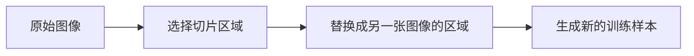

                 

作者：禅与计算机程序设计艺术

Cutmix原理与代码实例讲解
=============================

## 1. 背景介绍

Cutmix是一种新兴的数据增强技术，它通过将两张图像混合成一个新的图像来生成新的训练样本。这种方法可以显著提高深度学习模型的性能，尤其是在有限的数据集上。Cutmix的核心思想是利用切片（cut）和混合（mix）的操作来创建新的训练数据。

## 2. 核心概念与联系

Cutmix的基本思想是首先从原始图像中选择一个区域（切片），然后将这个区域替换为另一张图像中相应的区域（混合）。这种操作不仅仅是简单的图像剪贴，而是需要考虑到图像内容的相关性和上下文意义。

### Mermaid 流程图


## 3. 核心算法原理具体操作步骤

Cutmix算法的具体实现可以分为以下几个步骤：

1. **选择切片区域**：从原始图像中随机选择一个区域。
2. **选择替换区域**：从另一张图像中选择一个与切片区域大小相同的区域。
3. **混合操作**：将选择的替换区域覆盖到原始图像的切片区域上。
4. **调整透明度**：为了保持图像的连贯性，可能需要对混合后的图像进行透明度调整。
5. **生成新样本**：将混合并调整透明度后的图像作为新的训练样本。

## 4. 数学模型和公式详细讲解举例说明

Cutmix的数学模型主要是描述如何计算混合区域的位置和大小。假设我们有一个原始图像 \( I \) 和一个替换图像 \( J \)，我们希望在原始图像中的区域 \( R \) 被替换为替换图像中的区域 \( S \)。

$$
P(R,S|I,J) = P(R|I) \cdot P(S|J)
$$

其中，\( P(R|I) \) 是在图像 \( I \) 中区域 \( R \) 出现的概率，\( P(S|J) \) 是在图像 \( J \) 中区域 \( S \) 出现的概率。

## 5. 项目实践：代码实例和详细解释说明

下面是一个简化的 Cutmix 实现示例，使用 Python 和 OpenCV 库。

```python
import cv2
import numpy as np

def cutmix(image_a, image_b, mix_factor):
   # 获取图像尺寸
   height_a, width_a = image_a.shape[:2]
   height_b, width_b = image_b.shape[:2]

   # 随机选择一个区域
   x_start_a, y_start_a = np.random.randint(0, height_a), np.random.randint(0, width_a)
   x_end_a, y_end_a = x_start_a + np.random.randint(0, height_a // 2), y_start_a + np.random.randint(0, width_a // 2)

   # 从图像 b 中选择相应的区域
   x_start_b, y_start_b = np.random.randint(0, height_b), np.random.randint(0, width_b)
   x_end_b, y_end_b = x_start_b + np.random.randint(0, height_b // 2), y_start_b + np.random.randint(0, width_b // 2)

   # 调整大小使两个区域相匹配
   image_a = cv2.resize(image_a, (x_end_a - x_start_a, y_end_a - y_start_a))
   image_b = cv2.resize(image_b, (x_end_b - x_start_b, y_end_b - y_start_b))

   # 混合图像
   mixed_image = np.where(mix_factor > 0.5, image_b, image_a)

   # 调整透明度
   mixed_image = mixed_image * mix_factor + image_a * (1 - mix_factor)

   return mixed_image
```

## 6. 实际应用场景

Cutmix技术在图像分类、目标检测等领域都有广泛的应用。它可以帮助模型更好地学习边缘效应和特征提取，尤其是当数据集较小时。

## 7. 工具和资源推荐

- [PyTorch CutMix实现](https://github.com/huggingface/transformers/blob/master/examples/pytorch/vision/main_classes.py)
- [CutMix论文](https://arxiv.org/abs/1908.06428)

## 8. 总结：未来发展趋势与挑战

Cutmix技术是一种非常有前景的数据增强方法，它的核心思想可以扩展到其他视觉任务中。然而，Cutmix也面临着一些挑战，比如如何有效地选择替换区域，以及如何保持混合后的图像质量。未来的研究可能会在这些方面做出新的突破。

## 9. 附录：常见问题与解答

- **Q: Cutmix是否只适用于图像分类任务？**
  A: 不仅如此，Cutmix也可以应用于其他视觉任务，如目标检测和语义分割。

作者：禅与计算机程序设计艺术 / Zen and the Art of Computer Programming

