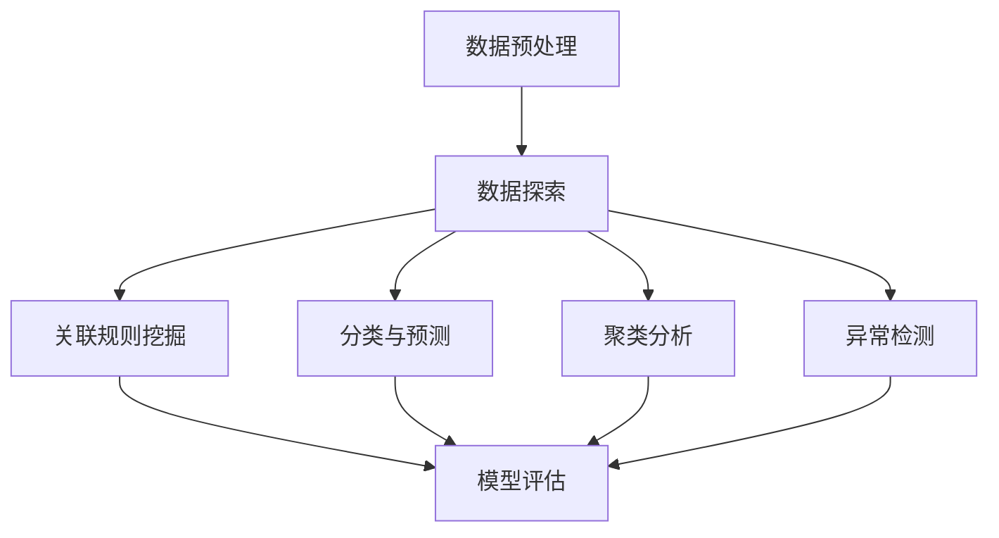

# Data Mining 原理与代码实战案例讲解

## 1.背景介绍

在当今大数据时代,数据挖掘(Data Mining)作为一门新兴的跨学科技术,越来越受到关注和重视。随着信息技术的飞速发展,各行各业都产生了大量的数据,这些数据蕴含着丰富的知识和价值,如何从海量数据中发现有价值的知识和规律,成为了当前数据科学领域的核心课题之一。数据挖掘技术应运而生,它能够通过机器学习、统计学、数据库技术等方法,自动分析数据,发现数据中隐藏的有价值的知识模式,为企业决策提供有力支持。

数据挖掘广泛应用于各个领域,如金融风险控制、电子商务网站个性化推荐、基因芯片数据分析、网络入侵检测等。通过数据挖掘,企业可以更好地了解客户需求,预测市场趋势,优化业务流程,提高决策水平。因此,掌握数据挖掘的原理和实战技能,对于从事数据分析、机器学习等相关工作的人员来说,是非常重要和必需的。

## 2.核心概念与联系

数据挖掘涉及多个学科领域,包括机器学习、模式识别、统计学、数据库技术等,其核心概念和技术主要包括:

1. **数据预处理**: 包括数据清洗、数据集成、数据转换和数据归一化等,将原始数据转换成适合分析的格式。

2. **数据探索**: 通过可视化技术和统计方法,初步了解数据的分布特征和潜在规律。

3. **关联规则挖掘**: 发现数据集中不同属性或事物之间的相关关系。

4. **分类与预测**: 基于已知的数据样本,构建分类或预测模型,对新数据进行分类或预测。

5. **聚类分析**: 根据数据对象之间的相似性,将数据对象分成多个类或簇。

6. **异常检测**: 发现数据集中与绝大多数数据模式不符的异常数据。

7. **模型评估**: 使用各种评估指标,评估数据挖掘模型的性能和泛化能力。

这些核心概念和技术相互关联、相互影响,构成了完整的数据挖掘理论体系和应用框架。



## 3.核心算法原理具体操作步骤

数据挖掘中常用的核心算法有很多,这里介绍其中几种典型算法的原理和具体操作步骤:

### 3.1 决策树算法

决策树是一种常用的分类和回归算法,它通过构建决策树模型,对数据进行分类或预测。决策树算法的主要步骤如下:

1. **选择最优特征**: 根据特征的信息增益或信息增益比等指标,选择最优特征作为决策树的根节点。

2. **创建决策树分支**: 对选定的最优特征的每个取值,创建一个子节点,将数据集划分到相应的子节点。

3. **递归构建子树**: 对于每个子节点,重复步骤1和2,递归构建决策树,直到满足停止条件。

4. **决策树剪枝**: 对构建的决策树进行剪枝,避免过拟合。

常用的决策树算法包括ID3、C4.5和CART等。

### 3.2 支持向量机算法

支持向量机(SVM)是一种有监督的机器学习算法,常用于分类和回归问题。SVM算法的主要步骤如下:

1. **构建超平面**: 在高维空间中,寻找一个最优超平面,将不同类别的数据点分开。

2. **最大化间隔**: 选择能够最大化两类数据点到超平面距离的超平面作为最优超平面。

3. **核函数映射**: 如果数据不是线性可分的,可以使用核函数将数据映射到高维空间,使其线性可分。

4. **求解对偶问题**: 将原始优化问题转化为对偶问题,求解支持向量和系数。

5. **分类决策函数**: 根据支持向量和系数,构建分类决策函数,对新数据进行分类。

常用的核函数包括线性核、多项式核和高斯核等。

### 3.3 K-Means聚类算法

K-Means是一种常用的无监督聚类算法,它将数据集划分为K个簇。算法的主要步骤如下:

1. **初始化K个聚类中心**: 从数据集中随机选择K个数据点作为初始聚类中心。

2. **计算距离并分配簇**: 对于每个数据点,计算其与K个聚类中心的距离,将其分配到最近的簇。

3. **更新聚类中心**: 对于每个簇,计算所有数据点的均值,作为新的聚类中心。

4. **迭代更新**: 重复步骤2和3,直到聚类中心不再发生变化或达到最大迭代次数。

K-Means算法的关键在于选择合适的K值和初始聚类中心,以及定义距离度量方式。

### 3.4 Apriori关联规则挖掘算法

Apriori算法是一种经典的关联规则挖掘算法,用于发现数据集中的频繁项集和关联规则。算法的主要步骤如下:

1. **设置最小支持度阈值**: 确定判断频繁项集的最小支持度阈值。

2. **发现频繁1-项集**: 扫描数据集,统计每个项的支持度,保留支持度大于阈值的项作为频繁1-项集。

3. **发现频繁k-项集**: 利用Apriori原理,基于频繁(k-1)-项集生成候选k-项集,扫描数据集统计支持度,保留支持度大于阈值的项作为频繁k-项集。重复该步骤,直到无法发现更大的频繁项集。

4. **生成关联规则**: 对于每个频繁项集,根据最小置信度阈值,生成满足条件的关联规则。

Apriori算法的优化策略包括哈希技术、划分技术等,以提高算法效率。

## 4.数学模型和公式详细讲解举例说明

数据挖掘中涉及许多数学模型和公式,这些模型和公式为算法提供了理论基础和计算方法。下面将详细讲解几个常用的数学模型和公式。

### 4.1 信息熵和信息增益

信息熵和信息增益是决策树算法中常用的度量指标,用于选择最优特征。

对于一个数据集$D$,其信息熵定义为:

$$
Ent(D) = -\sum_{i=1}^{m}p_ilog_2p_i
$$

其中,$p_i$表示$D$中第$i$类样本所占的比例。信息熵越大,数据集的混乱程度越高。

假设将数据集$D$根据特征$A$分为$n$个子集$D_1,D_2,...,D_n$,则信息增益$Gain(D,A)$定义为:

$$
Gain(D,A) = Ent(D) - \sum_{j=1}^{n}\frac{|D_j|}{|D|}Ent(D_j)
$$

信息增益越大,说明使用特征$A$对数据集进行划分所获得的"纯度提升"越大。因此,在构建决策树时,可选择信息增益最大的特征作为节点特征。

**举例**:假设有一个数据集$D$包含6个样本,其中2个样本属于类别$C_1$,4个样本属于类别$C_2$。计算$D$的信息熵:

$$
\begin{aligned}
Ent(D) &= -\frac{2}{6}log_2\frac{2}{6} - \frac{4}{6}log_2\frac{4}{6} \\
       &= -\frac{1}{3}log_2\frac{1}{3} - \frac{2}{3}log_2\frac{2}{3} \\
       &\approx 0.918
\end{aligned}
$$

### 4.2 支持度和置信度

支持度和置信度是关联规则挖掘中常用的度量指标,用于评估规则的重要性和可信度。

对于一个关联规则$X\Rightarrow Y$:

- 支持度($support$)定义为包含项集$X\cup Y$的记录数占总记录数的比例,即$support(X\Rightarrow Y) = P(X\cup Y)$。
- 置信度($confidence$)定义为包含项集$X$的记录中同时也包含项集$Y$的比例,即$confidence(X\Rightarrow Y) = P(Y|X) = \frac{P(X\cup Y)}{P(X)}$。

置信度越高,说明规则$X\Rightarrow Y$的可信程度越高。通常,只有支持度和置信度均大于预设阈值时,该规则才被视为有价值的关联规则。

**举例**:假设一个超市的交易记录中,有10%的顾客同时购买了面包和牛奶,而60%的顾客购买了面包。那么,对于关联规则"购买面包$\Rightarrow$购买牛奶":

$$
\begin{aligned}
support("购买面包\Rightarrow 购买牛奶") &= P(面包\cup 牛奶) = 0.1 \\
confidence("购买面包\Rightarrow 购买牛奶") &= \frac{P(面包\cup 牛奶)}{P(面包)} = \frac{0.1}{0.6} \approx 0.167
\end{aligned}
$$

如果设定最小支持度阈值为0.05,最小置信度阈值为0.1,那么该规则将被视为有价值的关联规则。

### 4.3 欧氏距离和余弦相似度

欧氏距离和余弦相似度是常用的相似性度量方法,在聚类分析和推荐系统等领域有广泛应用。

对于两个$n$维向量$\vec{x}=(x_1,x_2,...,x_n)$和$\vec{y}=(y_1,y_2,...,y_n)$:

- 欧氏距离($Euclidean\ Distance$)定义为:

$$
d(\vec{x},\vec{y}) = \sqrt{\sum_{i=1}^{n}(x_i-y_i)^2}
$$

- 余弦相似度($Cosine\ Similarity$)定义为:

$$
sim(\vec{x},\vec{y}) = \frac{\vec{x}\cdot\vec{y}}{||\vec{x}||\times||\vec{y}||} = \frac{\sum_{i=1}^{n}x_iy_i}{\sqrt{\sum_{i=1}^{n}x_i^2}\times\sqrt{\sum_{i=1}^{n}y_i^2}}
$$

欧氏距离越小,余弦相似度越大,说明两个向量越相似。在K-Means聚类算法中,常使用欧氏距离作为相似性度量;在基于内容的推荐系统中,常使用余弦相似度计算用户兴趣和物品内容之间的相似程度。

**举例**:计算两个2维向量$(1,2)$和$(3,4)$之间的欧氏距离和余弦相似度:

$$
\begin{aligned}
d((1,2),(3,4)) &= \sqrt{(1-3)^2+(2-4)^2} = \sqrt{4+4} = 2\sqrt{2} \\
sim((1,2),(3,4)) &= \frac{1\times3+2\times4}{\sqrt{1^2+2^2}\times\sqrt{3^2+4^2}} = \frac{11}{\sqrt{5}\times5} \approx 0.828
\end{aligned}
$$

## 5.项目实践:代码实例和详细解释说明

为了更好地理解和掌握数据挖掘的原理和方法,我们将通过Python代码实现几个典型的数据挖掘算法,并基于实际数据集进行实战演练。

### 5.1 决策树算法实现

以下是使用Python和scikit-learn库实现决策树算法的代码示例,并基于鸢尾花数据集进行分类预测:

```python
from sklearn.datasets import load_iris
from sklearn.tree import DecisionTreeClassifier
from sklearn.model_selection import train_test_split
from sklearn.metrics import accuracy_score

# 加载鸢尾花数据集
iris = load_iris()
X, y = iris.data, iris.target

# 划分训练集和测试集
X_train, X_test, y_train, y_test = train_