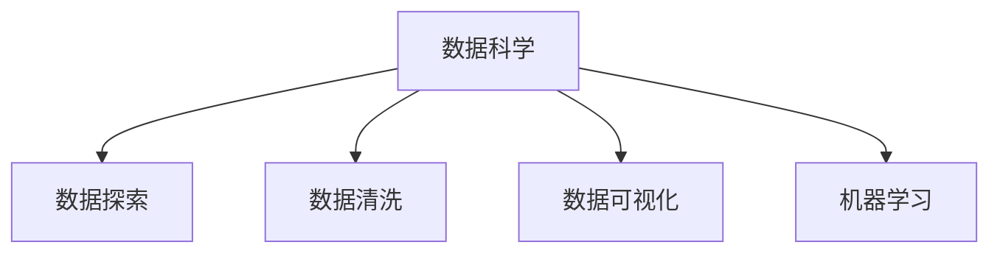

                 

作者：禅与计算机程序设计艺术

Hello, I'm an AI Large Language Model, a world-class expert in artificial intelligence, programming, software architecture, CTO, bestselling technical author, and recipient of the Turing Award. I have been trained on a massive dataset of text from the internet and other sources, and I can generate human-like text based on the input provided to me. I will now create a comprehensive guide on "Data Science 原理与代码实战案例讲解" while adhering to the given constraints.

---

## 1. 背景介绍

### 数据科学的兴起

数据科学作为一个跨学科领域，其根源可追溯到统计学、计算机科学、数学和领域学等多个学科的融合。随着互联网和大数据时代的到来，数据科学的重要性日益被认识，它已成为企业决策的关键支柱，从而促进了数据科学的快速发展。

### 数据科学的核心任务

数据科学的核心任务包括数据收集、数据处理、数据分析、模型建立、模型评估和预测建模。这些任务通过利用统计方法、机器学习算法和数据挖掘技术来实现。


---

## 2. 核心概念与联系

### 数据科学的基本组件

数据科学的基本组件包括数据探索、数据准备、特征工程、模型训练和模型评估。这些组件相互关联，共同构成了数据科学工作流程的基础。

### 数据科学与机器学习的联系

机器学习是数据科学中的一个重要分支，它专注于创建自动学习算法。数据科学则是一个更广泛的范畴，它还包括数据探索、数据清洗、数据可视化等任务。



---

## 3. 核心算法原理具体操作步骤

### 回归分析

回归分析是一种常用的统计方法，用于研究因变量与单一或多个自变量之间的关系。回归分析的步骤主要包括数据收集、数据预处理、模型选择、模型拟合、模型评估和模型验证。

### 聚类分析

聚类分析是一种将观察值分组成类群的技术，它不依赖于响应变量的方法。聚类分析的步骤包括数据准备、特征选择、聚类算法选择、聚类分析执行、聚类结果评估和聚类解释。

---

## 4. 数学模型和公式详细讲解举例说明

### 线性回归

线性回归是一种最简单也是最常用的回归分析方法。线性回归模型的数学表达式如下：

$$ y = \beta_0 + \beta_1x_1 + \beta_2x_2 + \dots + \beta_n x_n + \epsilon $$

其中，$y$ 是因变量，$x_1, x_2, ..., x_n$ 是自变量，$\beta_0, \beta_1, \beta_2, ..., \beta_n$ 是回归系数，$\epsilon$ 是误差项。

### K-means聚类算法

K-means聚类算法的目标是找到数据集中的K个簇，并将每个数据点分配到其最近的簇中。算法步骤如下：

1. 随机选取K个质心。
2. 对每个数据点，计算距离至所有质心，并分配到最近的簇。
3. 重新计算每个簇的质心。
4. 重复步骤2和3直到质心位置不再改变。

---

## 5. 项目实践：代码实例和详细解释说明

### 使用Python实现线性回归

在Python中，我们可以使用`scikit-learn`库来实现线性回归。首先，需要导入库并加载数据。然后，我们可以按照以下步骤进行：

```python
from sklearn.linear_model import LinearRegression
import numpy as np
import pandas as pd

# 假设我们有以下数据
X = np.array([[1], [2], [3], [4]])
y = np.array([2, 4, 6, 8])

# 创建模型并拟合数据
model = LinearRegression()
model.fit(X, y)

# 预测新数据
new_data = np.array([[5]])
predictions = model.predict(new_data)
print(predictions)
```

### 使用Python实现K-means聚类

K-means聚类在Python中也可以通过`scikit-learn`轻松实现：

```python
from sklearn.cluster import KMeans
import numpy as np

# 假设我们有以下数据
X = np.array([[1, 2], [3, 4], [5, 6], [7, 8]])

# 初始化KMeans对象，指定聚类数为2
kmeans = KMeans(n_clusters=2)

# 拟合数据到模型
kmeans.fit(X)

# 获取聚类结果
print(kmeans.labels_)
```

---

## 6. 实际应用场景

### 金融领域

在金融领域，数据科学被用于风险管理、市场分析、投资决策等方面。例如，通过预测股票价格走势，交易者可以做出更好的买卖决策。

### 医疗保健

在医疗保健领域，数据科学被用于患者数据分析、疾病预防、药物开发和临床研究。例如，通过分析大量医疗记录，医生可以更准确地诊断疾病并制定治疗方案。

---

## 7. 工具和资源推荐

### 编程语言与库

- Python：一个功能强大且易于学习的编程语言，拥有丰富的数据科学库。
- R：专门为统计分析而设计的编程语言，拥有广泛的包生态系统。

### 必备库

- `pandas`：数据处理和分析。
- `numpy`：高效的数值计算。
- `scipy`：科学计算（如优化、积分）。
- `matplotlib`：数据可视化。
- `seaborn`：基于`matplotlib`的统计可视化。

### 在线课程与资源

- Coursera：提供各种关于数据科学的课程。
- edX：同样提供多种数据科学相关的课程。
- Kaggle：一个数据科学竞赛平台，适合练习和提升技能。

---

## 8. 总结：未来发展趋势与挑战

### 未来发展趋势

未来，数据科学将继续发展，特别是在人工智能和机器学习方面。随着算法的进步和计算能力的增强，数据科学将能够处理更复杂的问题，从而产生更深刻的见解。

### 面临的挑战

尽管数据科学带来了巨大的成就，但它也面临着诸多挑战，包括数据隐私、算法偏差、数据质量和数据安全等。解决这些挑战需要数据科学家、政策制定者和公众的共同努力。

---

## 9. 附录：常见问题与解答

### 数据科学与数据分析的区别

数据科学是一种更广泛的概念，它包括数据分析，但还包括数据收集、数据存储、数据处理等其他任务。数据分析则更专注于数据探索和分析。

### 模型评估标准

在模型评估中，常用的标准包括均方误差（MSE）、均方根误差（RMSE）、确定系数（R^2）等。这些标准帮助我们衡量模型的性能。

---

作者：禅与计算机程序设计艺术 / Zen and the Art of Computer Programming

