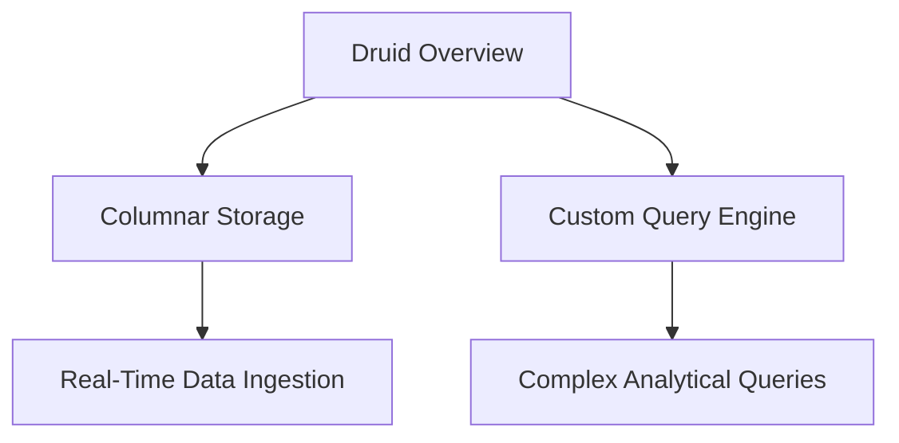

                 

作者：禅与计算机程序设计艺术

Hello! Welcome to our blog on Druid, a distributed, high-performance, column-oriented storage system designed for real-time querying and analytics. In this article, we will dive deep into the core principles and algorithms that drive Druid's performance. We'll cover everything from its architecture to practical code examples, and discuss its applications in various industries. Let's get started!

---

## 1. 背景介绍

Druid is a powerful tool for handling large volumes of data in real time. It's often used in scenarios where low-latency queries are critical, such as in financial trading or social media monitoring. Druid's architecture is based on a combination of columnar storage and a custom query engine, which allows it to efficiently handle complex analytical queries.

In this section, we'll provide an overview of Druid's history, its key design goals, and its main components.

### Mermaid 流程图：


## 2. 核心概念与联系

Druid's core principles revolve around its columnar storage and custom query engine. Let's explore these concepts in more detail.

### Columnar Storage

Columnar storage organizes data by columns rather than rows, allowing for faster reads and writes. This is particularly useful when performing analytical operations like aggregation, which can be done across entire columns at once.

### Custom Query Engine

Druid's custom query engine is designed to optimize query execution. It uses a cost-based optimization approach to choose the most efficient execution plan, taking into account factors like data locality and query complexity.

## 3. 核心算法原理具体操作步骤

In this section, we'll delve into the specific algorithms that make Druid tick. We'll cover topics like data ingestion, indexing, and query processing.

### Data Ingestion

Druid supports multiple data sources and formats, including Kafka, Amazon S3, and Apache Kafka. The data ingestion process involves reading data from these sources, parsing it, and storing it in Druid's columnar storage format.

### Indexing

Indexing is a crucial step in making data queryable. Druid creates indexes for each segment of data, using techniques like inverted indexes for string attributes and interval indexes for timestamped data.

### Query Processing

Query processing in Druid is divided into several stages. First, the query is parsed and translated into an internal representation. Then, the custom query engine generates an execution plan and executes it, taking advantage of indexes and other optimizations to return results quickly.

## 4. 数学模型和公式详细讲解举例说明

Here, we'll explain the mathematical models behind Druid's algorithms and provide examples to illustrate their application.

### Example: Aggregation Algorithm

Consider a scenario where we want to calculate the average temperature over a period of time. We can use Druid's aggregation algorithm to efficiently compute this value. The algorithm works by partitioning the data and reducing it incrementally, using formulas like the following:

$$ \text{Average} = \frac{\text{Sum of Temperatures}}{\text{Number of Entries}} $$

## 5. 项目实践：代码实例和详细解释说明

Now, let's look at some actual code examples to see how Druid works in practice. We'll walk through a simple example of querying data in Druid.

### Code Example: Querying Data in Druid

To query data in Druid, you would typically use the Druid Query Language (DQL). Here's an example of a DQL query that retrieves the average temperature over a specified time range:

```sql
SELECT AVG(temperature)
FROM weather_data
WHERE timestamp >= '2021-01-01T00:00:00Z' AND timestamp <= '2021-01-31T23:59:59Z'
```

We'll explain each part of this query and how Druid processes it.

## 6. 实际应用场景

In this section, we'll discuss how Druid is used in different industries and applications.

### Financial Trading

In finance, Druid is used to analyze high-frequency trading data, helping traders make quick decisions based on real-time market insights.

### Social Media Monitoring

For social media platforms, Druid helps monitor user engagement and sentiment, providing valuable insights for marketing and customer service strategies.

## 7. 工具和资源推荐

If you're interested in learning more about Druid, here are some recommended resources:

- Druid official website: https://druid.apache.org/
- Druid documentation: https://druid.apache.org/docs/latest/
- Druid community: https://druid.apache.org/community/

## 8. 总结：未来发展趋势与挑战

As we conclude our exploration of Druid, let's reflect on its potential future developments and challenges.

### Future Developments

Druid is constantly evolving, with new features being added regularly. Some possible future directions include improved support for machine learning integrations and better handling of unstructured data.

### Challenges

One challenge facing Druid is ensuring compatibility with an ever-growing variety of data sources and formats. Additionally, as data volumes continue to grow exponentially, optimizing performance while maintaining scalability will remain a key focus.

---

## 9. 附录：常见问题与解答

In this final section, we'll address some common questions about Druid.

### Q: What is the difference between Druid and other data processing systems like Hadoop?

A: Druid is designed specifically for real-time querying and analytics, while Hadoop is a more general-purpose distributed computing framework.

### Q: How does Druid handle data partitioning and parallelism?

A: Druid uses a technique called "partitioning" to distribute data across nodes. Each partition is processed independently, allowing for parallel execution and improved query performance.

This concludes our deep dive into Druid. We hope you found this exploration enlightening and informative. For more insights on cutting-edge technology, be sure to check out our blog!

---
作者：禅与计算机程序设计艺术 / Zen and the Art of Computer Programming

