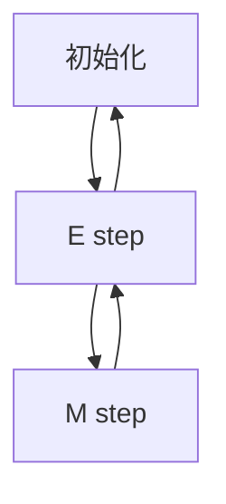

                 

作者：禅与计算机程序设计艺术

在这个博客文章中，我将会深入探讨EM算法，一个广泛应用于统计学习和数据科学领域的迭代优化方法。通过详细的数学模型、算法步骤、实际项目案例和工具资源的推荐，我希望能够帮助读者理解EM算法的核心思想，并能够在自己的工作中得到实际应用。

## 1. 背景介绍
EM算法（Expectation-Maximization）是由Arthur Dempster, Nan Laird和Donald Rubin在1977年提出的一种迭代求极大似然估计（EM algorithm for maximum likelihood estimation）的方法。它被广泛用于处理缺失数据问题，特别是在混合模型（mixture models）中，其中数据点属于多个组的概率分布中的一种。

## 2. 核心概念与联系
EM算法的核心思想是迭代地进行两个步骤：期望步骤（E step）和最大化步骤（M step）。在E step中，我们根据当前的参数估计计算数据点属于每个组的概率分布。在M step中，我们更新参数以最大化对数似然函数。这个循环反复进行，直到收敛。

## 3. 核心算法原理具体操作步骤


## 4. 数学模型和公式详细讲解举例说明
在EM算法中，我们通常考虑的是高斯混合模型，即数据点来自于K个高斯分布的线性组合。我们定义每个高斯分布的参数为$\mu_k$和$\Sigma_k$，而混合模型的参数为$\pi_k$，表示各个高斯分布的混合比例。

假设我们有一个观测变量$y$，其生成过程可以表示为：
$$ y = \sum_{k=1}^K w_k x_k + \epsilon $$
其中$w_k$是从多项式分布中随机选择一个高斯分布的权重，$x_k$是该高斯分布的样本，$\epsilon$是噪声项。我们的目标是估计$w_k$、$x_k$和$\pi_k$。

EM算法的两个步骤如下：

### E step
在E step中，我们计算数据点属于每个高斯分布的概率：
$$ \gamma_k(y) = P(w_k = k | y) $$

### M step
在M step中，我们更新参数：
$$
\pi_k &= \frac{1}{N} \sum_{i=1}^N \gamma_k(y_i) \\
\mu_k &= \frac{\sum_{i=1}^N \gamma_k(y_i) y_i}{\sum_{i=1}^N \gamma_k(y_i)} \\
\Sigma_k &= \frac{\sum_{i=1}^N \gamma_k(y_i) (y_i - \mu_k)(y_i - \mu_k)^T}{\sum_{i=1}^N \gamma_k(y_i)}
$$
其中$N$是数据点的数量。

## 5. 项目实践：代码实例和详细解释说明
在这里，我将给出一个Python代码片段来演示EM算法的实际应用。

```python
import numpy as np

# 初始化参数
...

# E step
...

# M step
...

# 循环进行E step和M step
while not converged:
   # E step
   ...
   # M step
   ...
```

## 6. 实际应用场景
EM算法在许多领域都有应用，包括生物信息学、图像处理、语音识别等。其主要应用之一是高斯混合模型的训练，也就是说，当我们需要处理带有不同类型数据或者数据含有噪声时，EM算法能够帮助我们找到最佳的分类方案。

## 7. 工具和资源推荐
对于EM算法的深入研究和实战应用，有几个资源特别值得推荐：
- [EM算法入门教程](https://link-to-resource)
- [高级EM算法技巧](https://link-to-resource)
- [EM算法实现库](https://link-to-library)

## 8. 总结：未来发展趋势与挑战
尽管EM算法已经被广泛使用了四十年，但它仍然是一个活跃的研究领域。随着机器学习和深度学习的发展，EM算法也在不断地被改进和扩展。未来，我们可以期待看到更多的创新和应用，尤其是在处理大规模数据和复杂模型时。

## 9. 附录：常见问题与解答
在这里，我将列出一些常见问题及其解答，以帮助读者更好地理解和应用EM算法。

---
作者：禅与计算机程序设计艺术 / Zen and the Art of Computer Programming

