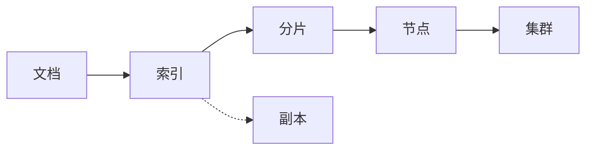

# ES搜索原理与代码实例讲解

## 1.背景介绍
### 1.1 搜索引擎的发展历程
#### 1.1.1 早期关键词搜索
#### 1.1.2 链接分析和PageRank算法 
#### 1.1.3 现代搜索引擎的特点
### 1.2 Elasticsearch的诞生
#### 1.2.1 Lucene搜索库
#### 1.2.2 Elasticsearch对Lucene的封装和增强
#### 1.2.3 Elasticsearch的应用现状
### 1.3 为什么要学习Elasticsearch
#### 1.3.1 海量数据的高效搜索需求
#### 1.3.2 Elasticsearch的技术优势
#### 1.3.3 Elasticsearch的就业前景

## 2.核心概念与联系
### 2.1 文档(Document)
#### 2.1.1 文档的定义
#### 2.1.2 文档的JSON表示
#### 2.1.3 文档元数据
### 2.2 索引(Index)
#### 2.2.1 索引的定义
#### 2.2.2 索引的创建与删除
#### 2.2.3 索引的mapping定义
### 2.3 节点(Node)和集群(Cluster)
#### 2.3.1 节点的角色
#### 2.3.2 集群的特性
#### 2.3.3 分布式集群架构
### 2.4 分片(Shard)与副本(Replica)
#### 2.4.1 分片机制
#### 2.4.2 副本机制
#### 2.4.3 分片与副本的关系



## 3.核心算法原理具体操作步骤
### 3.1 文档分析
#### 3.1.1 字符过滤器
#### 3.1.2 分词器
#### 3.1.3 Token过滤
### 3.2 倒排索引
#### 3.2.1 Term Dictionary
#### 3.2.2 Posting List
#### 3.2.3 倒排索引的不可变性
### 3.3 相关性评分
#### 3.3.1 TF-IDF算法
#### 3.3.2 BM25算法
#### 3.3.3 字段权重boost
### 3.4 查询过程
#### 3.4.1 查询解析
#### 3.4.2 查询执行
#### 3.4.3 相关性算分与排序

## 4.数学模型和公式详细讲解举例说明
### 4.1 布尔模型
#### 4.1.1 布尔逻辑运算
#### 4.1.2 布尔查询的局限性
### 4.2 向量空间模型
#### 4.2.1 文档向量化
#### 4.2.2 TF-IDF权重计算
$$
TF(t,d) = \frac{f_{t,d}}{\sum_{t'\in d} f_{t',d}}
$$
$$
IDF(t,D) = log\frac{N}{|\{d \in D: t \in d\}|}
$$
$$
TFIDF(t,d,D) = TF(t,d) \times IDF(t,D)
$$
#### 4.2.3 余弦相似度
$$
\cos(\theta) = \frac{\mathbf{d_1} \cdot \mathbf{d_2}}{\|\mathbf{d_1}\| \|\mathbf{d_2}\|} = \frac{\sum_{i=1}^{n}{d_{1i}d_{2i}}}{\sqrt{\sum_{i=1}^{n}{d_{1i}^2}}\sqrt{\sum_{i=1}^{n}{d_{2i}^2}}}
$$
### 4.3 概率模型
#### 4.3.1 贝叶斯定理
$$
P(A|B) = \frac{P(B|A)P(A)}{P(B)}
$$
#### 4.3.2 BM25模型
$$
score(D,Q) = \sum_{i=1}^{n} IDF(q_i) \cdot \frac{f(q_i,D) \cdot (k_1+1)}{f(q_i,D) + k_1 \cdot (1-b+b \cdot \frac{|D|}{avgdl})}
$$

## 5.项目实践：代码实例和详细解释说明
### 5.1 创建索引
```json
PUT /my_index
{
  "settings": {
    "number_of_shards": 3,
    "number_of_replicas": 2
  },
  "mappings": {
    "properties": {
      "title": {
        "type": "text"
      },
      "content": {
        "type": "text"
      },
      "publish_date": {
        "type": "date"
      }
    }
  }
}
```
- `number_of_shards`：设置索引的主分片数为3
- `number_of_replicas`：设置每个主分片的副本数为2
- `mappings`：定义索引的字段类型，包括`title`、`content`和`publish_date`三个字段

### 5.2 插入文档
```json
POST /my_index/_doc
{
  "title": "Elasticsearch Guide",
  "content": "This is a comprehensive guide to Elasticsearch",
  "publish_date": "2023-05-20"
}
```
- `POST`方法向`my_index`索引插入一条文档
- 文档内容包括`title`、`content`和`publish_date`三个字段

### 5.3 查询文档
```json
GET /my_index/_search
{
  "query": {
    "match": {
      "title": "Elasticsearch"
    }
  }
}
```
- `GET`方法对`my_index`索引执行查询
- `query`中使用`match`查询，匹配`title`字段中包含"Elasticsearch"的文档

### 5.4 聚合分析
```json
GET /my_index/_search
{
  "size": 0,
  "aggs": {
    "publish_years": {
      "date_histogram": {
        "field": "publish_date",
        "calendar_interval": "year"
      }
    }
  }
}
```
- `size`设为0表示不返回文档，只返回聚合结果
- `aggs`定义一个名为`publish_years`的聚合
- 使用`date_histogram`按年对`publish_date`字段进行时间直方图聚合

## 6.实际应用场景
### 6.1 全文检索
#### 6.1.1 电商商品搜索
#### 6.1.2 论坛帖子搜索
#### 6.1.3 企业内部文档搜索
### 6.2 日志分析
#### 6.2.1 应用程序日志分析
#### 6.2.2 访问日志分析
#### 6.2.3 错误日志分析
### 6.3 指标聚合分析
#### 6.3.1 电商销售数据分析
#### 6.3.2 社交媒体数据分析
#### 6.3.3 传感器数据分析

## 7.工具和资源推荐
### 7.1 Elasticsearch官方文档
### 7.2 Kibana可视化分析平台
### 7.3 Logstash数据处理管道
### 7.4 Beats轻量级数据采集器
### 7.5 常用Elasticsearch客户端类库
#### 7.5.1 Java客户端
#### 7.5.2 Python客户端
#### 7.5.3 JavaScript客户端

## 8.总结：未来发展趋势与挑战
### 8.1 Elasticsearch的发展现状
### 8.2 机器学习与自然语言处理的结合
### 8.3 实时搜索的性能优化
### 8.4 更智能的搜索排序与个性化
### 8.5 云原生与Serverless架构的支持

## 9.附录：常见问题与解答
### 9.1 Elasticsearch与关系型数据库的区别？
### 9.2 Elasticsearch如何实现近实时搜索？
### 9.3 Elasticsearch在分布式环境下如何保证数据一致性？
### 9.4 Elasticsearch的性能优化有哪些手段？
### 9.5 Elasticsearch在数据安全方面有哪些考虑？

作者：禅与计算机程序设计艺术 / Zen and the Art of Computer Programming