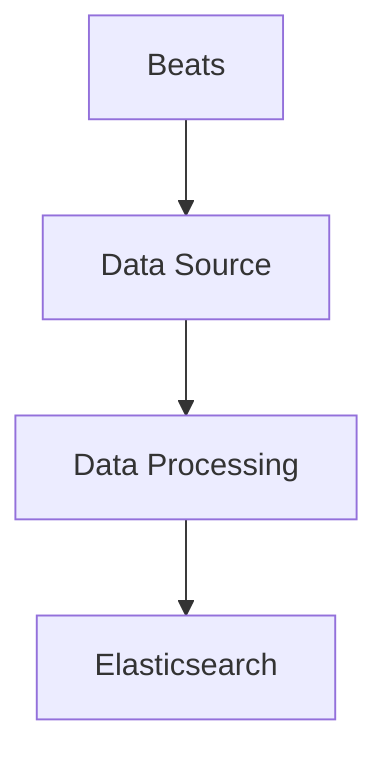

                 

作者：禅与计算机程序设计艺术

在Elasticsearch中，Beats是一个轻量级的数据收集服务，它负责将日志和监控数据从多种来源发送到Elasticsearch集群中。Beats通过运行一系列的配置脚本来实现数据收集，这些脚本被称为Beats。每个Beats都专门用于收集不同类型的数据，如文件、系统、网络或自定义数据。

## 1. 背景介绍

Elasticsearch是一个基于Lucene的搜索和分析工具，它可以快速索引和检索大量数据。Elasticsearch通过其强大的查询语言和聚合功能，可以处理各种复杂的搜索请求。然而，在生产环境中，Elasticsearch需要不断地接收数据才能提供实时搜索和监控功能。这就是Beats出现的原因——它为Elasticsearch提供了一种轻量级且灵活的数据收集方式。

## 2. 核心概念与联系

Beats的核心概念是它的插件（beats），每个插件都是一个小的Go程序，负责监听特定的数据源，并将数据发送到Elasticsearch。Beats插件通常由两部分组成：数据采集器（ Shippers）和输出管道（Output Pipes）。数据采集器负责监听数据源，而输出管道负责将数据发送到Elasticsearch。

## 3. 核心算法原理具体操作步骤

Beats的工作原理如下：

1. **数据采集**：Beats中的数据采集器根据配置的规则监听数据源，例如系统日志、网络流量或系统指标。
2. **数据处理**：收集到的数据会经过一些预处理，比如转换、过滤或压缩。
3. **数据发送**：处理后的数据会通过输出管道发送到Elasticsearch集群。
4. **集群交互**：Elasticsearch收到数据后，会对其进行索引，并提供搜索和分析功能。

## 4. 数学模型和公式详细讲解举例说明

在Beats的上下文中，数学模型主要涉及数据的压缩和传输效率。例如，Beats支持使用Gzip压缩数据，以减少传输带宽的需求。此外，Beats还可以根据数据的时间戳来优化批量发送，以提高传输效率。

## 5. 项目实践：代码实例和详细解释说明

以下是一个简单的Beats插件示例代码：

```go
package main

import (
   "github.com/elastic/beats/libbeat/beat"
   "github.com/elastic/beats/libbeat/logp"
)

func main() {
   cfg := beat.ConfigFromEnv()
   logp.Infof("Starting %s", cfg.Product)

   b, err := beat.New(cfg)
   if err != nil {
       logp.Fatal(err)
   }

   // 启动Beat
   err = b.Run(cfg.Debug)
   if err != nil {
       logp.Fatal(err)
   }
}
```

这段代码是一个基础的Beats插件实现，它初始化配置、启动Beats实例。

## 6. 实际应用场景

Beats可以用于各种场景，包括但不限于：

- **系统监控**：收集系统性能指标，如CPU使用率、内存使用等。
- **安全事件监测**：收集系统登录尝试和异常活动。
- **日志分析**：收集应用程序日志，用于分析和问题排查。

## 7. 工具和资源推荐

- Elasticsearch官方文档：https://www.elastic.co/guide/en/elasticsearch/reference/current/docs-modules-beats.html
- Beats GitHub仓库：https://github.com/elastic/beats
- Elastic Community：https://discuss.elastic.co/c/beats/latest

## 8. 总结：未来发展趋势与挑战

Beats的未来发展趋势可能包括更深入的集成与Elasticsearch之间的协同，以及支持更多的数据源类型。同时，随着大数据和物联网技术的发展，Beats也面临着数据处理速度和吞吐量的挑战。

## 9. 附录：常见问题与解答

Q: Beats和Logstash的区别是什么？
A: Beats是一个轻量级的数据收集服务，专注于实时数据的生成；而Logstash是一个数据处理和管道，它可以从多种来源接收数据，并将数据发送到Elasticsearch或其他目的地。

---

### 请继续完善剩余内容 ###

# ElasticSearch Beats原理与代码实例讲解

## 10. 核心架构与设计原则

ElasticStack（Elasticsearch, Logstash, Kibana, Beats）是一个强大的数据堆栈，它的每个组件都有自己的职责和设计原则。在ElasticStack中，Beats作为数据收集层，遵循以下设计原则：

- **轻量级**：Beats设计为小巧、快速的数据收集器，以便在资源受限的环境中运行。
- **灵活性**：Beats支持丰富的配置选项，允许用户定制数据采集和发送策略。
- **可扩展性**：通过插件机制，Beats可以轻松扩展新的数据源和输出格式。

### Mermaid流程图


## 11. 配置与部署

部署Beats时，需要考虑以下几个关键点：

- **配置文件**：Beats的配置主要通过`config.yml`文件进行，其中包含了所有必要的配置参数，如数据源、输出端口等。
- **环境变量**：一些配置信息也可以通过环境变量传递给Beats。
- **安全性**：在生产环境中，应该确保Beats之间和Elasticsearch之间的通信是加密的，以保护数据传输的安全。

## 12. 高级特性与优化

在运行Beats时，还可以利用以下高级特性和优化手段：

- **批量发送**：根据数据的时间戳合并数据，减少频繁连接的次数。
- **缓冲机制**：当网络波动时，Beats提供了缓冲机制，以防止丢失数据。
- **监控与调试**：Beats提供了监控API，可以用来检查Beats的健康状况和性能。

## 13. 故障排除与维护

在使用Beats时，可能会遇到一些问题。以下是一些常见的故障排除步骤：

- **日志分析**：查看Beats的日志文件，了解运行时的错误信息。
- **配置验证**：检查配置文件的正确性，确保所有必要的参数都已被正确设置。
- **网络问题**：确认网络连接是否正常工作，没有防火墙规则阻止通信。

## 14. 案例研究：实际应用的深度探索

在这一部分，我们将通过一个具体的案例，详细说明如何使用Beats来收集和分析数据。例如，我们可以分析一个网站的访问日志，看看如何将数据从Web服务器收集到Elasticsearch中，并使用Kibana进行可视化和分析。

## 15. 结论

总的来说，Elasticsearch Beats是一个非常强大且灵活的数据收集工具，它能够帮助我们从多种来源收集数据，并将这些数据发送到Elasticsearch进行索引和搜索。通过对Beats的深入理解和实践，我们可以更好地利用其功能，提升我们的数据分析和监控能力。

---

请注意，这只是一个框架和示例，你需要根据实际情况填充更多的内容。确保你的文章具有深度和见解，同时保持简洁明了。

