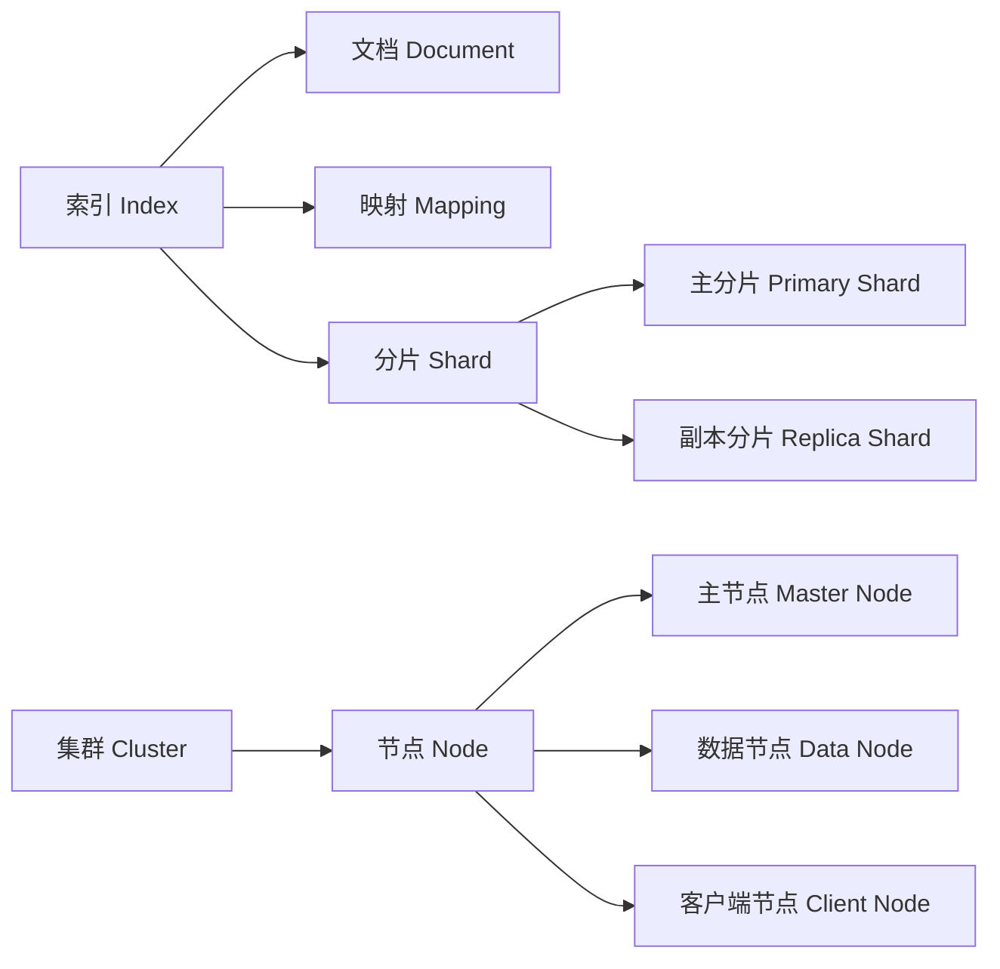

# ElasticSearch原理与代码实例讲解

## 1.背景介绍

### 1.1 搜索引擎概述
#### 1.1.1 搜索引擎的定义与分类
#### 1.1.2 搜索引擎的发展历程
#### 1.1.3 搜索引擎的应用场景

### 1.2 ElasticSearch简介 
#### 1.2.1 ElasticSearch的起源与发展
#### 1.2.2 ElasticSearch的特点与优势
#### 1.2.3 ElasticSearch的生态系统

## 2.核心概念与联系

### 2.1 索引(Index)
#### 2.1.1 索引的定义
#### 2.1.2 索引的结构
#### 2.1.3 索引的操作

### 2.2 文档(Document)  
#### 2.2.1 文档的定义
#### 2.2.2 文档的结构
#### 2.2.3 文档的操作

### 2.3 映射(Mapping)
#### 2.3.1 映射的定义 
#### 2.3.2 映射的类型
#### 2.3.3 动态映射

### 2.4 分片(Shard)与副本(Replica)
#### 2.4.1 分片的概念
#### 2.4.2 副本的概念
#### 2.4.3 分片与副本的配置

### 2.5 集群(Cluster)与节点(Node) 
#### 2.5.1 集群的定义
#### 2.5.2 节点的类型
#### 2.5.3 集群与节点的关系



## 3.核心算法原理具体操作步骤

### 3.1 倒排索引
#### 3.1.1 倒排索引原理
#### 3.1.2 词条与词典
#### 3.1.3 倒排表的构建过程

### 3.2 文档分析
#### 3.2.1 文档分析的目的
#### 3.2.2 分析器的组成
#### 3.2.3 内置分析器

### 3.3 相关性评分
#### 3.3.1 相关性评分算法 
#### 3.3.2 TF-IDF
#### 3.3.3 BM25

### 3.4 查询过程
#### 3.4.1 查询的分类
#### 3.4.2 查询的执行过程
#### 3.4.3 查询结果的排序

## 4.数学模型和公式详细讲解举例说明

### 4.1 布尔模型
#### 4.1.1 布尔模型的定义
#### 4.1.2 布尔模型的表示
#### 4.1.3 布尔模型的例子

布尔模型将查询和文档表示成布尔表达式的形式，例如：
$q=(term_1 \wedge term_2) \vee term_3$
$d_1=term_1 \wedge term_2$  
$d_2=term_1 \wedge term_3$

那么文档$d_1$和$d_2$都能匹配查询$q$。

### 4.2 向量空间模型
#### 4.2.1 向量空间模型的定义
#### 4.2.2 文档向量和查询向量
#### 4.2.3 向量空间模型的相似度计算

在向量空间模型中，文档和查询都被表示成$n$维向量的形式：

$$
\vec{d_j} = (w_{1,j},w_{2,j},...,w_{n,j})
$$

$$
\vec{q} = (w_{1,q},w_{2,q},...,w_{n,q})  
$$

其中$w_{i,j}$表示词项$t_i$在文档$d_j$中的权重，$w_{i,q}$表示词项$t_i$在查询$q$中的权重。

相似度可以用余弦相似度来计算：

$$
\cos(\vec{d_j},\vec{q})=\frac{\vec{d_j} \cdot \vec{q}}{\lVert\vec{d_j}\rVert \lVert\vec{q}\rVert}
$$

### 4.3 概率模型
#### 4.3.1 概率模型的定义
#### 4.3.2 概率模型的假设
#### 4.3.3 概率模型的排序函数

概率模型假设文档对查询的相关性可以用概率来表示，即$P(R=1|d,q)$表示文档$d$对查询$q$相关的概率。

利用贝叶斯定理，可以推导出：

$$
P(R=1|d,q)=\frac{P(d|R=1,q)P(R=1|q)}{P(d|q)}
$$

其中$P(R=1|q)$对所有文档都相同，$P(d|q)$可以视为常数，因此排序函数为：

$$
score(d,q)=P(d|R=1,q)
$$

## 5.项目实践：代码实例和详细解释说明

### 5.1 环境准备
#### 5.1.1 安装ElasticSearch
#### 5.1.2 安装Kibana
#### 5.1.3 安装IK分词插件

### 5.2 索引操作
#### 5.2.1 创建索引
```json
PUT /my_index
{
  "settings": {
    "number_of_shards": 3,
    "number_of_replicas": 1
  }
}
```

#### 5.2.2 查看索引
```json
GET /my_index
```

#### 5.2.3 删除索引  
```json
DELETE /my_index
```

### 5.3 映射操作
#### 5.3.1 创建映射
```json
PUT /my_index/_mapping
{
  "properties": {
    "title": {
      "type": "text",
      "analyzer": "ik_max_word"
    },
    "content": {
      "type": "text",
      "analyzer": "ik_smart"  
    },
    "publish_date": {
      "type": "date"
    }
  }  
}
```

#### 5.3.2 查看映射
```json
GET /my_index/_mapping
```

### 5.4 文档操作
#### 5.4.1 新增文档
```json
POST /my_index/_doc
{
  "title":"ElasticSearch原理与实践",
  "content":"这是一篇关于ElasticSearch的技术博客",
  "publish_date":"2023-05-20"
}
```

#### 5.4.2 查询文档
```json
GET /my_index/_doc/1
```

#### 5.4.3 修改文档
```json
POST /my_index/_update/1
{
  "doc": {
     "title":"ElasticSearch原理与代码实例讲解"
  }
}  
```

#### 5.4.4 删除文档
```json
DELETE /my_index/_doc/1
```

### 5.5 查询操作
#### 5.5.1 term查询
```json
GET /my_index/_search
{
  "query": {
    "term": {
      "title": "ElasticSearch"
    }
  }
}
```

#### 5.5.2 match查询
```json
GET /my_index/_search 
{
  "query": {
    "match": {
      "content": "原理 实践"
    }
  }
}
```

#### 5.5.3 布尔查询
```json
GET /my_index/_search
{
  "query": {
    "bool": {
      "must": [
        {
          "match": {
            "title": "ElasticSearch"  
          }
        },
        {
          "match": {
            "content": "代码实例"
          }  
        }
      ]
    }
  }
}
```

## 6.实际应用场景

### 6.1 全文检索
#### 6.1.1 电商商品搜索
#### 6.1.2 文档搜索引擎
#### 6.1.3 日志搜索分析

### 6.2 数据分析
#### 6.2.1 用户行为分析  
#### 6.2.2 运营数据分析
#### 6.2.3 安全指标分析

### 6.3 系统监控
#### 6.3.1 服务器监控
#### 6.3.2 应用性能监控
#### 6.3.3 业务指标监控

## 7.工具和资源推荐

### 7.1 学习资源
#### 7.1.1 官方文档
#### 7.1.2 入门书籍推荐
#### 7.1.3 视频教程推荐

### 7.2 开发工具
#### 7.2.1 Kibana
#### 7.2.2 Logstash
#### 7.2.3 Beats

### 7.3 周边生态
#### 7.3.1 Elasticsearch-Hadoop
#### 7.3.2 Elasticsearch-SQL
#### 7.3.3 Elasticsearch-Alerting

## 8.总结：未来发展趋势与挑战

### 8.1 ElasticSearch的发展现状
#### 8.1.1 版本迭代与新特性
#### 8.1.2 社区生态的繁荣
#### 8.1.3 应用领域的拓展

### 8.2 未来发展趋势
#### 8.2.1 云原生与托管服务  
#### 8.2.2 机器学习能力
#### 8.2.3 知识图谱探索

### 8.3 面临的挑战
#### 8.3.1 性能与扩展性
#### 8.3.2 安全与权限管控
#### 8.3.3 运维管理复杂度

## 9.附录：常见问题与解答

### 9.1 如何选择分片数和副本数？
### 9.2 如何对索引进行压力测试？
### 9.3 集群黄色状态的原因和解决方法？
### 9.4 大量删除文档会引发什么问题？
### 9.5 Mapping的字段类型如何选择？

作者：禅与计算机程序设计艺术 / Zen and the Art of Computer Programming