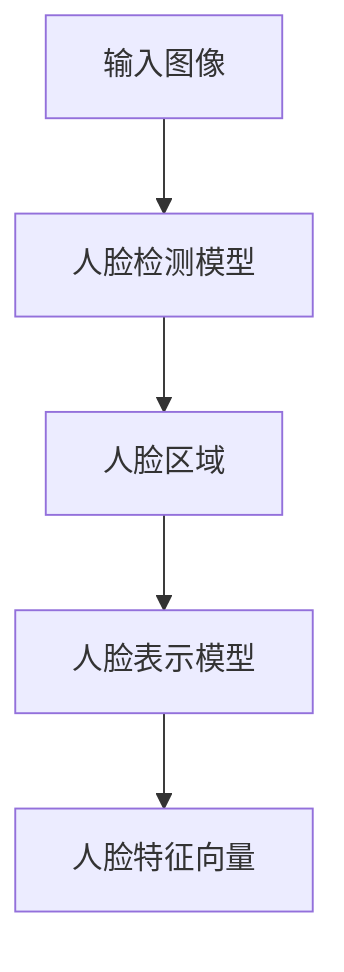
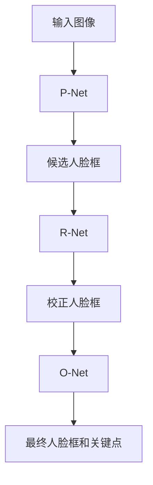

# Face Recognition原理与代码实例讲解

## 1.背景介绍

人脸识别是一种生物特征识别技术,旨在通过分析和比对面部特征来识别人的身份。随着计算机视觉、机器学习和深度学习等技术的快速发展,人脸识别技术也取得了长足进步,应用场景日益广泛。

人脸识别在安全监控、刷脸支付、人员通行管理等领域发挥着重要作用。它能够自动识别图像或视频中的人脸,并将其与预先存储的人脸数据库进行比对,从而确定其身份。与传统的身份验证方式(如密码、指纹等)相比,人脸识别具有无接触、高效、方便等优点。

## 2.核心概念与联系

人脸识别技术主要包括四个关键步骤:

1. **人脸检测(Face Detection)**: 从图像或视频流中定位并提取人脸区域。
2. **人脸表示(Face Representation)**: 将检测到的人脸编码为一个向量,即所谓的"人脸特征向量"。
3. **人脸比对(Face Matching)**: 将提取的人脸特征向量与预先存储的人脸数据库中的特征向量进行比对,计算相似度分数。
4. **人脸识别(Face Recognition)**: 根据相似度分数,确定该人脸的身份。

这四个步骤相互关联,构成了完整的人脸识别流程。下面将详细介绍每个步骤的原理和实现方法。

### 2.1 人脸检测

人脸检测是整个人脸识别过程的基础。常见的人脸检测算法包括:

- 基于机器学习的算法,如Viola-Jones算法、AdaBoost算法等。
- 基于深度学习的算法,如MTCNN(Multi-task Cascaded Convolutional Networks)、SSD(Single Shot MultiBox Detector)等。

其中,MTCNN是目前较为流行的人脸检测算法,它将人脸检测和人脸关键点检测两个任务结合起来,可以高效准确地检测出图像中的人脸区域及五官位置。

### 2.2 人脸表示

人脸表示的目标是将检测到的人脸编码为一个固定长度的向量,即人脸特征向量。这个向量应该能够很好地表征人脸的独特特征,使得不同人的人脸特征向量之间的距离较大,同一个人的不同人脸图像对应的特征向量之间的距离较小。

常见的人脸表示方法包括:

- 基于传统机器学习算法的方法,如PCA(主成分分析)、LDA(线性判别分析)、LBP(局部二值模式)等。
- 基于深度学习的方法,如FaceNet、DeepFace、VGGFace等。

其中,FaceNet是谷歌于2015年提出的一种基于深度卷积神经网络的人脸表示学习方法,它使用了三元组损失函数,可以学习出高度区分的人脸特征向量。

### 2.3 人脸比对

人脸比对的任务是计算待识别人脸特征向量与人脸数据库中已存储的人脸特征向量之间的相似度分数。常用的相似度度量方法有欧氏距离、余弦相似度等。

对于1:1的人脸验证任务,只需将待识别人脸与指定的一个人脸特征向量进行比对,根据相似度分数判断是否为同一个人。

对于1:N的人脸识别任务,需要将待识别人脸与整个人脸数据库中的所有人脸特征向量进行比对,选择相似度分数最高的那个作为识别结果。

### 2.4 人脸识别

人脸识别是整个流程的最终目标,根据人脸比对的结果,确定待识别人脸的身份。如果相似度分数超过预设阈值,则认为是已知身份;否则,视为未知身份。

## 3.核心算法原理具体操作步骤 

### 3.1 MTCNN人脸检测算法

MTCNN(Multi-task Cascaded Convolutional Networks)是一种高效准确的人脸检测算法,它将人脸检测和人脸关键点检测两个任务结合起来,通过级联网络架构实现端到端的人脸检测。

MTCNN算法主要包括三个阶段:

1. **候选框生成网络(Proposal Network,P-Net)**: 对输入图像进行密集采样,生成大量的候选人脸框。
2. **人脸校正网络(Refine Network,R-Net)**: 对P-Net生成的候选框进行校正和过滤,去除大部分背景区域和一些明显的非人脸框。
3. **人脸输出网络(Output Network,O-Net)**: 对R-Net的输出进行进一步校正,输出最终的人脸框和五官关键点位置。

MTCNN算法的优点是:

- 端到端的级联网络架构,可以高效准确地检测人脸。
- 同时输出人脸框和关键点位置,为后续的人脸表示和人脸识别提供了有利条件。
- 可以处理不同尺度、姿态和遮挡情况下的人脸。

### 3.2 FaceNet人脸表示算法

FaceNet是谷歌于2015年提出的一种基于深度卷积神经网络的人脸表示学习方法,它使用了三元组损失函数,可以学习出高度区分的人脸特征向量。

FaceNet的网络架构基于GoogleNet或ZFNet,通过大规模人脸数据集训练,使得同一个人的不同人脸图像对应的特征向量之间的距离较小,不同人的人脸特征向量之间的距离较大。

FaceNet的核心是三元组损失函数(Triplet Loss),它由三个部分组成:

- 锚点(Anchor): 用于计算损失的样本。
- 正例(Positive): 与锚点属于同一个人的样本。
- 负例(Negative): 与锚点属于不同人的样本。

三元组损失函数的目标是最小化锚点与正例之间的距离,同时最大化锚点与负例之间的距离,从而使得同一个人的人脸特征向量聚集在一起,不同人的人脸特征向量相互分开。

损失函数的数学表达式如下:

$$L = \sum_{i}^{N}\left[||f(x_{i}^{a}) - f(x_{i}^{p})||_{2}^{2} - ||f(x_{i}^{a}) - f(x_{i}^{n})||_{2}^{2} + \alpha\right]_{+}$$

其中:

- $f(x)$表示神经网络的输出,即人脸特征向量
- $x_{i}^{a}$、$x_{i}^{p}$、$x_{i}^{n}$分别表示第i个三元组中的锚点、正例和负例
- $\alpha$是一个超参数,控制人脸特征向量之间的最小距离
- $[x]_{+} = max(x, 0)$是ReLU函数

通过优化该损失函数,FaceNet可以学习到具有很强区分能力的人脸特征向量,为后续的人脸比对和人脸识别奠定基础。

### 3.3 人脸比对算法

人脸比对是将待识别人脸的特征向量与人脸数据库中已存储的人脸特征向量进行比对,计算相似度分数。常用的相似度度量方法有欧氏距离、余弦相似度等。

#### 3.3.1 欧氏距离

欧氏距离是最直观的距离度量方式,它计算两个向量之间的直线距离。对于两个n维向量$\vec{a}$和$\vec{b}$,它们之间的欧氏距离定义为:

$$d(\vec{a}, \vec{b}) = \sqrt{\sum_{i=1}^{n}(a_{i} - b_{i})^2}$$

在人脸比对中,我们可以计算待识别人脸特征向量$\vec{a}$与人脸数据库中每个人脸特征向量$\vec{b}$之间的欧氏距离,距离越小,相似度越高。

#### 3.3.2 余弦相似度

余弦相似度测量两个向量之间的夹角余弦值,常用于计算高维稀疏向量之间的相似度。对于两个n维向量$\vec{a}$和$\vec{b}$,它们之间的余弦相似度定义为:

$$\text{sim}(\vec{a}, \vec{b}) = \frac{\vec{a} \cdot \vec{b}}{||\vec{a}|| \cdot ||\vec{b}||} = \frac{\sum_{i=1}^{n}a_{i}b_{i}}{\sqrt{\sum_{i=1}^{n}a_{i}^2} \cdot \sqrt{\sum_{i=1}^{n}b_{i}^2}}$$

余弦相似度的取值范围为$[-1, 1]$,值越接近1,表示两个向量越相似。

在人脸比对中,我们可以计算待识别人脸特征向量与人脸数据库中每个人脸特征向量之间的余弦相似度,选择相似度最高的那个作为识别结果。

#### 3.3.3 阈值设置

无论使用欧氏距离还是余弦相似度,我们都需要设置一个阈值,将相似度分数与阈值进行比较,从而判断是否为同一个人。

通常情况下,阈值的设置需要在开发数据集上进行大量实验,权衡漏检率(False Negative Rate)和虚警率(False Positive Rate),找到一个合适的阈值。漏检率过高,会导致真实的人脸被错误拒绝;虚警率过高,会导致非目标人脸被错误接受。

## 4.数学模型和公式详细讲解举例说明

### 4.1 卷积神经网络

卷积神经网络(Convolutional Neural Network, CNN)是深度学习中最成功的模型之一,在计算机视觉任务中有着广泛的应用。人脸检测和人脸表示都可以使用CNN来实现。

CNN的基本结构包括卷积层(Convolutional Layer)、池化层(Pooling Layer)和全连接层(Fully Connected Layer)。

#### 4.1.1 卷积层

卷积层是CNN的核心部分,它通过卷积操作提取输入数据的局部特征。卷积操作可以用数学公式表示为:

$$\text{Output}(x, y) = \sum_{i, j} \text{Input}(x + i, y + j) \cdot \text{Kernel}(i, j)$$

其中,Input表示输入数据(如图像),Kernel表示卷积核(也称滤波器),Output表示卷积后的输出特征图。

卷积核的权重在训练过程中通过反向传播算法不断更新,从而学习到有效的特征检测器。

#### 4.1.2 池化层

池化层的作用是对卷积层的输出进行下采样,减小特征图的尺寸,提高计算效率和对平移、缩放等变换的鲁棒性。常见的池化操作有最大池化(Max Pooling)和平均池化(Average Pooling)。

最大池化的数学表达式为:

$$\text{Output}(x, y) = \max_{(i, j) \in R} \text{Input}(x \cdot s + i, y \cdot s + j)$$

其中,R表示池化窗口的大小,s表示池化窗口的步长。

#### 4.1.3 全连接层

全连接层通常位于CNN的最后几层,用于将卷积层和池化层提取的特征映射到最终的输出空间。全连接层的每个神经元与前一层的所有神经元相连,因此参数量很大,计算成本也较高。

全连接层的输出可以表示为:

$$\vec{y} = f(\vec{W} \cdot \vec{x} + \vec{b})$$

其中,$\vec{x}$是输入向量,$\vec{W}$是权重矩阵,$\vec{b}$是偏置向量,$f$是非线性激活函数(如ReLU、Sigmoid等)。

在人脸识别任务中,CNN的最后一层全连接层通常输出一个固定长度的向量,即人脸特征向量。

### 4.2 三元组损失函数

三元组损失函