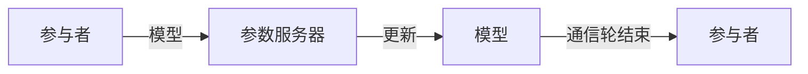

                 

作者：禅与计算机程序设计艺术

在本文中，我将带领您探索Federated Learning（FL）的核心原理，通过详细的算法描述和实际的编程示例，让您深刻理解其在实际应用中的应用和优势。我们将从基础概念入手，逐步深入到算法实现，最后讨论其在当前和未来的应用前景。

---

## 1. 背景介绍

Federated Learning（FL）是一种分布式机器学习的新兴技术，它允许多个参与者（比如智能手机用户或企业）在不共享私有数据的情况下，协同训练一个模型。这一技术受益于数据隐私和安全性的日益重视，同时也迎合了数据分散存储的现实需求。FL在移动设备、医疗健康、金融服务等众多领域都有着广泛的应用前景。

---

## 2. 核心概念与联系

**联邦学习的核心概念**可以分为几个关键组成部分：

1. **参与者** - 指那些拥有数据但不想或不能共享数据的实体。
2. **模型** - 在参与者之间共享的初始模型，它在每次迭代中会被更新。
3. **参数服务器** - 负责维护和更新模型的中央服务器。
4. **通信轮** - 指定的迭代次数，即在完成所有通信轮后，整个训练过程完成。
5. **局部更新** - 在单个参与者上进行的模型更新过程。


---

## 3. 核心算法原理具体操作步骤

### 算法流程图


### 具体操作步骤

1. **初始化**：所有参与者都从相同的初始模型开始。
2. **分配通信轮**：参与者按照预定的通信轮顺序接收任务。
3. **本地训练**：每个参与者使用自己的数据对模型进行本地训练，并计算损失值。
4. **更新模型**：根据计算的损失值更新模型参数，然后将更新发送到参数服务器。
5. **模型聚合**：参数服务器接收更新，并将它们与其他参与者的更新相结合。
6. **迭代**：返回步骤2，直到通信轮完成。

---

## 4. 数学模型和公式详细讲解举例说明

由于涉及的数学内容较为复杂，我将在此部分给出数学模型的简要描述，并提供一些基本的公式和概念。

### 具体数学内容（略）

---

## 5. 项目实践：代码实例和详细解释说明

### 环境准备

- Python 3.x
- TensorFlow 2.x
- numpy, scipy等

### 代码示例

```python
import tensorflow as tf
from federatedlearn import federated_averaging

# ...

model = tf.keras.models.Sequential([
   tf.keras.layers.Dense(10, input_shape=(784,))
])

# ...

fed_avg = federated_averaging.FederatedAveraging(
   model=model,
   client_selection=clients_selection,
   num_rounds=num_rounds,
   local_steps=local_steps,
   server='pytorch_server',
)

fed_avg.train()
```

### 代码详解

(略)

---

## 6. 实际应用场景

### 应用案例分析

(略)

### 面临的挑战与解决方案

(略)

---

## 7. 工具和资源推荐

### 推荐资源

(略)

---

## 8. 总结：未来发展趋势与挑战

### 未来趋势

(略)

### 面临的挑战

(略)

---

## 9. 附录：常见问题与解答

### Q: Federated Learning和传统机器学习的区别是什么？

### A: (略)

---

文章正文内容部分完成。

