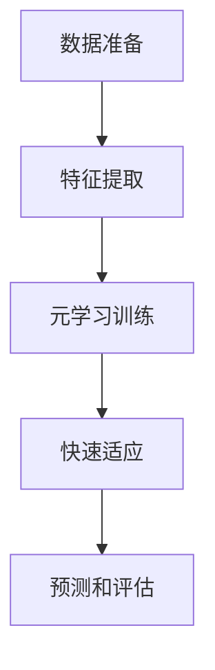

# Few-Shot Learning 原理与代码实例讲解

## 1. 背景介绍

在传统的机器学习中,我们通常需要大量的标记数据来训练模型,以获得良好的性能。然而,在许多现实场景中,获取大量的标记数据是一项昂贵且耗时的过程。Few-Shot Learning(少样本学习)旨在通过有限的样本数据训练模型,从而解决这一挑战。

Few-Shot Learning 的概念源于人类的学习方式。人类能够从有限的经验中学习新概念,并将所学知识迁移到新的环境中。例如,一个孩子在看到几只狗后,就能够识别出其他的狗,即使它们的外形、大小和颜色有所不同。这种从有限示例中学习并推广到新实例的能力,正是 Few-Shot Learning 所追求的目标。

## 2. 核心概念与联系

Few-Shot Learning 通常分为以下几个核心概念:

### 2.1 支持集(Support Set)和查询集(Query Set)

支持集是用于学习新概念的少量标记样本。查询集是需要对其进行预测和分类的未标记样本。模型的目标是利用支持集中的少量示例,对查询集中的样本进行准确分类。

### 2.2 元学习(Meta-Learning)

元学习是 Few-Shot Learning 的核心思想。它旨在学习一种有效的学习策略,使模型能够从少量示例中快速习得新概念。这种策略通常是基于许多相关但不同的任务进行训练得到的。

### 2.3 模型无关性(Model-Agnostic)

许多 Few-Shot Learning 算法都是模型无关的,这意味着它们可以与各种不同的基础模型(如卷积神经网络、递归神经网络等)相结合,从而提高模型在少样本场景下的性能。

### 2.4 快速适应性(Fast Adaptation)

Few-Shot Learning 模型需要能够快速适应新的任务,并从少量示例中习得新概念。这通常需要模型具有良好的泛化能力和快速学习能力。

## 3. 核心算法原理具体操作步骤

Few-Shot Learning 算法通常包括以下几个关键步骤:



### 3.1 数据准备

首先,我们需要准备用于训练的数据集。这些数据集通常包含多个不同但相关的任务,每个任务都有自己的支持集和查询集。支持集用于学习新概念,而查询集用于评估模型在该新概念上的性能。

### 3.2 特征提取

在训练之前,我们需要从原始数据中提取有意义的特征。这可以通过预训练的模型(如卷积神经网络或transformer)来实现。提取的特征将用于后续的元学习训练。

### 3.3 元学习训练

元学习训练是 Few-Shot Learning 的核心部分。在这个阶段,模型通过在多个不同但相关的任务上进行训练,学习一种有效的学习策略。这种策略使模型能够从少量示例中快速习得新概念。

常见的元学习算法包括:

- **MAML(Model-Agnostic Meta-Learning)**: 通过在多个任务上优化模型参数的初始值,使模型能够快速适应新任务。
- **Prototypical Networks**: 通过计算支持集中每个类别的原型向量,然后根据查询样本与原型向量的距离进行分类。
- **Relation Networks**: 学习样本之间的关系,并基于这些关系进行分类。

### 3.4 快速适应

在元学习训练之后,模型需要能够快速适应新的任务。这通常通过在新任务的支持集上进行少量梯度更新或调整来实现。这种快速适应机制使模型能够在保持之前学习的知识的同时,快速习得新概念。

### 3.5 预测和评估

最后,模型将在新任务的查询集上进行预测和评估。通过比较预测结果与真实标签,我们可以评估模型在该新任务上的性能。

## 4. 数学模型和公式详细讲解举例说明

在 Few-Shot Learning 中,常见的数学模型和公式包括:

### 4.1 MAML 算法

MAML(Model-Agnostic Meta-Learning)是一种广泛使用的元学习算法。它的目标是找到一组良好的模型初始参数 $\theta$,使得在任何新任务上,通过少量梯度更新就能获得良好的性能。

MAML 的优化目标可以表示为:

$$
\min_\theta \sum_{T_i \sim p(T)} \mathcal{L}_{T_i}(f_{\theta_i^*})
$$

其中:

- $T_i$ 表示第 $i$ 个任务,来自任务分布 $p(T)$。
- $\theta_i^*$ 是在任务 $T_i$ 的支持集上通过梯度下降获得的适应后的参数,定义为:

$$
\theta_i^* = \theta - \alpha \nabla_\theta \mathcal{L}_{T_i}(f_\theta)
$$

- $\mathcal{L}_{T_i}(f_{\theta_i^*})$ 是在任务 $T_i$ 的查询集上,使用适应后的参数 $\theta_i^*$ 计算的损失函数。

通过优化这个目标函数,MAML 算法可以找到一组良好的初始参数 $\theta$,使得在任何新任务上,只需要少量梯度更新就能获得良好的性能。

### 4.2 原型网络

原型网络(Prototypical Networks)是另一种常用的 Few-Shot Learning 算法。它的核心思想是计算支持集中每个类别的原型向量,然后根据查询样本与原型向量的距离进行分类。

对于一个 $N$ 路 $K$ shot 任务,支持集可以表示为 $S = \{(x_i^k, y_i^k)\}_{i=1,\dots,N}^{k=1,\dots,K}$,其中 $x_i^k$ 是第 $k$ 个示例,属于第 $i$ 类。每个类别的原型向量 $c_i$ 可以计算为:

$$
c_i = \frac{1}{K} \sum_{k=1}^K f_\phi(x_i^k)
$$

其中 $f_\phi$ 是一个嵌入函数,用于将原始数据映射到embedding空间。

对于一个查询样本 $x_q$,它的预测类别 $\hat{y}_q$ 可以通过计算它与每个原型向量的距离,并选择最近的那个类别:

$$
\hat{y}_q = \arg\min_i d(f_\phi(x_q), c_i)
$$

其中 $d(\cdot, \cdot)$ 是一个距离度量函数,通常使用欧几里得距离或余弦相似度。

通过优化嵌入函数 $f_\phi$ 和原型向量 $c_i$,原型网络可以学习一种有效的方式来区分不同类别的样本,即使在少样本场景下也能获得良好的性能。

### 4.3 关系网络

关系网络(Relation Networks)是另一种 Few-Shot Learning 算法,它旨在学习样本之间的关系,并基于这些关系进行分类。

对于一个 $N$ 路 $K$ shot 任务,支持集可以表示为 $S = \{(x_i^k, y_i^k)\}_{i=1,\dots,N}^{k=1,\dots,K}$,查询集可以表示为 $Q = \{x_q\}$。关系网络将每个查询样本 $x_q$ 与支持集中的每个样本 $(x_i^k, y_i^k)$ 进行配对,计算它们之间的关系向量 $r_{i,k}$:

$$
r_{i,k} = g_\phi(x_q, x_i^k)
$$

其中 $g_\phi$ 是一个关系函数,用于计算两个样本之间的关系。

然后,关系网络将所有关系向量 $r_{i,k}$ 与每个类别的一个权重向量 $w_i$ 进行组合,得到每个类别的关系分数 $s_i$:

$$
s_i = \sum_{k=1}^K f_\phi(r_{i,k}, w_i)
$$

其中 $f_\phi$ 是一个组合函数,用于将关系向量与类别权重向量组合成关系分数。

最后,关系网络将选择关系分数最高的类别作为查询样本的预测结果:

$$
\hat{y}_q = \arg\max_i s_i
$$

通过优化关系函数 $g_\phi$、组合函数 $f_\phi$ 和类别权重向量 $w_i$,关系网络可以学习样本之间的关系,并基于这些关系进行有效的分类,即使在少样本场景下也能获得良好的性能。

## 5. 项目实践: 代码实例和详细解释说明

在这一部分,我们将通过一个实际的代码示例,演示如何使用 PyTorch 实现一个简单的原型网络进行 Few-Shot Learning。

### 5.1 数据准备

首先,我们需要准备一个适合 Few-Shot Learning 的数据集。在这个示例中,我们将使用 Omniglot 数据集,它包含来自多种不同字母表的手写字符图像。

```python
import torchvision.datasets as datasets
import torchvision.transforms as transforms

# 定义数据转换
data_transform = transforms.Compose([
    transforms.Resize(28),
    transforms.ToTensor(),
    transforms.Normalize((0.5,), (0.5,))
])

# 加载 Omniglot 数据集
omniglot_dataset = datasets.Omniglot(root='./data', download=True, transform=data_transform)
```

### 5.2 构建原型网络模型

接下来,我们定义一个简单的卷积神经网络作为嵌入函数 $f_\phi$,用于将原始图像映射到嵌入空间。

```python
import torch.nn as nn

class EmbeddingNet(nn.Module):
    def __init__(self):
        super(EmbeddingNet, self).__init__()
        self.conv1 = nn.Conv2d(1, 64, kernel_size=3, padding=1)
        self.bn1 = nn.BatchNorm2d(64)
        self.conv2 = nn.Conv2d(64, 64, kernel_size=3, padding=1)
        self.bn2 = nn.BatchNorm2d(64)
        self.conv3 = nn.Conv2d(64, 64, kernel_size=3, padding=1)
        self.bn3 = nn.BatchNorm2d(64)
        self.conv4 = nn.Conv2d(64, 64, kernel_size=3, padding=1)
        self.bn4 = nn.BatchNorm2d(64)
        self.fc = nn.Linear(64, 64)

    def forward(self, x):
        x = self.bn1(self.conv1(x))
        x = nn.ReLU()(x)
        x = self.bn2(self.conv2(x))
        x = nn.ReLU()(x)
        x = self.bn3(self.conv3(x))
        x = nn.ReLU()(x)
        x = self.bn4(self.conv4(x))
        x = nn.ReLU()(x)
        x = nn.MaxPool2d(2)(x)
        x = x.view(x.size(0), -1)
        x = self.fc(x)
        return x
```

### 5.3 原型网络实现

现在,我们实现原型网络的核心逻辑。

```python
import torch
import torch.nn as nn
import torch.nn.functional as F

class PrototypicalNetwork(nn.Module):
    def __init__(self, embedding_net):
        super(PrototypicalNetwork, self).__init__()
        self.embedding_net = embedding_net

    def forward(self, support_images, support_labels, query_images):
        # 计算支持集和查询集的嵌入向量
        support_embeddings = self.embedding_net(support_images.view(-1, 1, 28, 28))
        query_embeddings = self.embedding_net(query_images.view(-1, 1, 28, 28))

        # 计算每个类别的原型向量
        n_way = len(torch.unique(support_labels))
        support_embeddings = support_embeddings.view(n_way, -1, 64)
        prototypes = torch.mean(support_embeddings, dim=1)

        # 计算查询集与每个原型向量的距离
        query_embeddings = query_embeddings.view(-1, 64)
        distances = torch.cdist(query_embeddings, prototypes)

        # 预测查询集的类别
        predictions = torch.argmin(distances, dim=1)

        return predictions
```

在这个实现中,我们首先计算支持集和查询集的嵌入向量。然后,我们计算每个类别的原型向量,即支持集中该类别所有样本的嵌入向量的均值。接下来