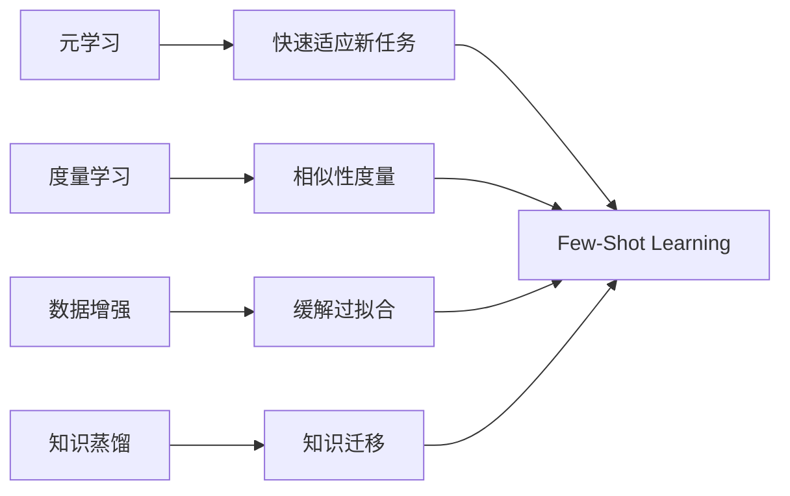

# Few-Shot Learning原理与代码实例讲解

## 1. 背景介绍

### 1.1 什么是Few-Shot Learning
Few-Shot Learning(少样本学习)是机器学习中的一个研究热点,旨在让模型通过很少的训练样本就能快速学习新的概念和任务。与传统的机器学习方法不同,Few-Shot Learning更接近人类的学习方式,即通过少量的例子就能掌握新知识。

### 1.2 Few-Shot Learning的应用场景
Few-Shot Learning在很多领域都有广泛的应用前景,例如:

- 计算机视觉:通过少量样本识别新的物体类别
- 自然语言处理:根据少量例句学习新词的语义
- 语音识别:利用少量语音adapt到新说话人
- 机器人控制:通过少量示范快速学习新动作
- 医学影像:利用少量病例诊断罕见疾病

### 1.3 Few-Shot Learning面临的挑战
尽管Few-Shot Learning很有前景,但其研究也面临诸多挑战:

- 样本稀缺:很难从极少的样本中学到足够多的知识
- 快速适应:需要模型能快速适应新任务而不是完全重新训练  
- 泛化能力:模型要有很强的泛化能力,能应对新的未知情况
- 鲁棒性:对噪声数据、异常点等要有较强的鲁棒性

## 2. 核心概念与联系

### 2.1 元学习(Meta-Learning)
元学习是Few-Shot Learning的核心思想之一。传统机器学习把重点放在模型本身,而元学习则是学习如何去学习,即学习一个学习算法。通过元学习,模型可以从以前学过的相关任务中总结规律,形成快速学习新任务的能力。

### 2.2 度量学习(Metric Learning)  
度量学习是另一个Few-Shot Learning常用的思路。其目标是学习一个度量空间,使得在该空间中,相似样本的距离小,不同类别样本的距离大。Few-Shot时,新类别的分类可以通过最近邻等方法实现。常见的度量学习方法有Siamese Network、Matching Network、Relation Network等。

### 2.3 数据增强(Data Augmentation)
由于Few-Shot Learning的训练样本很少,数据增强就显得尤为重要。除了常规的图像变换,领域知识驱动的数据增强如添加语义相关的背景等,可以有效缓解过拟合,提升模型泛化性。对抗样本的利用也被证明是有效的数据增强手段。

### 2.4 知识蒸馏(Knowledge Distillation)
知识蒸馏指用教师模型(通常是大模型)去指导学生模型(小模型)。在Few-Shot场景下,预训练的大模型可以作为教师,将其知识蒸馏到小样本上训练的学生模型,加速收敛和提高性能。

以下是这些概念之间的联系:


## 3. 核心算法原理具体操作步骤

### 3.1 基于度量的Few-Shot Learning

#### 3.1.1 Siamese神经网络

Siamese神经网络由两个共享参数的子网络组成,用于学习两个输入之间的相似度。训练时,两个子网络分别处理一对输入,然后通过对比损失函数(如Contrastive Loss)来学习一个度量空间。预测时,支持集中的样本与查询样本在特征空间中的接近程度决定了查询样本的类别。

具体步骤:
1. 准备好数据集,每个batch包含一定数量的正负样本对
2. 将一对输入分别送入两个共享参数的子网络,得到特征表示
3. 通过对比损失函数度量特征表示的相似性,并进行梯度反向传播
4. 重复步骤2-3直到模型收敛
5. 在支持集上fine-tune模型
6. 用fine-tuned的模型对查询集样本提取特征,并与支持集中样本的特征进行最近邻匹配,得到预测类别

#### 3.1.2 Prototypical网络

Prototypical网络学习一个度量空间,使得每个类别的样本聚集在该类别的原型向量周围。支持集中每个类别的原型向量定义为该类样本特征的均值向量。查询样本与各个原型向量的距离决定了其类别归属。

具体步骤:
1. 将支持集样本输入特征提取器(如CNN),得到特征表示
2. 对每个类别的支持样本特征取均值,得到原型向量
3. 计算查询样本特征与各原型向量的距离(如欧氏距离)
4. 根据距离对查询样本进行分类,距离最近的原型向量所属类别即为预测类别
5. 用交叉熵损失函数优化模型参数
6. 重复步骤1-5多个episode,每个episode随机采样构成不同的Few-Shot任务
7. 在测试时使用支持集获得原型向量,对查询样本分类

### 3.2 基于优化的Few-Shot Learning

#### 3.2.1 MAML

MAML(Model-Agnostic Meta-Learning)是一种广泛使用的元学习算法。其目标是学习一个对新任务有良好初始化的模型参数。这样在新任务上进行少量梯度下降就能快速适应。

具体步骤:
1. 随机初始化模型参数
2. 在元训练集上采样一个batch的任务
3. 对每个任务:
   - 用支持集计算损失,并对参数进行一次或多次梯度下降,得到任务专属参数
   - 用查询集计算任务专属参数下的损失
4. 对所有任务的查询集损失求平均,并对原始参数进行梯度更新
5. 重复步骤2-4直到收敛
6. 在测试时,用支持集对模型进行一次或多次梯度下降,再用查询集评估模型性能

#### 3.2.2 Reptile

Reptile是MAML的一个简化变体。不同于MAML对每个任务计算二阶导数,Reptile直接用每个任务梯度下降后的参数和初始参数的差值来更新初始参数。

具体步骤:
1. 随机初始化模型参数
2. 在元训练集上采样一个batch的任务
3. 对每个任务:
   - 将参数复制一份为任务专属参数
   - 用支持集对任务专属参数进行多次梯度下降
   - 计算任务专属参数和原始参数的差值
4. 将所有任务的参数差值相加,用于更新原始参数(lr为元学习率)
   `参数更新 = 原始参数 + lr * 参数差值和`
5. 重复步骤2-4直到收敛
6. 测试时采用与Maml相同的方式进行微调和评估

## 4. 数学模型和公式详细讲解举例说明

### 4.1 对比损失(Contrastive Loss)

对比损失用于度量学习,鼓励相似样本的特征接近,不同类别样本的特征远离。设$f(x)$为输入$x$的特征表示,$y$为样本对标签(相似为1,不同为0),则对比损失定义为:

$$
L(x_1,x_2,y) = \frac{1}{2}y||f(x_1)-f(x_2)||^2 + \frac{1}{2}(1-y)max(0, m-||f(x_1)-f(x_2)||)^2
$$

其中$m$为边界值,当不同类样本距离大于$m$时,该项损失为0。这个损失函数促使相似样本的特征距离小于不同类样本的距离。

例如,给定一对图像(狗,狗)和(狗,猫),对比损失将优化模型,使得两张狗图像的特征表示接近,而狗和猫的特征表示尽可能远离。

### 4.2 MAML的目标函数

MAML在元训练时优化如下目标函数:

$$
\min_{\theta} \mathbb{E}_{T \sim p(T)} \mathbb{E}_{(x^{(i)},y^{(i)}) \sim D^{test}_T}[\mathcal{L}(y^{(i)}, f_{\theta'}(x^{(i)}))]
$$

其中$\theta$为模型初始参数,$p(T)$为任务分布,$(x^{(i)},y^{(i)})$为任务$T$的测试集(即查询集)样本,$f_{\theta'}$为经过支持集梯度下降后的模型。$\theta'$的计算方式为:

$$
\theta' = \theta - \alpha \nabla_{\theta} \mathbb{E}_{(x^{(j)},y^{(j)}) \sim D^{train}_T}[\mathcal{L}(y^{(j)}, f_{\theta}(x^{(j)}))]
$$

其中$\alpha$为任务内学习率,$(x^{(j)},y^{(j)})$为任务$T$的训练集(即支持集)样本。

举例说明,假设一个Few-Shot分类任务,每个任务有5个类别,每类2个支持样本。MAML首先在支持集上对参数$\theta$进行一次梯度下降,得到$\theta'$,然后用查询集样本在$\theta'$上计算损失。通过最小化查询集损失,MAML学习到一个对新任务有良好初始化的$\theta$。

## 5. 项目实践：代码实例和详细解释说明

下面以Pytorch为例,给出Prototypical网络的简要实现:

```python
import torch
import torch.nn as nn
import torch.nn.functional as F

class PrototypicalNetwork(nn.Module):
    def __init__(self, in_dim, out_dim):
        super(PrototypicalNetwork, self).__init__()
        self.encoder = nn.Sequential(
            nn.Conv2d(in_dim, 64, 3, padding=1),
            nn.BatchNorm2d(64),
            nn.ReLU(),
            nn.MaxPool2d(2),
            nn.Conv2d(64, 64, 3, padding=1),
            nn.BatchNorm2d(64),
            nn.ReLU(),
            nn.MaxPool2d(2),
            nn.Conv2d(64, 64, 3, padding=1),
            nn.BatchNorm2d(64),
            nn.ReLU(),
            nn.MaxPool2d(2),
            nn.Flatten(),
            nn.Linear(64*5*5, out_dim)
        )
        
    def forward(self, x):
        return self.encoder(x)
    
    def get_prototypes(self, support_set):
        # 计算每个类别的原型向量
        prototypes = torch.mean(support_set, dim=1)
        return prototypes
    
    def euclidean_dist(self, x, y):
        # 计算两组向量间的欧氏距离
        n = x.size(0)
        m = y.size(0)
        d = x.size(1)
        x = x.unsqueeze(1).expand(n, m, d)
        y = y.unsqueeze(0).expand(n, m, d)
        return torch.pow(x - y, 2).sum(2)
    
    def loss(self, prototypes, query_set):
        # 计算查询集样本到各原型向量的距离
        dists = self.euclidean_dist(query_set, prototypes)
        # 取距离最近的原型所在的类别作为预测类别
        preds = torch.argmin(dists, dim=1)
        # 计算交叉熵损失
        loss = F.cross_entropy(dists, preds)
        return loss
```

代码说明:
1. `PrototypicalNetwork`类定义了一个简单的CNN作为特征提取器(encoder),将输入图像映射到一个固定维度的特征空间。
2. `forward`方法对输入进行特征提取。
3. `get_prototypes`方法对支持集中每个类别的样本特征取平均,得到原型向量。
4. `euclidean_dist`方法计算两组向量之间的欧氏距离。
5. `loss`方法计算查询集样本到各个原型向量的距离,并以距离最近的原型类别作为预测类别,然后计算交叉熵损失。

使用方法:
```python
model = PrototypicalNetwork(3, 64)
optimizer = torch.optim.Adam(model.parameters())

for epoch in range(num_epochs):
    for batch in dataloader:
        support_set, query_set, support_labels, query_labels = batch
        # 提取支持集特征并计算原型向量
        support_features = model(support_set) 
        prototypes = model.get_prototypes(support_features)
        # 提取查询集特征并计算损失
        query_features = model(query_set)
        loss