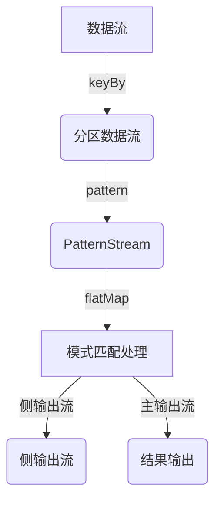

# Flink PatternAPI原理与代码实例讲解

## 1.背景介绍

### 1.1 什么是Flink

Apache Flink是一个开源的分布式流处理框架,用于对无界数据流进行有状态计算。Flink被设计为在所有常见的集群环境中运行,可以很好地与其他分布式系统集成在一起。Flink提供了一个功能丰富的API,支持各种编程语言,并且具有高吞吐量和低延迟的特点。

### 1.2 Flink流处理模型

Flink采用流式一次性持续计算模型,即数据以流的形式被持续不断地消费和处理。与传统的批处理模型不同,流处理模型不需要先将所有数据加载到内存中,而是实时地对数据进行处理。这种模型非常适合处理实时数据,如日志数据、传感器数据、金融交易数据等。

### 1.3 Flink PatternAPI介绍

PatternAPI是Flink提供的一种高级API,用于在数据流上查找复杂的事件模式。它允许开发人员使用类似于正则表达式的模式语言来定义需要检测的事件序列。PatternAPI提供了一种声明式的编程方式,使得开发人员可以专注于定义模式,而不必关注底层的流处理细节。

## 2.核心概念与联系

### 2.1 Pattern

Pattern是PatternAPI中最核心的概念,它定义了需要在数据流中查找的事件序列模式。Pattern由多个Pattern原语组成,这些原语描述了事件之间的关系和约束条件。常用的Pattern原语包括:

- `begin`: 定义模式的起始事件
- `next`: 指定下一个需要匹配的事件
- `followedBy`: 指定必须紧跟着的事件
- `or`: 指定备选事件
- `times`/`oneOrMore`/`times`/`optional`: 指定事件出现的次数

这些原语可以组合在一起构建复杂的模式。

### 2.2 PatternStream

PatternStream是一个包装了原始数据流的特殊流,它携带了模式匹配的相关信息。通过调用`stream.pattern`方法并传入一个Pattern,我们可以获得一个PatternStream。

### 2.3 PatternFlatMapFunction

PatternFlatMapFunction是一个函数接口,用于定义在发现模式匹配时应该执行的操作。它接收一个Map<String, List<事件>>作为输入,其中Map的键是模式中定义的事件的名称,值是与该事件匹配的数据元素列表。开发人员需要实现PatternFlatMapFunction的flatMap方法,并在其中处理模式匹配的结果。

```java
class MyPatternFlatMapper implements PatternFlatMapFunction<Event, AlertEvent> { 
    @Override
    public void flatMap(Map<String, List<Event>> pattern, Collector<AlertEvent> out) throws Exception {
        // 处理模式匹配结果,输出AlertEvent
    }
}
```

### 2.4 侧输出流

在处理模式匹配时,有时我们需要将不匹配的事件输出到侧输出流中,以便进行进一步处理。Flink提供了侧输出流的概念,允许我们在PatternFlatMapFunction中将不匹配的事件输出到指定的侧输出流中。

```java
OutputTag<Event> lateDataTag = new OutputTag<Event>("late-data"){};

SingleOutputStreamOperator<AlertEvent> alerts = 
    patternStream.flatMap(new MyPatternFlatMapper(), lateDataTag);

DataStream<Event> lateData = alerts.getSideOutput(lateDataTag);
```

## 3.核心算法原理具体操作步骤

PatternAPI的核心算法原理是基于有限状态机(Finite State Machine, FSM)实现的。在内部,PatternAPI会将用户定义的Pattern转换为一个FSM,然后使用这个FSM在数据流上进行模式匹配。

FSM由多个状态和状态转移组成。每个状态代表了模式中的一个事件,而状态转移则描述了从一个状态到另一个状态所需满足的条件。当一个新的数据元素到来时,FSM会根据当前状态和数据元素的属性决定是否进行状态转移。如果最终到达了接受状态,则认为发现了一个模式匹配。

PatternAPI的算法原理可以分为以下几个步骤:

1. **Pattern解析**: 将用户定义的Pattern解析为一个FSM的描述。
2. **FSM构建**: 根据FSM的描述构建出实际的FSM。
3. **数据元素处理**:
   - 对于每个到来的数据元素,将其传递给FSM进行处理。
   - FSM根据当前状态和数据元素的属性决定是否进行状态转移。
   - 如果转移到了接受状态,则认为发现了一个模式匹配。
4. **模式匹配处理**: 将发现的模式匹配传递给用户定义的PatternFlatMapFunction进行处理。

在内部实现中,PatternAPI使用了Flink的状态管理机制来维护FSM的状态,从而实现了有状态的模式匹配。这种基于FSM的实现方式使得PatternAPI能够高效地处理复杂的事件模式,并且具有很好的容错性和恢复能力。

## 4.数学模型和公式详细讲解举例说明

在PatternAPI的实现中,有一些数学模型和公式被用于优化和加速模式匹配的过程。这些模型和公式主要涉及以下几个方面:

### 4.1 状态组合优化

在FSM中,每个状态都有一个状态转移函数,用于决定在给定输入时应该转移到哪个状态。然而,随着模式复杂度的增加,状态数量会快速增长,导致状态转移函数的计算开销变大。

为了优化这个问题,PatternAPI采用了状态组合的策略。具体来说,它将具有相同状态转移函数的多个状态合并为一个组合状态。这样可以减少状态数量,从而降低状态转移函数的计算开销。

设有n个状态$s_1, s_2, \dots, s_n$,它们具有相同的状态转移函数$\delta$,则可以将它们合并为一个组合状态$s_c$,其状态转移函数为:

$$\delta_c(s_c, a) = \bigcup_{i=1}^n \delta(s_i, a)$$

其中$a$是输入符号。

通过这种组合方式,状态数量可以从$n$减少到$1$,从而大大降低了计算开销。

### 4.2 前缀共享

在处理模式匹配时,不同的模式可能会共享一些前缀。例如,模式`begin.next("a").next("b")`和模式`begin.next("a").next("c")`都共享了前缀`begin.next("a")`。

为了避免重复计算这些共享的前缀,PatternAPI采用了前缀共享的策略。具体来说,它会为共享的前缀构建一个共享的FSM部分,然后在这个基础上为每个模式构建剩余的FSM部分。这样可以减少重复计算,提高模式匹配的效率。

设有两个模式$p_1$和$p_2$,它们共享前缀$\pi$,则可以构建一个共享的FSM部分$M_\pi$,以及两个剩余的FSM部分$M_{p_1 - \pi}$和$M_{p_2 - \pi}$。模式匹配的计算可以表示为:

$$M(p_1) = M_\pi \circ M_{p_1 - \pi}$$
$$M(p_2) = M_\pi \circ M_{p_2 - \pi}$$

其中$\circ$表示FSM的组合运算。

通过这种前缀共享的策略,PatternAPI可以避免重复计算共享的前缀,从而提高模式匹配的效率。

### 4.3 窗口分割

在处理无界数据流时,PatternAPI需要维护一个滑动窗口,用于确定哪些数据元素属于当前的模式匹配范围。然而,随着时间的推移,窗口中的数据元素会越来越多,导致模式匹配的计算开销也会增加。

为了解决这个问题,PatternAPI采用了窗口分割的策略。具体来说,它会根据一些条件(如时间或计数)将滑动窗口分割成多个较小的窗口,然后在每个较小的窗口内进行模式匹配。这样可以减少每次计算需要处理的数据量,从而提高模式匹配的效率。

设有一个滑动窗口$W$,它可以被分割成$n$个较小的窗口$W_1, W_2, \dots, W_n$,则模式匹配的计算可以表示为:

$$M(W) = \bigcup_{i=1}^n M(W_i)$$

其中$M(W_i)$表示在窗口$W_i$内进行模式匹配的计算结果。

通过这种窗口分割的策略,PatternAPI可以将模式匹配的计算分散到多个较小的窗口中,从而降低了每次计算的开销,提高了整体的效率。

## 5.项目实践:代码实例和详细解释说明

为了更好地理解PatternAPI的使用方式,我们来看一个实际的代码示例。在这个示例中,我们将检测一个简单的模式:连续三次失败的登录尝试。

### 5.1 定义事件类型

首先,我们需要定义表示登录事件的数据类型:

```java
@Data
@AllArgsConstructor
@NoArgsConstructor
public class LoginEvent {
    private String userId;
    private String ipAddress;
    private boolean success;
    private long timestamp;
}
```

这个类包含了用户ID、IP地址、登录是否成功以及时间戳等信息。

### 5.2 定义模式

接下来,我们定义需要检测的模式:连续三次失败的登录尝试。我们使用PatternAPI提供的模式原语来描述这个模式:

```java
Pattern<LoginEvent, ?> pattern = Pattern.<LoginEvent>begin("start")
    .where(event -> !event.isSuccess())
    .next("next")
    .where(event -> !event.isSuccess())
    .next("next")
    .where(event -> !event.isSuccess())
    .within(Time.seconds(10));
```

这个模式定义了三个连续的失败登录事件,并且要求这三个事件必须在10秒内发生。

- `begin("start")`: 定义模式的起始事件,并给它命名为"start"。
- `where(event -> !event.isSuccess())`: 过滤条件,只匹配失败的登录事件。
- `next("next")`: 定义下一个需要匹配的事件,并给它命名为"next"。
- `within(Time.seconds(10))`: 指定这三个事件必须在10秒内发生。

### 5.3 应用模式

现在,我们可以将这个模式应用到数据流上,并定义在发现模式匹配时应该执行的操作:

```java
PatternStream<LoginEvent> patternStream = loginEventStream
    .keyBy(LoginEvent::getUserId)
    .pattern(pattern);

SingleOutputStreamOperator<AlertEvent> alertStream = patternStream
    .flatMap(new PatternFlatMapFunction<LoginEvent, AlertEvent>() {
        @Override
        public void flatMap(Map<String, List<LoginEvent>> pattern, Collector<AlertEvent> out) throws Exception {
            List<LoginEvent> start = pattern.get("start");
            List<LoginEvent> next = pattern.get("next");
            LoginEvent firstFailure = start.get(0);
            LoginEvent lastFailure = next.get(next.size() - 1);
            out.collect(new AlertEvent(firstFailure.getUserId(), firstFailure.getIpAddress(), lastFailure.getTimestamp()));
        }
    });
```

1. 我们首先使用`keyBy`对数据流进行分区,以确保同一个用户的登录事件被分配到同一个任务中处理。
2. 然后,我们调用`pattern`方法,将之前定义的模式应用到数据流上,获得一个PatternStream。
3. 最后,我们使用`flatMap`方法定义在发现模式匹配时应该执行的操作。在这个示例中,我们从模式匹配的结果中提取出用户ID、IP地址和最后一次失败登录的时间戳,并输出一个AlertEvent。

### 5.4 Mermaid流程图

下面是使用Mermaid绘制的PatternAPI处理流程图:



在这个流程图中,我们可以清晰地看到:

1. 首先对数据流进行分区(`keyBy`)。
2. 然后将模式应用到分区数据流上,获得PatternStream。
3. 在PatternStream上使用`flatMap`进行模式匹配处理,可以将不匹配的事件输出到侧