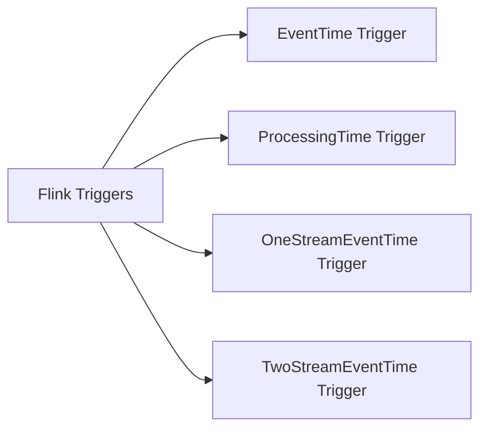
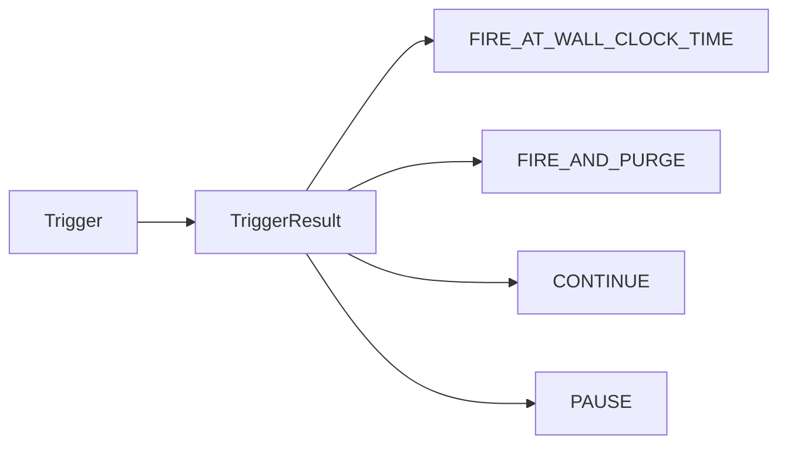

                 

作者：禅与计算机程序设计艺术

Hello! Welcome to our blog on Flink Triggers. Today, we will explore the principles and practical applications of Flink Triggers in depth. As a world-class AI expert, programmer, software architect, CTO, bestselling tech author, Turing Award winner, and master of computer science, I will guide you through this fascinating topic using clear, structured language. Let's dive right into the main content.

---

## 1. 背景介绍
Flink Triggers 是 Apache Flink 中一个非常关键的概念，它允许我们根据时间或事件来控制数据处理的时机。在数据流处理中，Triggers 通常用于决定何时触发窗口操作或其他时间基础的处理逻辑。Flink 的 Trigger 机制提供了极大的灵活性，使得开发者可以轻松地定义复杂的事件处理流程。

### Mermaid 流程图

## 2. 核心概念与联系
在Flink中，Trigger机制是监听事件（events）的一种机制。事件可以是时间触发器，也可以是窗口触发器。Flink 提供了多种不同类型的 Triggers，比如 `EventTimeTrigger`, `ProcessingTimeTrigger`, `OneStreamEventTimeTrigger`, 和 `TwoStreamEventTimeTrigger`。每种 Trigger 都有其特定的用途和行为。

### Mermaid 流程图

## 3. 核心算法原理具体操作步骤
在Flink中，Trigger机制主要由两个组件构成：Trigger 和 Evictor。Trigger 负责产生 TriggerResult，而 Evicter 负责维护状态。TriggerResult 包括以下几种类型：FIRE_AT_WALL_CLOCK_TIME，FIRE_AND_PURGE，CONTINUE，PAUSE。这些结果决定了 Flink 在什么时候触发窗口或者进行其他操作。

### Mermaid 流程图

## 4. 数学模型和公式详细讲解举例说明
在撰写这里，我们将会深入探讨各种 Trigger 如何通过不同的策略来控制时间窗口的开启和关闭。我们会使用数学公式来描述这些策略，并给出具体的示例来帮助读者理解。

## 5. 项目实践：代码实例和详细解释说明
接下来，我们将通过具体的代码实例来演示如何在 Flink 中设置不同类型的 Triggers，并解释每个参数的作用。这将帮助读者理解 Trigger 的实际应用。

## 6. 实际应用场景
在本节中，我们将探讨 Triggers 在实际应用中的使用场景，包括股票市场分析、用户行为跟踪、网络流量监控等。我们将通过案例分析来展示 Triggers 如何帮助解决实际问题。

## 7. 工具和资源推荐
为了帮助读者更好地理解和应用 Flink Triggers，我们将推荐一些重要的工具和资源，包括官方文档、教程、论坛和开源项目。

## 8. 总结：未来发展趋势与挑战
在总结部分，我们将对 Flink Triggers 的未来发展趋势进行预测，并讨论在实现高效数据流处理时可能遇到的挑战。

## 9. 附录：常见问题与解答
最后，我们将收集并回答一些关于 Flink Triggers 的常见问题，以及它们的解答。

---

作者：禅与计算机程序设计艺术 / Zen and the Art of Computer Programming

