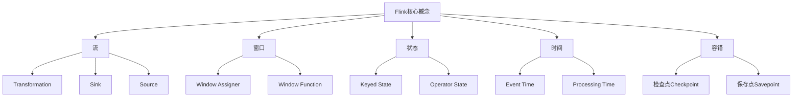

# Flink原理与代码实例讲解

## 1. 背景介绍

Apache Flink 是一个开源的分布式数据流处理框架,专门为有状态计算而设计。它能够对无界数据流进行高吞吐、低延迟的数据处理,并保证精确一次的状态一致性。Flink 具有出色的容错机制,可以在作业失败时自动恢复,确保数据处理的可靠性。

Flink 的核心架构采用了流批一体的设计理念,将批处理视为流处理的一个特例。这种设计使得 Flink 能够以统一的方式处理有界数据(批处理)和无界数据(流处理)。无论是批处理还是流处理,Flink 都能够提供低延迟、高吞吐、精确一次语义的数据处理能力。

### 1.1 Flink 的应用场景

Flink 可以广泛应用于各种场景,包括但不限于:

- 实时数据分析: 对来自各种来源(如日志、传感器等)的数据流进行实时分析,生成实时报表和仪表盘。
- 实时机器学习: 利用流式数据训练机器学习模型,并将模型应用于实时预测和决策。
- 事件驱动应用程序: 构建基于事件的实时应用程序,如实时推荐、欺诈检测等。
- 实时ETL: 从各种数据源提取、转换和加载数据,实现实时数据集成。

### 1.2 Flink 与其他框架的对比

Flink 与其他流处理框架(如 Apache Spark Streaming、Apache Storm 等)相比,具有以下优势:

- 更好的性能: Flink 采用了优化的执行引擎,能够提供低延迟和高吞吐的数据处理能力。
- 更强的容错性: Flink 的检查点机制和状态一致性保证了精确一次的处理语义。
- 更丰富的API: Flink 提供了流式和批处理两种API,使得开发人员可以使用相同的API处理有界和无界数据。
- 更好的可扩展性: Flink 可以在本地和云环境中无缝扩展,支持多种资源管理器。

## 2. 核心概念与联系

为了更好地理解 Flink,我们需要掌握一些核心概念。这些概念相互关联,共同构建了 Flink 的整体架构。

### 2.1 流 (Stream)

在 Flink 中,一切数据都被视为流。流是一个无界、持续不断的数据序列,可以来自各种数据源,如消息队列、文件、socket 等。Flink 提供了丰富的 Source 连接器,用于从不同数据源读取数据流。

### 2.2 窗口 (Window)

由于流是无界的,因此需要使用窗口将无界流切分为有界的数据集。Flink 支持多种窗口类型,如滚动窗口、滑动窗口、会话窗口等。窗口可以根据时间或数据条数进行划分。窗口分配器 (Window Assigner) 负责将数据流分配到不同的窗口中,窗口函数 (Window Function) 则对每个窗口中的数据进行计算。

### 2.3 状态 (State)

Flink 是一个有状态的流处理框架,它能够维护和管理作业的状态。状态可分为两种类型:

- 键控状态 (Keyed State): 与特定键关联的状态,常用于实现有状态的转换操作。
- 运算符状态 (Operator State): 与特定算子实例相关的状态,常用于实现有状态的源或sink。

### 2.4 时间 (Time)

在流处理中,时间是一个非常重要的概念。Flink 支持三种时间语义:

- 事件时间 (Event Time): 基于数据本身携带的时间戳进行处理。
- 提取时间 (Ingestion Time): 基于数据进入 Flink 的时间进行处理。
- 处理时间 (Processing Time): 基于机器的系统时间进行处理。

事件时间通常被认为是最合理的时间语义,因为它能够保证事件的顺序性和一致性。但在某些情况下,提取时间和处理时间也可能更加合适。

### 2.5 容错 (Fault Tolerance)

Flink 通过检查点 (Checkpoint) 和保存点 (Savepoint) 机制实现了容错能力。

- 检查点: 定期将作业的状态保存到持久存储中,以便在发生故障时能够从最近的一次检查点恢复。
- 保存点: 手动触发的检查点,可用于手动备份和恢复作业状态。

这些机制确保了 Flink 能够在发生故障时自动恢复,并保证精确一次的处理语义。

## 3. 核心算法原理具体操作步骤

Flink 的核心算法原理涉及多个方面,包括流处理、窗口操作、状态管理、时间语义处理和容错机制等。下面我们将详细介绍这些核心算法原理的具体操作步骤。

### 3.1 流处理算法

Flink 采用了流批一体的设计理念,将批处理视为流处理的一个特例。流处理算法的核心步骤如下:

1. **数据源 (Source)**: 从各种数据源(如消息队列、文件、socket 等)读取数据流。
2. **转换操作 (Transformation)**: 对数据流执行各种转换操作,如过滤、映射、聚合等。转换操作可以链式组合,形成复杂的数据处理管道。
3. **分区 (Partitioning)**: 将数据流按照特定的分区策略(如键值分区、广播分区等)分发到不同的并行实例上进行处理。
4. **窗口操作 (Window Operation)**: 对无界数据流进行窗口划分,将无界流转换为有界的数据集。
5. **状态管理 (State Management)**: 维护和管理作业的状态,包括键控状态和运算符状态。
6. **sink (Sink)**: 将处理后的数据流写入到不同的目标系统,如文件系统、数据库、消息队列等。

### 3.2 窗口操作算法

窗口操作是流处理中的一个关键步骤,它将无界的数据流划分为有界的数据集。Flink 支持多种窗口类型,包括滚动窗口、滑动窗口、会话窗口等。窗口操作算法的核心步骤如下:

1. **窗口分配 (Window Assigner)**: 根据特定的窗口策略(如时间窗口、计数窗口等),将数据流中的每个元素分配到对应的窗口中。
2. **窗口缓冲 (Window Buffer)**: 为每个窗口维护一个缓冲区,用于存储分配到该窗口中的数据元素。
3. **触发器 (Trigger)**: 决定何时对窗口中的数据进行计算。Flink 提供了多种触发器,如处理时间触发器、事件时间触发器等。
4. **窗口函数 (Window Function)**: 对每个窗口中的数据执行特定的计算操作,如聚合、折减等。
5. **结果输出 (Output)**: 将窗口计算的结果输出到下游操作或者 Sink 中。

### 3.3 状态管理算法

Flink 作为一个有状态的流处理框架,需要高效地管理和维护作业的状态。状态管理算法的核心步骤如下:

1. **状态分区 (State Partitioning)**: 根据键值将状态分区到不同的任务实例上,以实现状态的并行处理。
2. **状态存储 (State Storage)**: 将状态持久化存储到可靠的存储介质中,如本地磁盘或分布式文件系统。
3. **状态快照 (State Snapshot)**: 定期对状态进行快照,以便在发生故障时能够从最近的一次快照恢复。
4. **状态恢复 (State Recovery)**: 在作业失败后,从最近的一次快照中恢复状态,确保精确一次的处理语义。

### 3.4 时间语义处理算法

Flink 支持三种时间语义:事件时间、提取时间和处理时间。时间语义处理算法的核心步骤如下:

1. **时间戳分配 (Timestamp Assigner)**: 为每个数据元素分配一个时间戳,用于确定该元素所属的时间窗口。
2. **水位线 (Watermark)**: 水位线是一个全局的时间戳,用于追踪事件时间的进度。它保证了事件时间的有序性和一致性。
3. **延迟数据处理 (Late Data Handling)**: 对于迟到的数据元素,Flink 提供了多种策略进行处理,如丢弃、重新计算或者更新结果。
4. **时间窗口 (Time Window)**: 根据时间戳和水位线,将数据流划分为不同的时间窗口,并对每个窗口中的数据进行计算。

### 3.5 容错算法

Flink 通过检查点和保存点机制实现了容错能力,确保了作业在发生故障时能够自动恢复,并保证精确一次的处理语义。容错算法的核心步骤如下:

1. **检查点 (Checkpoint)**: 定期将作业的状态保存到持久存储中,形成一个一致性快照。
2. **屏障 (Barrier)**: 在数据流中注入屏障,用于确保检查点的一致性和完整性。
3. **故障恢复 (Failure Recovery)**: 当作业失败时,从最近的一次检查点恢复状态,并重新启动作业。
4. **保存点 (Savepoint)**: 手动触发的检查点,可用于手动备份和恢复作业状态。

## 4. 数学模型和公式详细讲解举例说明

在 Flink 的核心算法中,涉及到一些数学模型和公式。下面我们将详细讲解这些数学模型和公式,并给出具体的例子说明。

### 4.1 窗口模型

窗口是流处理中的一个核心概念,它将无界的数据流划分为有界的数据集。Flink 支持多种窗口类型,包括滚动窗口、滑动窗口和会话窗口等。

#### 滚动窗口 (Tumbling Window)

滚动窗口将数据流划分为固定大小的非重叠窗口。每个窗口包含一段固定时间范围内的数据,并且不会与其他窗口重叠。

滚动窗口的数学模型如下:

$$
W_i = [t_i, t_i + w)
$$

其中:
- $W_i$ 表示第 $i$ 个窗口
- $t_i$ 表示第 $i$ 个窗口的起始时间
- $w$ 表示窗口的大小(时间范围)

例如,如果我们设置滚动窗口的大小为 5 分钟,那么第一个窗口将包含从 00:00:00 到 00:04:59 的数据,第二个窗口将包含从 00:05:00 到 00:09:59 的数据,以此类推。

#### 滑动窗口 (Sliding Window)

滑动窗口将数据流划分为固定大小的重叠窗口。每个窗口包含一段固定时间范围内的数据,并且会与前一个窗口和后一个窗口重叠。

滑动窗口的数学模型如下:

$$
W_i = [t_i, t_i + w)
$$
$$
t_{i+1} = t_i + s
$$

其中:
- $W_i$ 表示第 $i$ 个窗口
- $t_i$ 表示第 $i$ 个窗口的起始时间
- $w$ 表示窗口的大小(时间范围)
- $s$ 表示窗口的滑动步长

例如,如果我们设置滑动窗口的大小为 10 分钟,滑动步长为 5 分钟,那么第一个窗口将包含从 00:00:00 到 00:09:59 的数据,第二个窗口将包含从 00:05:00 到 00:14:59 的数