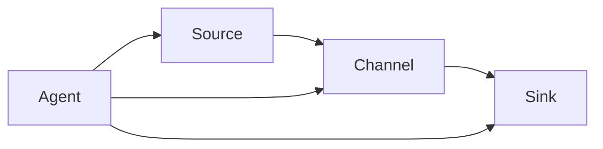
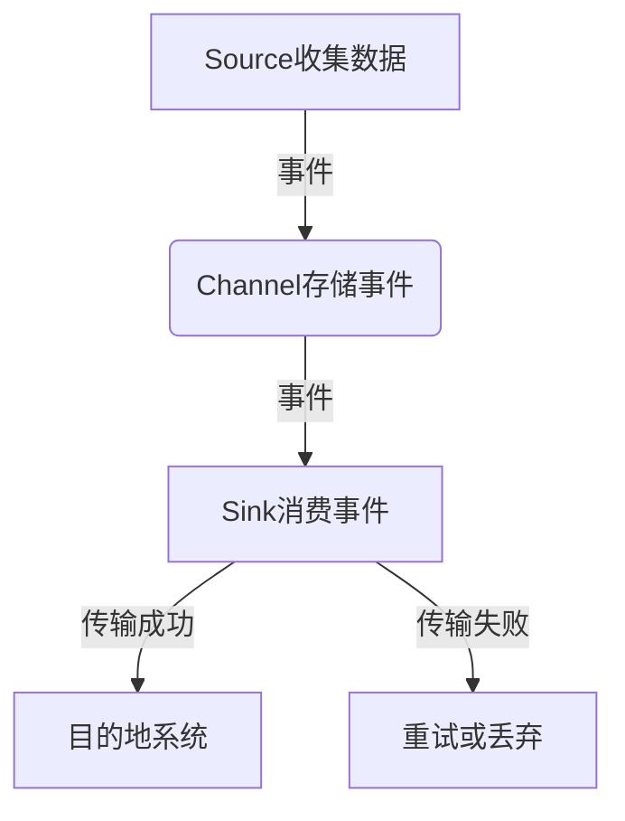

# Flume原理与代码实例讲解

## 1.背景介绍

Apache Flume 是一个分布式、可靠且可用的服务,用于高效地收集、聚合和移动大量日志数据。它是Apache Hadoop生态系统中的一个关键组件,旨在从不同的数据源高效地收集、聚合和移动大量的日志数据到集中存储系统中,以供后续的处理和分析。

在当今大数据时代,海量数据的产生是不可避免的。这些数据来源于各种不同的系统,如Web服务器日志、应用程序日志、设备日志等。有效地收集和处理这些数据对于企业来说至关重要,因为它们可以提供有价值的业务洞察力,并帮助企业做出更好的决策。

然而,收集和处理这些分散的数据源是一个巨大的挑战。传统的日志收集方式通常是将日志文件从各个节点复制到中央服务器上,这种方式存在许多问题,如效率低下、可靠性差、扩展性差等。Apache Flume应运而生,旨在解决这些问题,提供一种高效、可靠和可扩展的日志收集方式。

## 2.核心概念与联系

Apache Flume 由以下几个核心概念组成:

### 2.1 数据流(Data Flow)

Flume 中的数据流是指从数据源到数据目的地的数据传输路径。数据流由多个组件组成,包括 Source、Channel 和 Sink。

### 2.2 Source

Source 是数据进入 Flume 的入口,负责从外部系统(如 Web 服务器、应用程序日志等)收集数据。Flume 支持多种类型的 Source,如 Avro Source、Syslog Source、Kafka Source 等。

### 2.3 Channel

Channel 是 Flume 中的一个内部事件传输队列,用于临时存储从 Source 收集的数据,直到它们被 Sink 消费。Channel 具有缓冲作用,可以防止数据丢失并提高系统的可靠性。Flume 支持多种类型的 Channel,如 Memory Channel、File Channel 等。

### 2.4 Sink

Sink 是数据离开 Flume 的出口,负责将数据从 Channel 传输到下一个目的地,如 HDFS、Kafka、HBase 等。Flume 支持多种类型的 Sink,如 HDFS Sink、Kafka Sink、HBase Sink 等。

### 2.5 Agent

Agent 是 Flume 中的一个独立进程,由一个 Source、一个 Channel 和一个或多个 Sink 组成。Agent 负责从 Source 收集数据,将数据存储在 Channel 中,然后将数据从 Channel 传输到 Sink。

这些核心概念之间的关系如下所示:



## 3.核心算法原理具体操作步骤

Flume 的核心算法原理主要体现在数据流的处理过程中,包括以下几个步骤:

### 3.1 数据收集

Source 从外部系统(如 Web 服务器、应用程序日志等)收集数据,并将数据封装成 Flume 事件(Event)。每个事件包含一个头部(Header)和一个正文(Body)。头部存储元数据,如时间戳、主机名等;正文存储实际的数据内容。

### 3.2 数据传输

Source 将收集到的事件传输到 Channel 中。Channel 作为一个内部队列,负责临时存储这些事件。如果 Channel 已满,Source 会阻塞或者丢弃事件,具体行为取决于 Channel 的配置。

### 3.3 数据持久化

Channel 将事件持久化到磁盘或内存中,以防止数据丢失。Flume 提供了多种 Channel 类型,如 Memory Channel 和 File Channel。Memory Channel 将事件存储在内存中,速度更快但不太可靠;File Channel 将事件存储在本地文件系统中,速度较慢但更可靠。

### 3.4 数据消费

Sink 从 Channel 中消费事件,并将事件传输到下一个目的地,如 HDFS、Kafka、HBase 等。Sink 可以应用不同的处理逻辑,如数据格式转换、数据过滤等。如果 Sink 无法将事件传输到目的地,它会尝试重新传输或者丢弃事件,具体行为取决于 Sink 的配置。

### 3.5 事务处理

Flume 采用事务机制来确保数据的可靠性。每个 Source 和 Sink 都有自己的事务,用于控制数据的传输过程。如果在传输过程中发生错误,事务会回滚,并重新尝试传输。

这个过程可以用以下 Mermaid 流程图表示:



## 4.数学模型和公式详细讲解举例说明

在 Flume 中,数据传输的可靠性是一个关键问题。为了确保数据不会丢失,Flume 采用了一种基于事务的机制。这个机制可以用一个简单的数学模型来描述。

假设我们有一个 Flume 数据流,包括一个 Source、一个 Channel 和一个 Sink。我们定义以下变量:

- $N$: 源数据集合中的事件总数
- $N_s$: Source 成功发送到 Channel 的事件数
- $N_c$: Channel 成功接收的事件数
- $N_k$: Sink 成功发送到目的地的事件数

理想情况下,我们希望 $N_s = N_c = N_k = N$,即所有事件都能够成功传输到目的地。但在实际情况中,可能会出现以下几种情况:

1. **数据丢失**

   如果 $N_s < N$,说明有一些事件在 Source 发送到 Channel 的过程中丢失了。这种情况可能是由于网络问题或者 Channel 已满导致的。

2. **Channel 故障**

   如果 $N_c < N_s$,说明有一些事件在 Channel 接收时丢失了。这种情况可能是由于 Channel 故障或者数据损坏导致的。

3. **Sink 故障**

   如果 $N_k < N_c$,说明有一些事件在 Sink 发送到目的地时丢失了。这种情况可能是由于目的地系统故障或者网络问题导致的。

为了量化数据传输的可靠性,我们可以定义一个可靠性指标 $R$:

$$
R = \frac{N_k}{N}
$$

$R$ 的取值范围是 $[0, 1]$,值越接近 1,说明数据传输的可靠性越高。

例如,假设我们有一个 Flume 数据流,源数据集合中有 10000 个事件。在传输过程中,Source 成功发送到 Channel 的事件数为 9800,Channel 成功接收的事件数为 9700,Sink 成功发送到目的地的事件数为 9600。那么,可靠性指标 $R$ 的值为:

$$
R = \frac{9600}{10000} = 0.96
$$

这说明该数据流的可靠性较高,但仍然有 4% 的事件丢失。

通过分析可靠性指标 $R$ 的值,我们可以评估 Flume 数据流的可靠性,并采取相应的措施来提高可靠性,如增加 Channel 的容量、优化网络环境等。

## 5.项目实践:代码实例和详细解释说明

为了更好地理解 Flume 的工作原理,我们来看一个实际的代码示例。在这个示例中,我们将构建一个简单的 Flume 数据流,从本地文件系统收集日志数据,并将其存储到 HDFS 中。

### 5.1 配置文件

首先,我们需要创建一个 Flume 配置文件,定义数据流的各个组件。以下是一个示例配置文件 `flume-example.conf`:

```properties
# 定义 Agent 名称
a1.sources = r1
a1.sinks = k1
a1.channels = c1

# 定义 Source
a1.sources.r1.type = exec
a1.sources.r1.command = tail -F /path/to/log/file.log

# 定义 Sink
a1.sinks.k1.type = hdfs
a1.sinks.k1.hdfs.path = hdfs://namenode/flume/events/%Y/%m/%d/%H
a1.sinks.k1.hdfs.filePrefix = events-
a1.sinks.k1.hdfs.round = true
a1.sinks.k1.hdfs.roundValue = 10
a1.sinks.k1.hdfs.roundUnit = minute

# 定义 Channel
a1.channels.c1.type = memory
a1.channels.c1.capacity = 1000
a1.channels.c1.transactionCapacity = 100

# 绑定 Source、Channel 和 Sink
a1.sources.r1.channels = c1
a1.sinks.k1.channel = c1
```

在这个配置文件中,我们定义了一个名为 `a1` 的 Agent,包含以下组件:

- **Source**: 类型为 `exec`,从本地文件系统的 `/path/to/log/file.log` 文件中读取日志数据。
- **Sink**: 类型为 `hdfs`,将数据存储到 HDFS 的 `/flume/events` 目录下,文件名格式为 `events-yyyyMMddHH`。
- **Channel**: 类型为 `memory`,内存通道,容量为 1000 个事件,事务容量为 100 个事件。

### 5.2 启动 Flume Agent

配置文件准备好后,我们可以使用 Flume 命令行工具启动 Agent:

```bash
$ bin/flume-ng agent --conf conf --conf-file conf/flume-example.conf --name a1 -Dflume.root.logger=INFO,console
```

这条命令将启动一个名为 `a1` 的 Agent,使用 `flume-example.conf` 配置文件。`-Dflume.root.logger=INFO,console` 参数用于设置日志级别和输出目标。

### 5.3 数据流程解释

启动 Agent 后,Flume 将按照以下流程处理数据:

1. **Source 收集数据**

   `exec` Source 会执行 `tail -F /path/to/log/file.log` 命令,持续监视日志文件的变化。每当有新的日志数据写入文件,Source 就会将其封装成 Flume 事件,并发送到 Channel。

2. **Channel 存储事件**

   `memory` Channel 会将收到的事件存储在内存中。如果 Channel 已满,Source 会阻塞,直到有空间可用。

3. **Sink 消费事件**

   `hdfs` Sink 会从 Channel 中消费事件,并将它们存储到 HDFS 的 `/flume/events` 目录下。文件名格式为 `events-yyyyMMddHH`,每 10 分钟会生成一个新文件。

4. **事务处理**

   整个数据传输过程都是在事务的控制下进行的。如果在任何一个环节发生错误,事务会回滚,并重新尝试传输。

通过这个示例,我们可以看到 Flume 的核心工作原理:Source 收集数据、Channel 存储数据、Sink 消费数据,并通过事务机制确保数据的可靠性。

## 6.实际应用场景

Apache Flume 在实际应用中有着广泛的用途,尤其是在日志收集和数据传输方面。以下是一些常见的应用场景:

### 6.1 Web服务器日志收集

Web 服务器会产生大量的访问日志,这些日志对于分析用户行为、优化网站性能等方面非常有价值。使用 Flume,我们可以从多台 Web 服务器上实时收集日志,并将其存储到集中的存储系统(如 HDFS)中,供后续的数据分析和处理。

### 6.2 应用程序日志收集

在分布式应用程序中,每个节点都会产生大量的日志数据。使用 Flume,我们可以从各个节点收集这些日志,并将它们集中存储,方便进行问题诊断和性能监控。

### 6.3 物联网数据收集

在物联网领域,大量的传感器和设备会产生海量的数据。使用 Flume,我们可以从这些设备上实时收集数据,并将其传输到大数据平台进行处理和分析。

### 6.4 数据lake构建

数据lake是一种用于存储各种类型数据的集中存储系统。使用 Flume,我们可以将来自不同源的数据(如日志、传感器数