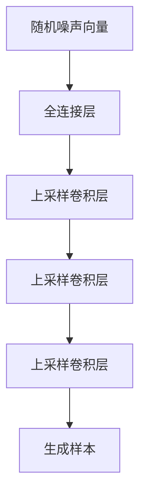

# GAN 生成模型：生成器 (Generator) 原理与代码实例讲解

## 1.背景介绍

### 1.1 生成对抗网络(GAN)概述

生成对抗网络(Generative Adversarial Networks, GAN)是一种由Ian Goodfellow等人在2014年提出的全新的生成模型框架。GAN由两个神经网络模型组成:生成器(Generator)和判别器(Discriminator)。这两个模型相互对抗地训练,生成器会学习从潜在空间中生成逼真的数据样本,而判别器则尝试区分生成的样本和真实样本。通过这种对抗训练,生成器和判别器相互博弈,最终达到生成器生成的样本无法被判别器区分的目标。

GAN在计算机视觉、自然语言处理、音频合成等领域展现出了巨大的潜力,被广泛应用于图像生成、语音生成、文本生成等任务中。

### 1.2 生成器在GAN中的作用

生成器(Generator)是GAN框架中的核心组成部分,负责从潜在空间(latent space)中采样并生成逼真的数据样本。生成器通常由一个深度神经网络构成,输入是一个随机噪声向量,输出是与训练数据具有相同分布的样本。

生成器的目标是学习训练数据的真实分布,并生成尽可能逼真的样本,以欺骗判别器。在训练过程中,生成器会根据判别器的反馈不断优化自身的参数,使得生成的样本更加逼真,从而最大化判别器被欺骗的概率。

## 2.核心概念与联系

### 2.1 生成器的网络结构

生成器通常采用上采样卷积网络(Upsampling Convolutional Networks)或转置卷积网络(Transposed Convolutional Networks)的结构。这种网络结构可以将低维的潜在向量逐步上采样为高维的图像或其他数据形式。



上图展示了一个典型的生成器网络结构。首先,一个随机噪声向量作为输入,经过全连接层对其进行映射。然后,通过一系列上采样卷积层,将低维特征逐步上采样为高维输出。每个上采样卷积层都会增加特征图的空间分辨率,同时减少通道数。最后一层通常是一个卷积层或转置卷积层,用于生成最终的样本输出。

### 2.2 生成器的损失函数

生成器的目标是生成足够逼真的样本以欺骗判别器。因此,生成器的损失函数通常是最大化判别器对生成样本的输出概率。具体来说,生成器的损失函数可以定义为:

$$J^{(G)}=-\mathbb{E}_{z\sim p_z(z)}[\log D(G(z))]$$

其中,$G(z)$表示生成器根据噪声向量$z$生成的样本,$D(G(z))$表示判别器对该生成样本的输出概率。通过最小化这个损失函数,生成器可以学习生成更加逼真的样本,从而欺骗判别器。

### 2.3 生成器与判别器的对抗关系

生成器和判别器之间存在一种对抗关系,可以被建模为一个两人零和博弈(two-player zero-sum game)。在这个博弈中,生成器试图最大化判别器被欺骗的概率,而判别器则试图最大化正确识别真实样本和生成样本的能力。这种对抗关系可以用下面的公式表示:

$$\min_{G}\max_{D}V(D,G)=\mathbb{E}_{x\sim p_{data}(x)}[\log D(x)]+\mathbb{E}_{z\sim p_z(z)}[\log(1-D(G(z)))]$$

其中,$V(D,G)$是判别器和生成器的值函数。判别器试图最大化这个值函数,而生成器则试图最小化它。通过这种对抗训练,生成器和判别器相互驱动,最终达到生成器生成的样本无法被判别器区分的状态。

## 3.核心算法原理具体操作步骤

GAN的训练过程可以概括为以下步骤:

1. **初始化生成器和判别器**:首先,我们需要初始化生成器$G$和判别器$D$的网络结构和参数。

2. **加载训练数据**:准备好训练数据集,例如图像、音频或文本数据。

3. **采样噪声向量**:从潜在空间(通常是高斯分布或均匀分布)中采样一个噪声向量$z$。

4. **生成器生成样本**:将噪声向量$z$输入到生成器$G$中,生成一个样本$G(z)$。

5. **判别器判别真实性**:将生成的样本$G(z)$和真实样本$x$输入到判别器$D$中,分别得到判别器对它们的输出概率$D(G(z))$和$D(x)$。

6. **计算生成器和判别器的损失**:根据判别器的输出,计算生成器的损失$J^{(G)}$和判别器的损失$J^{(D)}$。

7. **反向传播和优化**:对生成器和判别器分别进行反向传播,并使用优化算法(如Adam)更新它们的参数,以最小化各自的损失函数。

8. **重复训练**:重复步骤3-7,直到达到停止条件(如最大迭代次数或损失函数收敛)。

在训练过程中,生成器和判别器会相互对抗,生成器会不断尝试生成更加逼真的样本以欺骗判别器,而判别器则会不断提高区分真实样本和生成样本的能力。最终,生成器会学习到训练数据的真实分布,并能够生成高质量的样本。

## 4.数学模型和公式详细讲解举例说明

### 4.1 生成器的数学模型

生成器$G$可以被建模为一个映射函数,将潜在空间中的噪声向量$z$映射到数据空间中的样本$x$:

$$G(z;\theta_g):Z\rightarrow X$$

其中,$Z$表示潜在空间,$X$表示数据空间,$\theta_g$是生成器的参数。

生成器的目标是学习一个映射函数$G$,使得从潜在空间$Z$中采样的噪声向量$z$经过映射后,生成的样本$G(z)$与真实数据$x$的分布尽可能相似。换句话说,生成器试图学习真实数据$x$的概率分布$p_{data}(x)$,使得生成样本$G(z)$的分布$p_g(x)$与$p_{data}(x)$尽可能接近。

为了衡量生成样本与真实数据之间的分布差异,我们可以使用一种度量,例如Kullback-Leibler(KL)散度或Jenson-Shannon(JS)散度。生成器的目标是最小化这种分布差异度量:

$$\min_G D_{KL}(p_{data}(x)||p_g(x))=\min_G\mathbb{E}_{x\sim p_{data}(x)}[\log\frac{p_{data}(x)}{p_g(x)}]$$

或者

$$\min_G D_{JS}(p_{data}(x)||p_g(x))=\frac{1}{2}D_{KL}(p_{data}(x)||\frac{p_{data}(x)+p_g(x)}{2})+\frac{1}{2}D_{KL}(p_g(x)||\frac{p_{data}(x)+p_g(x)}{2})$$

其中,$D_{KL}$表示KL散度,$D_{JS}$表示JS散度。

然而,直接优化这些目标函数是非常困难的,因为我们无法精确计算真实数据分布$p_{data}(x)$和生成数据分布$p_g(x)$。GAN提供了一种巧妙的方式来间接优化这个目标,即通过对抗训练的方式,使生成器生成的样本无法被判别器区分。

### 4.2 生成器的损失函数

在GAN框架中,生成器的损失函数是最大化判别器对生成样本的输出概率,即:

$$J^{(G)}=-\mathbb{E}_{z\sim p_z(z)}[\log D(G(z))]$$

其中,$D(G(z))$表示判别器对生成样本$G(z)$的输出概率。通过最小化这个损失函数,生成器可以学习生成更加逼真的样本,从而欺骗判别器。

我们可以从另一个角度来理解这个损失函数。假设判别器$D$是理想的,即对于真实样本$x$,有$D(x)=1$;对于生成样本$G(z)$,有$D(G(z))=0$。那么,生成器的损失函数可以重写为:

$$J^{(G)}=-\mathbb{E}_{z\sim p_z(z)}[\log(1-D(G(z)))]$$

这个损失函数实际上是生成样本$G(z)$与真实样本$x$之间的JS散度:

$$D_{JS}(p_{data}(x)||p_g(x))=\frac{1}{2}D_{KL}(p_{data}(x)||\frac{p_{data}(x)+p_g(x)}{2})+\frac{1}{2}D_{KL}(p_g(x)||\frac{p_{data}(x)+p_g(x)}{2})$$

$$=\frac{1}{2}\mathbb{E}_{x\sim p_{data}(x)}[\log\frac{2p_{data}(x)}{p_{data}(x)+p_g(x)}]+\frac{1}{2}\mathbb{E}_{z\sim p_z(z)}[\log\frac{2p_g(G(z))}{p_{data}(G(z))+p_g(G(z))}]$$

$$=\log\frac{1}{2}+\frac{1}{2}\mathbb{E}_{x\sim p_{data}(x)}[\log p_{data}(x)]+\frac{1}{2}\mathbb{E}_{z\sim p_z(z)}[\log(1-D(G(z)))]$$

因此,最小化生成器的损失函数$J^{(G)}$等价于最小化生成样本与真实样本之间的JS散度,从而使生成样本的分布逼近真实数据的分布。

### 4.3 数学模型和公式举例说明

让我们通过一个具体的例子来说明生成器的数学模型和损失函数。假设我们要生成手写数字图像,数据集是MNIST。

1. **定义生成器网络结构**

我们可以定义一个上采样卷积网络作为生成器$G$的结构:

```python
import torch.nn as nn

class Generator(nn.Module):
    def __init__(self, z_dim, img_channels):
        super(Generator, self).__init__()
        self.z_dim = z_dim
        self.img_channels = img_channels

        self.gen = nn.Sequential(
            nn.ConvTranspose2d(z_dim, 512, 4, 1, 0, bias=False),
            nn.BatchNorm2d(512),
            nn.ReLU(True),
            nn.ConvTranspose2d(512, 256, 4, 2, 1, bias=False),
            nn.BatchNorm2d(256),
            nn.ReLU(True),
            nn.ConvTranspose2d(256, 128, 4, 2, 1, bias=False),
            nn.BatchNorm2d(128),
            nn.ReLU(True),
            nn.ConvTranspose2d(128, img_channels, 4, 2, 1, bias=False),
            nn.Tanh()
        )

    def forward(self, z):
        return self.gen(z.view(-1, self.z_dim, 1, 1))
```

这个生成器网络将一个100维的噪声向量$z$作为输入,经过一系列上采样卷积层和批归一化层,最终生成一个28x28的手写数字图像。

2. **定义生成器损失函数**

我们可以使用PyTorch来定义生成器的损失函数:

```python
import torch.nn.functional as F

def generator_loss(D, G, z):
    fake_images = G(z)
    logits_fake = D(fake_images)
    g_loss = -torch.mean(logits_fake)
    return g_loss
```

这个函数计算了生成器的损失$J^{(G)}=-\mathbb{E}_{z\sim p_z(z)}[\log D(G(z))]$,即判别器对生成样本的负对数似然。通过最小化这个损失函数,生成器可以学习生成更加逼真的样本,以欺骗判别器。

3. **训练生成器**

在训练过程中,我们可以采用如下步骤来优化生成器:

```python
for epoch