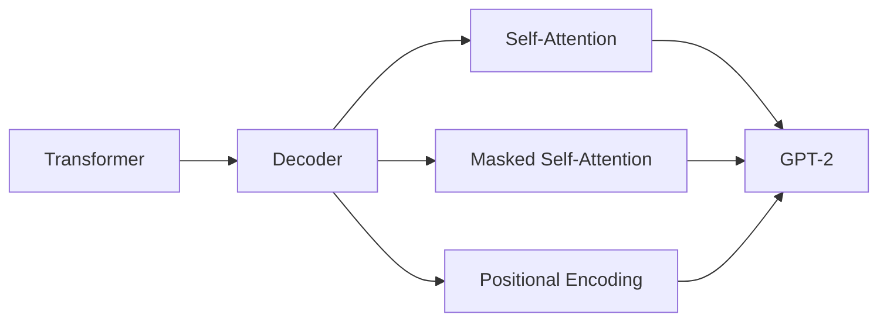

# GPT-2原理与代码实例讲解

## 1. 背景介绍
### 1.1 GPT-2的诞生
2019年2月，OpenAI发布了GPT-2(Generative Pre-trained Transformer 2)语言模型，它是GPT(Generative Pre-Training)的升级版。GPT-2在大规模无监督语料上进行预训练，通过自回归的方式学习语言的统计规律和语义信息，可以完成多种自然语言处理任务，如文本生成、问答、机器翻译等。

### 1.2 GPT-2的影响力
GPT-2的发布引起了学术界和工业界的广泛关注。一方面，它展示了在海量无标注语料上预训练的语言模型的强大能力；另一方面，GPT-2过于强大的文本生成能力也引发了对于AI可能被滥用于制造虚假信息的担忧。OpenAI最初只发布了GPT-2的小型版本，但最终还是决定完全开源，以推动相关研究的进展。

## 2. 核心概念与联系
### 2.1 Transformer架构
GPT-2基于Transformer的Decoder部分构建。Transformer最初是为机器翻译任务设计的Seq2Seq模型，它摒弃了传统的RNN/LSTM等结构，完全依赖Attention机制来学习文本的表示。

### 2.2 Self-Attention
Self-Attention是Transformer的核心，它允许模型的每个位置都能attend到序列的其他位置，直接建模任意距离的词之间的依赖关系。相比RNN按顺序处理输入，Self-Attention可以实现并行计算，大大提升了训练效率。

### 2.3 Masked Self-Attention
在Decoder中使用Masked Self-Attention，屏蔽了当前位置之后的信息，保证了生成过程的自回归属性，即在预测第t个词时只能访问前t-1个词的信息。

### 2.4 位置编码
由于Self-Attention不区分元素的顺序，需要通过位置编码(Positional Encoding)来引入序列的位置信息。GPT-2沿用了Transformer中的正弦曲线位置编码方式。

### 概念联系图


## 3. 核心算法原理和具体步骤
### 3.1 预训练阶段
1. 准备大规模无标注文本语料
2. 对语料进行预处理，如Tokenization、编码等 
3. 构建GPT-2模型，初始化参数
4. 使用Masked Self-Attention和位置编码构建Transformer Decoder块
5. 重复堆叠多个Decoder块形成完整的GPT-2模型
6. 定义语言模型的目标函数，如最大化下一个词的概率
7. 使用Adam优化器训练模型，更新参数

### 3.2 微调阶段
1. 根据下游任务准备带标签的数据集
2. 加载预训练好的GPT-2模型权重
3. 在GPT-2模型顶部添加特定任务的输出层
4. 冻结GPT-2的部分或全部层，只微调输出层或全模型
5. 定义任务的损失函数，如交叉熵损失
6. 使用较小的学习率对模型进行微调，避免过拟合

### 3.3 推理阶段
1. 加载微调后的模型权重
2. 对输入文本进行预处理和编码
3. 将输入传递给GPT-2模型
4. 通过Masked Self-Attention逐个生成下一个词
5. 采样策略选择生成的词，如贪心搜索、Beam Search等
6. 重复步骤4-5直到达到指定长度或遇到终止符
7. 对生成的序列进行后处理，如去除特殊字符、恢复标点等

## 4. 数学模型和公式详解
### 4.1 Self-Attention计算
假设输入序列为 $X=(x_1,\ldots,x_n)$，$x_i \in \mathbb{R}^d$，Self-Attention的计算过程如下：

1. 计算Query、Key、Value矩阵：
$$
\begin{aligned}
Q &= XW^Q \\
K &= XW^K \\
V &= XW^V
\end{aligned}
$$
其中，$W^Q, W^K, W^V \in \mathbb{R}^{d \times d_k}$ 是可学习的参数矩阵。

2. 计算Attention Scores：
$$
\text{Attention}(Q, K, V) = \text{softmax}(\frac{QK^T}{\sqrt{d_k}})V
$$

3. 将多头Attention的结果拼接并线性变换：
$$
\text{MultiHead}(X) = \text{Concat}(\text{head}_1, \ldots, \text{head}_h)W^O
$$
其中，$\text{head}_i = \text{Attention}(XW_i^Q, XW_i^K, XW_i^V)$，$W^O \in \mathbb{R}^{hd_k \times d}$。

### 4.2 位置编码
GPT-2使用正弦曲线位置编码，对于位置 $pos$ 和维度 $i$，编码值为：
$$
\begin{aligned}
PE_{(pos, 2i)} &= \sin(pos/10000^{2i/d}) \\
PE_{(pos, 2i+1)} &= \cos(pos/10000^{2i/d})
\end{aligned}
$$
其中，$d$ 是模型的维度。

### 4.3 语言模型损失函数
GPT-2使用最大似然估计作为语言模型的目标函数，给定上文 $x_{<t}$，最小化下一个词 $x_t$ 的负对数似然：
$$
L(x_t|x_{<t}) = -\log P(x_t|x_{<t})
$$

## 5. 项目实践：代码实例和详解
下面是使用PyTorch实现GPT-2的简化版代码：

```python
import torch
import torch.nn as nn

class SelfAttention(nn.Module):
    def __init__(self, d_model, n_heads):
        super().__init__()
        self.d_model = d_model
        self.n_heads = n_heads
        self.qkv_proj = nn.Linear(d_model, 3*d_model)
        self.out_proj = nn.Linear(d_model, d_model)
        
    def forward(self, x, mask=None):
        batch_size, seq_len, _ = x.size() 
        qkv = self.qkv_proj(x).view(batch_size, seq_len, self.n_heads, 3*self.d_model//self.n_heads)
        q, k, v = qkv.chunk(3, dim=-1)
        attn_scores = torch.matmul(q, k.transpose(-2, -1)) / (self.d_model//self.n_heads)**0.5
        if mask is not None:
            attn_scores = attn_scores.masked_fill(mask==0, -1e9)
        attn_probs = nn.Softmax(dim=-1)(attn_scores)
        attn_output = torch.matmul(attn_probs, v)
        attn_output = attn_output.transpose(1, 2).contiguous().view(batch_size, seq_len, self.d_model)
        return self.out_proj(attn_output)

class TransformerBlock(nn.Module):
    def __init__(self, d_model, n_heads, dropout=0.1):
        super().__init__()
        self.attn = SelfAttention(d_model, n_heads)
        self.ln1 = nn.LayerNorm(d_model)
        self.mlp = nn.Sequential(
            nn.Linear(d_model, 4*d_model),
            nn.GELU(),
            nn.Linear(4*d_model, d_model),
            nn.Dropout(dropout)
        )
        self.ln2 = nn.LayerNorm(d_model)
        
    def forward(self, x, mask=None):
        x = x + self.attn(self.ln1(x), mask)
        x = x + self.mlp(self.ln2(x))
        return x

class GPT2(nn.Module):
    def __init__(self, vocab_size, d_model, n_heads, n_layers, max_len=512):
        super().__init__()
        self.embed = nn.Embedding(vocab_size, d_model)
        self.pos_embed = nn.Parameter(torch.zeros(1, max_len, d_model))
        self.drop = nn.Dropout(0.1)
        self.layers = nn.ModuleList([TransformerBlock(d_model, n_heads) for _ in range(n_layers)])
        self.ln = nn.LayerNorm(d_model)
        self.head = nn.Linear(d_model, vocab_size, bias=False)
        
    def forward(self, x, mask=None):
        x = self.drop(self.embed(x) + self.pos_embed[:, :x.size(1)])
        for layer in self.layers:
            x = layer(x, mask)
        x = self.ln(x)
        return self.head(x)
```

主要组件说明：
- `SelfAttention`: 实现了Self-Attention机制，包括计算QKV矩阵、Attention Scores和Attention Output。
- `TransformerBlock`: 包含Self-Attention、Layer Normalization和前馈网络(MLP)，对应Transformer的一个Decoder块。
- `GPT2`: 完整的GPT-2模型，包括词嵌入、位置编码、多个Transformer块和输出层。

使用示例：
```python
model = GPT2(vocab_size=10000, d_model=768, n_heads=12, n_layers=12)
input_ids = torch.randint(0, 10000, (2, 20))
output = model(input_ids)
```

以上代码实现了GPT-2的主要组件和前向传播过程，可以作为学习和实验的起点。在实际应用中，还需要考虑训练数据的准备、模型的优化和推理等问题。

## 6. 实际应用场景
GPT-2在各种自然语言处理任务中得到了广泛应用，例如：

1. 文本生成：根据给定的上文，生成连贯、富有创意的延续文本。GPT-2可用于创作辅助、内容生成等。

2. 对话系统：通过微调，GPT-2可以作为对话系统的生成模型，根据用户的输入生成自然、流畅的回复。

3. 文本摘要：GPT-2可以学习文本的关键信息，生成简洁、准确的摘要。

4. 问答系统：将GPT-2应用于阅读理解和问答任务，根据给定的问题和上下文生成答案。

5. 机器翻译：GPT-2可以作为机器翻译的生成模型，根据源语言文本生成目标语言译文。

6. 文本分类：通过在GPT-2上添加分类器，可以进行情感分析、主题分类等任务。

7. 文本补全：根据不完整的句子或段落，GPT-2可以生成合理的补全结果，辅助写作。

总之，GPT-2强大的语言理解和生成能力使其在各种NLP任务中大放异彩，为自然语言处理领域带来了新的突破。

## 7. 工具和资源推荐
1. OpenAI GPT-2官方实现：https://github.com/openai/gpt-2
2. Hugging Face Transformers库：https://github.com/huggingface/transformers
3. GPT-2论文《Language Models are Unsupervised Multitask Learners》：https://d4mucfpksywv.cloudfront.net/better-language-models/language_models_are_unsupervised_multitask_learners.pdf
4. Jay Alammar的Transformer可视化讲解：http://jalammar.github.io/illustrated-transformer/
5. 《Attention is All You Need》论文：https://arxiv.org/abs/1706.03762
6. PyTorch官方教程：https://pytorch.org/tutorials/
7. 《Dive into Deep Learning》书籍：https://d2l.ai/

以上资源可以帮助深入理解GPT-2的原理，并提供实现和应用的参考。

## 8. 总结：未来发展趋势与挑战
GPT-2的成功展示了大规模预训练语言模型的巨大潜力，它在许多NLP任务上取得了突破性的进展。未来，预训练语言模型的发展趋势可能包括：

1. 模型规模的进一步扩大：更大的模型容量和更多的训练数据有助于提升模型的性能和泛化能力。

2. 多模态学习：将语言模型与视觉、语音等其他模态结合，实现跨模态的理解和生成。

3. 低资源语言的应用：通过迁移学习、多语言预训练等技术，使预训练语言模型惠及低资源语言。

4. 知识增强：将结构化知识与语言模型相结合，提升模型的常识推理和知识问答能力。

5. 模型压缩和优化：开发更高效的模型架构和训练方法，降低预训练语言模型的计算和存储开销。

同时，预训练语言模型也面临着一些挑战：

1. 偏见和公平性：模型