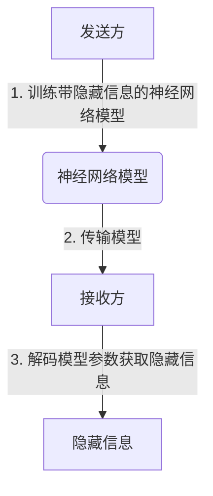

# GhostNet原理与代码实例讲解

## 1.背景介绍

在当今的网络安全领域,隐藏通道(Covert Channel)技术一直是研究的热点话题。隐藏通道指的是在正常的网络通信中隐藏数据,以实现隐蔽的信息传输。传统的隐藏通道技术往往存在被检测和阻断的风险。为了解决这个问题,研究人员提出了一种新型的隐藏通道技术——GhostNet。

GhostNet利用了深度神经网络的特性,将隐藏信息编码到神经网络的参数中,通过对神经网络模型的传输来实现隐蔽的信息传递。由于神经网络模型在传输过程中看起来就像是正常的数据流量,因此很难被检测和阻断。这种新型隐藏通道技术具有很高的隐蔽性和可靠性,引起了广泛关注。

## 2.核心概念与联系

### 2.1 神经网络基础

神经网络是一种模拟生物神经系统的计算模型,由大量互连的神经元组成。每个神经元接收来自其他神经元的输入,经过激活函数处理后产生输出,并传递给下一层神经元。神经网络通过训练调整神经元之间的连接权重,从而学习特定的映射关系。

### 2.2 隐藏通道概念

隐藏通道是指在正常的通信过程中隐藏数据,实现隐蔽的信息传输。传统的隐藏通道技术通常利用网络协议或文件格式中的冗余字段来隐藏数据。但这种方式容易被检测和阻断。

### 2.3 GhostNet工作原理

GhostNet的核心思想是将隐藏信息编码到神经网络模型的参数中,通过传输神经网络模型来实现隐蔽的信息传递。具体来说,发送方首先训练一个带有隐藏信息的神经网络模型,然后将该模型发送给接收方。接收方接收到模型后,可以从模型参数中解码出隐藏的信息。

由于神经网络模型在传输过程中看起来就像是正常的数据流量,因此很难被检测和阻断。同时,神经网络模型本身具有一定的冗余性,可以容纳大量的隐藏信息,从而提高了隐藏通道的带宽。



## 3.核心算法原理具体操作步骤

GhostNet的核心算法包括两个主要部分:隐藏信息编码和解码。

### 3.1 隐藏信息编码

编码过程的主要步骤如下:

1. **信息预处理**: 将要隐藏的信息转换为二进制比特流。

2. **神经网络初始化**: 初始化一个待训练的神经网络模型,例如全连接网络或卷积神经网络。

3. **信息注入**: 将比特流注入到神经网络的权重参数中,可以采用代数编码或赋值编码等方法。

4. **模型训练**: 在注入隐藏信息后,对神经网络模型进行训练,使其在完成主任务(如图像分类)的同时,保留了隐藏信息。

5. **模型输出**: 训练完成后,得到一个带有隐藏信息的神经网络模型。

### 3.2 隐藏信息解码

解码过程的主要步骤如下:

1. **模型接收**: 接收方获取带有隐藏信息的神经网络模型。

2. **参数提取**: 从神经网络模型中提取出权重参数。

3. **信息解码**: 根据预定义的编码方案,从权重参数中解码出隐藏的比特流信息。

4. **信息恢复**: 将解码出的比特流转换为原始的隐藏信息。

需要注意的是,编码和解码过程需要发送方和接收方事先约定好编码方案,以确保隐藏信息能够被正确解码。

## 4.数学模型和公式详细讲解举例说明

### 4.1 代数编码

代数编码是GhostNet中常用的一种隐藏信息编码方法。它的基本思想是将隐藏信息的比特流映射到神经网络权重参数的代数空间中。

假设要隐藏的信息为二进制比特流 $b_1, b_2, \ldots, b_n$,其中 $b_i \in \{0, 1\}$。我们将这些比特映射到神经网络权重参数 $w_1, w_2, \ldots, w_m$ 上,其中 $m \geq n$。

映射函数可以定义为:

$$
w_i = \begin{cases}
w_i^0, & \text{if } b_i = 0\\
w_i^0 + \Delta_i, & \text{if } b_i = 1
\end{cases}
$$

其中 $w_i^0$ 是神经网络的初始权重参数, $\Delta_i$ 是一个预定义的常数。

在解码过程中,接收方只需检查每个权重参数 $w_i$ 是否等于 $w_i^0$,如果不等于,则对应的比特为 1,否则为 0。

例如,假设初始权重为 $w_1^0 = 0.2, w_2^0 = -0.1$,隐藏信息为比特流 $[1, 0]$,取 $\Delta_1 = 0.05, \Delta_2 = 0.03$,则编码后的权重为:

$$
\begin{aligned}
w_1 &= w_1^0 + \Delta_1 = 0.2 + 0.05 = 0.25\\
w_2 &= w_2^0 = -0.1
\end{aligned}
$$

### 4.2 赋值编码

赋值编码是另一种常用的隐藏信息编码方法。它的基本思想是直接将隐藏信息的比特流赋值到神经网络权重参数的特定位置上。

假设要隐藏的信息为二进制比特流 $b_1, b_2, \ldots, b_n$,神经网络权重参数为 $w_1, w_2, \ldots, w_m$,其中 $m \gg n$。我们可以选择 $n$ 个不同的位置 $i_1, i_2, \ldots, i_n$,将每个比特 $b_j$ 赋值到对应位置的权重参数 $w_{i_j}$ 上。

具体来说,编码函数可以定义为:

$$
w_{i_j} = \begin{cases}
w_{i_j}^0, & \text{if } b_j = 0\\
w_{i_j}^0 + \epsilon_j, & \text{if } b_j = 1
\end{cases}
$$

其中 $w_{i_j}^0$ 是神经网络的初始权重参数, $\epsilon_j$ 是一个预定义的常数。

在解码过程中,接收方只需检查每个特定位置的权重参数 $w_{i_j}$ 是否等于 $w_{i_j}^0$,如果不等于,则对应的比特为 1,否则为 0。

例如,假设初始权重为 $w_1^0 = 0.2, w_2^0 = -0.1, w_3^0 = 0.4$,隐藏信息为比特流 $[1, 0, 1]$,取 $\epsilon_1 = 0.05, \epsilon_2 = 0.03, \epsilon_3 = 0.02$,则编码后的权重为:

$$
\begin{aligned}
w_1 &= w_1^0 + \epsilon_1 = 0.2 + 0.05 = 0.25\\
w_2 &= w_2^0 = -0.1\\
w_3 &= w_3^0 + \epsilon_3 = 0.4 + 0.02 = 0.42
\end{aligned}
$$

需要注意的是,赋值编码方法要求神经网络权重参数的数量足够大,以容纳所有隐藏信息的比特流。同时,也需要事先约定好特定位置的选择方式,以确保发送方和接收方使用相同的编码方案。

## 5.项目实践:代码实例和详细解释说明

为了更好地理解GhostNet的原理和实现,我们提供了一个基于PyTorch的代码示例。该示例实现了一个简单的全连接神经网络,并使用代数编码方法隐藏了一段文本信息。

### 5.1 依赖库

```python
import torch
import torch.nn as nn
import numpy as np
```

### 5.2 定义神经网络模型

```python
class SimpleNet(nn.Module):
    def __init__(self, input_size, hidden_size, output_size):
        super(SimpleNet, self).__init__()
        self.fc1 = nn.Linear(input_size, hidden_size)
        self.relu = nn.ReLU()
        self.fc2 = nn.Linear(hidden_size, output_size)

    def forward(self, x):
        out = self.fc1(x)
        out = self.relu(out)
        out = self.fc2(out)
        return out
```

### 5.3 隐藏信息编码

```python
def encode(model, message, delta):
    # 将消息转换为二进制比特流
    bit_stream = ''.join(format(ord(c), '08b') for c in message)
    
    # 遍历模型权重参数
    for param in model.parameters():
        # 将比特流编码到权重参数中
        for bit, weight in zip(bit_stream, param.data.flatten()):
            if bit == '1':
                weight += delta
    
    return model

# 示例用法
model = SimpleNet(10, 20, 2)
encoded_model = encode(model, "Hello, World!", 0.01)
```

在上述代码中,我们定义了一个 `encode` 函数,用于将给定的文本消息隐藏到神经网络模型的权重参数中。具体步骤如下:

1. 将消息转换为二进制比特流。
2. 遍历神经网络模型的所有权重参数。
3. 对于每个权重参数,将比特流中的每一位与该权重参数的值进行关联。如果比特为 1,则将权重参数加上一个预定义的常数 `delta`。

通过这种方式,我们将隐藏信息编码到了神经网络模型的权重参数中。

### 5.4 隐藏信息解码

```python
def decode(model, delta):
    message = ''
    bit_stream = ''
    
    # 遍历模型权重参数
    for param in model.parameters():
        # 从权重参数中解码比特流
        for weight in param.data.flatten():
            if weight % 1 >= delta:
                bit_stream += '1'
            else:
                bit_stream += '0'
    
    # 将比特流转换为字符串
    for i in range(0, len(bit_stream), 8):
        message += chr(int(bit_stream[i:i+8], 2))
    
    return message

# 示例用法
decoded_message = decode(encoded_model, 0.01)
print(decoded_message)  # 输出: Hello, World!
```

在上述代码中,我们定义了一个 `decode` 函数,用于从编码后的神经网络模型中解码出隐藏的信息。具体步骤如下:

1. 遍历神经网络模型的所有权重参数。
2. 对于每个权重参数,检查其值是否大于等于初始值加上预定义的常数 `delta`。如果是,则将比特流中对应的位置设为 1,否则设为 0。
3. 将解码出的比特流转换为字符串。

通过这种方式,我们从编码后的神经网络模型中成功解码出了隐藏的信息。

需要注意的是,编码和解码过程中使用的 `delta` 值必须保持一致,否则将无法正确解码隐藏信息。

## 6.实际应用场景

GhostNet作为一种新型的隐藏通道技术,具有很高的隐蔽性和可靠性,在多个领域都有潜在的应用前景。

### 6.1 安全通信

在一些需要高度保密的场景下,如军事通信、外交信使等,GhostNet可以用于隐蔽的信息传递,避免被敌方监控和窃听。

### 6.2 数字水印

GhostNet可以将数字水印信息隐藏在神经网络模型中,用于版权保护和内容认证。当模型被未经授权的第三方使用时,可以从模型参数中解码出水印信息,追究相关责任。

### 6.3 隐写术

在一些特殊场合下,人们可能需要隐蔽地传递信息,避免被监控或审查。