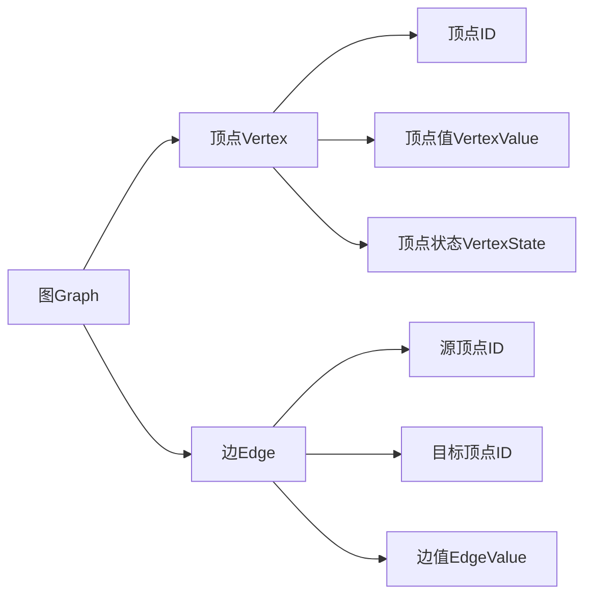
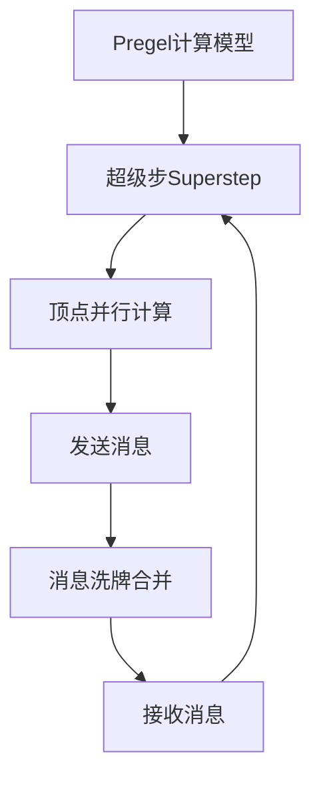
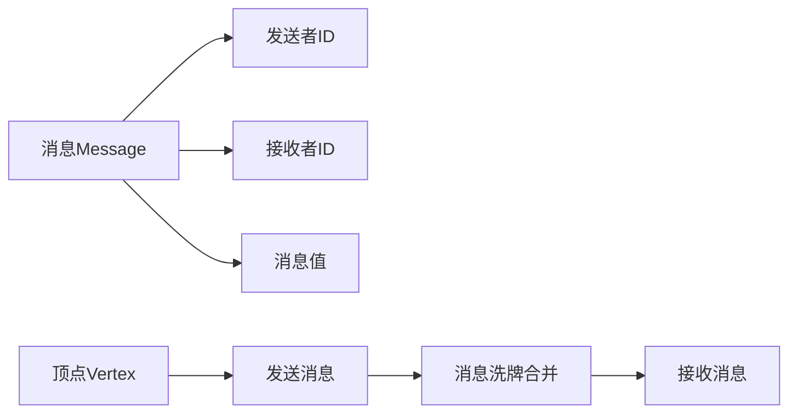
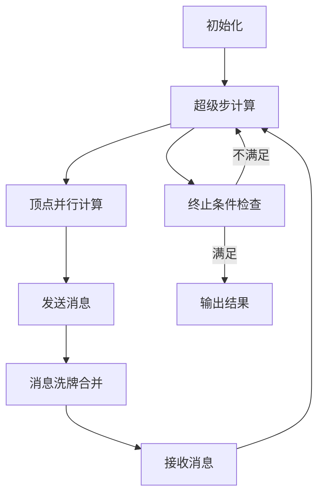
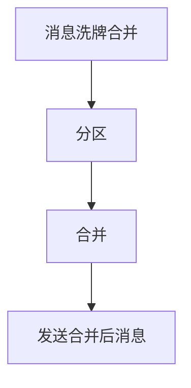

# Giraph原理与代码实例讲解

## 1.背景介绍

### 1.1 大数据时代的到来

随着互联网、物联网、人工智能等技术的快速发展,数据呈现出爆炸式增长。传统的数据处理方式已经无法满足大数据时代的需求,因此分布式计算框架应运而生。Apache Giraph作为一款开源的大规模图形并行处理系统,可以高效地处理大规模图形数据,在社交网络分析、网页排名、推荐系统等领域有着广泛的应用。

### 1.2 图计算的重要性

图是一种非常重要的数据结构,可以用来描述各种复杂的关系网络。许多实际问题都可以抽象为图计算问题,比如社交网络中的好友关系、网页之间的超链接关系、推荐系统中的物品相似度关系等。图计算在数据挖掘、机器学习、网络分析等领域扮演着重要角色。

### 1.3 Giraph简介

Giraph是Apache基金会的一个开源项目,它实现了Pregel计算模型,可以高效地进行大规模图形并行处理。Giraph采用了"思考像一个顶点(Think like a vertex)"的设计理念,将计算逻辑分散到每个顶点上,通过顶点之间的消息传递来实现图算法。Giraph具有良好的容错性和可伸缩性,可以在大规模集群上运行,处理大规模图形数据。

## 2.核心概念与联系

### 2.1 图的表示

在Giraph中,图由一组顶点(Vertex)和边(Edge)组成。每个顶点都有一个唯一的ID,可以存储顶点值(Vertex Value)和顶点状态(Vertex State)。每条边连接两个顶点,可以存储边值(Edge Value)。图可以是有向图或无向图。



### 2.2 Pregel计算模型

Giraph实现了Pregel计算模型,这是一种基于"超级步"(Superstep)的批处理模型。在每个超级步中,所有顶点并行执行用户定义的计算逻辑,并通过发送消息来交换数据。每个超级步结束后,系统会对所有消息进行洗牌和合并,然后将合并后的消息发送给相应的顶点,进入下一个超级步。



### 2.3 消息传递机制

消息传递是Giraph实现图算法的关键机制。在每个超级步中,顶点可以向其他顶点发送消息。消息包含发送者ID、接收者ID和消息值。Giraph会对所有消息进行洗牌和合并,然后将合并后的消息发送给相应的顶点,供下一个超级步使用。



## 3.核心算法原理具体操作步骤

### 3.1 Giraph工作流程

Giraph的工作流程可以概括为以下几个步骤:

1. **初始化阶段**:加载输入数据,构建初始图结构。
2. **超级步计算阶段**:进入迭代计算,每个超级步包括以下步骤:
   a. 顶点并行执行计算逻辑,发送消息
   b. 系统对所有消息进行洗牌和合并
   c. 将合并后的消息发送给相应的顶点
3. **终止条件检查**:检查是否满足算法终止条件,如果满足则终止计算。
4. **输出结果**:将计算结果输出到指定位置。



### 3.2 顶点计算逻辑

每个顶点都需要实现`compute()`方法,该方法定义了顶点在每个超级步中的计算逻辑。顶点可以读取自身的值、状态和收到的消息,执行相应的计算,更新自身的值和状态,并向其他顶点发送消息。

```java
public void compute(Iterator<VertexValue> msgIterator) {
    // 读取顶点值和状态
    VertexValue vertexValue = getVertexValue();
    VertexState vertexState = getVertexState();

    // 处理收到的消息
    while (msgIterator.hasNext()) {
        VertexValue msg = msgIterator.next();
        // 执行相应的计算逻辑
        ...
    }

    // 更新顶点值和状态
    setVertexValue(newVertexValue);
    setVertexState(newVertexState);

    // 向其他顶点发送消息
    sendMsgToVertex(targetVertexId, msg);

    // 设置顶点状态为已计算或需要再次计算
    setVertexState(VertexState.COMPUTED);
    // 或
    setVertexState(VertexState.CONTINUE);
}
```

### 3.3 消息传递实现

Giraph使用`sendMsg()`方法实现消息传递。发送的消息会被缓存在内存中,等待当前超级步结束后进行洗牌和合并操作。在下一个超级步开始时,合并后的消息会被发送给相应的顶点。

```java
public void sendMsg(String targetVertexId, VertexValue msg) {
    // 将消息缓存在内存中
    msgBuffer.addPartitionEntry(targetVertexId, msg);
}
```

### 3.4 消息洗牌和合并

消息洗牌和合并是Giraph的一个关键步骤。它将所有顶点发送的消息进行重新分区,并对相同目标顶点的消息进行合并。这个过程可以减少网络传输开销,提高计算效率。



## 4.数学模型和公式详细讲解举例说明

### 4.1 PageRank算法

PageRank是一种著名的网页排名算法,它基于网页之间的链接关系,计算每个网页的重要性得分。PageRank算法可以用Giraph进行高效的并行计算。

PageRank算法的核心公式如下:

$$PR(u) = \frac{1-d}{N} + d\sum_{v\in M(u)}\frac{PR(v)}{L(v)}$$

其中:

- $PR(u)$表示网页$u$的PageRank值
- $N$表示网络中网页的总数
- $M(u)$表示链接到网页$u$的所有网页集合
- $L(v)$表示网页$v$的出链接数
- $d$是一个阻尼系数,通常取值0.85

在Giraph中实现PageRank算法的步骤如下:

1. 初始化阶段:将网页数据加载到Giraph,构建初始图结构,每个顶点表示一个网页,边表示链接关系。
2. 超级步计算阶段:
   a. 每个顶点并行执行计算逻辑,根据公式计算自身的PageRank值。
   b. 将计算出的PageRank值发送给所有出链接的顶点。
   c. 接收其他顶点发送的PageRank值,进行求和。
   d. 重复上述步骤,直到PageRank值收敛。
3. 输出结果:将最终的PageRank值输出到指定位置。

### 4.2 单源最短路径算法

单源最短路径算法是一种常见的图算法,用于计算从一个源顶点到其他所有顶点的最短路径。在Giraph中,可以使用Dijkstra算法或Bellman-Ford算法实现单源最短路径计算。

以Dijkstra算法为例,其核心公式如下:

$$d(v) = \min\{d(v), d(u) + w(u, v)\}$$

其中:

- $d(v)$表示源顶点到顶点$v$的最短路径长度
- $d(u)$表示源顶点到顶点$u$的最短路径长度
- $w(u, v)$表示边$(u, v)$的权重

在Giraph中实现Dijkstra算法的步骤如下:

1. 初始化阶段:将图数据加载到Giraph,构建初始图结构,设置源顶点的最短路径长度为0,其他顶点为无穷大。
2. 超级步计算阶段:
   a. 每个顶点并行执行计算逻辑,根据公式更新自身的最短路径长度。
   b. 将更新后的最短路径长度发送给所有邻居顶点。
   c. 接收其他顶点发送的最短路径长度,进行比较和更新。
   d. 重复上述步骤,直到所有顶点的最短路径长度不再变化。
3. 输出结果:将最终的最短路径长度输出到指定位置。

## 5.项目实践:代码实例和详细解释说明

### 5.1 PageRank示例代码

以下是使用Giraph实现PageRank算法的示例代码:

```java
public class PageRankVertex extends Vertex<DoubleWritable, DoubleWritable, DoubleWritable, DoubleWritable> {
    private static final DoubleWritable DAMPING_FACTOR = new DoubleWritable(0.85);
    private static final DoubleWritable ONE_MINUS_DAMPING_FACTOR = new DoubleWritable(1 - DAMPING_FACTOR.get());

    @Override
    public void compute(Iterator<DoubleWritable> msgIterator) {
        double sum = 0;
        while (msgIterator.hasNext()) {
            sum += msgIterator.next().get();
        }

        double newPageRank = ONE_MINUS_DAMPING_FACTOR.get() / getTotalNumVertices() + DAMPING_FACTOR.get() * sum;
        DoubleWritable newPageRankValue = new DoubleWritable(newPageRank);

        if (getSuperstep() == 0) {
            setValue(new DoubleWritable(1.0 / getTotalNumVertices()));
        } else {
            double prevPageRank = getValue().get();
            if (Math.abs(prevPageRank - newPageRank) < 0.0001) {
                setVertexState(VertexState.INACTIVE);
            } else {
                setValue(newPageRankValue);
                sendMsgToAllEdges(newPageRankValue);
            }
        }
    }
}
```

代码解释:

1. 定义一个`PageRankVertex`类,继承自`Vertex`类,用于实现PageRank算法的顶点计算逻辑。
2. 在`compute()`方法中,首先计算收到的所有消息的和`sum`。
3. 根据PageRank公式,计算新的PageRank值`newPageRank`。
4. 如果是第一个超级步,则将所有顶点的初始PageRank值设为`1/N`。
5. 否则,比较新旧PageRank值的差异,如果小于阈值,则将顶点状态设为`INACTIVE`,表示不需要再次计算;否则,更新顶点值并向所有出边发送新的PageRank值。

### 5.2 单源最短路径示例代码

以下是使用Giraph实现单源最短路径算法(Dijkstra算法)的示例代码:

```java
public class ShortestPathVertex extends Vertex<DoubleWritable, DoubleWritable, DoubleWritable, DoubleWritable> {
    private static final DoubleWritable MAX_VALUE = new DoubleWritable(Double.MAX_VALUE);

    @Override
    public void compute(Iterator<DoubleWritable> msgIterator) {
        double minDist = isSource() ? 0 : Double.MAX_VALUE;

        while (msgIterator.hasNext()) {
            double dist = msgIterator.next().get();
            minDist = Math.min(minDist, dist);
        }

        if (minDist < getValue().get()) {
            setValue(new DoubleWritable(minDist));
            sendMsgToAllEdges(getValue());
        } else {
            setVertexState(VertexState.INACTIVE);
        }
    }

    private boolean isSource() {
        // 判断当前顶点是否为源顶点
        return getId().equals(source