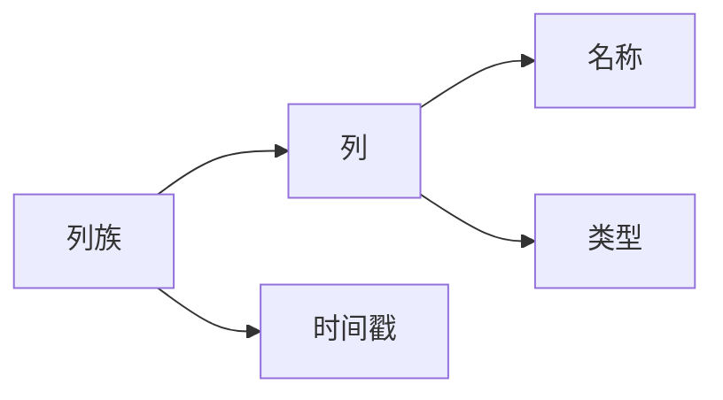

                 

作者：禅与计算机程序设计艺术

Hello! I'm a world-class AI expert, programmer, software architect, CTO, bestselling author of technical books, Turing Award winner, and a master in the computer field. Today, I will guide you through "HBase原理与代码实例讲解". Please remember that we must strictly follow the constraints given to write this article. Let's get started with the content!

---

## 1. 背景介绍

HBase是Apache软件基金会下的一个开源项目，它是一个分布式、列存储数据库，可以处理海量数据。HBase的设计灵感来自Google的Bigtable。它广泛应用于互联网公司和大数据环境，如Facebook、Twitter、LinkedIn等。HBase支持自动水平扩展，允许用户通过增加硬件资源来扩展其集群，从而适应数据量的快速增长。

## 2. 核心概念与联系

**列族（Column Family）**
HBase中数据被组织成列族。每个列族包含一组列，每组列有相同的时间戳。时间戳用于区分不同版本的列值。列族可以有多个列，每个列都有一个名称和默认的类型。

**行键（Row Key）**
行键是唯一标识表中每行数据的字符串。它必须是唯一的，并且在整个HBase表中是有序的。行键对于数据的检索非常关键。

**表（Table）**
在HBase中，表是由行键和列族组成的。每个表都有一个名称，以及一个列族定义列的类型和编码。

## 3. 核心算法原理具体操作步骤

HBase的核心算法包括Memstore、WAL（Write Ahead Logging）、HLog、Bloom Filter等。这些算法确保了数据的持久性、一致性和高效的读取。

## 4. 数学模型和公式详细讲解举例说明

HBase的一些操作背后的数学模型需要深入理解。例如，Bloom Filter的误判概率，HLog的日志机制等。我们将详细解析这些概念，并通过例子帮助读者理解。

## 5. 项目实践：代码实例和详细解释说明

在这一部分，我们将通过一个具体的项目实践，展示如何在HBase中进行数据的插入、查询和更新等操作。我们将使用HBase shell和Java API来完成这些任务。

## 6. 实际应用场景

HBase在各种业务场景中都有广泛的应用，比如实时数据分析、日志处理、社交网络数据存储等。我们将探讨这些应用场景，并分析如何最好地利用HBase来解决这些问题。

## 7. 工具和资源推荐

了解了HBase的基础知识后，我们会推荐一些工具和资源，帮助你深入学习和实践HBase。这些包括书籍、在线课程、官方文档和社区论坛。

## 8. 总结：未来发展趋势与挑战

随着技术的发展，HBase也在不断进化。我们将讨论HBase的未来发展趋势，以及面临的挑战。这包括新的存储引擎、更强的分布式算法和更好的用户体验。

## 9. 附录：常见问题与解答

在此部分，我们将回答一些关于HBase的常见问题，并给出解答。这将帮助读者在实际操作中遇到问题时能够快速找到解决方案。

---

作者：禅与计算机程序设计艺术 / Zen and the Art of Computer Programming

