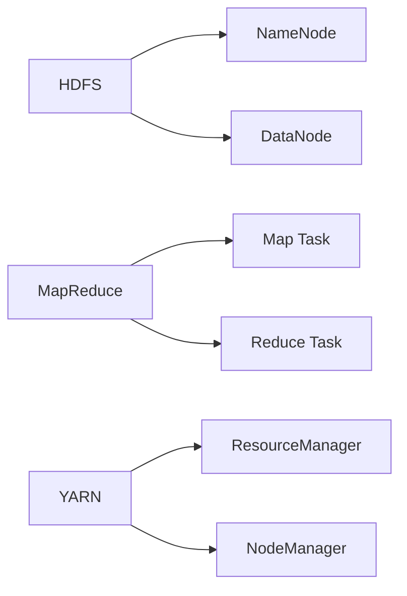

# Hadoop 原理与代码实例讲解

## 1. 背景介绍
### 1.1 大数据处理的挑战
### 1.2 Hadoop的诞生
### 1.3 Hadoop生态系统概览

## 2. 核心概念与联系  
### 2.1 HDFS分布式文件系统
#### 2.1.1 HDFS架构
#### 2.1.2 NameNode与DataNode
#### 2.1.3 数据块与副本
### 2.2 MapReduce分布式计算框架  
#### 2.2.1 MapReduce编程模型
#### 2.2.2 Map与Reduce任务
#### 2.2.3 任务调度与容错
### 2.3 YARN资源管理系统
#### 2.3.1 ResourceManager与NodeManager
#### 2.3.2 ApplicationMaster
#### 2.3.3 容器化资源分配



## 3. 核心算法原理具体操作步骤
### 3.1 MapReduce编程模型详解
#### 3.1.1 Map阶段
##### 3.1.1.1 输入分片
##### 3.1.1.2 Map函数处理
##### 3.1.1.3 Partition分区
#### 3.1.2 Shuffle阶段  
##### 3.1.2.1 排序
##### 3.1.2.2 合并
#### 3.1.3 Reduce阶段
##### 3.1.3.1 分组
##### 3.1.3.2 Reduce函数处理
##### 3.1.3.3 输出结果
### 3.2 HDFS读写数据流程
#### 3.2.1 HDFS写数据流程
##### 3.2.1.1 切分数据块
##### 3.2.1.2 副本存储
#### 3.2.2 HDFS读数据流程
##### 3.2.2.1 查找数据块位置
##### 3.2.2.2 并行读取数据

## 4. 数学模型和公式详细讲解举例说明
### 4.1 MapReduce中的线性代数运算
#### 4.1.1 矩阵乘法
$$
\begin{bmatrix}
a_{11} & a_{12} & a_{13}\\
a_{21} & a_{22} & a_{23}
\end{bmatrix}
\times
\begin{bmatrix}
b_{11} & b_{12}\\  
b_{21} & b_{22}\\
b_{31} & b_{32}
\end{bmatrix}
=
\begin{bmatrix}
c_{11} & c_{12}\\
c_{21} & c_{22}  
\end{bmatrix}
$$
#### 4.1.2 向量点积
$\vec{a} \cdot \vec{b} = \sum_{i=1}^{n} a_i b_i$

### 4.2 PageRank算法
#### 4.2.1 转移概率矩阵
#### 4.2.2 幂法迭代
$\vec{r}^{(k+1)} = M \vec{r}^{(k)}$

## 5. 项目实践：代码实例和详细解释说明
### 5.1 WordCount单词计数
#### 5.1.1 Map函数
```java
public void map(Object key, Text value, Context context) 
  throws IOException, InterruptedException {
    StringTokenizer itr = new StringTokenizer(value.toString());
    while (itr.hasMoreTokens()) {
        word.set(itr.nextToken());
        context.write(word, one);
    }
}
```
#### 5.1.2 Reduce函数  
```java
public void reduce(Text key, Iterable<IntWritable> values, Context context) 
  throws IOException, InterruptedException {
    int sum = 0;
    for (IntWritable val : values) {
        sum += val.get();
    }
    result.set(sum);
    context.write(key, result);
}
```

### 5.2 二次排序
#### 5.2.1 自定义复合键
#### 5.2.2 分区与分组

## 6. 实际应用场景
### 6.1 日志分析
#### 6.1.1 PV/UV统计
#### 6.1.2 TopN统计
### 6.2 推荐系统
#### 6.2.1 协同过滤
#### 6.2.2 基于内容推荐
### 6.3 搜索引擎  
#### 6.3.1 倒排索引
#### 6.3.2 网页排序

## 7. 工具和资源推荐
### 7.1 Hadoop发行版
#### 7.1.1 Apache Hadoop
#### 7.1.2 Cloudera CDH
#### 7.1.3 Hortonworks HDP
### 7.2 开发工具
#### 7.2.1 Eclipse
#### 7.2.2 IntelliJ IDEA
### 7.3 学习资源
#### 7.3.1 官方文档
#### 7.3.2 书籍推荐
#### 7.3.3 在线教程

## 8. 总结：未来发展趋势与挑战 
### 8.1 Hadoop 3.x的新特性
### 8.2 云计算与Hadoop
### 8.3 实时大数据处理
### 8.4 机器学习与Hadoop

## 9. 附录：常见问题与解答
### 9.1 Hadoop集群搭建问题
### 9.2 MapReduce程序调优
### 9.3 HDFS小文件问题
### 9.4 数据倾斜问题

作者：禅与计算机程序设计艺术 / Zen and the Art of Computer Programming