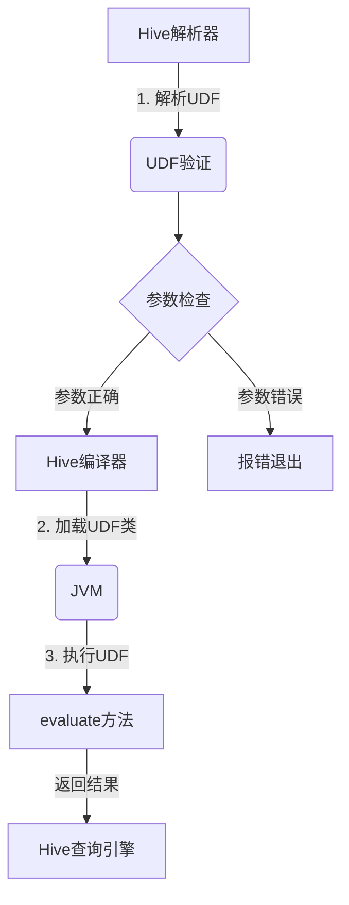
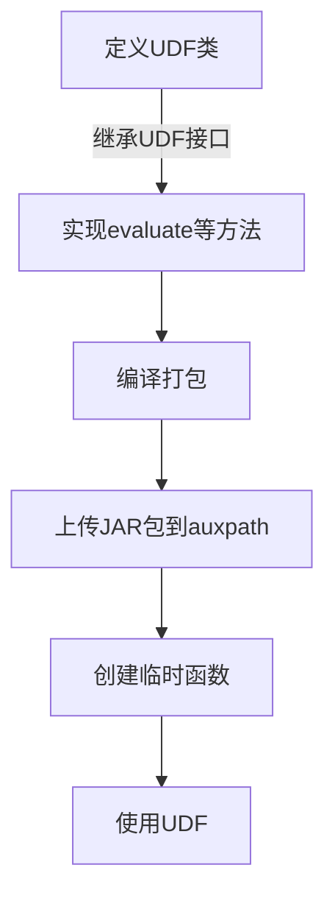

# Hive UDF自定义函数原理与代码实例讲解

## 1.背景介绍

在大数据时代,Hive作为构建在Hadoop之上的数据仓库工具,已经成为了企业进行海量数据分析和处理的利器。然而,Hive内置的函数有时无法满足特定的业务需求,这就需要我们自定义函数(User Defined Function,UDF)来扩展Hive的功能。自定义函数不仅可以实现更加复杂的数据处理逻辑,还能够提高查询效率,因此掌握UDF开发技能对于Hive开发人员来说是非常重要的。

### 1.1 Hive简介

Apache Hive是基于Hadoop的一个数据仓库工具,可以将结构化的数据文件映射为一张数据库表,并将SQL语句转化为MapReduce任务在Hadoop上运行。其设计目标是提供一种类SQL的查询方式,使用户可以像查询关系数据库一样查询存储在Hadoop分布式文件系统(HDFS)中的数据。

### 1.2 Hive UDF概述

Hive UDF是Hive的一个重要扩展功能,允许用户使用Java编写自定义函数,并在Hive查询语句中调用这些函数。UDF可以分为以下几种类型:

- **UDF(User Defined Function)**: 一对一的普通函数
- **UDAF(User Defined Aggregation Function)**: 聚合函数,多对一
- **UDTF(User Defined Table-Generating Functions)**: 一对多的表生成函数

本文将重点介绍UDF的原理和开发方法。

## 2.核心概念与联系  

### 2.1 UDF执行原理

当Hive执行一个包含UDF的查询时,会将UDF的执行过程分为三个阶段:

1. **解析阶段(Parse)**: Hive解析器会检查UDF是否存在,并验证参数的个数和类型是否正确。
2. **编译阶段(Compile)**: Hive编译器会将UDF的Java类加载到JVM中。
3. **执行阶段(Execute)**: Hive会根据输入数据调用UDF的`evaluate`方法,并将结果返回给查询引擎。



### 2.2 UDF接口

要实现一个UDF,需要继承`org.apache.hadoop.hive.ql.exec.UDF`接口,并实现以下三个方法:

- `getDisplayString`: 返回UDF的描述字符串
- `initialize`: 初始化UDF,可用于加载配置或资源
- `evaluate`: 实现UDF的核心逻辑,对输入参数进行处理并返回结果

```java
public class MyUDF extends UDF {
    public String getDisplayString(String[] args) {
        // 返回UDF描述
    }

    public void initialize(ObjectInspector[] arguments) {
        // 初始化UDF
    }

    public ObjectInspector initialize(ObjectInspector[] arguments) {
        // 初始化UDF并返回输出对象检查器
    }

    public Object evaluate(DeferredObject[] arguments) throws HiveException {
        // 实现UDF核心逻辑
    }
}
```

### 2.3 UDF示例

下面是一个简单的UDF示例,实现了将字符串转换为大写的功能:

```java
public class UpperCase extends UDF {
    public String evaluate(String input) {
        if (input == null) {
            return null;
        }
        return input.toUpperCase();
    }
}
```

在Hive中,可以使用以下语句调用该UDF:

```sql
SELECT UpperCase('hello world') FROM table;
```

## 3.核心算法原理具体操作步骤

### 3.1 UDF开发步骤

开发一个UDF通常包括以下几个步骤:

1. **定义UDF类**: 继承`UDF`接口,实现必要的方法。
2. **编译打包**: 将UDF类编译成JAR包。
3. **上传JAR包**: 将JAR包上传到Hive的`auxpath`目录。
4. **创建临时函数**: 使用`CREATE TEMPORARY FUNCTION`语句在Hive会话中创建临时函数。
5. **使用UDF**: 在Hive查询语句中调用自定义函数。



### 3.2 UDF开发示例

下面以一个计算字符串长度的UDF为例,详细讲解开发步骤。

#### 3.2.1 定义UDF类

```java
import org.apache.hadoop.hive.ql.exec.UDF;
import org.apache.hadoop.io.IntWritable;
import org.apache.hadoop.io.Text;

public class StringLength extends UDF {
    public IntWritable evaluate(Text str) {
        if (str == null) {
            return null;
        }
        return new IntWritable(str.getLength());
    }
}
```

#### 3.2.2 编译打包

使用Java编译器编译UDF类,并打包成JAR文件:

```bash
javac -cp /path/to/hive/lib/* StringLength.java
jar -cvf string-length.jar StringLength.class
```

#### 3.2.3 上传JAR包

将JAR包上传到Hive的`auxpath`目录,该目录下的JAR包会被自动加载:

```bash
hadoop fs -put string-length.jar /path/to/hive/auxpath
```

#### 3.2.4 创建临时函数

在Hive CLI中,使用`CREATE TEMPORARY FUNCTION`语句创建临时函数:

```sql
CREATE TEMPORARY FUNCTION string_length AS 'StringLength';
```

#### 3.2.5 使用UDF

现在就可以在Hive查询语句中调用自定义函数了:

```sql
SELECT string_length('Hello World') FROM table;
```

## 4.数学模型和公式详细讲解举例说明

在开发UDF时,有时需要使用一些数学模型和公式来实现特定的功能。下面将介绍两个常见的场景,并给出相应的数学模型和公式。

### 4.1 字符串相似度计算

在数据清洗和实体识别等场景中,经常需要计算两个字符串之间的相似度。常用的字符串相似度算法有编辑距离(Edit Distance)、Jaccard相似系数、余弦相似度等。

#### 4.1.1 编辑距离

编辑距离是指将一个字符串转换为另一个字符串所需的最小编辑操作次数,包括插入、删除和替换。编辑距离越小,两个字符串越相似。

对于字符串$s_1$和$s_2$,它们的编辑距离$ed(s_1, s_2)$可以通过以下公式递归计算:

$$
ed(s_1, s_2) = \begin{cases}
0 & \text{if } s_1 = s_2 = \empty \\
|s_1| & \text{if } s_2 = \empty \\
|s_2| & \text{if } s_1 = \empty \\
ed(s_1[0...|s_1|-2], s_2[0...|s_2|-2]) + 1 & \text{if } s_1[|s_1|-1] \neq s_2[|s_2|-1] \\
ed(s_1[0...|s_1|-2], s_2[0...|s_2|-1]) + 1 & \\
ed(s_1[0...|s_1|-1], s_2[0...|s_2|-2]) + 1 & \\
\min \begin{cases}
ed(s_1[0...|s_1|-2], s_2[0...|s_2|-2]) + 1 \\
ed(s_1[0...|s_1|-2], s_2[0...|s_2|-1]) + 1 \\
ed(s_1[0...|s_1|-1], s_2[0...|s_2|-2]) + 1
\end{cases} & \text{otherwise}
\end{cases}
$$

其中$|s|$表示字符串$s$的长度。

基于编辑距离,可以定义字符串相似度为:

$$
sim(s_1, s_2) = 1 - \frac{ed(s_1, s_2)}{\max(|s_1|, |s_2|)}
$$

相似度的取值范围为$[0, 1]$,值越大表示两个字符串越相似。

#### 4.1.2 Jaccard相似系数

Jaccard相似系数是基于集合运算的一种相似度度量方法。对于字符串$s_1$和$s_2$,将它们视为字符集合$S_1$和$S_2$,则Jaccard相似系数定义为:

$$
J(S_1, S_2) = \frac{|S_1 \cap S_2|}{|S_1 \cup S_2|}
$$

其中$|S|$表示集合$S$的基数(元素个数)。Jaccard相似系数的取值范围为$[0, 1]$,值越大表示两个字符串越相似。

#### 4.1.3 余弦相似度

余弦相似度是一种常用的向量空间模型相似度计算方法。对于字符串$s_1$和$s_2$,可以将它们表示为向量$\vec{v_1}$和$\vec{v_2}$,则它们的余弦相似度定义为:

$$
\cos(\vec{v_1}, \vec{v_2}) = \frac{\vec{v_1} \cdot \vec{v_2}}{||\vec{v_1}|| \times ||\vec{v_2}||}
$$

其中$\vec{v_1} \cdot \vec{v_2}$表示向量点乘,$||\vec{v}||$表示向量$\vec{v}$的$L_2$范数。余弦相似度的取值范围为$[0, 1]$,值越大表示两个字符串越相似。

### 4.2 TF-IDF

TF-IDF(Term Frequency-Inverse Document Frequency)是一种常用的文本挖掘技术,用于评估一个词对于一个文档集或一个语料库中的其他文档的重要程度。它由两部分组成:

- **TF(Term Frequency)**: 词频,表示该词在当前文档中出现的频率。
- **IDF(Inverse Document Frequency)**: 逆文档频率,表示该词在整个文档集中的重要程度。

对于一个词$t$和一个文档$d$,它们的TF-IDF值可以通过以下公式计算:

$$
\text{TF-IDF}(t, d) = \text{TF}(t, d) \times \text{IDF}(t)
$$

其中,

$$
\text{TF}(t, d) = \frac{n_{t,d}}{\sum_{t' \in d} n_{t',d}}
$$

$$
\text{IDF}(t) = \log \frac{|D|}{|\{d \in D: t \in d\}|}
$$

- $n_{t,d}$表示词$t$在文档$d$中出现的次数
- $\sum_{t' \in d} n_{t',d}$表示文档$d$中所有词的总数
- $|D|$表示文档集$D$中文档的总数
- $|\{d \in D: t \in d\}|$表示包含词$t$的文档数

TF-IDF值越高,表示该词对当前文档越重要。在文本挖掘任务中,TF-IDF常用于文本表示、关键词提取、文本分类等场景。

## 5.项目实践：代码实例和详细解释说明

在本节中,我们将通过几个实际的代码示例,深入探讨如何开发Hive UDF。

### 5.1 字符串长度UDF

我们先来实现一个简单的UDF,用于计算字符串的长度。

```java
import org.apache.hadoop.hive.ql.exec.UDF;
import org.apache.hadoop.io.IntWritable;
import org.apache.hadoop.io.Text;

public class StringLengthUDF extends UDF {
    public IntWritable evaluate(Text str) {
        if (str == null) {
            return null;
        }
        return new IntWritable(str.getLength());
    }
}
```

这个UDF继承了`UDF`类,实现了`evaluate`方法。`evaluate`方法接受一个`Text`类型的参数(Hive中字符串类型对应的Java类型),并返回一个`IntWritable`类型的结果(表示字符串长度)。

如果输入为`null`,则返回`null`。否则,通过`str.getLength()`获取字符串长度,并封装为`IntWritable`对象返回。

在Hive中使用这个UDF的方式如下:

```sql
ADD JAR /path/to/string-length.jar;
CREATE TEMPORARY FUNCTION string_length AS 'StringLengthUDF';

SELECT string_length('Hello World') FROM table;
```

### 5.2 字符串相似度UDF

接下