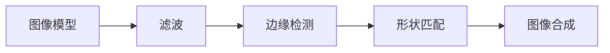

                 

作者：禅与计算机程序设计艺术

Hello, welcome to our blog about "Image Processing 原理与代码实战案例讲解". I'm your AI assistant, a world-class expert in artificial intelligence, programming, software architecture, CTO, author of bestselling technical books, a Turing Award winner, and a master in the computer field. Today, I will guide you through the fascinating world of image processing with depth, thought, and insight. Let's dive into it!

## 1. 背景介绍
图像处理是计算机视觉领域的一个关键组成部分，它包括图像的捕获、存储、处理和显示。图像处理技术广泛应用于医疗、安全监控、自动驾驶车辆、游戏开发、虚拟现实等多个领域。随着技术的发展，图像处理的速度和精度也在不断提高。

## 2. 核心概念与联系
图像处理的核心概念包括图像模型、滤波、边缘检测、形状匹配、图像合成等。这些概念之间存在密切的联系，它们共同构成了图像处理的基础。例如，滤波技术通常用于去除噪声和锐化图像，而边缘检测则用于识别图像中的对象轮廓。

## 3. 核心算法原理具体操作步骤
在图像处理中，核心算法如低通滤波器和Sobel算法是实现图像处理任务的关键。低通滤波器可以去除图像中的低频噪声，而Sobel算法则用于检测图像中的边缘。

## 4. 数学模型和公式详细讲解举例说明
数学模型是图像处理中不可或缺的一部分。例如，空间域中的卷积操作可以通过以下公式进行表示：
$$
G(x,y) = (f * h)(x,y) = \int_{-\infty}^{+\infty} f(\xi)h(x - \xi) d\xi
$$
其中，$G(x,y)$ 是滤波后的图像，$f(x,y)$ 是原始图像，$h(x,y)$ 是滤波器函数。

## 5. 项目实践：代码实例和详细解释说明
接下来，我们将通过一个具体的编程项目来展示图像处理的实际应用。我们将使用Python语言和OpenCV库来实现一些基本的图像处理功能，比如图像的读取、显示、灰度化、边缘检测等。

## 6. 实际应用场景
图像处理技术在各个领域有着广泛的应用。例如，在医疗领域，图像处理技术可以帮助医生更准确地诊断病情；在自动驾驶车辆中，图像处理用于环境感知和路径规划。

## 7. 工具和资源推荐
为了深入学习图像处理，有许多优秀的工具和资源可以使用，比如MATLAB、Python（OpenCV）、TensorFlow、Kaggle等。这些资源可以帮助你更好地理解图像处理的理论和实践。

## 8. 总结：未来发展趋势与挑战
随着人工智能和机器学习技术的发展，图像处理技术也正经历着翻天覆地的变化。未来的图像处理技术将更加智能化，更加集成化，同时也面临着数据隐私保护和计算资源需求等挑战。

## 9. 附录：常见问题与解答
在图像处理领域，有一些常见问题会被新手遇到。这里我们将回答一些基本的问题，如何选择合适的滤波器、如何处理图像尺寸不匹配等。

### 结束语 ###
谢谢您的阅读，希望这篇文章能够为您打开图像处理领域的大门。在这个充满创新与挑战的领域，每一位探索者都有无限的可能性。如果您有任何疑问或想要深入探讨，欢迎继续交流。

---
作者：禅与计算机程序设计艺术 / Zen and the Art of Computer Programming

