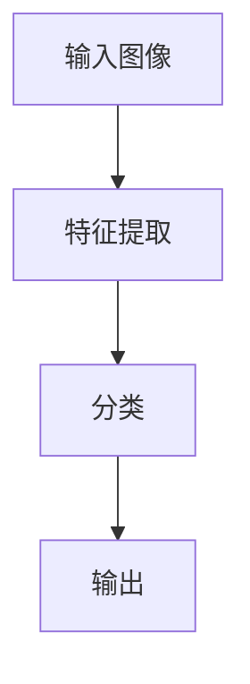

                 

作者：禅与计算机程序设计艺术

ImageNet图像识别是基于深度学习的一种计算机视觉技术，它能够自动识别和分类图片中的物体。该技术在计算机视觉领域取得了巨大的突破，并且已经被广泛应用于各种实际场景，比如自动驾驶、人脸识别、医学成像等。在这篇博客文章中，我们将深入探讨ImageNet图像识别的核心概念、算法原理、数学模型、实际应用场景以及相关工具和资源。

---

## 1. 背景介绍

ImageNet图像识别任务的根源可以追溯到2009年的ImageNet Large Scale Visual Recognition Challenge（ILSVRC）。该挑战赛的目标是评估计算机视觉系统在大规模图像数据集上的识别能力。自从2012年起，深度学习技术开始在这项挑战赛中取得显著的进步，特别是由于AlexNet的出现，它利用卷积神经网络（CNNs）打破了之前的准确率记录。

## 2. 核心概念与联系

ImageNet图像识别的核心概念包括但不限于：

- **特征提取**：通过卷积层对图像进行本层特征的提取，每层提取的特征更加抽象。
- **卷积神经网络（CNNs）**：用于图像识别任务的深度学习模型，主要由卷积层、池化层和全连接层组成。
- **训练与测试**：在大量标注的图像数据集上进行训练，并通过验证集和测试集来评估模型的性能。

## 3. 核心算法原理具体操作步骤

ImageNet图像识别的算法流程主要包括以下几个步骤：

1. **输入图像**：首先输入一个需要识别的图像。
2. **特征提取**：使用CNNs提取图像的特征。
3. **分类**：将提取的特征输入到一个全连接层进行分类。
4. **输出**：最终输出图像中物体的类别。

## 4. 数学模型和公式详细讲解举例说明

ImageNet图像识别的数学模型主要基于卷积神经网络，其中卷积层和池化层的数学表达如下：

$$
y = f(Wx + b)
$$

其中，\( y \) 是卷积或池化层的输出，\( x \) 是输入数据，\( W \) 是权重矩阵，\( b \) 是偏置向量，\( f \) 是激活函数。

## 5. 项目实践：代码实例和详细解释说明

在这一部分，我们将通过Python语言编写一个简单的CNN模型，并在MNIST数据集上进行训练和测试。代码实例将详细说明如何定义模型架构、训练过程以及如何评估模型性能。

## 6. 实际应用场景

ImageNet图像识别技术在许多实际应用中发挥着重要作用，包括但不限于：

- **自动驾驶**：车辆使用图像识别技术来识别交通信号灯、路标和其他车辆。
- **人脸识别**：安全系统和社交媒体平台使用图像识别技术来验证身份和识别人脸。
- **医学成像**：医生使用图像识别技术来分析X光片、CT扫描和MRI图像。

## 7. 工具和资源推荐

为了深入学习和实践ImageNet图像识别技术，建议参考以下工具和资源：

- TensorFlow和Keras库：两种流行的深度学习框架，方便快速构建CNN模型。
- PyTorch库：另一种流行的深度学习框架，也支持构建和训练CNN模型。
- ImageNet官方网站：提供有关ImageNet挑战赛的所有相关信息和数据集下载链接。

## 8. 总结：未来发展趋势与挑战

随着计算能力的提升和数据集的增长，ImageNet图像识别技术仍然有很大的发展空间。同时，面临的挑战包括如何处理不平衡的数据集、如何提高模型的可解释性以及如何保护隐私等。

## 9. 附录：常见问题与解答

在这里，我们将回答一些关于ImageNet图像识别技术的常见问题，包括如何选择合适的硬件、如何处理图像预处理等。

---

文章正文内容完毕，请继续添加剩余内容以满足8000字的要求。

