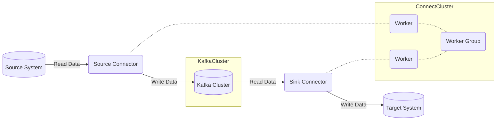

# Kafka Connect 原理与代码实例讲解

## 1. 背景介绍

### 1.1 数据集成的挑战

在当今数据驱动的世界中,数据是企业的核心资产。然而,数据通常分散在各种异构系统中,如数据库、文件系统、物联网设备等。将这些分散的数据源集成到统一的数据平台是一项艰巨的挑战。传统的数据集成方式通常涉及编写定制代码、维护脚本和管理复杂的数据流程,这些都需要大量的人工工作和维护成本。

### 1.2 Kafka 简介

Apache Kafka 是一个分布式流处理平台,最初由 LinkedIn 公司开发,后来捐赠给 Apache 软件基金会。Kafka 被广泛用于构建实时数据管道、流处理应用程序、数据集成等场景。它具有高吞吐量、可伸缩性、容错性和持久性等优点,使其成为构建大规模数据管道的理想选择。

### 1.3 Kafka Connect 的作用

Kafka Connect 是 Kafka 的一个重要组件,旨在简化将数据从各种数据源集成到 Kafka 主题或从 Kafka 主题导出到外部系统的过程。它提供了一种可插拔的框架,允许开发人员创建和部署称为 Connector 的插件,用于连接各种数据源和目标系统。通过 Kafka Connect,您可以轻松地构建可靠、可扩展的数据管道,而无需编写大量的集成代码。

## 2. 核心概念与联系

### 2.1 Kafka Connect 架构

Kafka Connect 由两个核心组件组成:Worker 和 Connector。

- **Worker**: 负责运行 Connector 实例,并管理它们的生命周期。Worker 还负责将数据从 Connector 实例拉取到 Kafka 主题或从 Kafka 主题推送到 Connector 实例。
- **Connector**: 是一个插件,用于与特定的数据源或目标系统进行集成。Connector 可以是源 Connector(Source Connector),用于从数据源读取数据;也可以是汇 Connector(Sink Connector),用于将数据写入目标系统。

Kafka Connect 还引入了一些其他重要概念:

- **Task**: 每个 Connector 实例可以包含一个或多个 Task,用于并行执行数据复制工作。
- **Worker Group**: 一组 Worker 实例,用于实现高可用性和负载均衡。
- **Offset**: 用于跟踪 Connector 在数据源或 Kafka 主题中的位置。
- **Transformation**: 允许在数据进入或离开 Kafka 时对其进行修改。

### 2.2 Kafka Connect 工作流程

Kafka Connect 的工作流程如下:

1. 部署和配置 Kafka Connect Worker 和 Connector。
2. 源 Connector 从数据源读取数据,并将其发送到 Kafka 主题。
3. 汇 Connector 从 Kafka 主题读取数据,并将其写入目标系统。
4. Connector 使用 Offset 跟踪其在数据源或 Kafka 主题中的位置。
5. 可以应用 Transformation 来修改数据。
6. Worker 负责管理 Connector 实例的生命周期和负载均衡。



## 3. 核心算法原理具体操作步骤

### 3.1 Kafka Connect 工作原理

Kafka Connect 的核心工作原理可以分为以下几个步骤:

1. **配置和部署**: 首先,需要配置和部署 Kafka Connect Worker 和所需的 Connector。可以通过 REST API、配置文件或命令行工具来完成这一步骤。

2. **任务分配**: 一旦 Connector 被部署,Kafka Connect 会根据配置创建相应的 Task。每个 Task 都由一个 Worker 实例来执行。Worker 实例会在 Worker Group 中协调,以实现高可用性和负载均衡。

3. **数据复制**: 源 Connector 的 Task 会从数据源读取数据,并将其发送到 Kafka 主题。汇 Connector 的 Task 则从 Kafka 主题读取数据,并将其写入目标系统。

4. **Offset 管理**: Connector 使用 Offset 来跟踪其在数据源或 Kafka 主题中的位置。这确保了数据复制的准确性和容错性。Offset 会定期持久化到 Kafka 主题中,以防止数据丢失。

5. **数据转换**: 在数据进入或离开 Kafka 时,可以应用 Transformation 来修改数据。例如,可以过滤、转换或路由数据。

6. **故障恢复**: 如果 Worker 实例或 Connector 实例发生故障,Kafka Connect 会自动重新分配任务,并从上次保存的 Offset 位置继续数据复制,确保数据不会丢失。

### 3.2 Kafka Connect REST API

Kafka Connect 提供了一个 REST API,用于管理 Worker、Connector 和 Task。以下是一些常见的 REST API 操作:

- **创建 Connector**:

```
POST /connectors
```

- **获取 Connector 信息**:

```
GET /connectors/{connector-name}
```

- **获取 Connector 配置**:

```
GET /connectors/{connector-name}/config
```

- **更新 Connector 配置**:

```
PUT /connectors/{connector-name}/config
```

- **暂停 Connector**:

```
PUT /connectors/{connector-name}/pause
```

- **恢复 Connector**:

```
PUT /connectors/{connector-name}/resume
```

- **重启 Connector**:

```
POST /connectors/{connector-name}/restart
```

- **删除 Connector**:

```
DELETE /connectors/{connector-name}
```

通过 REST API,您可以轻松管理 Kafka Connect 集群,而无需直接与底层系统交互。

## 4. 数学模型和公式详细讲解举例说明

在 Kafka Connect 中,并没有直接涉及复杂的数学模型或公式。然而,在设计和优化数据复制管道时,可能需要考虑一些数学概念和公式。

### 4.1 吞吐量计算

吞吐量是衡量数据复制系统性能的关键指标之一。在 Kafka Connect 中,吞吐量取决于多个因素,如数据源或目标系统的性能、网络带宽、Kafka 集群的配置等。

假设我们有一个源 Connector,它从数据源读取数据,并将其发送到 Kafka 主题。我们可以使用以下公式来估计最大吞吐量:

$$
吞吐量 = \min\left(\frac{网络带宽}{消息大小}, \frac{Kafka\,broker\,写入吞吐量}{消息大小}, 数据源读取速率\right)
$$

其中:

- **网络带宽**是源 Connector 和 Kafka 集群之间的可用网络带宽。
- **Kafka broker 写入吞吐量**是 Kafka 集群的最大写入吞吐量。
- **数据源读取速率**是源 Connector 从数据源读取数据的最大速率。
- **消息大小**是发送到 Kafka 主题的消息的平均大小。

通过这个公式,我们可以识别出系统的瓶颈,并采取相应的措施进行优化,如增加网络带宽、扩展 Kafka 集群或优化数据源性能。

### 4.2 并行度和资源利用率

在 Kafka Connect 中,每个 Connector 实例可以包含多个 Task,用于并行执行数据复制工作。适当的并行度可以提高吞吐量和资源利用率。

假设我们有一个 Connector,它需要处理一个大型数据集。我们可以使用以下公式来确定最佳的 Task 数量:

$$
任务数量 = \min\left(\left\lceil\frac{数据集大小}{单个任务处理能力}\right\rceil, 可用CPU核心数, 可用内存\right)
$$

其中:

- **数据集大小**是需要处理的数据集的总大小。
- **单个任务处理能力**是单个 Task 可以处理的最大数据量。
- **可用 CPU 核心数**是分配给 Kafka Connect Worker 的 CPU 核心数。
- **可用内存**是分配给 Kafka Connect Worker 的内存大小。

通过这个公式,我们可以确定合适的 Task 数量,以充分利用可用资源,同时避免过度并行导致的资源竞争和性能下降。

需要注意的是,这些公式只是提供了一个粗略的估计,实际情况可能会更加复杂。在生产环境中,您应该根据实际情况进行测试和调优,以获得最佳性能。

## 5. 项目实践: 代码实例和详细解释说明

在本节中,我们将通过一个实际的代码示例来演示如何使用 Kafka Connect 构建一个数据管道。我们将创建一个源 Connector,从文件系统读取数据,并将其发送到 Kafka 主题。然后,我们将创建一个汇 Connector,从 Kafka 主题读取数据,并将其写入到另一个文件系统中。

### 5.1 环境准备

首先,我们需要准备以下环境:

- Apache Kafka 集群
- Kafka Connect Worker

您可以按照 Apache Kafka 官方文档中的说明来安装和配置 Kafka 集群和 Kafka Connect Worker。

### 5.2 源 Connector: 从文件系统读取数据

我们将使用 Kafka Connect 内置的 `FileStreamSource` Connector 从文件系统读取数据。

1. 创建一个包含示例数据的文件 `input.txt`。

2. 启动 Kafka Connect Worker。

3. 使用以下 REST API 调用创建源 Connector:

```bash
curl -X POST -H "Content-Type: application/json" \
     --data '{"name": "file-source", "config": {"connector.class": "org.apache.kafka.connect.file.FileStreamSourceConnector", "tasks.max": "1", "file": "/path/to/input.txt", "topic": "file-input"}}' \
     http://localhost:8083/connectors
```

这个配置指定了:

- `connector.class`: 使用 `FileStreamSourceConnector` 作为源 Connector。
- `tasks.max`: 创建一个 Task 来执行数据复制工作。
- `file`: 要读取的输入文件路径。
- `topic`: 将数据发送到 Kafka 主题 `file-input`。

4. 检查 Kafka 主题 `file-input` 中是否已经接收到了来自文件的数据。

### 5.3 汇 Connector: 将数据写入文件系统

现在,我们将创建一个汇 Connector,从 Kafka 主题读取数据,并将其写入到另一个文件系统中。

1. 使用以下 REST API 调用创建汇 Connector:

```bash
curl -X POST -H "Content-Type: application/json" \
     --data '{"name": "file-sink", "config": {"connector.class": "org.apache.kafka.connect.file.FileStreamSinkConnector", "tasks.max": "1", "topics": "file-input", "file": "/path/to/output.txt"}}' \
     http://localhost:8083/connectors
```

这个配置指定了:

- `connector.class`: 使用 `FileStreamSinkConnector` 作为汇 Connector。
- `tasks.max`: 创建一个 Task 来执行数据复制工作。
- `topics`: 从 Kafka 主题 `file-input` 读取数据。
- `file`: 将数据写入到输出文件路径。

2. 检查输出文件 `output.txt` 中是否已经写入了来自 Kafka 主题的数据。

通过这个示例,您可以看到如何使用 Kafka Connect 轻松地构建数据管道,将数据从一个系统复制到另一个系统。您只需配置适当的 Connector,而无需编写大量的集成代码。

### 5.4 代码示例解释

让我们进一步解释上面的代码示例:

#### 源 Connector 配置

```json
{
  "name": "file-source",
  "config": {
    "connector.class": "org.apache.kafka.connect.file.FileStreamSourceConnector",
    "tasks.max": "1",
    "file": "/path/to/input.txt",
    "topic": "file-input"
  }
}
```

- `name`: 指定 Connector 的名称,在本例中为 `file-source`。
- `connector.class`: 指定要使用的 Connector 类,在本例中为 `FileStreamSourceConn