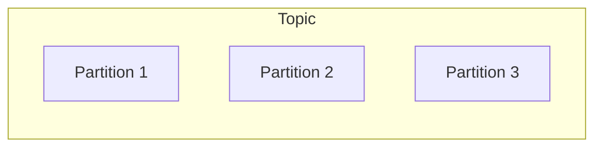
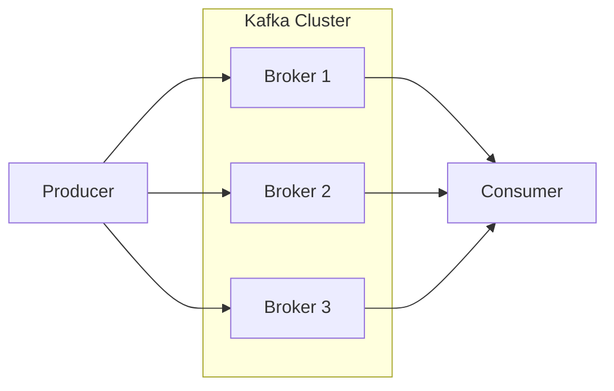
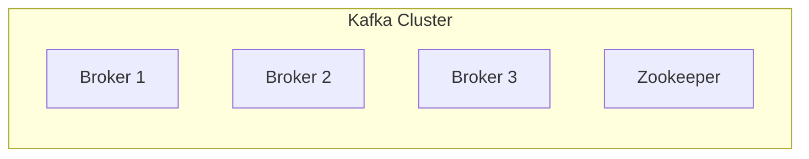
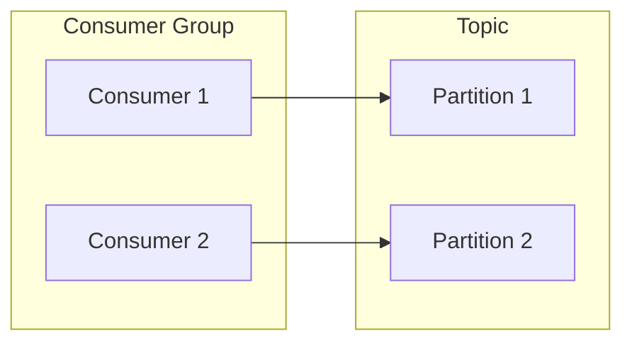
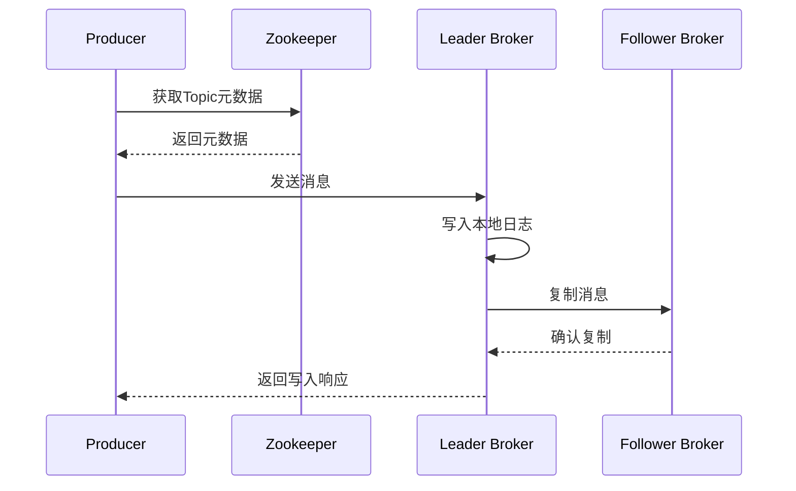
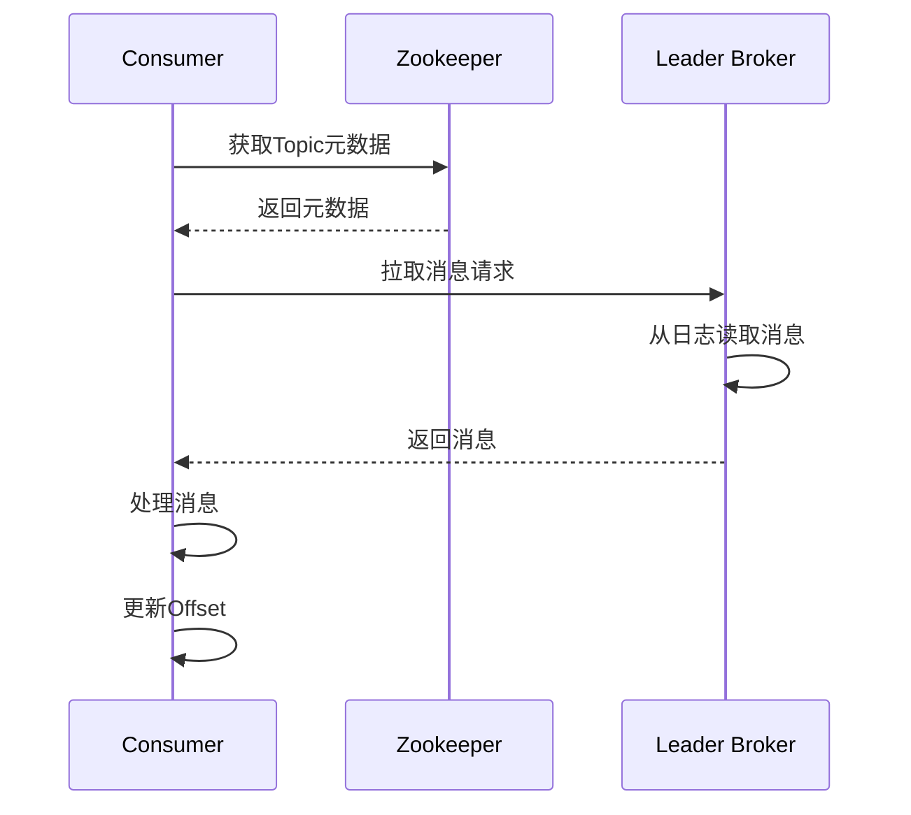
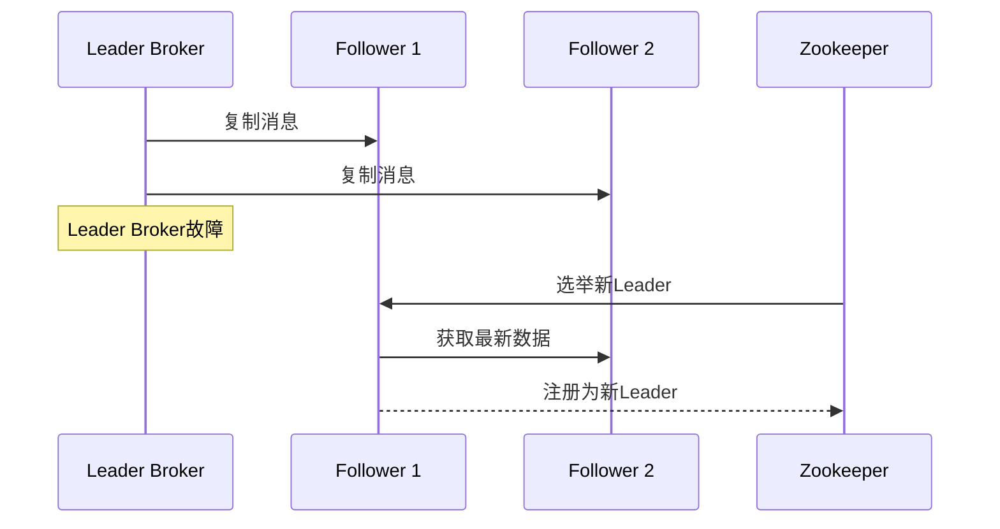

# Kafka原理与代码实例讲解

## 1.背景介绍

Apache Kafka是一个分布式流处理平台,最初由LinkedIn公司开发,后来捐赠给Apache软件基金会。它被广泛应用于构建实时数据管道和流式应用程序,用于可靠地获取、存储和处理大量实时数据。Kafka具有高吞吐量、低延迟、高可伸缩性和持久性等特点,使其成为当今大数据生态系统中不可或缺的核心组件。

### 1.1 Kafka的设计目标

Kafka的设计目标是为了解决以下几个关键问题:

1. **高吞吐量和低延迟**: 能够以恒定的高吞吐量实时处理大量数据,并提供毫秒级的低延迟响应。
2. **可靠性和持久性**: 保证数据不会丢失,并能够持久化存储以供后续处理和分析。
3. **分布式和可扩展性**: 能够在多台机器上水平扩展,提供高可用性和容错能力。
4. **多客户端支持**: 支持多种编程语言的客户端,方便与不同系统集成。

### 1.2 Kafka的应用场景

Kafka广泛应用于各种场景,包括但不限于:

- **消息系统**: 作为分布式发布-订阅消息队列,实现异步通信和解耦。
- **日志收集**: 作为日志收集系统的中心存储,用于收集和处理大量日志数据。
- **流处理**: 作为实时流处理平台,支持对流数据进行低延迟的处理和分析。
- **事件驱动架构**: 作为事件源(Event Source),支持事件驱动架构和事件溯源模式。
- **数据集成**: 作为数据管道,实现不同系统之间的数据集成和传输。

## 2.核心概念与联系

在深入探讨Kafka的原理之前,我们需要先了解一些核心概念。

### 2.1 Topic和Partition

Topic是Kafka中的核心概念,可以理解为一个逻辑上的数据流或事件流。每个Topic可以被分区(Partition),每个分区都是一个有序、不可变的记录序列。



分区的作用:

1. **提高并行度**: 每个分区可以被独立消费,提高了并行处理能力。
2. **提高吞吐量**: 分区可以分布在不同的Broker上,增加了整体吞吐量。
3. **提高容错性**: 分区可以在多个Broker上备份,提高了容错能力。

### 2.2 Producer和Consumer

Producer是数据的生产者,负责向Topic发送消息。Consumer是数据的消费者,负责从Topic中拉取并消费消息。



Producer和Consumer都可以是多实例的,并且可以同时作为Producer和Consumer。

### 2.3 Broker和Cluster

Broker是Kafka集群中的单个节点,负责存储和处理数据。多个Broker组成一个Kafka集群,提供了高可用性和容错能力。



Zookeeper是Kafka集群的协调者,用于管理和监控Broker的状态,并维护Topic的元数据信息。

### 2.4 Offset和Consumer Group

Offset是Consumer在Partition中的位置标记,用于记录消费进度。Consumer Group是一组Consumer的逻辑组合,它们共享同一个消费进度(Offset)。



在同一个Consumer Group中,每个Partition只能被一个Consumer消费,这样可以避免重复消费。不同的Consumer Group则可以独立消费相同的数据流。

## 3.核心算法原理具体操作步骤

### 3.1 Producer发送消息流程

1. Producer首先需要从Zookeeper获取Topic的元数据信息,包括Topic的Partition信息、Leader Broker等。
2. Producer根据分区策略(Partitioner)选择将消息发送到哪个Partition。
3. Producer将消息发送给Leader Broker,Leader Broker将消息写入本地日志文件。
4. Leader Broker将消息复制到所有Follower Broker。
5. Leader Broker向Producer返回一个响应,表示消息已经成功写入。



### 3.2 Consumer消费消息流程

1. Consumer首先需要从Zookeeper获取Topic的元数据信息,包括Topic的Partition信息、Leader Broker等。
2. Consumer向Leader Broker发送拉取消息的请求,指定要拉取的Partition和Offset位置。
3. Leader Broker从本地日志文件中读取消息,并返回给Consumer。
4. Consumer处理消息,并更新Offset位置。



### 3.3 故障恢复机制

Kafka采用了复制和故障转移机制,以确保数据的可靠性和高可用性。

1. 每个Partition都有多个副本(Replica),其中一个是Leader,其他是Follower。
2. Leader Broker会将消息复制到所有Follower Broker。
3. 如果Leader Broker发生故障,Zookeeper会选举一个新的Leader Broker。
4. 新的Leader Broker会从Follower Broker中获取最新的数据,并继续提供服务。



## 4.数学模型和公式详细讲解举例说明

### 4.1 分区分配策略

Kafka采用了一种基于键(Key)的分区分配策略,用于确定消息应该发送到哪个Partition。该策略可以保证具有相同键的消息被发送到同一个Partition,从而保证消息的有序性。

分区分配策略的公式如下:

$$
Partition = hash(key) \% numPartitions
$$

其中:

- $hash(key)$是对键进行哈希运算得到的哈希值。
- $numPartitions$是Topic的分区数量。

例如,假设一个Topic有4个分区,并且我们有以下消息:

| 消息 | 键 | 哈希值 | 分区号 |
|------|----|---------|----|
| M1   | K1 | 123     | 123 % 4 = 3 |
| M2   | K2 | 456     | 456 % 4 = 0 |
| M3   | K1 | 123     | 123 % 4 = 3 |

可以看到,具有相同键的消息M1和M3被分配到了同一个分区3,而消息M2被分配到了分区0。

### 4.2 复制因子和ISR

复制因子(Replication Factor)决定了每个Partition应该有多少个副本。Kafka采用了领导者-追随者(Leader-Follower)模型,其中一个副本是Leader,其他副本是Follower。

在正常情况下,所有的Follower副本都会与Leader保持同步。但是,如果某个Follower落后太多,就会被临时踢出同步队列(ISR,In-Sync Replicas)。只有ISR中的Follower副本才能被选举为新的Leader。

ISR的计算公式如下:

$$
ISR = \{replicas | leo_{replica} \geq leo_{leader} - max\_lag\}
$$

其中:

- $leo_{replica}$是副本的日志结束偏移量(Log End Offset)。
- $leo_{leader}$是Leader的日志结束偏移量。
- $max\_lag$是允许的最大落后距离。

例如,假设一个Partition有3个副本R1(Leader)、R2和R3,它们的日志结束偏移量分别为100、98和95。如果$max\_lag$设置为5,那么ISR就是{R1, R2},因为R3落后太多(100 - 95 > 5)。

### 4.3 水印机制

Kafka采用了水印(Watermark)机制来控制消息的可见性和保留时间。水印分为两种:高水印(High Watermark)和低水印(Low Watermark)。

高水印表示消费者可以安全消费的最大偏移量,它是所有副本中最小的日志结束偏移量。公式如下:

$$
HW = min(leo_{replica})
$$

低水印表示消息被认为是已提交的最小偏移量,它是所有副本中最大的日志起始偏移量加上复制因子减一。公式如下:

$$
LW = max(log.start.offset_{replica}) + replication.factor - 1
$$

只有当消息的偏移量大于等于低水印时,它才被认为是已提交的,可以被安全删除。这样可以确保至少有一个副本包含该消息。

## 5.项目实践:代码实例和详细解释说明

### 5.1 Producer示例

以下是一个使用Java编写的Kafka Producer示例:

```java
Properties props = new Properties();
props.put("bootstrap.servers", "localhost:9092");
props.put("key.serializer", "org.apache.kafka.common.serialization.StringSerializer");
props.put("value.serializer", "org.apache.kafka.common.serialization.StringSerializer");

Producer<String, String> producer = new KafkaProducer<>(props);

for (int i = 0; i < 100; i++) {
    String key = "key-" + i;
    String value = "value-" + i;
    ProducerRecord<String, String> record = new ProducerRecord<>("my-topic", key, value);
    producer.send(record);
}

producer.flush();
producer.close();
```

1. 首先,我们创建一个`Properties`对象,并设置Kafka Broker的地址和序列化器。
2. 然后,我们创建一个`KafkaProducer`实例。
3. 在循环中,我们创建`ProducerRecord`对象,指定Topic名称、键和值。
4. 使用`producer.send()`方法发送消息。
5. 最后,我们调用`flush()`方法确保所有消息都被发送出去,并调用`close()`方法关闭Producer。

### 5.2 Consumer示例

以下是一个使用Java编写的Kafka Consumer示例:

```java
Properties props = new Properties();
props.put("bootstrap.servers", "localhost:9092");
props.put("group.id", "my-group");
props.put("key.deserializer", "org.apache.kafka.common.serialization.StringDeserializer");
props.put("value.deserializer", "org.apache.kafka.common.serialization.StringDeserializer");

KafkaConsumer<String, String> consumer = new KafkaConsumer<>(props);
consumer.subscribe(Collections.singletonList("my-topic"));

while (true) {
    ConsumerRecords<String, String> records = consumer.poll(Duration.ofMillis(100));
    for (ConsumerRecord<String, String> record : records) {
        System.out.println("Key: " + record.key() + ", Value: " + record.value());
        System.out.println("Partition: " + record.partition() + ", Offset: " + record.offset());
    }
}
```

1. 首先,我们创建一个`Properties`对象,并设置Kafka Broker的地址、Consumer Group ID和反序列化器。
2. 然后,我们创建一个`KafkaConsumer`实例,并订阅Topic。
3. 在无限循环中,我们调用`consumer.poll()`方法从Kafka拉取消息。
4. 对于每条消息,我们打印出键、值、分区号和偏移量。

### 5.3 Kafka Streams示例

Kafka Streams是Kafka提供的一个用于构建