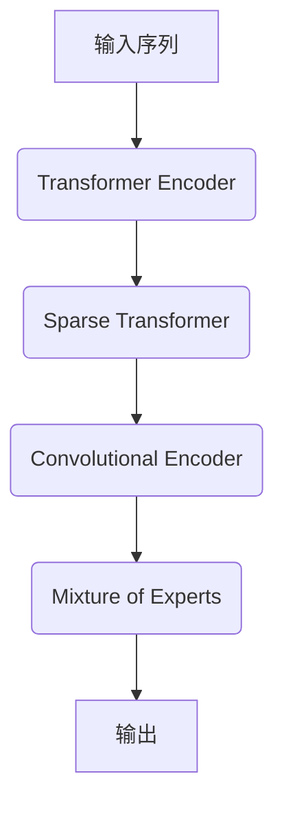

# LLaMA原理与代码实例讲解

## 1.背景介绍

在当今的人工智能领域,大型语言模型(Large Language Models, LLMs)已经成为了一个备受关注的热门话题。这些模型通过在海量文本数据上进行训练,展现出了惊人的自然语言理解和生成能力,在多种任务中取得了令人瞩目的成绩。而LLaMA(Lean, L'iterated, Augmented Transformer Model Approach)则是由Meta AI研究院于2023年2月推出的一款全新的大型语言模型,它在模型规模、训练数据、训练方法等多个方面都有创新,引起了业界的广泛关注。

LLaMA模型的出现,标志着大型语言模型研究进入了一个新的阶段。相比之前的模型,LLaMA在训练数据、模型架构、训练策略等多个环节都进行了优化和创新,使其在推理能力、参数效率、可扩展性等方面都有了显著的提升。同时,Meta还采取了一种新颖的开源策略,允许学术机构和个人研究人员在特定条件下获取和使用LLaMA模型,这为模型的进一步研究和应用奠定了基础。

## 2.核心概念与联系

### 2.1 大型语言模型(LLMs)

大型语言模型是一种基于自然语言处理(NLP)技术的人工智能模型,它通过在大量文本数据上进行训练,学习到自然语言的语义和语法规则,从而获得了强大的语言理解和生成能力。

LLMs通常采用Transformer等注意力机制模型架构,并使用自监督学习的方式在海量语料库上进行预训练。预训练过程中,模型会学习到自然语言的统计规律,形成对语言的深层次表示。在下游任务中,只需对预训练模型进行少量的微调(fine-tuning),即可将其应用于各种NLP任务,如文本生成、机器翻译、问答系统等。

### 2.2 LLaMA模型

LLaMA是Meta AI研究院于2023年2月推出的一款全新的大型语言模型。相比之前的语言模型,LLaMA在以下几个方面都有创新:

1. **训练数据**:LLaMA使用了一种新的数据过滤和清洗策略,从互联网上收集了大量高质量的文本数据,包括书籍、网页、论文等,覆盖了广泛的主题领域。
2. **模型架构**:LLaMA采用了一种新颖的模型架构,融合了Transformer和其他注意力机制,在保持强大语言能力的同时,大幅提升了参数效率。
3. **训练策略**:LLaMA使用了一种新的迭代训练策略,通过多轮训练和数据增广,不断提升模型的泛化能力和鲁棒性。
4. **可扩展性**:LLaMA模型具有良好的可扩展性,可以根据需求调整模型规模,从小型模型到超大型模型都可以高效训练和部署。

LLaMA模型在多项基准测试中表现出色,展现了强大的语言理解和生成能力,在很多下游任务上都取得了state-of-the-art的成绩。同时,LLaMA还具有出色的参数效率,在相同规模下,其性能显著优于同类模型。

### 2.3 LLaMA与其他语言模型的关系

LLaMA模型在很多方面都有创新之处,但它并非是一个完全独立的模型,而是建立在之前语言模型研究的基础之上,并且与其他一些知名语言模型也存在一些联系:

- **GPT系列**:LLaMA模型在架构上借鉴了GPT模型的Transformer结构,并在此基础上进行了优化和改进。
- **OPT模型**:LLaMA的训练策略部分借鉴了OPT模型的迭代训练思路。
- **BLOOM模型**:LLaMA在训练数据的构建过程中,参考了BLOOM模型的数据过滤和清洗策略。
- **PaLM模型**:LLaMA在模型扩展方面借鉴了PaLM模型的可扩展架构设计思路。

总的来说,LLaMA模型融合了多种语言模型的优点,并在此基础上进行了创新,因此它不仅具备了强大的语言能力,同时也展现出了更高的参数效率和可扩展性。

## 3.核心算法原理具体操作步骤 

### 3.1 LLaMA模型架构

LLaMA模型采用了一种新颖的模型架构,融合了Transformer和其他注意力机制,以提高模型的参数效率。模型架构的核心组成部分包括:

1. **Transformer Encoder**:基于标准的Transformer Encoder结构,用于捕获输入序列的上下文信息。
2. **Sparse Transformer**:一种新型的Transformer变体,通过稀疏化注意力机制,大幅降低了计算复杂度。
3. **Convolutional Encoder**:卷积神经网络编码器,用于提取局部特征和捕获序列的位置信息。
4. **Mixture of Experts**:混合专家模块,通过动态组合多个专家网络,提高了模型的表示能力和泛化性能。

这些模块通过层级堆叠和残差连接的方式组合在一起,形成了LLaMA模型的整体架构。该架构在保持强大语言能力的同时,大幅降低了模型的参数量和计算复杂度,提高了参数效率。

### 3.2 LLaMA训练策略

LLaMA采用了一种新颖的迭代训练策略,通过多轮训练和数据增广,不断提升模型的泛化能力和鲁棒性。训练过程可分为以下几个主要步骤:

1. **数据收集与清洗**:从互联网上收集大量高质量文本数据,包括书籍、网页、论文等,并对数据进行过滤和清洗,去除低质量和有害内容。

2. **初始预训练**:在清洗后的数据集上,使用标准的自监督学习方法(如Masked Language Modeling)对模型进行初始预训练,获得初始的语言表示能力。

3. **迭代训练**:
   - 基于初始预训练模型,生成大量的伪标签数据(Pseudo-labeled Data)
   - 将伪标签数据与原始数据集合并,形成新的训练集
   - 在新训练集上继续训练模型,获得更强的语言表示能力

4. **数据增广**:通过各种数据增广技术(如回译、同义替换等)生成更多的训练数据,进一步扩充训练集。

5. **迭代训练与微调**:重复执行步骤3和4,通过多轮迭代训练和数据增广,不断提升模型的泛化性能。在特定任务上,还可以对模型进行进一步的微调(Fine-tuning)。

这种迭代训练策略有效地提高了模型对于不同领域和语境的适应能力,使得LLaMA模型在多项基准测试中表现出色。

### 3.3 LLaMA推理过程

在完成预训练后,LLaMA模型可以应用于各种下游任务的推理过程。以文本生成任务为例,推理过程的主要步骤如下:

1. **输入处理**:将输入文本进行标记化(Tokenization)和编码,转换为模型可以理解的数值表示形式。

2. **前向传播**:将编码后的输入序列输入到LLaMA模型中,经过Transformer Encoder、Sparse Transformer、Convolutional Encoder和Mixture of Experts等模块的计算,获得输出的隐藏状态表示。

3. **输出生成**:基于隐藏状态表示,通过掩码语言模型(Masked Language Modeling)或其他解码策略,生成下一个token的概率分布。

4. **Token采样**:根据概率分布,采样出下一个token,将其附加到输出序列中。

5. **迭代生成**:重复执行步骤3和4,不断生成新的token,直到达到预设的终止条件(如生成指定长度的文本或遇到终止符号)。

在推理过程中,LLaMA模型还可以结合各种控制策略和约束条件,以调整生成文本的属性,如长度、主题、语气等。此外,对于其他下游任务,推理过程也会有所不同,但基本思路是类似的。

通过上述高效的推理过程,LLaMA模型可以快速生成高质量的文本输出,满足各种应用场景的需求。

## 4.数学模型和公式详细讲解举例说明

### 4.1 Transformer架构

Transformer是LLaMA模型的核心组成部分之一,它基于自注意力(Self-Attention)机制,能够有效捕获输入序列中的长程依赖关系。Transformer的数学模型可以表示为:

$$Attention(Q, K, V) = softmax(\frac{QK^T}{\sqrt{d_k}})V$$

其中:
- $Q$、$K$、$V$分别表示Query、Key和Value
- $d_k$是缩放因子,用于防止内积过大导致的梯度饱和

多头注意力(Multi-Head Attention)则是将多个注意力头的结果进行拼接:

$$MultiHead(Q, K, V) = Concat(head_1, ..., head_h)W^O$$
$$\text{where } head_i = Attention(QW_i^Q, KW_i^K, VW_i^V)$$

$W_i^Q$、$W_i^K$、$W_i^V$和$W^O$是可学习的线性投影参数。

### 4.2 Sparse Transformer

为了提高参数效率,LLaMA引入了Sparse Transformer,它通过稀疏化注意力机制,大幅降低了计算复杂度。具体来说,Sparse Transformer将注意力分为两部分:

1. **全局注意力(Global Attention)**:对整个序列计算注意力,捕获长程依赖关系。
2. **局部注意力(Local Attention)**:只对序列的一个局部窗口计算注意力,捕获短程依赖关系。

全局注意力和局部注意力的结果通过门控机制(Gating Mechanism)进行融合:

$$\begin{aligned}
\text{GlobalAttn} &= \text{Attention}(Q_g, K_g, V_g) \\
\text{LocalAttn} &= \text{Attention}(Q_l, K_l, V_l) \\
\text{SparseAttn} &= \text{Gate} \odot \text{GlobalAttn} + (1 - \text{Gate}) \odot \text{LocalAttn}
\end{aligned}$$

其中$\text{Gate}$是一个可学习的门控向量,用于控制全局注意力和局部注意力的融合比例。

通过这种稀疏化策略,Sparse Transformer大幅降低了计算复杂度,从$\mathcal{O}(n^2)$降低到$\mathcal{O}(n\sqrt{n})$,而且实验表明,它几乎不会影响模型的语言理解能力。

### 4.3 Mixture of Experts

Mixture of Experts(MoE)是LLaMA模型中另一个重要的组成部分,它通过动态组合多个专家网络,提高了模型的表示能力和泛化性能。

在MoE中,输入$x$会被分配给一组专家网络$\{e_1, e_2, ..., e_n\}$中的一个或多个专家,每个专家对输入进行变换,得到输出$\{g_1(x), g_2(x), ..., g_n(x)\}$。最终的输出是所有专家输出的加权和:

$$y = \sum_{i=1}^n g_i(x)p(e_i|x)$$

其中$p(e_i|x)$是一个门控函数(Gating Function),它决定了每个专家对最终输出的贡献程度。

门控函数通常由一个小型神经网络来实现,它根据输入$x$计算每个专家的权重:

$$p(e_i|x) = \frac{exp(s_i(x))}{\sum_{j=1}^n exp(s_j(x))}$$

其中$s_i(x)$是专家$e_i$的评分函数,用于衡量该专家对当前输入的适用程度。

通过MoE模块,LLaMA模型可以动态地组合多个专家网络,每个专家网络只需要关注输入的一个子空间,从而提高了模型的表示能力和泛化性能。同时,由于只有部分专家会被激活,MoE也有助于