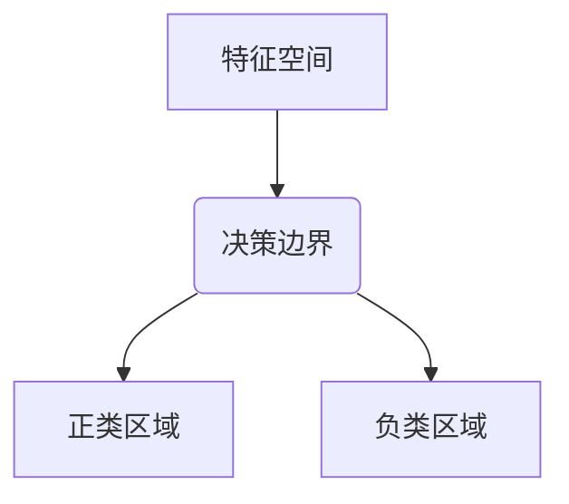

# Logistic Regression 原理与代码实战案例讲解

## 1. 背景介绍

### 1.1 什么是逻辑回归

逻辑回归(Logistic Regression)是一种广泛应用于分类问题的经典机器学习算法。它的主要目的是估计一个样本属于某个类别的概率。尽管名字中含有"回归"一词,但逻辑回归实际上是一种分类模型,而非回归模型。

逻辑回归在解决二分类(Binary Classification)问题时应用最为广泛,例如判断一封电子邮件是否为垃圾邮件、确定一个客户是否会流失等。但它也可以推广到解决多分类(Multi-class Classification)问题。

### 1.2 逻辑回归的应用场景

逻辑回归模型由于其简单性和可解释性,在各个领域都有广泛的应用,例如:

- 医疗保健:预测患者是否患有某种疾病
- 金融领域:评估贷款申请人的违约风险
- 电子商务:预测用户是否会购买某个产品
- 自然语言处理:垃圾邮件过滤、情感分析
- 网络安全:检测网络入侵行为
- 社交网络:推荐好友关系
- 广告投放:预测用户是否会点击广告

## 2. 核心概念与联系

### 2.1 逻辑回归的数学基础

逻辑回归模型的核心思想是通过对数据特征进行线性组合,得到一个分数值(Score),然后将这个分数值映射到一个0到1之间的概率值,作为样本属于正类(Positive Class)的概率估计。

对于二分类问题,设有 n 个训练样本 $\{(x_1, y_1), (x_2, y_2), ..., (x_n, y_n)\}$,其中 $x_i$ 是第 i 个样本的特征向量,维度为 $d$;$y_i$ 是对应的类别标记,取值为 0 或 1。逻辑回归模型的目标是学习一个分类函数 $h(x)$,使得对于给定的输入实例 $x$,可以计算出它属于正类的概率估计 $\hat{y} = h(x)$。

### 2.2 Sigmoid 函数

为了将线性函数的输出映射到0到1之间的概率值,逻辑回归引入了 Sigmoid 函数:

$$\sigma(z) = \frac{1}{1 + e^{-z}}$$

其中 $z$ 是线性函数的输出,即 $z = w^Tx + b$。Sigmoid 函数的值域为(0,1),当 $z \rightarrow +\infty$ 时,$ \sigma(z) \rightarrow 1$;当 $z \rightarrow -\infty$ 时,$\sigma(z) \rightarrow 0$。

因此,逻辑回归模型可以表示为:

$$h(x) = \sigma(w^Tx + b) = \frac{1}{1 + e^{-(w^Tx + b)}}$$

其中 $w$ 是权重向量,$b$ 是偏置项。通过学习合适的参数 $w$ 和 $b$,我们可以得到样本 $x$ 属于正类的概率估计值 $\hat{y} = h(x)$。

### 2.3 决策边界

对于二分类问题,我们可以根据概率估计值 $\hat{y}$ 与一个阈值(通常为 0.5)的大小关系,将样本划分到正类或负类。

当 $\hat{y} \geq 0.5$ 时,将样本划分到正类;否则划分到负类。这条分界线就是逻辑回归模型的决策边界。

在特征空间中,决策边界是一个超平面,将样本空间划分为两个区域。对于二维情况,决策边界是一条直线;对于三维情况,决策边界是一个平面。

## 3. 核心算法原理具体操作步骤  

### 3.1 损失函数

为了学习逻辑回归模型的参数 $w$ 和 $b$,我们需要定义一个损失函数(Loss Function),使得模型在训练数据上的损失最小。

对于二分类问题,常用的损失函数是交叉熵损失函数(Cross Entropy Loss):

$$J(w, b) = -\frac{1}{n}\sum_{i=1}^{n}[y_i\log h(x_i) + (1 - y_i)\log(1 - h(x_i))]$$

其中 $n$ 是训练样本的数量,$y_i$ 是第 i 个样本的真实标记,取值为 0 或 1。

交叉熵损失函数可以衡量模型输出的概率估计值 $h(x_i)$ 与真实标记 $y_i$ 之间的差异。当模型预测准确时,损失函数值较小;当模型预测错误时,损失函数值较大。

### 3.2 参数学习

学习逻辑回归模型的参数 $w$ 和 $b$,就是求解能够使损失函数 $J(w, b)$ 最小的参数值。这是一个无约束的优化问题,可以使用梯度下降法(Gradient Descent)等优化算法来求解。

梯度下降法的基本思路是:从一个初始点出发,不断沿着损失函数下降最快的方向(即负梯度方向)更新参数值,直到收敛到局部最小值点。

对于逻辑回归模型,损失函数 $J(w, b)$ 关于参数 $w$ 和 $b$ 的梯度为:

$$\begin{aligned}
\frac{\partial J}{\partial w} &= \frac{1}{n}\sum_{i=1}^{n}(h(x_i) - y_i)x_i \\
\frac{\partial J}{\partial b} &= \frac{1}{n}\sum_{i=1}^{n}(h(x_i) - y_i)
\end{aligned}$$

因此,在每一次迭代中,我们可以按照下面的规则更新参数值:

$$\begin{aligned}
w &\leftarrow w - \alpha\frac{\partial J}{\partial w} \\
b &\leftarrow b - \alpha\frac{\partial J}{\partial b}
\end{aligned}$$

其中 $\alpha$ 是学习率(Learning Rate),控制每次更新的步长。

通过不断迭代,直到损失函数收敛或达到预设的最大迭代次数,我们就可以得到逻辑回归模型的最优参数估计值。

### 3.3 算法流程

逻辑回归算法的整体流程如下:

1. 初始化模型参数 $w$ 和 $b$,一般取较小的随机值
2. 计算损失函数 $J(w, b)$
3. 计算损失函数关于参数的梯度 $\frac{\partial J}{\partial w}$ 和 $\frac{\partial J}{\partial b}$
4. 更新参数值 $w$ 和 $b$
5. 重复步骤 2-4,直到损失函数收敛或达到最大迭代次数
6. 返回最优参数 $w$ 和 $b$

以上就是逻辑回归算法的核心原理和具体操作步骤。接下来,我们将详细介绍逻辑回归的数学模型和公式推导。

## 4. 数学模型和公式详细讲解举例说明

### 4.1 Sigmoid 函数的导数

在梯度下降法中,我们需要计算损失函数关于参数的梯度。因此,我们首先需要推导 Sigmoid 函数的导数。

设 $z = w^Tx + b$,则 Sigmoid 函数可以表示为:

$$\sigma(z) = \frac{1}{1 + e^{-z}}$$

对 $z$ 求导数,我们有:

$$\begin{aligned}
\frac{d\sigma(z)}{dz} &= \frac{d}{dz}\left(\frac{1}{1 + e^{-z}}\right) \\
&= \frac{e^{-z}}{(1 + e^{-z})^2} \\
&= \frac{1}{1 + e^{-z}} \cdot \frac{e^{-z}}{1 + e^{-z}} \\
&= \sigma(z)(1 - \sigma(z))
\end{aligned}$$

这个结果在后续求解损失函数梯度时会被使用到。

### 4.2 交叉熵损失函数的梯度推导

现在,我们来推导逻辑回归模型的损失函数梯度。

对于单个样本 $(x, y)$,交叉熵损失函数为:

$$L(w, b) = -[y\log h(x) + (1 - y)\log(1 - h(x))]$$

其中 $h(x) = \sigma(w^Tx + b)$ 是模型的输出,即样本 $x$ 属于正类的概率估计值。

我们先求损失函数关于 $w$ 的梯度:

$$\begin{aligned}
\frac{\partial L}{\partial w} &= -\left[y\frac{1}{h(x)}\frac{\partial h(x)}{\partial w} + (1 - y)\frac{1}{1 - h(x)}\frac{\partial(1 - h(x))}{\partial w}\right] \\
&= -\left[y\frac{1}{h(x)}\sigma'(w^Tx + b)x + (1 - y)\frac{1}{1 - h(x)}(-\sigma'(w^Tx + b))x\right] \\
&= -\left[\frac{y}{h(x)} - \frac{1 - y}{1 - h(x)}\right]\sigma'(w^Tx + b)x \\
&= -\left[\frac{y}{h(x)} - \frac{1 - y}{1 - h(x)}\right]h(x)(1 - h(x))x \\
&= -(y - h(x))x
\end{aligned}$$

接下来,我们求损失函数关于 $b$ 的梯度:

$$\begin{aligned}
\frac{\partial L}{\partial b} &= -\left[y\frac{1}{h(x)}\frac{\partial h(x)}{\partial b} + (1 - y)\frac{1}{1 - h(x)}\frac{\partial(1 - h(x))}{\partial b}\right] \\
&= -\left[y\frac{1}{h(x)}\sigma'(w^Tx + b) + (1 - y)\frac{1}{1 - h(x)}(-\sigma'(w^Tx + b))\right] \\
&= -\left[\frac{y}{h(x)} - \frac{1 - y}{1 - h(x)}\right]\sigma'(w^Tx + b) \\
&= -\left[\frac{y}{h(x)} - \frac{1 - y}{1 - h(x)}\right]h(x)(1 - h(x)) \\
&= -(y - h(x))
\end{aligned}$$

将上述结果推广到整个训练数据集,我们得到:

$$\begin{aligned}
\frac{\partial J}{\partial w} &= \frac{1}{n}\sum_{i=1}^{n}(h(x_i) - y_i)x_i \\
\frac{\partial J}{\partial b} &= \frac{1}{n}\sum_{i=1}^{n}(h(x_i) - y_i)
\end{aligned}$$

这就是逻辑回归模型损失函数梯度的最终形式,在算法实现中会用到。

### 4.3 举例说明

为了更好地理解逻辑回归模型的数学原理,我们来看一个具体的例子。

假设我们有一个二维数据集,特征为 $x_1$ 和 $x_2$,标记为 $y \in \{0, 1\}$。我们希望学习一个逻辑回归模型,对样本进行二分类。

设模型的参数为 $w = (w_1, w_2)^T$ 和 $b$,则模型可以表示为:

$$h(x) = \sigma(w_1x_1 + w_2x_2 + b)$$

其中 $\sigma(z)$ 是 Sigmoid 函数。

在特征空间中,模型的决策边界是一条直线,方程为:

$$w_1x_1 + w_2x_2 + b = 0$$

当 $w_1x_1 + w_2x_2 + b > 0$ 时,样本被划分到正类;否则被划分到负类。

通过梯度下降法学习参数 $w$ 和 $b$,我们可以得到最优的决策边界,将正负样本分开。下图展示了一个可能的学习结果:

在上图中,决策边界(即直线)将特征空间划分为两个区域,分别对应正类和负类。通过调整参数 $w$ 和 $b$,我们可以获得最佳的分类效果。

## 5. 项目实践:代码实例和详细解释说明

为了更好地理解逻辑回归算法,我们来看一个使用 Python 和 Scikit-learn 库实现的代码示例。

### 