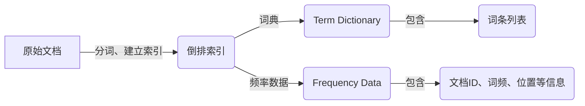

# Lucene索引原理与代码实例讲解

## 1.背景介绍

在当今信息时代,数据量呈现爆炸式增长,如何高效地存储和检索海量数据成为一个巨大挑战。传统的数据库系统在处理非结构化数据(如文本、图像、视频等)时存在明显的局限性,这就催生了全文检索技术的兴起。作为一种先进的信息检索技术,全文检索可以有效地对非结构化数据进行索引和搜索,广泛应用于网络搜索引擎、电子邮件归档、知识管理等领域。

Apache Lucene是一个基于Java的高性能、全功能的搜索引擎库,它不只是一个全文检索工具,更是一个成熟的信息检索框架。Lucene提供了完整的查询引擎和索引引擎,支持各种类型的查询语法、评分排序、高亮显示、分面导航等功能。凭借其卓越的性能、灵活性和可扩展性,Lucene已经成为全文检索领域的事实标准,被广泛应用于各种商业和开源项目中。

## 2.核心概念与联系

在深入探讨Lucene的索引原理之前,我们需要先了解一些核心概念:

### 2.1 文档(Document)

Lucene中的文档是指被索引的基本数据单元,可以是一个文本文件、一封电子邮件、一条数据库记录或任何其他形式的原始数据。每个文档由一组字段(Field)组成,字段是文档的最小单位,用于存储文档的各个部分内容。

### 2.2 域(Field)

域是文档中的一个独立数据项,例如标题、作者、内容等。每个域都有自己的名称和数据类型,可以是文本、数字、日期等。域的设置决定了索引和搜索的行为,例如某些域可以被索引和搜索,而另一些域则只存储元数据。

### 2.3 索引(Index)

索引是Lucene存储和组织文档数据的核心数据结构,它将原始文档数据转换为高度优化的数据格式,以便快速检索。索引由多个段(Segment)组成,每个段包含了一组文档的倒排索引。

### 2.4 倒排索引(Inverted Index)

倒排索引是全文检索系统中最关键的数据结构,它将文档中的词条与其所在文档的位置信息相关联,从而实现高效的全文检索。倒排索引由两个核心组件组成:词典(Term Dictionary)和频率文件(Frequency Data)。



## 3.核心算法原理具体操作步骤  

Lucene的索引过程可以概括为以下几个核心步骤:

1. **文档获取**: 首先需要从各种数据源获取原始文档数据,如文本文件、数据库记录等。

2. **文档分析**: 对原始文档进行分词、过滤、标准化等预处理操作,将文档转换为一系列词条(Term)。这一步通常由Lucene的分析器(Analyzer)完成。

3. **建立倒排索引**: 根据分析得到的词条,建立倒排索引的两个核心组件:词典和频率文件。
   - 词典: 存储文档集合中出现过的所有不重复词条,并为每个词条分配一个唯一的编号(TermID)。
   - 频率文件: 记录每个词条在哪些文档中出现,以及在文档中的位置、词频等信息。

4. **索引持久化**: 将内存中的倒排索引数据写入磁盘文件,形成一个或多个索引段(Segment)。

5. **索引合并**: 随着新文档的不断添加,索引会产生越来越多的段。Lucene会定期执行索引合并操作,将多个小段合并为更大的复合段,以提高查询效率。

索引创建完成后,Lucene就可以根据用户的查询请求,快速在倒排索引中定位相关文档,并根据评分算法对结果进行排序。

## 4.数学模型和公式详细讲解举例说明

在Lucene中,评分算法是一个核心组件,用于计算每个命中文档与查询的相关性分数,并根据分数对结果进行排序。Lucene采用基于向量空间模型(VSM)的评分公式,将文档和查询表示为向量,通过计算它们之间的相似度来确定相关性。

### 4.1 TF-IDF权重

在VSM中,每个词条都会被赋予一个权重,用于表示其在文档集合中的重要程度。Lucene使用广为人知的TF-IDF(Term Frequency-Inverse Document Frequency)算法计算词条权重,公式如下:

$$
w_{t,d} = tf_{t,d} \times \log{\frac{N}{df_t}}
$$

其中:
- $w_{t,d}$ 表示词条 $t$ 在文档 $d$ 中的权重
- $tf_{t,d}$ 表示词条 $t$ 在文档 $d$ 中出现的频率
- $N$ 表示文档集合的总文档数
- $df_t$ 表示包含词条 $t$ 的文档数

TF部分反映了词条在文档中的重要程度,而IDF则表示了词条在整个文档集合中的区分能力。常用词(如"the"、"and"等)的IDF值较低,而稀有词的IDF值较高。

### 4.2 文档向量与查询向量

对于文档 $d$,我们可以将其表示为一个向量 $\vec{d} = (w_{1,d}, w_{2,d}, ..., w_{t,d}, ...)$,其中每个分量 $w_{t,d}$ 表示词条 $t$ 在文档 $d$ 中的TF-IDF权重。

类似地,查询 $q$ 也可以表示为一个向量 $\vec{q} = (w_{1,q}, w_{2,q}, ..., w_{t,q}, ...)$,其中 $w_{t,q}$ 表示词条 $t$ 在查询 $q$ 中的权重(通常使用特殊的查询词项权重计算方法)。

### 4.3 相似度计算

文档 $d$ 与查询 $q$ 的相似度可以用它们对应向量的余弦相似度来表示:

$$
\text{score}(q, d) = \frac{\vec{q} \cdot \vec{d}}{|\vec{q}||\vec{d}|} = \frac{\sum_{t \in q \cap d}w_{t,q}w_{t,d}}{\sqrt{\sum_{t \in q}w_{t,q}^2}\sqrt{\sum_{t \in d}w_{t,d}^2}}
$$

其中:
- $q \cap d$ 表示文档 $d$ 与查询 $q$ 中共有的词条集合
- $w_{t,q}$ 和 $w_{t,d}$ 分别表示词条 $t$ 在查询和文档中的权重

余弦相似度的取值范围为 $[0, 1]$,值越大表示文档与查询越相关。Lucene会根据这个分数对命中的文档进行排序,从而返回最相关的结果。

需要注意的是,Lucene的实际评分公式比上述公式更加复杂,它还考虑了词条的位置信息、文档长度归一化等多种因素,以提高评分的准确性。

## 5.项目实践:代码实例和详细解释说明

为了更好地理解Lucene的索引原理,我们来看一个基于Lucene 8.x版本的Java代码示例。在这个示例中,我们将创建一个简单的文本索引,并对其执行搜索操作。

### 5.1 创建索引

```java
// 1. 创建索引目录
Directory indexDir = FSDirectory.open(Paths.get("index"));

// 2. 创建IndexWriterConfig
IndexWriterConfig config = new IndexWriterConfig(new StandardAnalyzer());

// 3. 创建IndexWriter
IndexWriter indexWriter = new IndexWriter(indexDir, config);

// 4. 创建Document并添加Field
Document doc = new Document();
doc.add(new TextField("content", "This is a sample document.", Field.Store.YES));

// 5. 将Document添加到索引中
indexWriter.addDocument(doc);

// 6. 提交并关闭IndexWriter
indexWriter.commit();
indexWriter.close();
```

代码解释:

1. 首先,我们创建一个索引目录`indexDir`,用于存储索引文件。在这个示例中,我们使用本地文件系统作为索引目录。

2. 然后,创建`IndexWriterConfig`对象,并指定使用`StandardAnalyzer`作为分析器。分析器负责将文本分词并执行标准化操作。

3. 使用`IndexWriterConfig`创建`IndexWriter`对象,`IndexWriter`是Lucene中用于创建和修改索引的核心组件。

4. 创建一个`Document`对象,并使用`TextField`添加一个名为"content"的字段。`Field.Store.YES`表示该字段的值将被存储在索引中,以便在搜索结果中显示。

5. 调用`IndexWriter.addDocument()`方法将文档添加到索引中。

6. 最后,调用`IndexWriter.commit()`将内存中的索引数据写入磁盘,并调用`IndexWriter.close()`关闭`IndexWriter`。

### 5.2 搜索索引

```java
// 1. 创建IndexReader
Directory indexDir = FSDirectory.open(Paths.get("index"));
IndexReader indexReader = DirectoryReader.open(indexDir);

// 2. 创建IndexSearcher
IndexSearcher indexSearcher = new IndexSearcher(indexReader);

// 3. 创建查询
QueryParser queryParser = new QueryParser("content", new StandardAnalyzer());
Query query = queryParser.parse("sample");

// 4. 执行搜索并获取结果
TopDocs topDocs = indexSearcher.search(query, 10);
ScoreDoc[] scoreDocs = topDocs.scoreDocs;

// 5. 输出结果
for (ScoreDoc scoreDoc : scoreDocs) {
    Document doc = indexSearcher.doc(scoreDoc.doc);
    System.out.println("Score: " + scoreDoc.score);
    System.out.println("Content: " + doc.get("content"));
}

// 6. 关闭IndexReader
indexReader.close();
```

代码解释:

1. 首先,我们打开之前创建的索引目录,并创建一个`IndexReader`对象。`IndexReader`用于从索引中读取数据。

2. 使用`IndexReader`创建一个`IndexSearcher`对象,`IndexSearcher`负责执行搜索操作。

3. 创建一个`QueryParser`对象,并指定要搜索的字段("content")和分析器(`StandardAnalyzer`)。然后,使用`QueryParser.parse()`方法根据查询字符串("sample")创建一个`Query`对象。

4. 调用`IndexSearcher.search()`方法执行搜索,并获取命中的文档列表(`TopDocs`)。我们将最大命中数限制为10个。

5. 遍历`TopDocs`中的`ScoreDoc`对象,获取每个命中文档的分数(`scoreDoc.score`)和内容(`doc.get("content")`)。

6. 最后,关闭`IndexReader`以释放资源。

运行上述代码,您将看到类似以下的输出:

```
Score: 0.6931472
Content: This is a sample document.
```

这个简单的示例展示了如何使用Lucene创建索引并执行搜索操作。在实际应用中,您可能需要处理更复杂的文档结构、自定义分析器、优化索引性能等任务。Lucene提供了丰富的API和配置选项,以满足各种需求。

## 6.实际应用场景

Lucene作为一个强大的全文检索框架,在各种领域都有广泛的应用,包括但不限于:

1. **网络搜索引擎**: 搜索引擎是Lucene最典型的应用场景之一。像Elasticsearch、Solr这样的搜索平台都是基于Lucene构建的。它们为网站、电子商务平台、知识库等提供了高效的全文搜索功能。

2. **电子邮件归档与搜索**: 在大型企业和组织中,电子邮件往往是重要的信息载体。使用Lucene可以对海量邮件进行索引和搜索,提高信息查找效率。

3. **日志分析与监控**: 系统日志是排查问题和监控系统运行状态的重要数据源。Lucene可以对日志数据建立索引,支持关键字搜索、模式匹配等功能,方便开发人员快速定位问题。

4. **文档管理系统**: 在知识管理、法律文档、技术文档等领域,Lucene可以用于构建文档管理系统,实现全文搜索、版本控制、权限管理