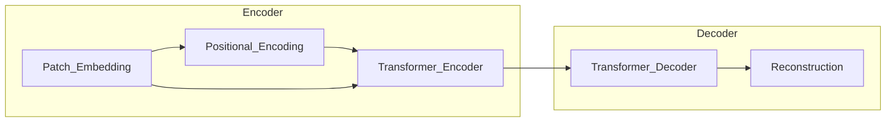

# MAE原理与代码实例讲解

## 1. 背景介绍

在计算机视觉和深度学习领域,图像分类、目标检测和语义分割等任务一直是研究的热点。然而,这些任务往往需要大量的标注数据,而获取高质量的标注数据是一个耗时且昂贵的过程。为了解决这个问题,自监督学习(Self-Supervised Learning)应运而生,它能够利用大量未标注的数据进行预训练,从而获得有效的视觉表示,为下游任务提供良好的初始化。

最新的自监督学习方法之一是掩码自编码(Masked Autoencoders,MAE),它由Meta AI提出,在2022年发表在ICCV上。MAE在自编码器的基础上引入了掩码机制,通过重建被掩码的图像patch,学习到更加丰富和通用的视觉表示。与之前的自监督方法相比,MAE在下游任务上取得了更好的性能,同时训练成本也更低。本文将深入探讨MAE的原理、算法细节、代码实现以及在实际应用中的表现。

## 2. 核心概念与联系

### 2.1 自编码器(Autoencoder)

自编码器是一种无监督学习模型,它通过将输入数据压缩成一个低维的编码(encoding),然后再从这个编码重构出原始数据。自编码器由两部分组成:编码器(encoder)和解码器(decoder)。编码器将输入数据映射到编码空间,而解码器则将编码映射回原始数据空间。

自编码器的目标是最小化输入数据与重构数据之间的差异,通常使用均方误差或交叉熵作为损失函数。在训练过程中,自编码器被迫学习输入数据的有效表示,从而捕捉数据的本质特征。

### 2.2 掩码机制(Masking)

掩码机制是MAE的核心创新点。在训练过程中,MAE会随机将输入图像的一部分patch(图像块)进行掩码,即用一个固定值(如0或均值)替换这些patch。然后,模型需要根据未被掩码的patch,重建被掩码的部分。

通过这种掩码机制,MAE被迫学习理解图像的整体结构和语义信息,而不仅仅是简单地复制输入数据。这种自监督学习方式使MAE能够从大量未标注的数据中获得丰富的视觉表示,为下游任务提供有效的初始化。

### 2.3 视觉transformer(ViT)

视觉transformer(ViT)是一种将transformer模型应用于计算机视觉任务的新型架构。与传统的卷积神经网络(CNN)不同,ViT直接对图像的patch序列进行建模,捕捉全局依赖关系。

在MAE中,ViT被用作编码器和解码器的骨干网络。通过预训练,ViT能够学习到强大的视觉表示能力,为下游任务提供良好的初始化权重。

## 3. 核心算法原理具体操作步骤

MAE的训练过程可以分为以下几个主要步骤:

1. **图像分块(Image Patchifying)**: 将输入图像划分为一个个不重叠的patch,每个patch的大小通常为16x16像素。

2. **掩码(Masking)**: 随机选择一部分patch(通常为75%)进行掩码,即用一个固定值(如0或均值)替换这些patch。

3. **编码(Encoding)**: 将未被掩码的patch输入到编码器(基于ViT的transformer encoder)中,获得编码向量。

4. **解码(Decoding)**: 将编码向量输入到解码器(基于ViT的transformer decoder)中,重建被掩码的patch。

5. **重建损失计算(Reconstruction Loss)**: 计算重建的patch与原始被掩码的patch之间的均方误差或其他损失函数,作为模型的训练目标。

6. **模型更新(Model Update)**: 使用优化算法(如Adam)根据重建损失更新模型参数。

在训练过程中,MAE通过重建被掩码的patch来学习视觉表示。由于掩码的随机性,MAE被迫捕捉图像的整体结构和语义信息,而不仅仅是简单地复制输入数据。

训练完成后,MAE的编码器可以被用作下游任务的初始化权重,从而提高模型的性能和训练效率。

## 4. 数学模型和公式详细讲解举例说明

### 4.1 MAE损失函数

MAE的损失函数是基于重建损失,即被掩码的patch与重建的patch之间的差异。具体来说,MAE使用均方误差(Mean Squared Error,MSE)作为损失函数:

$$
\mathcal{L}_{MAE} = \mathbb{E}_{x, \hat{x}_m} \left[ \left\| \hat{x}_m - x_m \right\|_2^2 \right]
$$

其中:
- $x$ 是原始输入图像
- $\hat{x}_m$ 是重建的被掩码的patch
- $x_m$ 是原始被掩码的patch
- $\left\| \cdot \right\|_2$ 表示$l_2$范数

通过最小化这个损失函数,MAE被迫学习捕捉图像的整体结构和语义信息,从而获得有效的视觉表示。

### 4.2 掩码策略

MAE的掩码策略是一个关键组成部分。通常,MAE会随机掩码75%的图像patch,即只保留25%的patch作为可见patch。这种高掩码比例迫使模型从有限的可见patch中捕捉全局信息,从而学习到更加丰富的视觉表示。

掩码的过程可以表示为:

$$
x_m = \begin{cases}
    x_p, & \text{if } m_p = 0\\
    \text{mask}, & \text{if } m_p = 1
\end{cases}
$$

其中:
- $x_p$ 是原始图像的第$p$个patch
- $m_p$ 是一个二值掩码,表示第$p$个patch是否被掩码(0表示可见,1表示被掩码)
- `mask`是一个固定值,通常为0或均值

在实现中,可以使用PyTorch的`torch.rand`函数生成随机掩码,然后应用于原始图像patch。

### 4.3 视觉transformer架构

MAE使用视觉transformer(ViT)作为编码器和解码器的骨干网络。ViT的架构如下所示:



1. **Patch Embedding**: 将图像划分为一个个patch,并将每个patch映射到一个固定维度的向量空间。

2. **Positional Encoding**: 为每个patch添加位置信息,以捕捉patch在图像中的空间位置。

3. **Transformer Encoder**: 由多个transformer编码器块组成,用于捕捉patch之间的全局依赖关系,生成编码向量。

4. **Transformer Decoder**: 由多个transformer解码器块组成,将编码向量解码为重建的patch。

5. **Reconstruction**: 将解码器的输出重构为原始图像大小的patch,用于计算重建损失。

通过预训练,ViT能够学习到强大的视觉表示能力,为下游任务提供良好的初始化权重。

## 5. 项目实践:代码实例和详细解释说明

在这一部分,我们将提供一个基于PyTorch的MAE实现示例,并详细解释每一部分的代码。

### 5.1 导入必要的库

```python
import torch
import torch.nn as nn
import torch.nn.functional as F
from einops import rearrange
```

我们导入了PyTorch库,以及一些辅助库,如`einops`用于张量变换。

### 5.2 Patch Embedding模块

```python
class PatchEmbedding(nn.Module):
    def __init__(self, img_size=224, patch_size=16, in_chans=3, embed_dim=768):
        super().__init__()
        self.img_size = img_size
        self.patch_size = patch_size
        self.n_patches = (img_size // patch_size) ** 2

        self.proj = nn.Conv2d(
            in_chans, embed_dim, kernel_size=patch_size, stride=patch_size
        )

    def forward(self, x):
        x = self.proj(x)  # [B, C, H, W]
        x = rearrange(x, "b c h w -> b (h w) c")
        return x
```

`PatchEmbedding`模块将输入图像划分为一个个patch,并将每个patch映射到一个固定维度的向量空间。具体来说:

1. 使用卷积层(`nn.Conv2d`)将每个patch映射到一个`embed_dim`维的向量。
2. 使用`einops.rearrange`将输出张量重新排列,从`[B, C, H, W]`变换为`[B, N, C]`,其中`N`是patch的数量。

### 5.3 MAE模型

```python
class MAE(nn.Module):
    def __init__(self, encoder, decoder, mask_ratio=0.75):
        super().__init__()
        self.encoder = encoder
        self.decoder = decoder
        self.mask_ratio = mask_ratio

    def forward(self, x):
        # 生成随机掩码
        mask = torch.rand(x.shape[0], x.shape[2] * x.shape[3], device=x.device)
        mask = mask < self.mask_ratio  # 掩码比例
        mask = rearrange(mask, "b n -> b n 1")  # 添加通道维度

        # 应用掩码
        x_masked = x * (1 - mask)

        # 编码
        x_encoded = self.encoder(x_masked)

        # 解码
        x_decoded = self.decoder(x_encoded, mask)

        # 重建损失
        loss = F.mse_loss(x_decoded, x * mask)

        return loss, x_decoded, mask
```

`MAE`模型包含编码器(`encoder`)和解码器(`decoder`)两个主要组件,以及掩码比例(`mask_ratio`)超参数。在前向传播过程中:

1. 生成一个随机掩码,其中掩码比例由`mask_ratio`控制。
2. 将掩码应用于输入图像,得到掩码后的图像`x_masked`。
3. 将`x_masked`输入编码器,获得编码向量`x_encoded`。
4. 将`x_encoded`和掩码`mask`输入解码器,获得重建的patch`x_decoded`。
5. 计算重建的patch与原始被掩码的patch之间的均方误差(MSE)作为损失函数。

### 5.4 训练过程

```python
def train(model, train_loader, optimizer, device):
    model.train()
    train_loss = 0.0

    for data in train_loader:
        images = data.to(device)

        optimizer.zero_grad()
        loss, _, _ = model(images)
        loss.backward()
        optimizer.step()

        train_loss += loss.item() * images.size(0)

    train_loss /= len(train_loader.dataset)
    return train_loss
```

在训练过程中,我们遍历训练数据集,将图像输入MAE模型,计算重建损失,并使用优化器(如Adam)更新模型参数。最后,我们计算整个训练集上的平均损失,用于监控训练进度。

### 5.5 推理过程

```python
def inference(model, test_loader, device):
    model.eval()
    test_loss = 0.0

    with torch.no_grad():
        for data in test_loader:
            images = data.to(device)
            loss, _, _ = model(images)
            test_loss += loss.item() * images.size(0)

    test_loss /= len(test_loader.dataset)
    return test_loss
```

在推理过程中,我们将模型设置为评估模式,并在测试数据集上计算重建损失,用于评估模型的性能。

通过上述代码示例,我们实现了MAE模型的核心组件,包括Patch Embedding、编码器、解码器,以及训练和推理过程。在实际应用中,您可能还需要调整超参数、优化训练策略等,以获得更好的性能。

## 6. 实际应用场景

MAE作为一种新颖的自监督学习方法,在计算机视觉领域有着广泛的应用前景。以下是一些典型的应用场景:

### 6.1 图像分类

图像分类是计算机视觉的基础任务之一。通过使用MAE预训练的编码器作为初始化权重,可以显著提高图像分类模型的性能,尤其是在数据量有限的情况下。

### 6.2 目标检测

目标检测旨在在图像中定位和识别特定对象。MAE预训练的编码器可以作为目标检测模型的骨干网络,提供丰富的视觉表示,从而提高检测精度。

### 6.3 