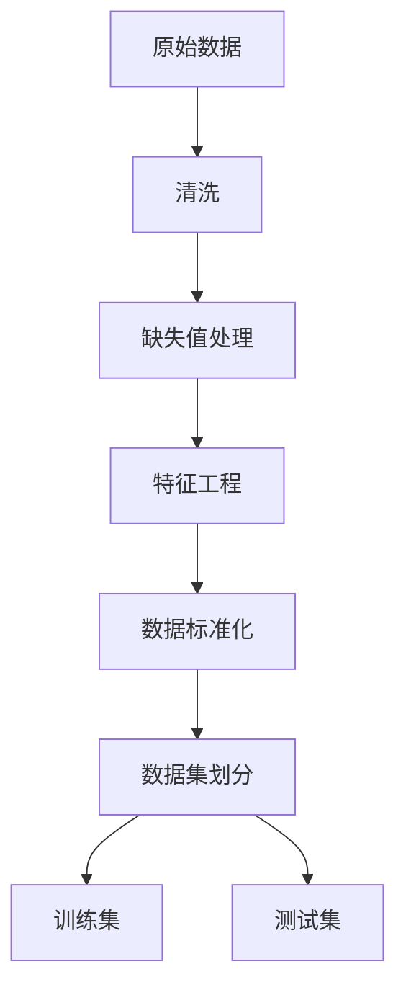
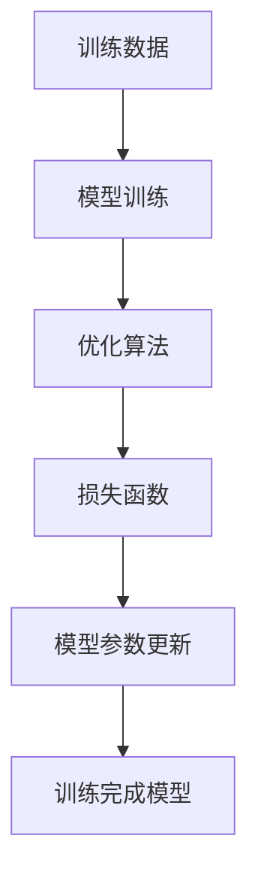
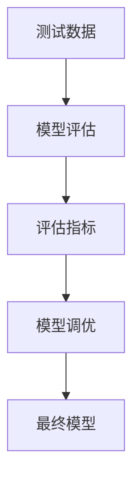

# Machine Learning

## 1. 背景介绍

机器学习是人工智能领域的一个重要分支,它赋予计算机系统从数据中自动学习和提高性能的能力,而无需明确编程。在当今大数据时代,海量数据的存在为机器学习提供了广阔的应用空间。机器学习已广泛应用于计算机视觉、自然语言处理、推荐系统、金融预测等诸多领域,极大地促进了人工智能技术的发展。

## 2. 核心概念与联系

机器学习的核心思想是利用算法从数据中学习,获取潜在的规律和知识,从而对新数据做出准确的预测或决策。根据学习的方式不同,机器学习可分为以下三大类:

### 2.1 监督学习

监督学习利用已标注的训练数据集,学习映射关系,从而对新的输入数据做出预测。常见的监督学习任务包括分类和回归。

### 2.2 无监督学习

无监督学习直接从未标注的数据中发现潜在的模式和结构,常用于聚类和降维等任务。

### 2.3 强化学习

强化学习是基于对环境的反馈信号,通过试错不断优化决策策略,以最大化长期累积奖励。它广泛应用于机器人控制、游戏AI等领域。

## 3. 核心算法原理具体操作步骤

机器学习算法的核心原理涉及多个方面,包括数据预处理、模型选择、模型训练和模型评估等。下面将详细介绍这些步骤:

### 3.1 数据预处理



1. **数据清洗**: 去除噪声数据、异常值、重复数据等。
2. **缺失值处理**: 填充缺失值或删除缺失数据。
3. **特征工程**: 构建有意义的特征,提高模型性能。
4. **数据标准化**: 将数据缩放到相同范围,防止某些特征对模型的影响过大。
5. **数据集划分**: 将数据划分为训练集和测试集,用于模型训练和评估。

### 3.2 模型选择

根据问题的性质和数据的特点,选择合适的机器学习算法,如线性回归、逻辑回归、决策树、支持向量机、神经网络等。

### 3.3 模型训练



1. **模型训练**: 利用训练数据,通过优化算法调整模型参数,使模型在训练数据上的性能最优。
2. **优化算法**: 常用的优化算法包括梯度下降、随机梯度下降、L-BFGS等。
3. **损失函数**: 衡量模型预测值与真实值之间的差异,如均方误差、交叉熵等。
4. **模型参数更新**: 根据损失函数的梯度,更新模型参数,使损失函数值最小化。
5. **训练完成模型**: 经过多次迭代,得到最终的训练完成模型。

### 3.4 模型评估



1. **模型评估**: 使用测试数据评估模型的泛化能力。
2. **评估指标**: 根据任务类型选择合适的评估指标,如准确率、精确率、召回率、F1分数等。
3. **模型调优**: 根据评估结果,调整模型超参数或特征工程,提高模型性能。
4. **最终模型**: 获得性能最优的模型,可用于实际应用。

## 4. 数学模型和公式详细讲解举例说明

机器学习算法的核心是基于数学模型和优化理论,下面将详细介绍一些常见的数学模型和公式。

### 4.1 线性回归

线性回归是一种常见的监督学习算法,用于解决回归问题。它假设输入特征 $\mathbf{x}$ 和目标值 $y$ 之间存在线性关系,可表示为:

$$y = \mathbf{w}^T\mathbf{x} + b$$

其中 $\mathbf{w}$ 为权重向量, $b$ 为偏置项。训练目标是通过优化算法,找到最小化损失函数的 $\mathbf{w}$ 和 $b$。常用的损失函数是均方误差:

$$J(\mathbf{w}, b) = \frac{1}{2m}\sum_{i=1}^m(y^{(i)} - \mathbf{w}^T\mathbf{x}^{(i)} - b)^2$$

其中 $m$ 为训练样本数量。

### 4.2 逻辑回归

逻辑回归是一种常见的分类算法,用于解决二分类问题。它通过 Sigmoid 函数将线性模型的输出映射到 (0, 1) 区间,表示样本属于正类的概率:

$$h_\theta(x) = \frac{1}{1 + e^{-\theta^Tx}}$$

其中 $\theta$ 为模型参数。训练目标是最小化交叉熵损失函数:

$$J(\theta) = -\frac{1}{m}\sum_{i=1}^m[y^{(i)}\log h_\theta(x^{(i)}) + (1 - y^{(i)})\log(1 - h_\theta(x^{(i)}))]$$

### 4.3 支持向量机

支持向量机(SVM)是一种有监督的非线性分类模型,其基本思想是在特征空间中寻找一个超平面,将不同类别的样本分开,且间隔最大化。对于线性可分的情况,超平面可表示为:

$$\mathbf{w}^T\mathbf{x} + b = 0$$

其中 $\mathbf{w}$ 为法向量, $b$ 为偏置项。SVM的目标是最大化间隔 $\frac{2}{\|\mathbf{w}\|}$,即最小化 $\|\mathbf{w}\|^2$,同时满足约束条件:

$$y^{(i)}(\mathbf{w}^T\mathbf{x}^{(i)} + b) \geq 1, i = 1, 2, \dots, m$$

对于线性不可分的情况,可引入松弛变量,将问题转化为软间隔最大化问题。

### 4.4 决策树

决策树是一种基于树形结构的监督学习算法,可用于分类和回归任务。它通过递归地对特征空间进行划分,构建一棵决策树。每个内部节点表示对一个特征的测试,每个分支代表该测试的一个输出,而每个叶节点则对应一个类别或数值。

决策树的构建过程可以使用信息增益或基尼系数等指标,选择最优特征进行分裂。对于分类问题,信息增益定义为:

$$\text{Gain}(D, a) = \text{Entropy}(D) - \sum_{v \in \text{Values}(a)}\frac{|D^v|}{|D|}\text{Entropy}(D^v)$$

其中 $D$ 为数据集, $a$ 为特征, $D^v$ 为特征 $a$ 取值 $v$ 的子集, $\text{Entropy}(D)$ 为数据集 $D$ 的熵。

### 4.5 神经网络

神经网络是一种基于人工神经元的机器学习模型,具有强大的非线性拟合能力。一个典型的神经网络由输入层、隐藏层和输出层组成,每一层由多个神经元构成。

假设一个单层神经网络有 $n$ 个输入特征 $\mathbf{x} = (x_1, x_2, \dots, x_n)$,权重矩阵为 $\mathbf{W}$,偏置向量为 $\mathbf{b}$,激活函数为 $\sigma$,则输出 $\mathbf{y}$ 可表示为:

$$\mathbf{y} = \sigma(\mathbf{W}^T\mathbf{x} + \mathbf{b})$$

对于多层神经网络,每一层的输出将作为下一层的输入,通过反向传播算法调整权重和偏置,使损失函数最小化。

## 5. 项目实践: 代码实例和详细解释说明

为了更好地理解机器学习算法的实现,下面将使用 Python 和 scikit-learn 库,通过实例代码演示线性回归和逻辑回归的具体实现过程。

### 5.1 线性回归实例

```python
import numpy as np
from sklearn.linear_model import LinearRegression
from sklearn.datasets import make_regression
from sklearn.model_selection import train_test_split

# 生成模拟数据
X, y = make_regression(n_samples=1000, n_features=5, noise=10, random_state=42)

# 划分训练集和测试集
X_train, X_test, y_train, y_test = train_test_split(X, y, test_size=0.2, random_state=42)

# 创建线性回归模型
model = LinearRegression()

# 训练模型
model.fit(X_train, y_train)

# 评估模型
score = model.score(X_test, y_test)
print(f"Model score: {score:.2f}")
```

代码解释:

1. 导入所需的库和模块。
2. 使用 `make_regression` 函数生成模拟的回归数据,包含 5 个特征和 1000 个样本。
3. 使用 `train_test_split` 函数将数据划分为训练集和测试集。
4. 创建 `LinearRegression` 对象,即线性回归模型。
5. 使用 `fit` 方法在训练集上训练模型。
6. 使用 `score` 方法在测试集上评估模型的性能,输出模型得分。

### 5.2 逻辑回归实例

```python
import numpy as np
from sklearn.linear_model import LogisticRegression
from sklearn.datasets import make_blobs
from sklearn.model_selection import train_test_split
from sklearn.metrics import accuracy_score

# 生成模拟数据
X, y = make_blobs(n_samples=1000, centers=2, n_features=5, random_state=42)

# 划分训练集和测试集
X_train, X_test, y_train, y_test = train_test_split(X, y, test_size=0.2, random_state=42)

# 创建逻辑回归模型
model = LogisticRegression()

# 训练模型
model.fit(X_train, y_train)

# 评估模型
y_pred = model.predict(X_test)
accuracy = accuracy_score(y_test, y_pred)
print(f"Model accuracy: {accuracy:.2f}")
```

代码解释:

1. 导入所需的库和模块。
2. 使用 `make_blobs` 函数生成模拟的二分类数据,包含 5 个特征和 1000 个样本。
3. 使用 `train_test_split` 函数将数据划分为训练集和测试集。
4. 创建 `LogisticRegression` 对象,即逻辑回归模型。
5. 使用 `fit` 方法在训练集上训练模型。
6. 使用 `predict` 方法在测试集上进行预测,获取预测标签。
7. 使用 `accuracy_score` 函数计算模型在测试集上的准确率,输出准确率结果。

通过上述实例,您可以更好地理解线性回归和逻辑回归算法的实现过程,并进一步探索其他机器学习算法的实现。

## 6. 实际应用场景

机器学习在现实世界中有着广泛的应用,下面列举了一些典型的应用场景:

1. **计算机视觉**: 图像分类、目标检测、人脸识别、自动驾驶等。
2. **自然语言处理**: 文本分类、情感分析、机器翻译、问答系统等。
3. **推荐系统**: 电商产品推荐、视频推荐、音乐推荐等。
4. **金融预测**: 股票预测、欺诈检测、风险评估等。
5. **医疗健康**: 疾病诊断、药物发现、医学图像分析等。
6. **物联网**: 设备故障预测、能源优化、智能家居等。
7. **游戏AI**: 棋类游戏AI、射击游戏AI、策略游戏AI等。

随着技术的不断进步,机器学习的应用范围将持续扩大,为各个领域带来革命性